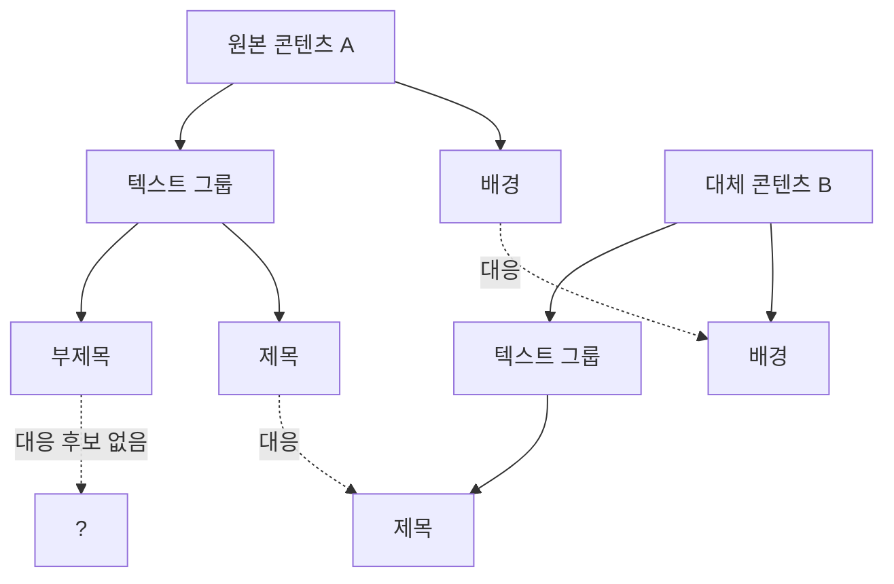
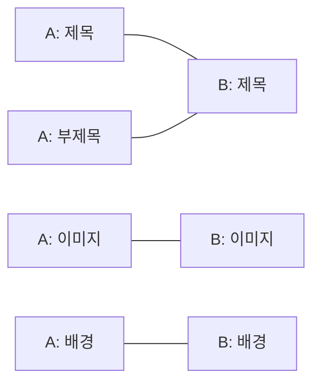

# Tree/Graph Matching 알고리즘

## 이 문서의 목적

"원본 콘텐츠와 대체 콘텐츠 사이의 대응 관계를 찾아라"는 문제는 결국 두 구조(트리 또는 그래프) 사이의 노드를 짝짓는 문제다. 이 문서는 그 문제를 세 가지 각도 — tree 구조 비교, bipartite matching, assignment problem — 로 쪼개서 정리한다.

---

## 왜 "구조 비교"가 매칭 문제가 되는가

디자인 콘텐츠 하나는 평평한 리스트가 아니라 계층을 가진 트리다. 배경 위에 그룹이 있고, 그룹 안에 텍스트와 이미지가 있는 식이다. 두 콘텐츠(원본 A, 대체 후보 B)를 비교한다는 건 "A의 어떤 노드가 B의 어떤 노드에 대응하는가"를 정하는 일이다.

노드 개수도 다르고 구조도 완벽히 같지 않을 수 있다. 그래서 "완전 일치"가 아니라 "가장 그럴듯한 대응"을 찾는 문제가 되고, 여기서 tree edit distance와 matching 알고리즘이 필요해진다.

---

## Tree Edit Distance

두 트리를 서로 다른 트리로 바꾸는 데 필요한 최소 편집 연산(노드 삽입, 삭제, 치환) 횟수를 tree edit distance라고 한다. 문자열의 edit distance(Levenshtein distance)를 트리로 확장한 개념이다.

핵심 아이디어는 두 트리가 "얼마나 다른가"를 하나의 숫자로 표현할 수 있다는 것이다. 이 값이 작을수록 두 콘텐츠 구조가 비슷하다고 판단할 수 있다. 다만 순수 tree edit distance 계산은 비용이 크기 때문에(트리 크기에 따라 다항식이지만 계수가 큼), 실무에서는 근사치나 제한된 비교(예: 깊이 2까지만) 로 쓰는 경우가 많다.

## Subtree Matching / Isomorphism

두 트리가 완전히 같은 모양인지(isomorphism), 혹은 한 트리가 다른 트리의 부분 트리로 포함되는지(subtree matching)를 확인하는 문제. leetcode572_Subtree_of_Another_Tree가 정확히 이 유형이다 — 큰 트리 안에 작은 트리와 동일한 구조가 있는지 찾는 문제.

콘텐츠 매칭 맥락에서는 "이 대체 후보가 원본의 일부 구조를 그대로 갖고 있는가"를 빠르게 판별할 때 쓴다. Edit distance보다 계산이 가볍다는 게 장점.

---

## Bipartite Matching

트리 구조 비교로 "어느 정도 비슷한가"를 판단했다면, 다음 문제는 "A의 각 노드를 B의 어떤 노드와 1:1로 짝지을 것인가"다. 이건 이분 그래프(bipartite graph) 매칭 문제다.

A의 노드 집합과 B의 노드 집합을 양쪽에 두고, "대응 가능하다"고 판단되는 쌍마다 간선을 긋는다. 여기서 최대 매칭(maximum matching) — 가장 많은 쌍을 동시에 짝지을 수 있는 조합 — 을 찾는다.

위 예시에서 A의 제목과 부제목이 둘 다 B의 제목에 대응 가능하다고 나오면, 최대 매칭 알고리즘이 그중 하나만 선택하고 나머지는 대응 없음으로 처리한다. 대표 알고리즘은 Hungarian algorithm(헝가리안 알고리즘)이다.

## Assignment Problem

Bipartite matching에 "비용"이나 "점수"가 붙으면 assignment problem이 된다. 단순히 "짝지을 수 있는가"가 아니라 "짝지었을 때 비용이 얼마나 드는가(혹은 점수가 얼마나 높은가)"를 따져서, 전체 비용의 합이 최소(또는 점수 합이 최대)가 되는 조합을 찾는다.

콘텐츠 매칭에서는 "글자 크기, 색상, 위치가 비슷할수록 비용이 낮다"는 식으로 비용 함수를 설계하고, 그 비용을 최소화하는 조합을 Hungarian algorithm으로 구한다. Phase 4에서 다룰 scoring function과 여기서 연결된다 — 비용 함수를 어떻게 설계하느냐가 매칭 품질을 결정한다.

---

## Constraint Solving

비용 함수만으로 부족할 때는 제약 조건(constraint)을 추가한다. 예를 들어 "배경 요소는 반드시 배경끼리만 매칭", "텍스트 그룹 내부 순서는 유지" 같은 규칙이다. 이건 constraint satisfaction problem(CSP)에 가까워지고, 순수 최적화보다 규칙 기반 필터링을 먼저 적용한 뒤 남은 후보에 대해 assignment problem을 푸는 2단계 구조로 설계하는 경우가 많다.

---

## 실습 방향

leetcode572_Subtree_of_Another_Tree, leetcode173_Binary_Search_Tree_Iterator에서 이미 트리 순회/비교 감각은 있다. 다음 단계로:

1. Tree edit distance를 직접 구현 (작은 트리 두 개로 시작)
2. Bipartite matching을 Hungarian algorithm으로 구현 (또는 간단한 augmenting path 방식)
3. 위 둘을 합쳐서 "트리 A, B가 주어지면 노드 대응 쌍을 반환하는" 함수 하나로 통합

완료 기준: "디자인 요소 트리 A, B 사이 대응 노드 쌍을 찾아라" 문제를 30분 안에 구현.

---

## Q1 (기본)

Tree edit distance와 bipartite matching은 각각 어떤 질문에 답하는 알고리즘인가? 이 문서에서 설명한 차이를 본인 말로 한 문단 설명해보세요. (힌트: 하나는 "얼마나 다른가"를 수치로, 다른 하나는 "무엇을 무엇과 짝지을 것인가"를 답한다 — 왜 매칭 파이프라인에서 이 둘이 순서대로 필요한지가 핵심)
