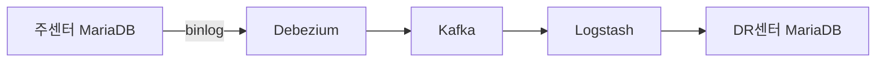

# CDC란 무엇인가

## 왜 필요했나

주센터와 DR센터, 두 개의 MariaDB를 실시간으로 동기화해야 했다.

처음엔 단순하게 생각했다. 애플리케이션이 두 DB에 동시에 쓰면 되지 않나? 근데 이건 틀렸다. 애플리케이션이 DB 동기화 책임까지 지면 코드가 복잡해지고, 한쪽 쓰기가 실패하면 정합성이 깨진다. 레거시 시스템이면 코드 수정 자체가 불가능하다.

**DB 레벨에서 변경을 감지해서 자동으로 전파**하는 방법이 필요했다. 그게 CDC다.

---

## CDC가 뭔가

Change Data Capture. DB의 변경(INSERT / UPDATE / DELETE)을 감지해서 다른 시스템으로 전달하는 기법이다.

핵심은 **애플리케이션 코드를 건드리지 않는다**는 것. DB 내부에서 벌어지는 일을 DB 레벨에서 캡처한다.

---

## 변경을 어떻게 감지하나

세 가지 방법이 있다.

**폴링** — 주기적으로 `updated_at` 같은 컬럼을 보고 바뀐 row를 찾는다. DELETE는 감지 못한다. row가 사라지면 알 방법이 없으니까. 폴링 주기만큼 지연도 생긴다.

**트리거** — DB 트리거로 변경이 생기면 별도 테이블에 기록한다. DELETE도 잡히긴 하는데 모든 테이블에 트리거를 달아야 하고 성능에도 영향을 준다.

**트랜잭션 로그** — MySQL/MariaDB는 모든 변경을 binlog에 기록한다. 이걸 읽으면 INSERT/UPDATE/DELETE 전부 감지할 수 있다. 애플리케이션에 영향도 없고 DB 부하도 거의 없다.

Debezium이 세 번째 방식을 쓴다. binlog를 실시간으로 읽어서 변경 이벤트를 Kafka로 발행한다.

---

## 이 시리즈에서 다루는 구조

처음엔 Sink 구간을 JDBC Sink Connector로 구현했다. Kafka Connect 안에서 Source/Sink를 모두 해결하는 방식이었는데, 양방향 무한루프 방지나 센터별 필터링 같은 요구사항을 유연하게 처리하기 어려웠다. 결국 Logstash로 바꿨다. filter 플러그인으로 변환과 조건 처리가 훨씬 자유롭기 때문이다.

---

## 다음

02-debezium-and-binlog.md
