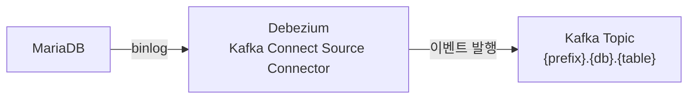

# Debezium과 binlog

## binlog가 뭔가

MariaDB/MySQL은 모든 변경 작업을 **바이너리 로그(binlog)** 에 기록한다. 원래 목적은 복제(Replication) — 마스터 DB의 변경을 슬레이브로 전파하기 위한 것이다.

Debezium은 이 binlog를 슬레이브인 척 읽는다. 즉, DB 입장에서 Debezium은 그냥 복제 슬레이브 하나가 더 붙은 것처럼 보인다.

---

## Debezium이 하는 일

binlog에서 변경 이벤트를 읽어서 Kafka 토픽으로 발행한다. 하나의 테이블 변경이 하나의 Kafka 메시지가 된다.



토픽 이름은 자동으로 `{topic.prefix}.{database}.{table}` 형태로 만들어진다. 예를 들어 prefix가 `center`면 `center.ECP_ADMIN.TADP_PRJCT` 같은 이름이 된다.

---

## 메시지 구조

Debezium이 발행하는 메시지는 기본적으로 이런 구조다:

```json
{
  "before": { ... },
  "after": { ... },
  "op": "c",
  "ts_ms": 1234567890
}
```

- `op`: 작업 종류 — `c`(create/INSERT), `u`(UPDATE), `d`(DELETE), `r`(snapshot)
- `before`: 변경 전 row 데이터
- `after`: 변경 후 row 데이터

DELETE면 `after`가 null이고, INSERT면 `before`가 null이다.

---

## ExtractNewRecordState transform

기본 메시지 구조는 before/after/op가 중첩된 형태라 Sink에서 처리하기 번거롭다. `ExtractNewRecordState` transform을 쓰면 메시지를 flat하게 풀어준다.

```json
{
  "connector.class": "io.debezium.connector.mariadb.MariaDbConnector",
  "transforms": "unwrap",
  "transforms.unwrap.type": "io.debezium.transforms.ExtractNewRecordState",
  "transforms.unwrap.delete.handling.mode": "rewrite",
  "transforms.unwrap.drop.tombstones": "false",
  "transforms.unwrap.add.fields": "op"
}
```

transform 후 메시지는 이렇게 바뀐다:

```json
{
  "PRJCT_ID": "abc123",
  "BIZ_NM": "테스트",
  "__op": "c",
  "__deleted": "false"
}
```

`__op`, `__deleted` 같은 메타데이터가 추가되고 row 데이터가 최상위로 올라온다.

---

## DELETE 처리가 까다로운 이유

DELETE 이벤트는 두 단계로 발행된다:

1. **tombstone 메시지** — value가 null인 메시지. Kafka의 log compaction이 해당 key의 이전 메시지를 정리할 수 있도록 신호를 보내는 것이다.
2. **delete 이벤트** — `__op: "d"`, `__deleted: "true"` 인 메시지

`drop.tombstones: false`로 설정하지 않으면 tombstone이 중간에 날아가서 Sink에서 DELETE를 인식 못하는 경우가 생긴다.

---

## Schema History

Debezium은 테이블의 스키마 변경도 추적해야 한다. 컬럼이 추가되거나 타입이 바뀌면 과거 메시지를 어떻게 해석할지 알아야 하기 때문이다.

이 스키마 히스토리를 어디에 저장하느냐가 설정 포인트다.

- `FileSchemaHistory` — 로컬 파일에 저장. 파일이 사라지면 끝이다.
- `KafkaSchemaHistory` — Kafka 토픽에 저장. 분산 환경에서 안전하다.

```json
"schema.history.internal.kafka.bootstrap.servers": "localhost:9092",
"schema.history.internal.kafka.topic": "dbhistory.center-mysql"
```

운영 환경이라면 `KafkaSchemaHistory`를 써야 한다. Kafka Connect가 여러 노드에 분산되어 있을 때 로컬 파일로는 공유가 안 된다.

---

## 필수 권한

Debezium 계정에 필요한 최소 권한:

```sql
GRANT SELECT, RELOAD, SHOW DATABASES, REPLICATION SLAVE, REPLICATION CLIENT ON *.* TO 'debezium'@'%';
```

`REPLICATION SLAVE`가 핵심이다. 이게 없으면 binlog를 읽을 수 없다.

---

## 다음

[03 - Kafka Connect 내부 토픽과 cleanup.policy](03-kafka-connect-internal-topics.md)
