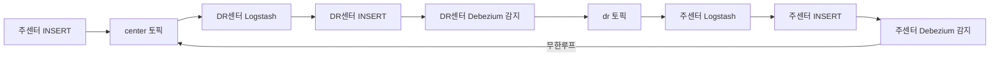

# 양방향 동기화와 무한루프 방지

## 문제

주센터 → DR센터 단방향 동기화라면 간단하다. 문제는 양방향이다.

주센터 변경이 DR센터로 전파되면, DR센터의 Debezium이 그 변경을 또 감지한다. 그걸 다시 주센터로 보내면 주센터 Debezium이 또 감지한다. 무한루프다.



---

## 해결책: 두 가지 안전장치를 겹쳤다

### 1. sql_log_bin=0 — 핵심 방어

Logstash가 DB에 쓸 때 해당 세션의 binlog 기록을 끈다.

```ruby
conn.createStatement.execute("SET sql_log_bin=0")
```

이렇게 하면 `kafka_sink` 계정이 INSERT/UPDATE/DELETE를 해도 binlog에 남지 않는다. Debezium이 감지할 binlog 자체가 없으니 루프가 끊긴다.

이 설정을 쓰려면 `kafka_sink` 계정에 `BINLOG ADMIN` 권한이 필요하다:

```sql
GRANT BINLOG ADMIN ON *.* TO 'kafka_sink'@'%';
```

### 2. Topic Prefix 분리 — 추가 안전장치

각 센터의 Source Connector가 서로 다른 prefix로 토픽을 만든다:

```
주센터 Debezium → topic.prefix=center → center.ECP_ADMIN.TADP_PRJCT
DR센터 Debezium → topic.prefix=dr    → dr.ECP_ADMIN.TADP_PRJCT
```

Logstash는 반대편 토픽만 구독한다:

```
주센터 Logstash → dr.* 구독 → 주센터 DB에 씀
DR센터 Logstash → center.* 구독 → DR센터 DB에 씀
```

설령 `sql_log_bin=0`이 어떤 이유로 동작 안 해도, 같은 센터의 토픽은 구독하지 않으니 루프가 생기지 않는다.

---

## 왜 database.user.exclude.list를 안 썼나

Debezium MySQL 커넥터에는 특정 계정의 변경을 무시하는 `database.user.exclude.list` 옵션이 있다. `kafka_sink` 계정을 제외하면 루프를 막을 수 있다.

하지만 우리가 쓴 건 **MariaDB 커넥터**다. MariaDB 커넥터는 이 옵션을 공식 지원하지 않는다. 그래서 `sql_log_bin=0` 방식으로 갔다.

---

## 동작 흐름 최종


---

## 무한루프 의심 신호

- Kafka 토픽 메시지 수가 계속 증가하는데 실제 DB 변경은 없는 경우
- 양쪽 DB에서 동일 row가 계속 UPDATE 타임스탬프가 바뀌는 경우

---

## 다음

[06 - JDBC Sink에서 Logstash로 전환한 이유](06-jdbc-sink-to-logstash.md)
