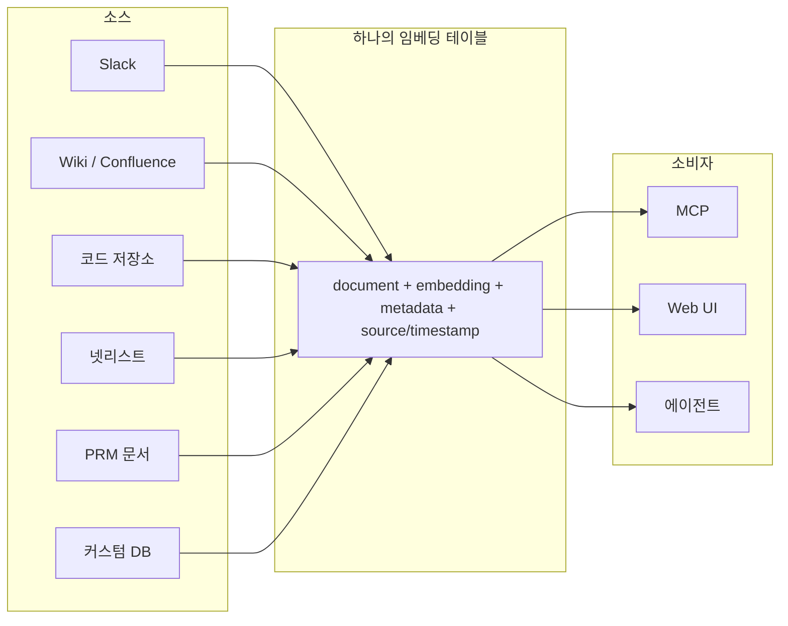
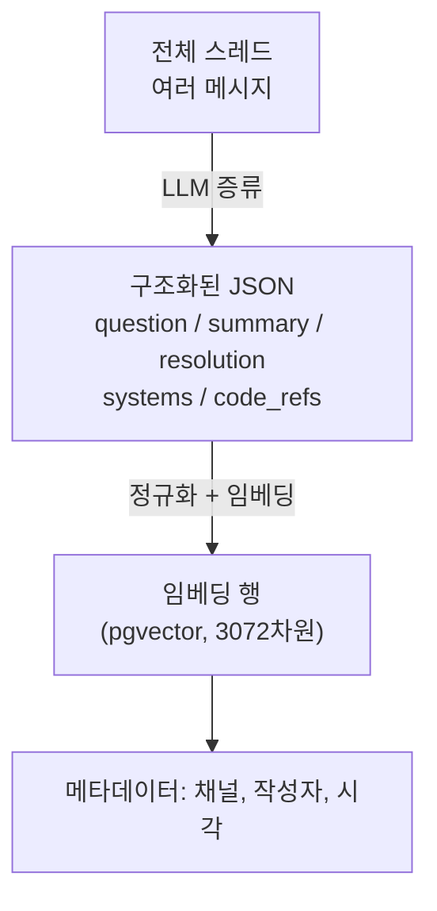
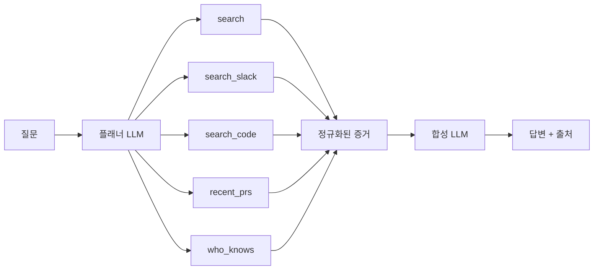
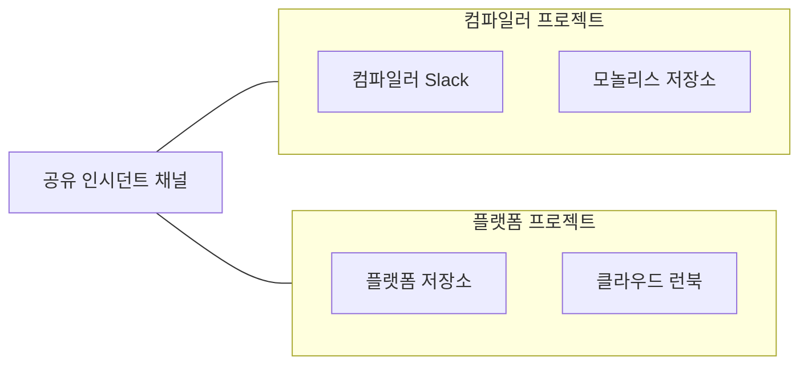

# Cerebras는 사내 지식베이스를 어떻게 만들었나

원문: https://www.cerebras.ai/blog/how-we-built-our-knowledge-base

## 배경: 왜 만들었나

Cerebras는 데이터센터 운영, 칩 설계, 하드웨어, 트레이닝, 추론, 클라우드 플랫폼 등 여러 팀으로 구성된 회사다.
매년 수백 명씩 신규 입사자가 들어오면서 Slack에는 "X는 어디서 찾아요", "Y 전문가가 누구예요" 같은 반복 질문이 쌓였다.
이 문제를 풀기 위해 만든 것이 사내 지식베이스 "Cerebras Knowledge"다.
출시 3개월 만에 하루 15,000건 이상의 질문을 처리하는, 사내에서 가장 널리 쓰이는 도구 중 하나가 됐다.
사람뿐 아니라 자동화 스크립트와 에이전트도 이 지식베이스를 사용한다.

## 핵심 전제: 단일 진실 공급원(single source of truth)은 환상이다

정보는 각 도구가 가장 자연스러운 곳에서 만들어진다.
문서 제안은 Google Docs에서, 논의는 Slack 스레드에서, 코드 리뷰는 GitHub에서, 이슈 상태는 Jira에서 일어난다.
이 도구들은 각자의 영역에 맞게 오랫동안 최적화되어 왔기 때문에, PR 논의를 Google Docs에서 하라고 강제하면 오히려 경험이 나빠진다.
그래서 Cerebras는 "모든 정보를 하나의 플랫폼으로 몰아넣자"는 흔한 해법 대신, 기존 행동 방식을 바꾸지 않고 각 플랫폼에서 데이터를 직접 끌어오는 방향을 택했다.

## 전체 구조: 하나의 임베딩 테이블

지식베이스는 세 가지 역할을 한다.
데이터를 수집하고 저장하는 플랫폼, 그 데이터를 질의하는 플랫폼, 그리고 인증/인가와 감사(auditing)를 담당하는 계층이다.

핵심에는 Postgres 테이블 하나가 있다.
이 테이블에는 여러 소스에서 온 임베딩, 원본 요약, 메타데이터가 함께 들어간다.
Slack, 위키/Confluence, 코드 저장소, 넷리스트(칩 설계 데이터), PRM 문서, 팀이 직접 만든 커스텀 데이터베이스까지 — 소스가 무엇이든 결과물은 같은 형태의 행(row)으로 저장된다.

각 데이터 소스는 "이 데이터가 무엇인지", "어떻게 연결하는지", "얼마나 자주 가져올지"를 정의하는 커넥터 하나를 갖는다.
소스가 Slack이든 코드 저장소든 커스텀 DB든, 결과로 나오는 임베딩 행은 동일한 인터페이스를 따른다.
이 "소스당 커넥터 하나, 테이블은 하나"라는 설계 덕분에 다른 개발자들도 자기 팀의 커스텀 커넥터를 쉽게 추가할 수 있었다.

## Slack: 가장 까다로웠던 소스

Slack은 회사 전체에서 가장 최신 엔지니어링 논의가 일어나는 곳이라 가장 공들여 설계한 소스다.

### 단순 임베딩만으로는 부족했던 이유

처음에는 원문 텍스트를 그대로 임베딩하는 방식을 시도했지만 벡터 검색만으로는 충분하지 않았다.
이유는 세 가지였다.
첫째, 메시지마다 정보 밀도가 천차만별이다 — "그래 알겠어 마이크"와 상세한 커널 설명이 똑같이 "메시지 하나"로 취급된다.
둘째, 메시지 길이가 들쭉날쭉해서 짧은 메시지가 코사인 유사도에서 더 상세한 메시지를 이기는 경우가 잦다.
셋째, 메시지의 의미는 종종 앞뒤 대화 맥락에 의존한다.

### 하이브리드 검색: 네 가지 신호를 함께 쓴다

그래서 Cerebras는 하나의 스레드를 여러 검색 기법으로 동시에 찾을 수 있도록 설계했다.
각 기법이 서로의 약점을 보완하는 구조다.

풀텍스트 검색은 에러 문자열, 플래그 이름, 호스트 이름처럼 임베딩이 뭉개버리는 정확한 토큰을 잡아낸다.
엔지니어가 에러 메시지를 그대로 붙여넣었다면, 의미 유사도보다 정확한 어휘 일치가 거의 항상 더 나은 증거다.

임베딩 검색은 바꿔 말하기(paraphrase)를 잡아낸다.
"restore가 manifest load 후에 멈춰요"라고 묻는 사람과 "checkpoint가 NFS 마운트에서 멎어요"라고 답한 사람은 서로 다른 어휘를 쓰지만, 벡터 유사도가 이 둘을 연결해준다.

역문서빈도(IDF)는 신호와 잡음을 가른다.
흔치 않은 설정 플래그처럼 희귀 토큰으로 이루어진 짧은 메시지는 순위에 들어야 하는데, "고마워요!" 같은 메시지는 임베딩 공간에서는 질의와 가까워 보여도 토큰 희귀도를 반영하면 거의 0점에 가까워진다.

age decay(시간 감쇠)는 Slack 답변에 유효기간이 있다는 사실을 반영한다.
같은 질문에 답하는 스레드가 두 개 있고 하나가 6개월 전 것이라면, 그 인프라가 이미 사라졌을 수 있다.
다른 조건이 같다면 더 최근 스레드가 이긴다.

이 네 가지 기법은 서로 다른 랭킹 결과를 만들어내고, 이 결과들은 질의 시점에 합쳐진다(뒤에서 설명할 reranking 단계).

### Socket Mode로 실시간 수집

Slack 봇을 워크스페이스에 설치하고 Socket Mode로 실행한다.
Slack이 모든 메시지 이벤트를 영속 WebSocket으로 밀어주기 때문에, Web API를 폴링하며 rate limit을 소모하지 않고도 실시간 업데이트를 받는다.

이벤트가 도착하면 즉시 확인(ack) 응답을 보내고, 안정적인 event ID로 중복을 제거한 뒤, ingest consumer가 처리하도록 표시한다.
ingest consumer는 새 메시지 하나만 따로 저장하지 않는다.
그 메시지가 속한 스레드를 찾아서 부모 메시지와 모든 답글을 포함한 전체 대화를 Slack API에서 다시 가져온 뒤, 스레드 전체를 하나의 행으로 다시 쓴다.
그래서 기존 스레드에 답글이 하나 달리면 부모와 형제 메시지까지 다시 끌어오게 되고, 결과적으로 저장된 내용·참여자 목록·최근 활동 시각이 항상 대화 전체를 반영한다.

Slack 채널마다 별도의 데이터 소스로 취급하기 때문에 채널별로 수집 빈도를 다르게 조정할 수 있다.
예를 들어 트래픽이 많은 인시던트 채널은 더 자주 수집하도록 설정할 수 있다.

### 스레드 증류(distillation): LLM으로 구조화하기

원문 Slack 텍스트는 Postgres 전문 검색(GIN 인덱스)으로 바로 키워드 검색이 가능하다.
하지만 쓸모 있는 벡터 검색을 하려면 추가 가공이 필요하다.

증류 단계에서 LLM이 스레드 전체에서 다음 구조화된 데이터를 추출한다.
엔지니어가 실제로 검색할 법한 한 줄 질문, 짧은 요약, 해결 방법, 언급된 시스템과 코드 참조.

원본 대화록을 그대로 임베딩하지 않고, 질문+요약+해결+시스템+코드참조로 정규화한 문서를 임베딩한다.
Cerebras 실험에 따르면 스레드를 일관된 형식으로 정규화했을 때 정확도가 크게 올라갔다.
추가된 메타데이터도 의미 매칭에 더 유용한 신호를 준다.

### 버스팅(bursting): 긴 스레드 속 한 마디를 놓치지 않기

스레드 요약만으로는 긴 스레드 안의 중요한 메시지 하나가 대표되지 않는 문제가 계속 발생했다.
그래서 "버스트" 단위로도 임베딩한다.
버스트란 같은 작성자가 연속으로 보낸 메시지 묶음이다.
스레드 주제를 맥락으로 앞에 붙여서 개별 버스트를 임베딩하는데, 답이 스레드 요약에는 반영되지 않은 한 곁가지 메시지에 있는 경우가 있기 때문이다.
버스트 임베딩은 그 메시지를 단독으로도 찾을 수 있게 해준다.

저품질 데이터가 DB에 들어가지 않도록, 각 버스트는 가중치 조합 점수가 임계값을 넘어야 임베딩된다.
조건은 세 가지다.
말뭉치 전체에서 상대적으로 희귀한 토큰(IDF 4.0 이상)을 포함할 것, 버스트를 합친 길이가 200자 이상일 것, 버스트 내 메시지 중 하나 이상이 리액션(이모지)을 받았을 것(사회적 신호로 취급).

## 코드 저장소: CocoIndex로 증분 임베딩

처음에는 코드 임베딩이 필요한지 자체를 의심했다.
Claude Code 같은 CLI 도구가 뜨면서 "grep만 있으면 충분하지 않나"라는 생각이 들었기 때문이다.
업계 사례를 조사하고 Cursor의 대규모 코드베이스 시맨틱 검색 연구를 읽은 뒤 시도해보기로 결정했다.

Cerebras는 내부 저장소가 많고 일부는 40GB가 넘는다.
가장 큰 고민은 이렇게 큰 저장소를 효율적으로 최신 상태로 유지하는 방법이었다.

여러 실험 끝에 CocoIndex라는 오픈소스 문서 임베딩 프레임워크를 채택했다.
저장소마다 언어별 정규식 경계를 이용해 코드를 분할하는데, 굵은 단위(클래스)부터 시도하고 청크가 너무 크면 메서드 단위, 더 작은 블록 순으로 내려간다.
파일 하나가 파일 수준과 함수 수준처럼 서로 다른 세밀도의 임베딩 여러 개를 만들어낼 수 있다.

CocoIndex는 동기화 메타데이터를 Postgres에 함께 저장한다.
커밋이 생길 때마다 저장소 전체를 다시 계산하지 않고 바뀐 코드 청크만 재임베딩·재수출한다.
동기화 상태와 임베딩 저장소가 같은 DB에 있다는 점이 이 방식이 잘 맞았던 이유다.

코드베이스 수가 늘어나면서 저장소 온보딩을 설정 파일로 옮겨, 팀이 직접 파일 경로 단위 allowlist/denylist를 포함한 설정을 제출할 수 있게 했다.

## 커스텀 데이터 소스: 플러그인 스크립트

이미 자체 DB를 가진 팀들은 그 데이터를 Slack이나 문서 시스템으로 옮기고 싶어하지 않았다.
기존 테이블 위에 동일한 질의 인터페이스만 얹고 싶어했다.

그래서 커스텀 소스는 플러그인 스크립트로 취급한다.
팀이 자기 시스템을 읽어서 임베딩 테이블과 같은 형태의 행을 만들어내는 작은 Python 모듈과, 그에 대응하는 데이터 소스 설정을 PR로 올리면 된다.
같은 스키마로 공유 DB에 쓰기만 하면 나머지 스택은 그대로 작동한다.
Slack, 코드, 문서와 함께 별도 처리 없이 바로 질의 대상이 된다.

## 질의 처리: 플래닝 → 팬아웃 → 리랭킹 → 합성

### 플래닝과 도구 팬아웃

질의가 들어오면 먼저 짧은 플래닝 패스를 돌려 LLM이 어떤 도구와 데이터 소스가 관련 있을지 판단한다.
주요 도구는 다음과 같다.

subsystem_index(파일별 LLM 요약), search(Slack·위키·코드 등을 아우르는 통합 벡터 파이프라인, 내부에서 병합·리랭킹까지 수행), search_slack(Slack 직접 검색), search_code(저장소 대상 ripgrep), recent_prs(관련 최근 PR), who_knows(주제에 정통한 사람 찾기).

플래너는 어떤 프로젝트가 있고 각 프로젝트에 어떤 소스가 연결되어 있으며 각 소스가 어떤 질문에 강한지에 대한 압축된 설명을 참고해서 동작한다.
사용자 질의와 현재 스코프를 받아 도구 선택을 결정하면, executor가 이를 병렬로 팬아웃하고 공통 증거(evidence) 포맷으로 정규화한 뒤 최종 합성 LLM에 넘긴다.

### 리랭킹: RRF로 서로 다른 리스트를 합치기

문서 하나가 질문과 어휘만 겹칠 뿐 실제로는 다른 질문에 답하고 있는데도 상위권에 올라오는 경우가 있다.
리랭킹 전에, 서로 호환되지 않는 여러 검색기 결과 리스트를 RRF(reciprocal rank fusion)로 합친다.
문서마다 그 문서가 등장한 각 리스트에 대해 weight / (60 + rank) 점수를 더하는데, 기본 가중치는 1.0, 스무딩 상수는 60이다.

이 스무딩 상수는 "한 리스트에서만 1등인 문서"보다 "여러 리스트에서 골고루 상위권인 문서"가 이기도록 만든다 — 즉 단일 강한 득표보다 합의(consensus)가 더 중요해진다.
그 다음 중복 청크를 원 소스 기준으로 병합하고, 파일 하나가 기여할 수 있는 결과 수를 제한해서 더 다양한 상위 20개를 만든다.

원 질의와 이 후보들을 작은 리랭커 모델에 보내면, 각 문서에 0~10점을 매기고 상위 10개만 남긴다.
순위가 확정되면 승자 주변 맥락을 다시 채워 넣는다.
예를 들어 위키 섹션 하나가 매칭됐다면 인접한 두 섹션을 함께 가져와서, 청킹 과정에서 잘려나간 제목·전제조건·주의사항이 유실되지 않게 한다.
그 결과 search의 출력은 여러 검색기에서 융합되고, 소스 단위로 중복 제거되고, 실제 질문 기준으로 리랭킹되고, 마지막으로 주변 맥락까지 확장된 증거 묶음이 된다.

## MCP와 Web UI: 같은 도구, 다른 오케스트레이션

### MCP: 도구를 그대로 노출

MCP 통합에서는 검색의 기본 구성 요소를 "질문에 답해줘" 같은 단일 엔드포인트 뒤에 숨기지 않고 직접 도구로 노출한다.
이 도구들은 의도적으로 단순하고 최대한 LLM에 의존하지 않아서, 클라이언트가 빠르고 저렴하게 호출할 수 있다.

MCP 도구 하나는 search_slack, search_code, search, who_knows 같은 검색 기본 단위 하나에 대응한다.
입출력이 좁고 구조화되어 있고 안정적이라, 도구 자체에 추가 오케스트레이션 로직을 넣지 않아도 어떤 클라이언트나 에이전트에서든 쉽게 호출할 수 있다.
대부분의 도구는 벡터 검색·어휘 검색·ripgrep 중 하나의 질의 파이프라인을 돌리고 가벼운 스코어링 휴리스틱을 적용해 원본 증거 행을 반환한다.

Claude Code 같은 MCP 호환 에이전트가 오케스트레이션 엔진이 된다.
어떤 도구를 어떤 순서로 호출하고 결과를 어떻게 조합해서 최종 답변이나 코드 수정으로 만들지는 에이전트가 결정한다.
검색 계층 자체는 이런 LLM 판단에 의존하지 않고 요청을 서빙한다.

### Web UI: 같은 도구를 파이프라인으로 감싸기

Web UI에서는 같은 도구들이 존재하지만, 모든 사용자 질문에 대해 처음부터 끝까지 실행되는 완전한 질의 파이프라인에 연결되어 있다.
UI 에이전트가 플래너와 executor 단계를 직접 소유한다.

플래너는 질의와 활성 프로젝트를 보고 search, search_slack, subsystem_index 같은 검색 도구 중 무엇을 호출할지 고르는 가벼운 LLM 패스다.
executor는 그 도구 호출들을 병렬로 팬아웃하고 결과를 모아 점수·최신성·출처 힌트가 포함된 공유 증거 스키마로 정규화한다.
합성 단계는 타입이 정해진 증거 묶음과 원 질문을 받아 인용, 주의사항, 소스 간 종합까지 포함한 답변을 만들어 UI에 보여준다.

사용자 입장에서 Web UI는 그냥 "질문하면 답이 나오는" 인터페이스지만, 내부적으로는 MCP 클라이언트가 명시적으로 재현할 수 있는 것과 같은 플래너 → executor → 합성 패턴을 그대로 돌린다.

## 프로젝트: 검색 범위를 좁히기

말뭉치가 커지자 "모든 것을 다 검색"하는 방식은 금방 쓸모없어졌다.
컴파일러 팀은 인프라 런북이 검색 결과에 섞이는 걸 원하지 않았고, 그 반대도 마찬가지였다.
"프로젝트"는 기본 검색 관련성을 확보하기 위한 장치다.

프로젝트는 질의가 도는 작업공간을 조직하는 기본 단위로, 특정 Slack 채널·코드 저장소·내부 DB·문서 공간을 팀이나 이니셔티브 단위로 묶은 것이다.
프로젝트는 의도적으로 가볍게 설계되어서, 공유 인시던트 채널이나 중앙 플랫폼 저장소 같은 같은 데이터 소스를 여러 프로젝트가 중복 없이 함께 참조할 수 있다.

온보딩 시 사용자는 자신이 일하는 방식에 맞는 기본 프로젝트(ML 트레이닝 인프라, 컴파일러, 데이터센터 운영 등)를 고르거나 만든다.
이 기본 프로젝트는 사용자 프로필에 저장되어 질의 범위를 자동으로 좁혀준다.
신규 입사 엔지니어는 어떤 Slack 채널·저장소·문서 공간이 중요한지 먼저 배우지 않아도 바로 신호 좋은 답을 받을 수 있다.

## 마무리

이 지식베이스가 작동하는 이유는 모든 것을 하나의 경직된 시스템에 억지로 몰아넣는 대신, 정보가 이미 있는 곳에서 그 정보를 만나러 갔기 때문이다.
여러 검색 기법을 조합함으로써 증거를 빠르게 찾아낼 수 있었고, 그 결과 실제 회사 데이터에 맞게 유연하면서도 회사가 계속 성장해도 쓸모를 유지할 만큼 구조화된 검색 경험을 만들었다.

## 참고 문헌 (원문 References)

- Malkov and Yashunin, *Efficient and Robust Approximate Nearest Neighbor Search Using Hierarchical Navigable Small World Graphs*, arXiv:1603.09320 / IEEE TPAMI 2018. (HNSW — pgvector의 인덱스 방식)
- Anthropic, *Introducing Contextual Retrieval*, 2024.
- Cormack, Clarke, and Büttcher, *Reciprocal Rank Fusion Outperforms Condorcet and Individual Rank Learning Methods*, SIGIR 2009. (RRF 원 논문)
- Li et al., *Search-o1: Agentic Search-Enhanced Large Reasoning Models*, arXiv:2501.05366, 2025.
- Anthropic, *Code Execution with MCP*, 2025.
- Liu et al., *Lost in the Middle: How Language Models Use Long Contexts*, arXiv:2307.03172, 2023.
- Anthropic, *Use XML Tags*.
- Salesforce/Slack Engineering, *How Slack AI Processes Billions of Messages*.
- Cursor, *Improving Agent with Semantic Search*, 2025.

---

## 이 글에서 더 파볼 만한 개념 (glossary 후보)

다음 개념들은 이 글에서 스쳐 지나가듯 나오지만 이해하려면 별도로 찾아봐야 할 만한 것들이다.

- **HNSW** (Hierarchical Navigable Small World) — pgvector가 3072차원 임베딩에 쓰는 근사 최근접 이웃 검색 인덱스 구조
- **RRF** (Reciprocal Rank Fusion) — 서로 다른 랭킹 리스트를 점수 스케일 없이 순위만으로 합치는 방법
- **IDF** (Inverse Document Frequency) — 흔한 단어의 가중치를 낮추고 희귀 단어의 가중치를 높이는 정보검색 기법
- **pgvector** — Postgres에 벡터 타입과 유사도 검색을 추가하는 확장
- **MCP** (Model Context Protocol) — LLM 에이전트가 외부 도구/데이터에 접근하는 프로토콜
- **Socket Mode** (Slack) — Web API 폴링 대신 WebSocket으로 이벤트를 실시간으로 받는 Slack 앱 연결 방식
