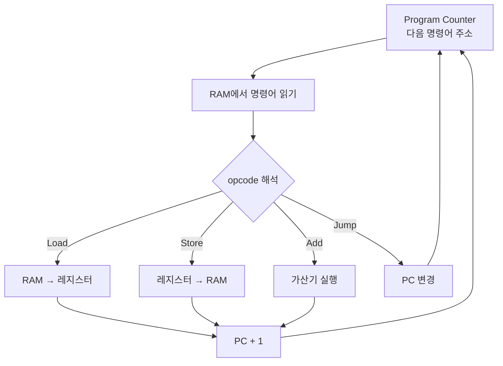
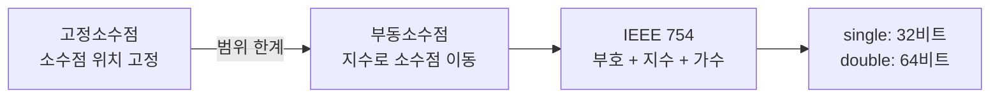
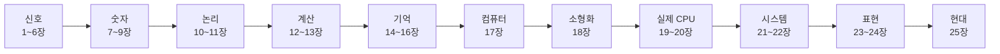

# CODE: 전신기에서 컴퓨터까지, 25장의 흐름

Charles Petzold의 CODE는 전신기 하나에서 시작해서 컴퓨터 전체를 바닥부터 쌓아 올린다. 각 챕터는 독립된 주제가 아니라, 이전 챕터에서 만든 것 위에 새 레이어를 올리는 구조다.

---

## 1부 — 신호와 스위치 (1~6장)

### 1장: Best Friends
모스 부호 이야기로 시작한다. 점과 대시, 두 가지 상태만으로 모든 알파벳을 표현할 수 있다는 것.

이게 왜 중요한가: **두 가지 상태만으로 정보를 전달할 수 있다**는 발견이 이 책 전체의 출발점이다. 전기 스위치도 두 가지 상태(켜짐/꺼짐), 비트도 두 가지 상태(0/1).

### 2~3장: Codes and Combinations / Braille
n개의 자리에서 2ⁿ개의 조합이 만들어진다. 점자는 6비트로 64가지를 표현한다.

이게 왜 중요한가: 이후 CPU의 명령어 집합, RAM 주소 계산, 문자 인코딩까지 전부 "n비트로 2ⁿ가지를 표현한다"는 공식을 반복해서 쓴다.

### 4~6장: 전기 회로, 전신기, 릴레이
전구를 켜는 회로에서 시작해서, 릴레이(약한 신호로 강한 신호를 제어하는 전자기 스위치)까지.

이게 왜 중요한가: 릴레이는 이 책에서 처음 등장하는 "능동적" 부품이다. 뒤에 나올 모든 논리 게이트, 플립플롭, 가산기가 전부 릴레이(또는 그 후계자인 트랜지스터)로 만들어진다.

---

## 2부 — 숫자 체계 (7~9장)

### 7~8장: 10진수에서 2진수로
위치 기수법, 2진수, 8진수, 16진수, 진수 변환.

이게 왜 중요한가: 컴퓨터는 전기 스위치로 만들어지기 때문에 2진수로 동작한다. 16진수는 이진수를 인간이 읽기 쉽게 표현하는 약속이다. 이후 메모리 주소, 명령어 코드, 색상값 등 모든 것이 16진수로 표기된다.

### 9장: 비트와 정보 이론
비트의 정의, 섀넌의 정보량 개념.

이게 왜 중요한가: "정보를 측정할 수 있다"는 개념이 현대 컴퓨터 과학의 토대다.

---

## 3부 — 논리 게이트 (10~11장)

### 10~11장: 불 논리와 게이트
AND/OR/NOT을 릴레이로 구현. NAND/NOR이 모든 게이트를 만들 수 있는 범용 게이트임.

이게 왜 중요한가: **논리 연산이 물리적 회로로 구현된다**는 것. AND 게이트는 두 스위치를 직렬로, OR 게이트는 병렬로 연결한 것이다. CPU 내부의 모든 계산이 이 게이트들의 조합이다.

---

## 4부 — 계산 (12~13장)

### 12장: Binary Adding Machine
반가산기, 전가산기, 여러 비트 덧셈기(Ripple Carry Adder).

이게 왜 중요한가: **이 챕터에서 처음으로 계산하는 회로가 등장한다.** 게이트를 연결하면 덧셈이 된다. CPU 안의 ALU(Arithmetic Logic Unit)가 이 원리다. 덧셈만 있으면 뺄셈, 곱셈, 나눗셈도 전부 구현할 수 있다.

### 13장: But What About Subtraction?
2의 보수. 음수를 표현하는 방식을 바꾸면 뺄셈이 덧셈이 된다.

이게 왜 중요한가: 별도의 뺄셈 회로 없이 같은 덧셈기로 뺄셈까지 처리한다. 모든 현대 CPU가 쓰는 방식이다. Java에서 `int`가 -2,147,483,648 ~ 2,147,483,647인 이유도 32비트 2의 보수 표현 때문이다.

---

## 5부 — 기억 (14~16장)

### 14장: Feedback and Flip-Flops
출력을 입력으로 되먹이면 상태가 유지된다. R-S 플립플롭, D형 플립플롭(level-triggered, edge-triggered), 주파수 분주기.

이게 왜 중요한가: **12~13장에서 계산은 할 수 있게 됐지만, 결과를 저장할 수가 없었다.** 피드백이 기억을 만든다. 이게 없으면 컴퓨터가 불가능하다. CPU 내부의 레지스터, 캐시, 플립플롭이 전부 이 원리다.

### 15장: Bytes and Hex
8비트 = 1바이트, 16진수 표기.

이게 왜 중요한가: 이후 챕터에서 메모리 주소와 데이터를 전부 16진수로 표기한다. 표기 약속을 정하는 챕터.

### 16장: An Assemblage of Memory
플립플롭 → 8비트 래치 → 주소가 있는 RAM. Decoder와 Selector로 원하는 위치에 읽고 쓰기.

이게 왜 중요한가: **계산 결과를 저장하는 것을 넘어, 임의 주소에 접근할 수 있는 메모리가 생겼다.** 프로그램과 데이터가 담기는 공간이다. 주소 비트 n개 → 2ⁿ개의 위치 → 이게 RAM 용량의 원리.

---

## 6부 — 자동화 (17장)

### 17장: Automation
가산기 + RAM + 카운터를 연결하면, 메모리에 저장된 명령어를 순서대로 자동 실행하는 기계가 된다.

**이 챕터에서 처음으로 "컴퓨터"라는 단어가 나온다.**

Load, Store, Add, Jump. 이 네 가지 명령어(opcode)만 있으면 프로그램을 짤 수 있다. 프로그램 카운터(PC)가 다음 명령어 주소를 가리키고, Jump 명령어가 PC를 바꾼다.

이게 왜 중요한가: 12~16장이 개별 부품이라면, 17장은 그것들을 조립해서 컴퓨터를 만드는 순간이다. JVM의 바이트코드, x86의 명령어 집합, ARM ISA가 전부 이 원리의 확장판이다.

---

## 7부 — 소형화 (18장)

### 18장: From Abaci to Chips
릴레이(1930s) → 진공관(1940s) → 트랜지스터(1947) → 집적회로(1958~59).

이게 왜 중요한가: 17장에서 만든 컴퓨터의 원리는 같다. 구현 재료가 바뀐 것뿐이다. 릴레이 컴퓨터는 방 하나를 채웠고, 집적회로는 손톱만하다. 무어의 법칙(18개월마다 트랜지스터 수 2배)이 여기서 나온다.

---

## 8부 — 실제 CPU와 문자 (19~20장)

### 19장: Two Classic Microprocessors
Intel 8080과 Motorola 6800. 17장에서 만든 단순한 컴퓨터를 실제 상업용 마이크로프로세서로 확장한다.

이게 왜 중요한가: 이 두 칩이 없었으면 개인용 컴퓨터 혁명도 없었다. 8080의 명령어 집합이 x86으로 이어졌고, 지금 우리가 쓰는 Intel/AMD CPU가 여기서 출발했다.

### 20장: ASCII and a Cast of Characters
문자를 숫자로 표현하는 ASCII. 7비트로 128개 문자. 그리고 ASCII의 한계와 Unicode(16비트, 65,536개 문자)의 등장.

이게 왜 중요한가: 컴퓨터가 텍스트를 다루는 방식의 기초다. Java `String`의 내부가 UTF-16인 이유, 파일에서 인코딩 문제가 생기는 이유가 여기서 나온다.

---

## 9부 — 버스와 운영체제 (21~22장)

### 21장: Get on the Bus
CPU, RAM, 키보드, 디스플레이를 연결하는 버스. 주소 버스, 데이터 버스, 제어 버스. 트라이스테이트 출력, SRAM vs DRAM. 비디오 디스플레이 메모리(픽셀 = RAM의 비트).

이게 왜 중요한가: 여러 부품이 같은 선을 공유하는 방법이 버스다. "어떻게 여러 장치가 하나의 CPU에 연결되는가"의 답이다. 메모리 맵 I/O, 비디오 메모리 개념이 여기서 나온다.

### 22장: The Operating System
CP/M에서 MS-DOS, UNIX까지. 파일 시스템, 부트로더, API(CALL 5), 계층 구조(BIOS → BDOS → CCP).

이게 왜 중요한가: 운영체제는 하드웨어를 추상화해서 프로그램이 하드웨어를 직접 몰라도 되게 만든다. JVM도 이 역할을 한다: JVM 위에서 돌아가는 Java 프로그램은 실제 CPU가 Intel인지 ARM인지 몰라도 된다.

---

## 10부 — 숫자와 언어 (23~24장)

### 23장: Fixed Point, Floating Point
고정소수점의 한계 → 부동소수점(IEEE 754). 부호 1비트 + 지수 8비트 + 가수 23비트 = 32비트 single precision.

이게 왜 중요한가: Java `float`/`double`이 왜 0.1 + 0.2 = 0.30000000000000004가 되는지 이 챕터를 읽으면 이해된다. 금융 계산에 `BigDecimal`을 써야 하는 이유도 여기서 나온다.

### 24장: Languages High and Low
어셈블리 언어 → 컴파일러 → ALGOL, FORTRAN, COBOL, BASIC, Pascal, C. 인터프리터 vs 컴파일러.

이게 왜 중요한가: 17장의 기계어에서 출발해서 고수준 언어가 어떻게 등장했는지. Java는 컴파일러(javac)로 바이트코드를 만들고 JVM(인터프리터 + JIT)이 실행한다. 두 방식의 절충점이다.

---

## 11부 — GUI와 멀티미디어 (25장)

### 25장: The Graphical Revolution
텍스트 기반 UI → 그래픽 UI. Xerox PARC, Macintosh, Windows. 래스터 디스플레이, 픽셀, 비트맵. 벡터 그래픽 vs 래스터 그래픽. 이미지 압축(RLE, LZW, JPEG). 디지털 오디오(PCM, 샘플링 레이트, 44,100Hz). MIDI. 모뎀, 인터넷, TCP/IP, HTML, Java.

이게 왜 중요한가: 책의 마지막 챕터는 "지금 우리가 쓰는 컴퓨터"로 연결된다. Vannevar Bush가 1945년에 상상한 Memex(하이퍼링크로 연결된 정보 저장 장치)가 웹의 원형이었다는 것. Java가 마지막에 등장하는 건 우연이 아니다.

---

## 전체 흐름 한 줄 요약

릴레이 하나 → 논리 게이트 → 가산기 → 메모리 → 컴퓨터 → 칩 → 운영체제 → 우리가 지금 쓰는 것.

이 책을 읽고 나면 "왜 정수 오버플로우가 생기는가", "왜 부동소수점은 부정확한가", "JVM은 왜 필요한가", "운영체제가 하드웨어를 어떻게 추상화하는가"에 대한 답이 생긴다. 개별 지식이 아니라 연결된 맥락으로.
