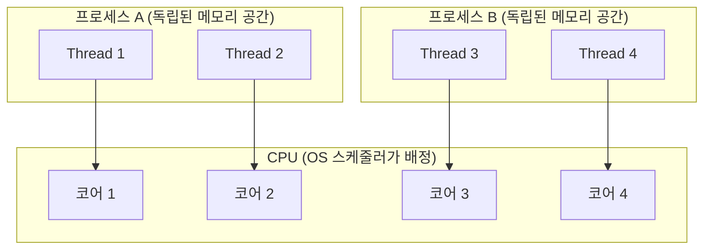
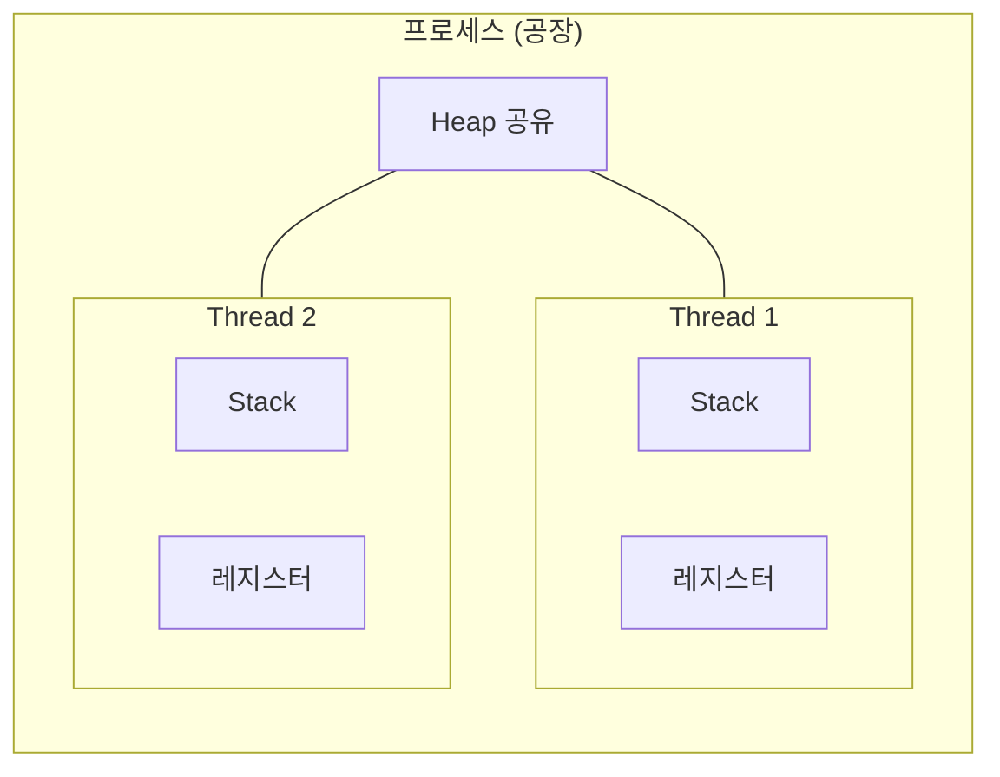
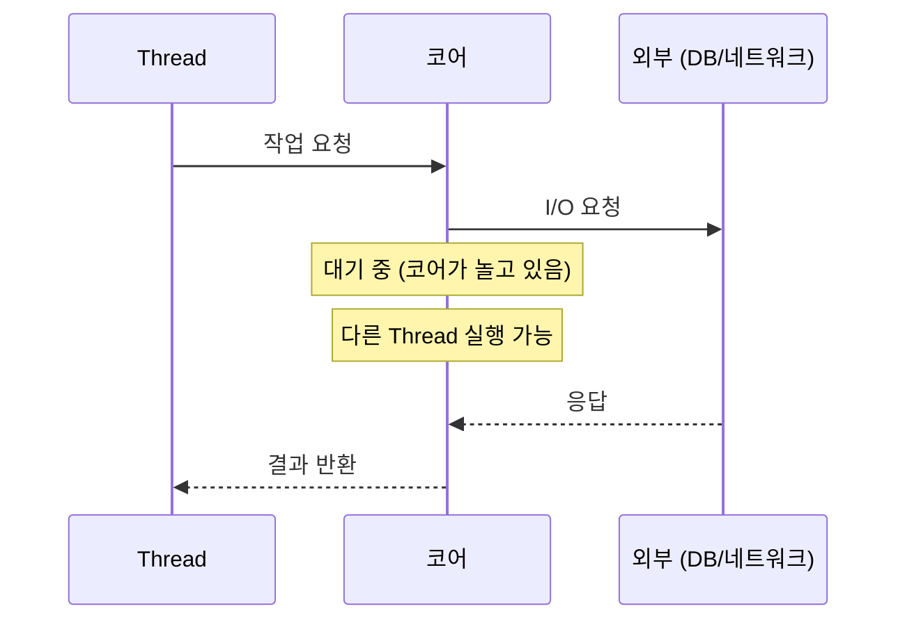

# 프로세스, 스레드, 코어, 병렬처리 — 실행 단위의 전체 그림

> "코어가 많으면 스레드로 병렬처리를 할 수 있는 건가?" 라는 질문에서 시작했다. 맞는 말이지만, 정확히 이해하려면 프로세스부터 코어까지 전체 계층을 함께 봐야 한다.

---

## 전체 계층 구조



프로세스가 스레드를 포함하고, 스레드가 코어에서 실행된다.

---

## 핵심 개념 정의

### 프로세스 (Process)

실행 중인 프로그램 하나의 독립적인 인스턴스다.

```
크롬 탭 하나 = 프로세스 하나
IntelliJ 실행 = 프로세스 하나
Node.js 서버 실행 = 프로세스 하나
```

- 각자 독립된 메모리 공간 (Heap, Stack, Code, Data)
- OS가 자원(메모리, 파일 핸들 등)을 **프로세스 단위**로 관리
- 프로세스끼리는 메모리를 공유하지 않음 → IPC(파이프, 소켓, 공유 메모리)로 통신

### 스레드 (Thread)

프로세스 안에서 실행되는 작업 단위다.



- 같은 프로세스의 스레드끼리는 **Heap을 공유**
- 각 스레드는 자신만의 Stack과 레지스터를 가짐
- 스레드는 소프트웨어 개념이다

### 물리적 코어 (Physical Core)

CPU 안에 있는 실제 연산 유닛이다.

```
코어 하나 = 동시에 명령어 하나를 실행하는 "진짜 일꾼"
```

4코어 CPU라면 물리적으로 동시에 4개의 명령어를 실행할 수 있다. 코어는 하드웨어 개념이다.

### 병렬처리 (Parallelism)

물리적으로 동시에 여러 작업이 실행되는 것이다. **코어 수에 종속된다.**

---

## 멀티프로세스 vs 멀티스레드

둘 다 여러 작업을 동시에 처리하는 방법이지만, 접근이 다르다.

| | 멀티프로세스 | 멀티스레드 |
|---|---|---|
| 메모리 | 각자 독립된 공간 | Heap 공유 |
| 격리성 | 높음 (하나가 죽어도 다른 프로세스 영향 없음) | 낮음 (하나가 죽으면 전체 프로세스 영향) |
| 통신 비용 | 높음 (IPC 필요) | 낮음 (메모리 직접 공유) |
| 컨텍스트 스위칭 비용 | 높음 | 낮음 |
| 생성 비용 | 높음 | 낮음 |

**멀티스레드를 주로 쓰는 이유**: 같은 프로세스 안에서 메모리를 공유하므로 통신 비용이 낮고, 스레드 생성/전환 비용이 프로세스보다 훨씬 저렴하다.

**멀티프로세스를 쓰는 경우**: 격리가 중요할 때 (크롬 탭, Nginx worker). 하나가 죽어도 다른 것에 영향을 주면 안 될 때.

---

## 병렬처리는 코어 수에 종속적인가?

**Yes. 진짜 병렬처리(True Parallelism)는 코어 수에 종속된다.**

```mermaid
gantt
  title 코어 1개 — 동시성 (번갈아 실행)
  dateFormat x
  axisFormat %L ms

  section 코어 1
  Task A : 0, 20
  Task B : 20, 40
  Task A : 40, 60
  Task B : 60, 80
```

```mermaid
gantt
  title 코어 4개 — 병렬처리 (동시에 실행)
  dateFormat x
  axisFormat %L ms

  section 코어 1
  Task A : 0, 40

  section 코어 2
  Task B : 0, 40

  section 코어 3
  Task C : 0, 40

  section 코어 4
  Task D : 0, 40
```





코어가 1개라면 아무리 스레드를 많이 만들어도 **동시에 실행되는 작업은 하나뿐**이다.

---

## 스레드 수 > 코어 수일 때 어떻게 되나?

```mermaid
gantt
  title 코어 2개, 스레드 6개 — OS 스케줄러가 번갈아 배정
  dateFormat x
  axisFormat %L ms

  section 코어 1
  Thread 1 : 0, 20
  Thread 3 : 20, 40
  Thread 5 : 40, 60

  section 코어 2
  Thread 2 : 0, 20
  Thread 4 : 20, 40
  Thread 6 : 40, 60
```



OS의 **스케줄러**가 스레드들을 코어에 돌아가며 배정한다. 매우 빠르게 번갈아 실행하므로 "동시에 돌아가는 것처럼" 보이지만, 이것은 **동시성(Concurrency)** 이지 진짜 병렬처리가 아니다.

---

## 동시성 vs 병렬처리

| 개념 | 설명 | 코어 요구사항 |
|------|------|--------------|
| **동시성 (Concurrency)** | 여러 작업을 번갈아 처리, 진행 중인 작업이 여럿인 상태 | 코어 1개도 가능 |
| **병렬처리 (Parallelism)** | 여러 작업을 물리적으로 동시에 처리 | 코어 여러 개 필수 |

동시성은 "여러 작업을 다루는 구조"이고, 병렬처리는 "실제로 동시에 실행하는 것"이다.

---

## 스레드풀 크기는 코어 수를 고려해야 한다

작업 유형에 따라 전략이 달라진다.

### CPU 집약적 작업 (CPU-bound)

계산, 암호화, 압축, 렌더링처럼 **CPU가 쉬지 않고 일하는 작업**이다.

```
스레드 수 = 코어 수 (또는 코어 수 + 1)
```

코어 수 이상으로 스레드를 늘리면, 추가 연산을 할 코어가 없으니 **컨텍스트 스위칭 오버헤드**만 늘어난다.

### I/O 집약적 작업 (I/O-bound)

DB 쿼리, 네트워크 요청, 파일 읽기처럼 **CPU가 외부 응답을 기다리는 작업**이다.

스레드가 I/O 대기 중일 때 코어는 놀고 있다. 그 사이에 다른 스레드를 실행할 수 있으므로, 코어 수보다 많은 스레드를 배정해도 된다.



```
스레드 수 = 코어 수 × (1 + 대기시간 / 처리시간)
```

예를 들어 스레드가 90% 시간을 I/O 대기에 쓴다면:

```
코어 4개 × (1 + 9) = 40개 스레드가 적절
```

### 실무에서 자주 쓰는 기준

| 작업 유형 | 스레드 수 공식 |
|-----------|--------------|
| CPU-bound | `N_cores` 또는 `N_cores + 1` |
| I/O-bound | `N_cores × 2` ~ `N_cores × 10` (경험치) |
| 혼합 | 프로파일링 후 튜닝 |

---

## 정리

- **프로세스**는 독립된 메모리 공간을 가진 실행 단위, **스레드**는 그 안의 작업 단위
- **멀티스레드**는 메모리 공유로 통신 비용이 낮지만, Heap 공유로 동기화 문제가 생긴다
- **진짜 병렬처리는 코어 수가 상한선**이다
- **스레드는 코어보다 많아도 되지만**, 그 이상은 동시성일 뿐 병렬이 아니다
- **CPU-bound는 코어 수에 맞게**, I/O-bound는 대기 비율에 따라 더 많이
- 스레드를 무조건 많이 만든다고 빠르지 않다 — 메모리 소비와 컨텍스트 스위칭 비용이 따른다
- 최적값은 결국 **벤치마킹/프로파일링**으로 결정한다
