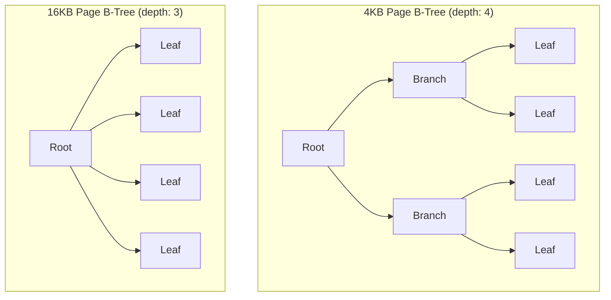
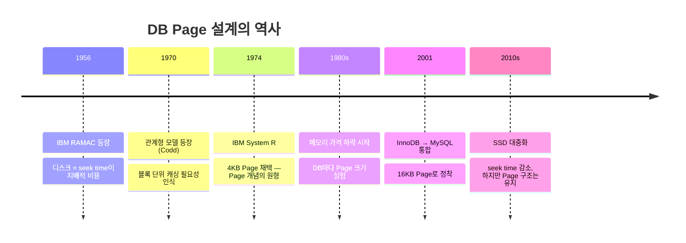

# DB는 왜 처음부터 Page 단위로 설계됐을까 — 그 역사적 맥락

> "InnoDB 기본 Page 크기는 16KB입니다" — 이걸 외우는 건 쉽다.
> 근데 왜 하필 Page라는 개념이 생겼는가? 누가, 언제, 왜 이 설계를 선택했는가?

---

## 1960년대: 디스크가 처음 등장했을 때

최초의 상업용 하드디스크는 1956년 IBM의 RAMAC 305다.

```
IBM RAMAC 305 (1956)
┌─────────────────────────────────┐
│  용량: 5MB                      │
│  무게: 1톤                      │
│  크기: 냉장고 2개 크기           │
│  가격: 연 $3,200 임대료         │
└─────────────────────────────────┘
```

초기 디스크는 데이터를 **트랙(track)** 과 **섹터(sector)** 단위로 물리적으로 구분해서 저장했다. 헤드가 물리적으로 이동해야 데이터에 접근할 수 있었고, 이 이동 시간(seek time)이 지배적인 비용이었다.

이때부터 명확해진 원칙이 하나 있다:

> **디스크는 "얼마나 읽냐"가 아니라 "몇 번 읽냐"가 비용이다.**

---

## 1970년대: 관계형 DB의 등장과 블록 I/O

1970년, IBM의 에드거 코드(Edgar F. Codd)가 관계형 모델 논문을 발표했다. 이후 IBM에서 System R, UC Berkeley에서 Ingres를 만들기 시작했다.

이 시기에 DB 설계자들은 현실적인 문제에 부딪혔다.

```
문제: 테이블에서 row 하나를 읽으려면?

옵션 A: 바이트 주소로 직접 접근
  → 디스크 헤드를 정확한 위치로 이동 → seek time 최대
  → 매번 다른 위치 → 캐싱 불가능

옵션 B: 고정 크기 블록으로 묶어서 관리
  → 블록 단위로 캐시 가능
  → 근처 row가 같은 블록에 있으면 재사용 가능
  → 인덱스도 블록 단위로 구성하면 탐색 효율화
```

선택은 명확했다. **고정 크기 블록(Page) 단위로 데이터를 관리**하는 방식이 채택됐다.

IBM System R(1974~1979)은 이미 **4KB 페이지**를 기본 단위로 사용했다. 이게 오늘날 DB Page의 직접적인 원형이다.

---

## 왜 OS 블록(512B~4KB)보다 크게 잡았나


OS와 하드웨어는 이미 블록 단위로 동작하고 있었다. DB가 그것보다 더 큰 단위를 쓰는 이유는 **지역성(locality)** 때문이다.

SQL 쿼리 패턴을 생각해보면:

```sql
SELECT * FROM orders WHERE user_id = 123;
-- user_id=123의 주문이 100개라면?
-- 이 row들이 물리적으로 인접해있을 가능성이 높다
-- 첫 번째 row를 읽을 때 근처 row까지 같이 올려오면 → 추가 I/O 없이 재사용
```

Row들이 물리적으로 인접해있다면, 한 번의 I/O로 여러 row를 같이 올려오는 게 훨씬 효율적이다. 이게 Page 크기를 OS 블록보다 크게 잡는 핵심 이유다.

---

## 1980~90년대: Page 크기 경쟁

여러 DB가 등장하면서 Page 크기도 제각각이었다.

| DB | 기본 Page 크기 | 비고 |
|----|--------------|------|
| IBM DB2 | 4KB | 당시 메모리가 너무 비쌌음 |
| Oracle | 2KB → 8KB | 버전업하면서 점진적으로 증가 |
| Sybase / SQL Server | 2KB → 8KB | Sybase에서 MS가 포크 |
| PostgreSQL | 8KB | 현재까지 고정 |
| MySQL InnoDB | **16KB** | 2000년대 초 기본값으로 정착 |

Page 크기가 커지는 트렌드의 이유는 하나다: **메모리가 점점 저렴해졌기 때문이다.**

```
메모리 가격 추이 (1MB 기준)
1970년대: $5,000,000
1980년대: $500,000
1990년대: $5,000
2000년대: $50
2010년대: $5
```

메모리가 싸질수록 Buffer Pool을 크게 잡을 수 있게 됐고, 그러면 더 큰 Page를 올려놔도 낭비가 아니게 됐다.

---

## InnoDB가 16KB를 선택한 이유

InnoDB는 핀란드 회사 Innobase Oy에서 1990년대 후반 개발됐고, MySQL 3.23(2001년)에 통합됐다.

16KB 선택의 배경:

```
트레이드오프 분석

Page 크기 작을수록 (+)          Page 크기 클수록 (+)
─────────────────────          ─────────────────────
메모리 낭비 적음               I/O 횟수 적음
작은 테이블에 유리             근처 row 재사용 유리
                               B-Tree 노드 크면 트리 높이 낮아짐
                               → 탐색 비용 감소

2000년대 초 서버 메모리 상황:
  일반 서버: 256MB ~ 1GB
  16KB × 수천 Page = 수십 MB → 충분히 감당 가능
```

특히 **B-Tree 인덱스 구조**와의 궁합이 결정적이었다. Page 하나가 B-Tree의 노드 하나다. Page가 클수록 노드 하나에 더 많은 키를 담을 수 있고, 트리의 높이(depth)가 낮아지고, 탐색에 필요한 I/O 횟수가 줄어든다.



16KB Page는 4KB Page보다 노드당 4배 많은 키를 담기 때문에 트리 높이가 낮아진다. 1억 건 테이블 기준으로 B-Tree depth 차이가 1만 달라져도, 모든 쿼리에서 I/O 1회가 줄어드는 효과다.

---

## 오늘날: SSD 시대에도 Page가 유효한 이유

SSD가 등장하면서 seek time 문제가 상당 부분 해소됐다. 그렇다면 Page 설계가 의미 없어진 걸까?

그렇지 않다. 이유가 달라졌을 뿐이다.

```
HDD 시대의 Page 이유:
  seek time이 지배적 → I/O 횟수가 비용 → 한 번에 크게 읽어라

SSD 시대의 Page 이유:
  ① SSD도 I/O 요청 레이턴시가 존재 (HDD보다 작지만 0은 아님)
  ② SSD 내부도 페이지/블록 단위로 동작 (NAND Flash 특성)
  ③ Buffer Pool 캐싱 효율은 여전히 Page 크기에 의존
  ④ B-Tree 구조 자체가 Page 기반 — 바꾸려면 DB를 통째로 다시 설계해야 함
```

NVMe SSD의 등장 이후 일부 DB는 더 작은 Page(4KB, 8KB)로 실험하기도 했다. 하지만 InnoDB 16KB는 수십 년간 최적화된 디폴트로 여전히 유지되고 있다.

---

## 정리: 왜 DB는 처음부터 Page 단위였나



Page는 "디스크가 어차피 블록 단위로 읽으니까 맞춰 쓴 것"이 아니다.

**디스크 I/O의 비용 구조(횟수가 비용)를 역이용해서, 한 번 읽을 때 최대한 유용한 데이터를 묶어 올리기 위한 전략적 설계 단위다.**

그리고 그 판단이 1970년대에 내려졌고, 지금도 유효하다.

---

*관련 학습: [DB Storage Basics](../db-internals/db-storage-basics.md)*
