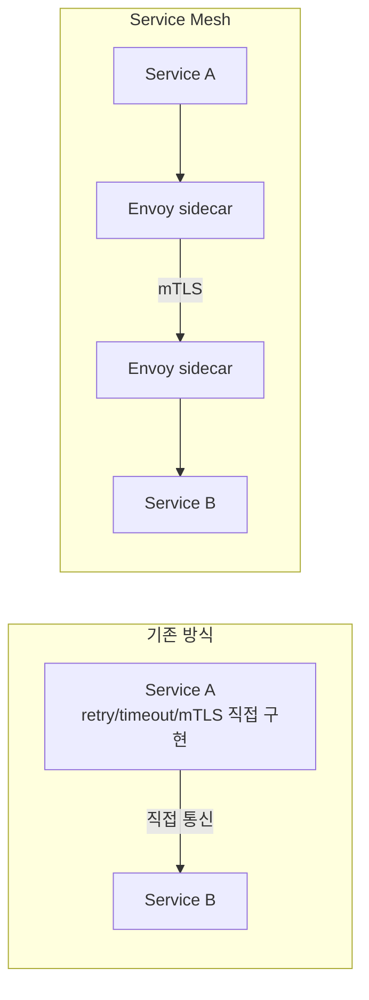
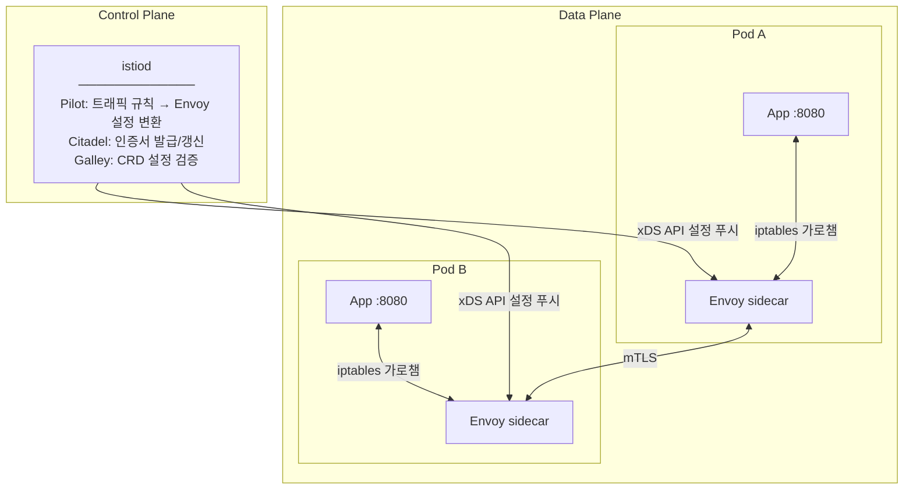
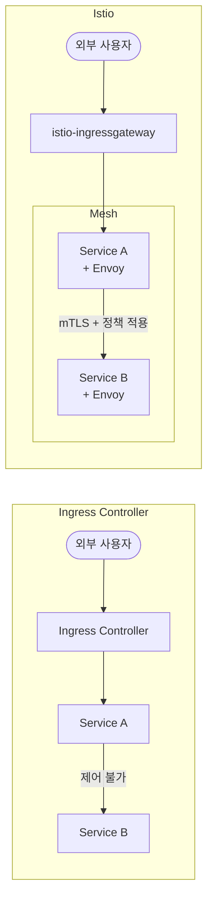
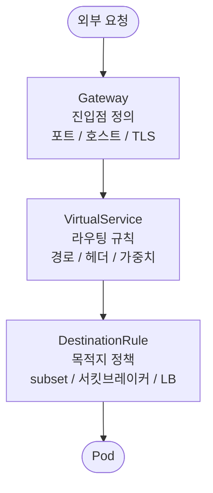
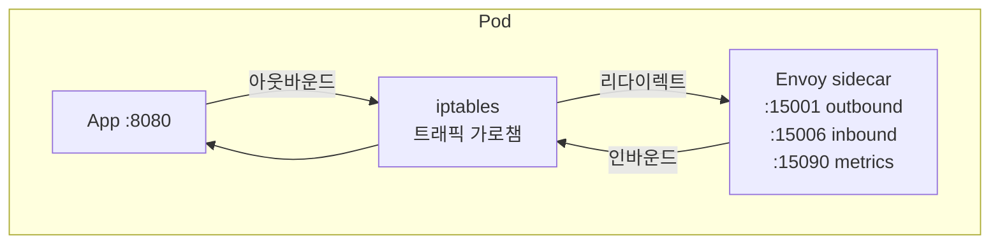
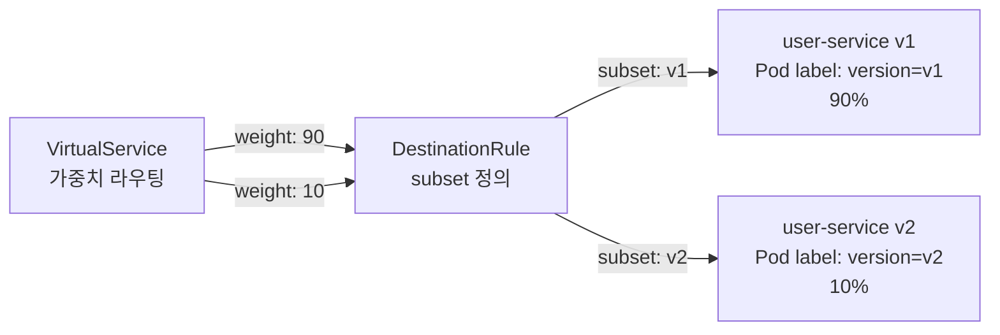
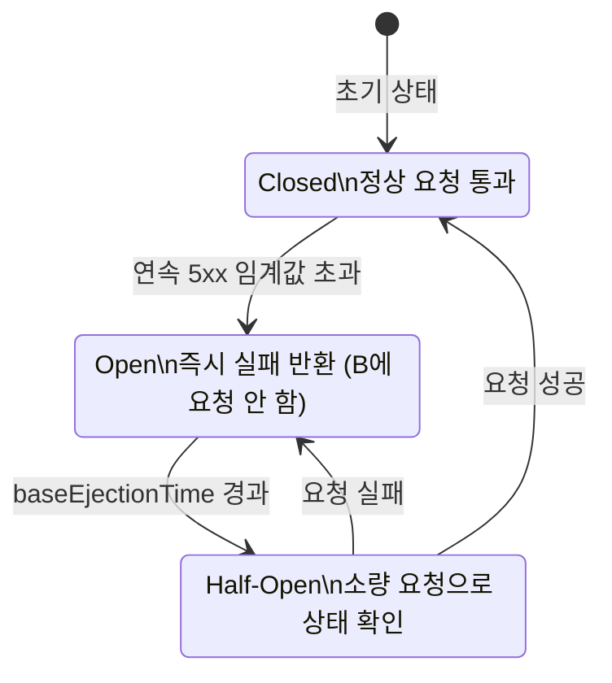
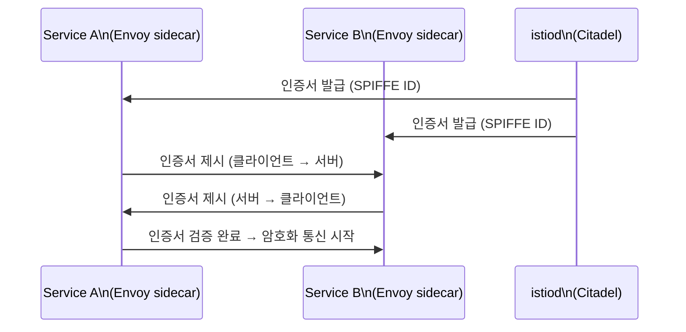
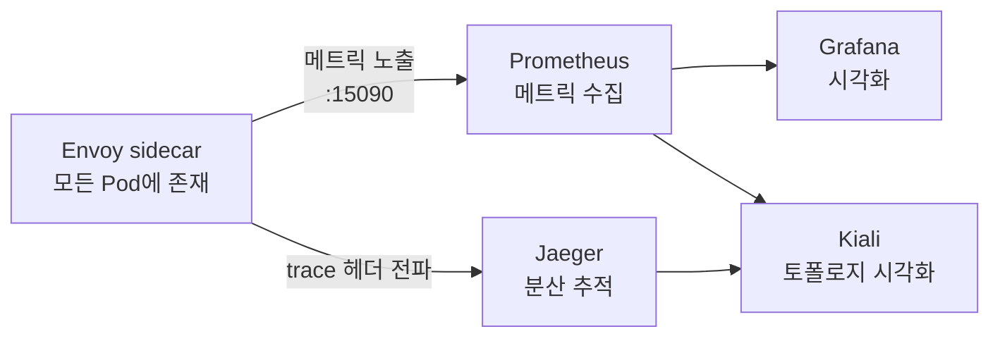

# Istio 학습 가이드

> Ingress Controller 없이 Istio만으로 트래픽을 제어하는 방법을 개념과 실습 예제로 정리한 문서입니다.

---

## 1. Service Mesh란?

Service Mesh는 마이크로서비스 간의 통신을 인프라 레이어에서 대신 처리해주는 시스템이다.
앱 코드를 수정하지 않고도 **트래픽 제어, 보안, 관찰성**을 확보할 수 있다.

### 왜 필요한가?

마이크로서비스가 많아질수록 아래 문제가 생긴다.

- 서비스 A → 서비스 B 통신 실패 시 어디서 문제인지 모름
- 서비스 간 암호화(mTLS)를 각 앱에 직접 구현해야 함
- 재시도, 타임아웃 로직을 모든 서비스에 중복 구현
- 트래픽 분산 (카나리, A/B 테스트) 을 앱 레벨에서 처리

Service Mesh는 이를 **sidecar 패턴**으로 해결한다.
모든 Pod에 Envoy 프록시를 붙여서, 앱은 아무것도 모른 채 통신하고 실제 처리는 sidecar가 담당한다.



---

## 2. Istio 아키텍처

Istio는 **Control Plane**과 **Data Plane**으로 나뉜다.



### istiod

Istio 1.5부터 Pilot, Citadel, Galley가 **istiod** 단일 프로세스로 통합되었다.

- **Pilot**: VirtualService, DestinationRule 등을 Envoy xDS 설정으로 변환해서 각 sidecar에 푸시
- **Citadel**: 서비스 간 인증서 발급/갱신 — mTLS에 사용
- **Galley**: CRD 설정 유효성 검증

### Envoy Sidecar

모든 Pod에 자동 주입되는 프록시. **iptables 규칙**으로 앱의 인바운드/아웃바운드 트래픽을 가로챈다.

```bash
# sidecar 자동 주입 활성화 (namespace 레벨)
kubectl label namespace my-app istio-injection=enabled
```

### istio-ingressgateway

외부 트래픽을 받아들이는 전용 Envoy Pod. Ingress Controller 역할을 대체한다.

```bash
kubectl get svc istio-ingressgateway -n istio-system
```

---

## 3. Ingress Controller vs Istio

핵심 차이는 **제어 범위**다.

Ingress Controller는 클러스터 외부에서 들어오는 트래픽(North-South)만 다룬다.
반면 Istio는 외부 트래픽뿐 아니라 클러스터 내부 서비스 간 통신(East-West)까지 제어한다.



Ingress Controller가 못하는 것을 Istio는 한다.

- East-West 트래픽 제어 (서비스 간 라우팅, 정책 적용)
- mTLS 자동 적용
- 트래픽 가중치 분산 (카나리, A/B 테스트)
- 서킷브레이커
- 분산 추적 (Jaeger/Zipkin)

대신 Istio는 복잡도가 높다. Ingress Controller 하나로 충분한 환경에서 Istio를 도입하면 운영 비용이 올라간다.

### 리소스 대응 관계

Kubernetes Ingress 리소스와 Istio 리소스는 다음과 같이 대응된다.

- `Ingress` → `Gateway + VirtualService`
- (없음) → `DestinationRule` — 서킷브레이커, subset 정의
- (없음) → `ServiceEntry` — 외부 서비스 등록
- (없음) → `PeerAuthentication` — mTLS 정책

---

## 4. 핵심 리소스 개념



### Gateway

외부에서 들어오는 트래픽의 **진입점**을 정의한다.
어떤 포트, 어떤 호스트, 어떤 프로토콜을 허용할지 설정한다.
`istio-ingressgateway` Pod 자체가 아니라, 그 Pod의 동작을 설정하는 리소스다.

### VirtualService

실제 **라우팅 규칙**을 정의한다.
어떤 경로로 들어온 트래픽을 어느 서비스/버전으로 보낼지 결정한다.

Gateway와 연결하면 외부 트래픽 라우팅, Gateway 없이 사용하면 내부 서비스 간 트래픽 라우팅에 쓰인다.

### DestinationRule

트래픽이 **목적지에 도달한 후** 어떻게 처리할지 정의한다.

- subset 정의 — v1, v2 등 Pod label 기반으로 그룹 구분
- 로드밸런싱 정책 — ROUND_ROBIN, LEAST_CONN 등
- 서킷브레이커 — outlier detection
- mTLS 설정

### ServiceEntry

Mesh 외부 서비스(외부 API, DB 등)를 **Mesh 안으로 등록**해서 Istio 정책을 적용할 수 있게 한다.

### PeerAuthentication

서비스 간 mTLS 모드를 설정한다.

- `STRICT` — mTLS만 허용
- `PERMISSIVE` — mTLS + 평문 둘 다 허용 (마이그레이션 과도기에 사용)
- `DISABLE` — mTLS 비활성화

---

## 5. 트래픽 흐름 이해

### Pod 내부 통신 구조

앱은 자신이 프록시를 거친다는 사실을 모른다.
iptables가 트래픽을 가로채서 Envoy로 보내고, Envoy가 실제 통신을 처리한다.



### iptables 동작 원리

sidecar init 컨테이너가 Pod 시작 시 iptables 규칙을 설정한다.

- 아웃바운드 트래픽 → Envoy 15001 포트로 리다이렉트
- 인바운드 트래픽 → Envoy 15006 포트로 리다이렉트
- 앱은 이 사실을 모른 채 평소처럼 통신

---

## 6. 실습 예제 - 외부 트래픽 (North-South)

### 시나리오

`api.example.com` 으로 들어오는 요청을 내부 `user-service` 로 라우팅

### Step 1: Namespace에 sidecar 주입 활성화

```bash
kubectl label namespace my-app istio-injection=enabled
```

### Step 2: 앱 배포

```yaml
# deployment.yaml
apiVersion: apps/v1
kind: Deployment
metadata:
  name: user-service
  namespace: my-app
spec:
  replicas: 2
  selector:
    matchLabels:
      app: user-service
      version: v1
  template:
    metadata:
      labels:
        app: user-service
        version: v1
    spec:
      containers:
      - name: user-service
        image: my-registry/user-service:1.0.0
        ports:
        - containerPort: 8080
---
apiVersion: v1
kind: Service
metadata:
  name: user-service
  namespace: my-app
spec:
  selector:
    app: user-service
  ports:
  - port: 8080
    targetPort: 8080
```

### Step 3: Gateway 생성

```yaml
# gateway.yaml
apiVersion: networking.istio.io/v1beta1
kind: Gateway
metadata:
  name: my-gateway
  namespace: my-app
spec:
  selector:
    istio: ingressgateway    # istio-ingressgateway Pod 선택
  servers:
  - port:
      number: 80
      name: http
      protocol: HTTP
    hosts:
    - "api.example.com"
  - port:
      number: 443
      name: https
      protocol: HTTPS
    tls:
      mode: SIMPLE
      credentialName: api-example-tls    # Secret 이름
    hosts:
    - "api.example.com"
```

### Step 4: VirtualService 생성

```yaml
# virtualservice.yaml
apiVersion: networking.istio.io/v1beta1
kind: VirtualService
metadata:
  name: user-service-vs
  namespace: my-app
spec:
  hosts:
  - "api.example.com"
  gateways:
  - my-gateway                       # Gateway와 연결
  http:
  - match:
    - uri:
        prefix: /api/v1/users        # 경로 매칭
    rewrite:
      uri: /v1/users                 # 경로 재작성 (선택)
    route:
    - destination:
        host: user-service           # Service 이름
        port:
          number: 8080
    timeout: 10s
    retries:
      attempts: 3
      perTryTimeout: 3s
      retryOn: "5xx,reset,connect-failure"
```

### Step 5: 확인

```bash
# ingressgateway 외부 IP 확인
kubectl get svc istio-ingressgateway -n istio-system

# 설정 적용 확인
istioctl analyze -n my-app

# Envoy 설정 확인
istioctl proxy-config routes deploy/user-service -n my-app
```

---

## 7. 실습 예제 - 내부 트래픽 (East-West)

### 시나리오

`order-service`가 `user-service`를 호출할 때 타임아웃/재시도 정책 적용

### VirtualService (내부용)

`gateways` 필드를 생략하면 내부 서비스 간 트래픽에만 적용된다.

```yaml
apiVersion: networking.istio.io/v1beta1
kind: VirtualService
metadata:
  name: user-service-internal-vs
  namespace: my-app
spec:
  hosts:
  - user-service        # 내부 Service 이름만
  http:
  - route:
    - destination:
        host: user-service
        port:
          number: 8080
    timeout: 5s
    retries:
      attempts: 3
      perTryTimeout: 2s
      retryOn: "5xx,connect-failure,reset"
```

### DestinationRule

```yaml
apiVersion: networking.istio.io/v1beta1
kind: DestinationRule
metadata:
  name: user-service-dr
  namespace: my-app
spec:
  host: user-service
  trafficPolicy:
    connectionPool:
      tcp:
        maxConnections: 100
      http:
        http1MaxPendingRequests: 100
        http2MaxRequests: 1000
    loadBalancer:
      simple: LEAST_CONN
```

---

## 8. 실습 예제 - 카나리 배포

### 시나리오

user-service v1(90%)과 v2(10%)로 트래픽 분산



### Step 1: v2 배포

```yaml
apiVersion: apps/v1
kind: Deployment
metadata:
  name: user-service-v2
  namespace: my-app
spec:
  replicas: 1
  selector:
    matchLabels:
      app: user-service
      version: v2
  template:
    metadata:
      labels:
        app: user-service
        version: v2         # 반드시 version label 필요
    spec:
      containers:
      - name: user-service
        image: my-registry/user-service:2.0.0
        ports:
        - containerPort: 8080
```

### Step 2: DestinationRule — subset 정의

```yaml
apiVersion: networking.istio.io/v1beta1
kind: DestinationRule
metadata:
  name: user-service-dr
  namespace: my-app
spec:
  host: user-service
  subsets:
  - name: v1
    labels:
      version: v1           # Pod label 기반으로 선택
  - name: v2
    labels:
      version: v2
```

### Step 3: VirtualService — 가중치 설정

```yaml
apiVersion: networking.istio.io/v1beta1
kind: VirtualService
metadata:
  name: user-service-vs
  namespace: my-app
spec:
  hosts:
  - user-service
  http:
  - route:
    - destination:
        host: user-service
        subset: v1
      weight: 90
    - destination:
        host: user-service
        subset: v2
      weight: 10
```

### 헤더 기반 라우팅 (특정 사용자만 v2 사용)

```yaml
http:
- match:
  - headers:
      x-user-group:
        exact: "beta"       # beta 헤더가 있는 요청만 v2로
  route:
  - destination:
      host: user-service
      subset: v2
- route:
  - destination:
      host: user-service
      subset: v1            # 나머지는 v1
```

### 점진적 전환 순서

```
1단계: weight v1=90, v2=10
2단계: weight v1=70, v2=30
3단계: weight v1=50, v2=50
4단계: weight v1=0,  v2=100 → v1 Deployment 제거
```

---

## 9. 실습 예제 - 서킷브레이커

### 개념

특정 서비스가 연속으로 실패하면 **잠시 해당 서비스로의 요청을 차단**해서 장애가 전파되지 않게 한다.



Istio에서 서킷브레이커는 DestinationRule의 `outlierDetection`으로 구현한다.
특정 Pod가 문제가 있으면 그 Pod를 로드밸런싱 풀에서 일시적으로 제거(eject)하는 방식이다.

### DestinationRule — outlier detection

```yaml
apiVersion: networking.istio.io/v1beta1
kind: DestinationRule
metadata:
  name: user-service-dr
  namespace: my-app
spec:
  host: user-service
  trafficPolicy:
    outlierDetection:
      consecutive5xxErrors: 3      # 연속 5xx 에러 3번이면 제거
      interval: 10s                # 분석 주기
      baseEjectionTime: 30s        # 최소 격리 시간
      maxEjectionPercent: 50       # 최대 격리 가능한 인스턴스 비율
      minHealthPercent: 30         # 최소 건강한 인스턴스 비율 유지
```

### Connection Pool 설정 (과부하 방지)

```yaml
trafficPolicy:
  connectionPool:
    tcp:
      maxConnections: 100          # 최대 TCP 연결 수
      connectTimeout: 3s
    http:
      http1MaxPendingRequests: 50  # 대기 중인 요청 초과 시 503
      http2MaxRequests: 100
      maxRequestsPerConnection: 10
      maxRetries: 3
```

---

## 10. mTLS 이해

### 기본 개념

Istio에서 서비스 간 통신은 기본적으로 **mTLS (mutual TLS)** 로 암호화된다.

일반 TLS는 클라이언트가 서버만 검증한다. mTLS는 서버도 클라이언트의 인증서를 검증한다.
즉, 서비스 A가 서비스 B를 부를 때 B는 "이게 진짜 A인가"를 확인할 수 있다.



istiod의 Citadel이 인증서를 자동으로 발급하고 갱신한다. SPIFFE (Secure Production Identity Framework) 표준을 사용한다.

### PeerAuthentication 설정

```yaml
# 전체 Mesh에 STRICT 적용
apiVersion: security.istio.io/v1beta1
kind: PeerAuthentication
metadata:
  name: default
  namespace: istio-system    # 전체 mesh에 적용
spec:
  mtls:
    mode: STRICT
---
# 특정 namespace만 PERMISSIVE (레거시 서비스 마이그레이션 중)
apiVersion: security.istio.io/v1beta1
kind: PeerAuthentication
metadata:
  name: default
  namespace: legacy-app
spec:
  mtls:
    mode: PERMISSIVE
```

마이그레이션 전략은 보통 이렇다. 처음엔 PERMISSIVE로 설정해서 기존 서비스가 끊기지 않게 하면서 Istio를 도입한다. 모든 서비스가 sidecar를 갖추면 STRICT로 전환한다.

### 확인 방법

```bash
istioctl x check-inject -n my-app
istioctl authn tls-check my-pod.my-app
istioctl proxy-config secret deploy/user-service -n my-app
```

---

## 11. 관찰성 (Observability)



### 메트릭 (Prometheus + Grafana)

Envoy sidecar가 자동으로 메트릭을 노출한다.

- `istio_requests_total` — 요청 수
- `istio_request_duration_milliseconds` — 응답 시간
- `istio_request_bytes` / `istio_response_bytes` — 요청/응답 바이트

### 분산 추적 (Jaeger / Zipkin)

요청이 여러 서비스를 거칠 때 전체 경로를 추적한다.

한 가지 주의할 점이 있다. Istio는 서비스 간 통신 구간만 자동으로 추적한다.
같은 서비스 내에서 다른 서비스로 요청을 보낼 때, **앱이 직접 trace 헤더를 전파**해야 전체 경로가 이어진다.

전파해야 하는 헤더:

```
x-request-id
x-b3-traceid
x-b3-spanid
x-b3-parentspanid
x-b3-sampled
x-b3-flags
```

```java
// Spring Boot 예시 - 헤더 전파 (RestTemplate)
@Component
public class HeaderPropagationInterceptor implements ClientHttpRequestInterceptor {

    @Override
    public ClientHttpResponse intercept(HttpRequest request, byte[] body,
            ClientHttpRequestExecution execution) throws IOException {

        HttpServletRequest servletRequest = // 현재 요청 가져오기
        List<String> traceHeaders = List.of(
            "x-request-id", "x-b3-traceid", "x-b3-spanid",
            "x-b3-parentspanid", "x-b3-sampled", "x-b3-flags"
        );

        traceHeaders.forEach(header -> {
            String value = servletRequest.getHeader(header);
            if (value != null) {
                request.getHeaders().add(header, value);
            }
        });

        return execution.execute(request, body);
    }
}
```

### Kiali — 서비스 토폴로지 시각화

```bash
istioctl dashboard kiali
istioctl dashboard jaeger
```

---

## 12. 자주 겪는 문제와 해결

### sidecar가 주입되지 않음

```bash
# namespace label 확인
kubectl get namespace my-app --show-labels

# label 추가
kubectl label namespace my-app istio-injection=enabled

# 기존 Pod 재시작 필요 (자동 주입은 Pod 생성 시 적용)
kubectl rollout restart deployment/user-service -n my-app
```

### 404 / 503 응답

```bash
# VirtualService 설정 분석
istioctl analyze -n my-app

# Envoy 라우팅 테이블 확인
istioctl proxy-config routes deploy/user-service -n my-app

# 엔드포인트 확인
istioctl proxy-config endpoints deploy/user-service -n my-app
```

### Gateway에서 트래픽이 들어오지 않음

```bash
# ingressgateway 로그 확인
kubectl logs -l app=istio-ingressgateway -n istio-system

# Gateway 리소스가 올바른 selector를 가리키는지 확인
kubectl get gateway -n my-app -o yaml

# ingressgateway Pod의 label 확인
kubectl get pod -l app=istio-ingressgateway -n istio-system --show-labels
```

가장 흔한 원인은 Gateway의 `selector.istio: ingressgateway`가 실제 Pod label과 다른 경우다.

### DestinationRule subset을 찾지 못함

```bash
# subset이 있는지 확인
kubectl get destinationrule -n my-app -o yaml

# Pod label이 subset label과 일치하는지 확인
kubectl get pod -n my-app --show-labels | grep user-service
```

VirtualService에서 `subset: v2`를 참조하는데 DestinationRule에 해당 subset이 없으면 503이 발생한다.

### 유용한 디버깅 명령어

```bash
# Istio 전체 설정 분석
istioctl analyze --all-namespaces

# 특정 Pod의 Envoy 설정 전체 dump
istioctl proxy-config all deploy/user-service -n my-app

# Pilot에서 Envoy로 푸시된 설정 확인
istioctl proxy-status

# 특정 서비스로의 mTLS 확인
istioctl authn tls-check <pod-name>.<namespace> user-service.my-app.svc.cluster.local
```

---

## 참고

- [Istio 공식 문서](https://istio.io/latest/docs/)
- [Istio API 레퍼런스](https://istio.io/latest/docs/reference/config/networking/)
- [istioctl 명령어 레퍼런스](https://istio.io/latest/docs/reference/commands/istioctl/)
