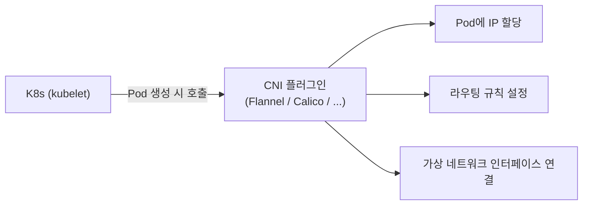
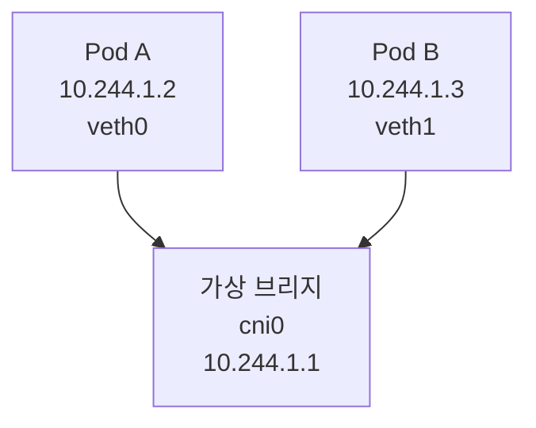
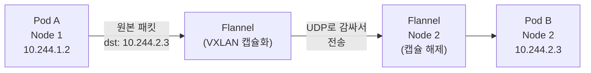
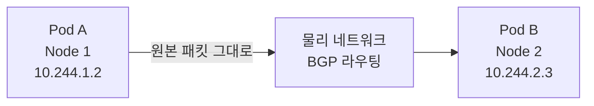

# CNI 플러그인 — Pod 간 L3 라우팅이 실제로 어떻게 되는가

> K8s에서 "모든 Pod는 고유한 IP를 가진다"는 원칙을 실제로 구현하는 것이 CNI다.

---

## 1. CNI가 뭔가

CNI(Container Network Interface)는 K8s가 컨테이너 네트워크를 구성할 때 호출하는 표준 인터페이스다. K8s 자체는 네트워크를 직접 구성하지 않는다. "Pod가 생겼으니 네트워크 붙여라"라는 명령을 CNI 플러그인에 위임한다.



대표적인 CNI 플러그인으로 Flannel과 Calico가 있다.

---

## 2. 같은 노드 안 Pod 통신 — L2 브리지

같은 노드 안에서는 가상 브리지(cbr0, cni0)를 통해 통신한다.



Pod A → Pod B 패킷은 브리지에서 MAC 주소로 바로 전달된다. 노드 밖으로 나가지 않는다.

---

## 3. 다른 노드의 Pod 통신 — L3 라우팅

다른 노드의 Pod로 패킷을 보낼 때는 노드 간 라우팅이 필요하다. CNI 플러그인이 이 라우팅을 구성한다.

### Flannel — VXLAN 오버레이

패킷을 UDP로 감싸서(캡슐화) 노드 간에 전송한다. 노드의 물리 네트워크 위에 가상 네트워크를 올리는 방식이다.



설정이 단순하다. 물리 네트워크 설정을 건드리지 않아도 된다. 단점은 캡슐화/해제 비용으로 성능이 약간 떨어진다.

### Calico — BGP 라우팅

캡슐화 없이 노드 간에 BGP(Border Gateway Protocol)로 라우팅 정보를 교환한다. 패킷이 그대로 물리 네트워크를 타고 간다.



캡슐화 오버헤드가 없어서 성능이 좋다. 대신 네트워크 장비가 BGP를 지원해야 하고 설정이 복잡하다.

---

## 4. Flannel vs Calico 선택 기준

**Flannel을 쓸 때**
- 설정이 단순해야 할 때
- 온프레미스 환경에서 네트워크 장비 제어가 어려울 때
- 소규모 클러스터

**Calico를 쓸 때**
- 네트워크 성능이 중요할 때
- 네트워크 정책(NetworkPolicy)을 세밀하게 제어해야 할 때
- 대규모 클러스터

---

## 5. NetworkPolicy — CNI가 방화벽도 한다

CNI 플러그인(특히 Calico)은 Pod 간 트래픽을 허용/차단하는 NetworkPolicy도 구현한다.

```yaml
apiVersion: networking.k8s.io/v1
kind: NetworkPolicy
metadata:
  name: deny-all
spec:
  podSelector: {}
  policyTypes:
    - Ingress
    - Egress
```

이 규칙을 적용하면 모든 Pod 간 통신이 차단된다. Calico는 이를 iptables 또는 eBPF 규칙으로 구현한다.

Flannel은 NetworkPolicy를 지원하지 않는다. Flannel + NetworkPolicy가 필요하면 Calico를 NetworkPolicy 엔진으로 추가로 붙이는 방식을 쓴다.

---

## 정리

CNI는 K8s가 Pod에 IP를 부여하고 네트워크를 연결할 때 호출하는 플러그인 인터페이스다.

같은 노드 안 Pod 통신은 L2 브리지, 다른 노드 Pod 통신은 L3 라우팅으로 처리한다.

Flannel은 VXLAN 캡슐화로 단순하게 구현하고, Calico는 BGP 라우팅으로 성능과 정책 제어를 강화한다.
