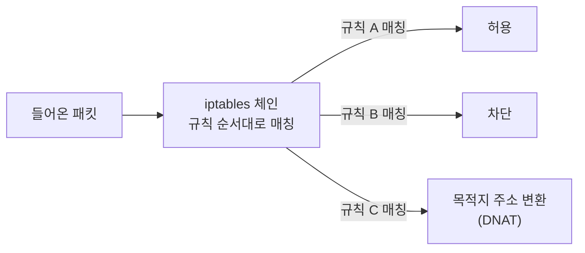
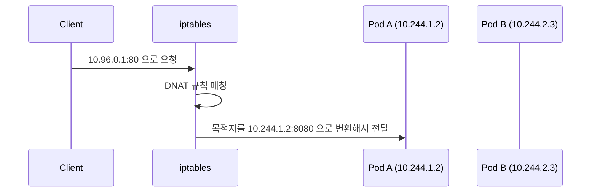

# iptables와 K8s Service — L4 로드밸런싱이 실제로 동작하는 방식

> K8s Service가 "L4 로드밸런싱을 iptables로 구현한다"는 말의 실제 의미.

---

## 1. iptables가 뭔가

Linux 커널에 내장된 패킷 필터링/변환 규칙 엔진이다. 네트워크 패킷이 커널을 통과할 때 미리 정의된 규칙에 따라 허용, 차단, 변환(NAT)을 수행한다.



K8s가 쓰는 핵심 기능은 **DNAT(Destination NAT)** 다. 패킷의 목적지 IP/포트를 바꿔치기한다.

---

## 2. K8s Service가 iptables로 하는 일

`ClusterIP` Service를 만들면 kube-proxy가 해당 서비스의 iptables 규칙을 자동으로 생성한다.

예시: Service IP가 `10.96.0.1:80`, 뒤에 Pod 3개가 있는 경우.

```
패킷 목적지: 10.96.0.1:80
           ↓
iptables DNAT 규칙
  → 33% 확률로 Pod A (10.244.1.2:8080) 로 변환
  → 33% 확률로 Pod B (10.244.2.3:8080) 로 변환
  → 33% 확률로 Pod C (10.244.3.4:8080) 로 변환
```

클라이언트는 `10.96.0.1:80`으로 보냈지만, 실제로는 세 Pod 중 하나로 패킷이 도착한다.



---

## 3. Service 종류별 iptables 동작

**ClusterIP** — 클러스터 내부에서만 접근 가능한 가상 IP. iptables DNAT으로 Pod IP로 변환.

**NodePort** — 모든 노드의 특정 포트를 열어둔다. 외부에서 `노드IP:NodePort`로 오면 iptables가 ClusterIP로 다시 DNAT.


**LoadBalancer** — 클라우드 로드밸런서(ELB 등)가 앞에 붙는다. 클라우드 LB → NodePort → ClusterIP → Pod 순으로 타고 들어온다.

---

## 4. iptables 방식의 한계

Pod가 수백 개가 넘어가면 iptables 규칙이 수만 개가 된다. 규칙을 선형으로 순회하는 구조라 규모가 커질수록 성능이 떨어진다.

이 한계를 해결하기 위해 나온 것이 **IPVS(IP Virtual Server)** 모드다. 해시 테이블 기반이라 규칙 수가 늘어도 O(1)으로 처리한다. kube-proxy를 IPVS 모드로 전환할 수 있다.

```
iptables: 규칙 10,000개 → 선형 탐색 → 느려짐
IPVS:     규칙 10,000개 → 해시 탐색 → O(1)
```

---

## 정리

K8s Service는 가상 IP(ClusterIP)를 실제 Pod IP로 바꿔주는 DNAT 규칙을 iptables에 심는 방식으로 L4 로드밸런싱을 구현한다.

kube-proxy가 Pod 변화를 감지할 때마다 iptables 규칙을 갱신한다. 클라이언트는 Pod IP를 몰라도 되고, Pod가 교체돼도 Service IP는 바뀌지 않는다.

규모가 커지면 iptables 대신 IPVS 모드를 고려한다.
