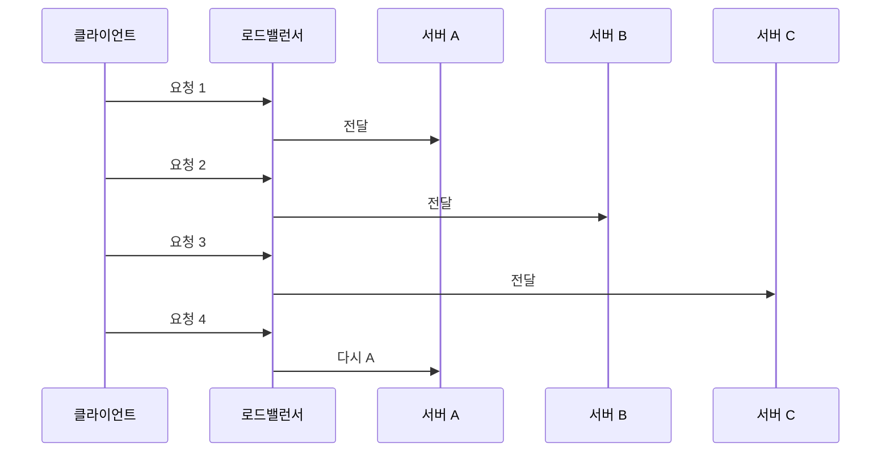
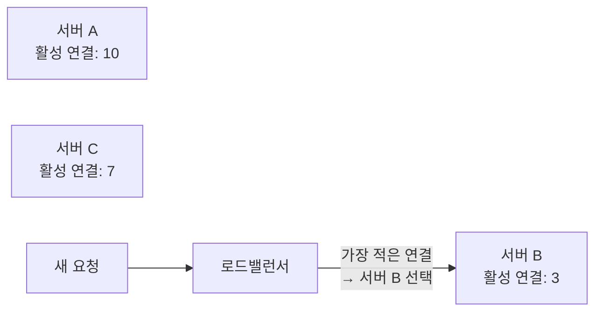

# 로드밸런싱 알고리즘 — Round Robin부터 IP Hash까지

> L4/L7 스위치가 여러 서버로 트래픽을 분배할 때 어떤 기준으로 고르는가.

---

## 1. Round Robin

요청이 들어올 때마다 서버를 순서대로 돌아가며 선택한다. 가장 단순하다.



단점: 서버 처리 능력이 다르거나, 요청 처리 시간이 제각각이면 특정 서버에 부하가 몰릴 수 있다.

**Weighted Round Robin** — 서버마다 가중치를 줘서 비율을 조정한다.

```
서버 A: weight 3 → 요청 3개
서버 B: weight 1 → 요청 1개
→ A, A, A, B, A, A, A, B, ...
```

---

## 2. Least Connection

현재 활성 연결 수가 가장 적은 서버로 보낸다. 처리 시간이 들쑥날쑥한 워크로드에 적합하다.



Round Robin과 달리 서버의 현재 상태를 본다. 오래 걸리는 요청이 섞인 환경에서 더 고르게 분배된다.

---

## 3. IP Hash

클라이언트 IP를 해시해서 항상 같은 서버로 보낸다. **세션 고정(Sticky Session)** 이 필요할 때 쓴다.

```mermaid
graph LR
    A_Client["클라이언트 A\n1.2.3.4"] -->|hash(1.2.3.4) → 서버 1| S1["서버 1"]
    B_Client["클라이언트 B\n5.6.7.8"] -->|hash(5.6.7.8) → 서버 2| S2["서버 2"]
    A_Client2["클라이언트 A\n1.2.3.4\n(재요청)"] -->|같은 해시 → 서버 1| S1
```

같은 IP는 항상 같은 서버로 간다. 로그인 세션을 서버 메모리에 저장하는 구조에서 유용하다.

단점: 서버가 추가/제거되면 해시 결과가 바뀌어서 기존 세션이 끊길 수 있다. 이를 보완한 것이 **Consistent Hashing**이다.

---

## 4. Least Response Time

응답 시간이 가장 짧은 서버로 보낸다. Least Connection보다 한 단계 더 정교하다.

```
서버 A: 활성 연결 3, 평균 응답 200ms
서버 B: 활성 연결 1, 평균 응답 800ms
→ 연결 수는 B가 적지만, 응답 시간은 A가 빠름 → A 선택
```

HAProxy, Nginx Plus 같은 상용/고급 로드밸런서에서 지원한다.

---

## 5. K8s에서의 로드밸런싱

K8s Service는 기본적으로 **Random** 또는 **Round Robin** 방식으로 iptables 규칙을 생성한다.

```
Service → iptables DNAT 규칙
→ 확률적으로 Pod A, B, C 중 하나로 DNAT
```

세션 고정이 필요하면 Service의 `sessionAffinity: ClientIP` 옵션을 쓴다. IP Hash와 동일한 개념이다.

더 정교한 로드밸런싱(Least Connection, 가중치 등)이 필요하면 Ingress 컨트롤러(Nginx, HAProxy)나 서비스 메시(Istio)를 써야 한다.

---

## 정리

- Round Robin — 순서대로. 단순하고 빠름. 처리 시간 편차가 크면 불균형 발생.
- Least Connection — 현재 연결 수 기준. 처리 시간 편차가 큰 환경에 적합.
- IP Hash — 같은 IP는 같은 서버. 세션 고정 필요할 때.
- Least Response Time — 응답 시간 기준. 가장 정교하지만 측정 비용 있음.

알고리즘 선택 기준: 요청 처리 시간이 균일하면 Round Robin, 편차가 크면 Least Connection, 세션이 필요하면 IP Hash.
