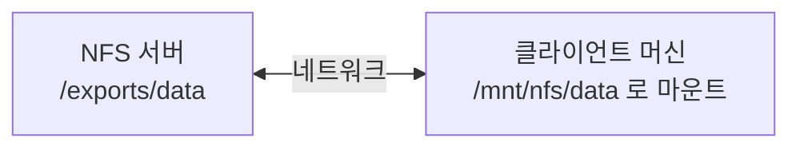
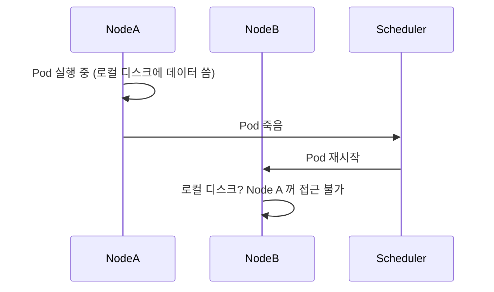
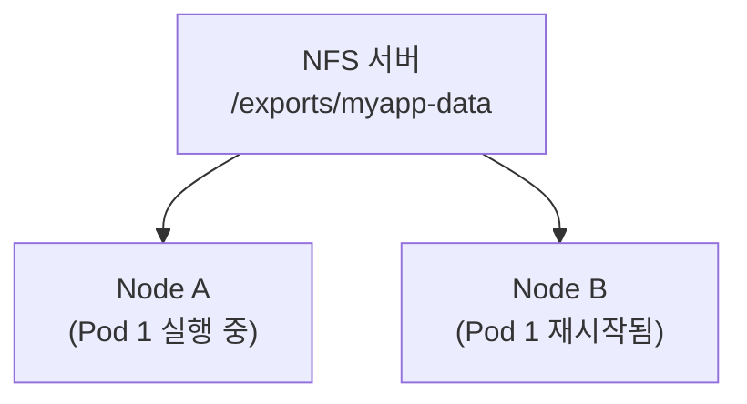
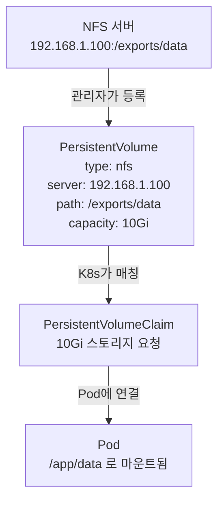
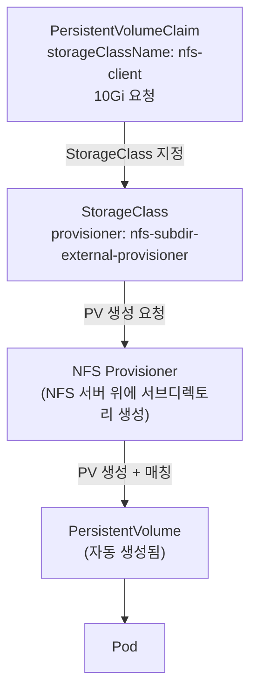
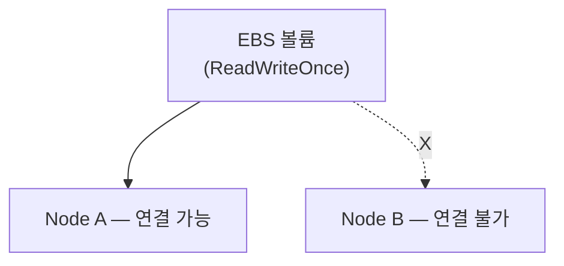
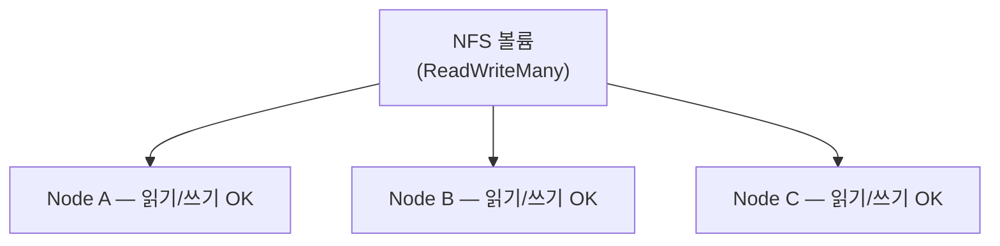

# K8s에서 NFS 스토리지는 어떻게 동작하는가

> 회사에서 K8s + NFS 조합을 자주 보게 되는데, 왜 이 조합을 쓰는지, 내부에서 어떻게 연결되는지를 정리했다.

---

## 1. NFS가 뭔가

NFS(Network File System)는 네트워크를 통해 다른 머신의 디렉토리를 **로컬 디렉토리처럼** 마운트해서 쓰는 프로토콜이다.

USB를 꽂으면 `/mnt/usb`로 접근하듯이, 네트워크 너머 서버의 디렉토리를 `/mnt/nfs`처럼 마운트해서 `ls`, `cat`, `cp` 등을 그대로 쓸 수 있다.



핵심은 **파일 시스템이 네트워크 위에 있다**는 것이다. 읽고 쓰는 건 로컬처럼 보이지만, 실제 I/O는 네트워크 패킷으로 날아간다.

---

## 2. NFS 서버 구성 — 실제로 어떻게 세팅하나

NFS 서버는 `nfs-kernel-server` 패키지로 띄운다.

```bash
# Ubuntu/Debian 기준
sudo apt install nfs-kernel-server

# 공유할 디렉토리 만들기
sudo mkdir -p /exports/data

# /etc/exports 에 공유 설정 추가
echo "/exports/data  192.168.1.0/24(rw,sync,no_subtree_check)" | sudo tee -a /etc/exports

# 설정 적용 및 서버 시작
sudo exportfs -ra
sudo systemctl start nfs-kernel-server
```

`/etc/exports`가 핵심이다. 어떤 디렉토리를 누구에게 어떤 권한으로 공유할지 선언하는 파일이다.

```
/exports/data  192.168.1.0/24(rw,sync)   # 특정 대역만 읽기/쓰기 허용
/exports/data  *(ro)                      # 모두에게 읽기 전용
```

클라이언트 머신에서 마운트하는 건 한 줄이다.

```bash
sudo mount -t nfs 192.168.1.100:/exports/data /mnt/nfs
```

이 명령이 K8s PV에서 `server: 192.168.1.100`, `path: /exports/data`로 적는 값과 정확히 동일하다. K8s 노드들이 내부적으로 이 mount를 대신 실행해주는 구조다.

---

## 3. K8s에서 왜 NFS가 필요한가

K8s의 기본 동작 방식을 보면 문제가 명확해진다.

Pod는 죽으면 데이터가 사라진다. 컨테이너 레이어에 쓴 파일은 Pod가 재시작되면 없어진다. 더 큰 문제는 Pod가 **어느 노드에 뜰지 모른다**는 것이다.



Node A의 로컬 디스크에 쓴 데이터는 Node B에서 접근할 수 없다.

NFS는 이 문제를 모든 노드가 **같은 NFS 서버를 마운트**하는 방식으로 해결한다.



Pod가 어느 노드에 뜨든 동일한 `/exports/myapp-data`에 접근할 수 있다.

---

## 4. K8s가 NFS를 연결하는 방식 — PV / PVC

K8s는 스토리지를 **PersistentVolume(PV)** 과 **PersistentVolumeClaim(PVC)** 두 단계로 분리해서 관리한다.



**PV** — 관리자가 NFS 서버 정보를 K8s에 등록한 것. "이 스토리지를 쓸 수 있어요"라고 선언하는 리소스다.

**PVC** — 개발자가 "스토리지 얼마 주세요"라고 신청하는 리소스다. Pod가 직접 NFS 서버 주소를 알 필요 없다.

**K8s** — PVC 요청이 들어오면 조건에 맞는 PV를 찾아서 매칭(Binding)시킨다.

실제 YAML은 이렇게 생겼다.

```yaml
# PV — 관리자가 생성
apiVersion: v1
kind: PersistentVolume
metadata:
  name: nfs-pv
spec:
  capacity:
    storage: 10Gi
  accessModes:
    - ReadWriteMany
  nfs:
    server: 192.168.1.100
    path: /exports/data
---
# PVC — 개발자가 생성
apiVersion: v1
kind: PersistentVolumeClaim
metadata:
  name: nfs-pvc
spec:
  accessModes:
    - ReadWriteMany
  resources:
    requests:
      storage: 10Gi
---
# Pod — PVC를 볼륨으로 연결
apiVersion: v1
kind: Pod
metadata:
  name: myapp
spec:
  volumes:
    - name: data
      persistentVolumeClaim:
        claimName: nfs-pvc
  containers:
    - name: app
      image: myapp:latest
      volumeMounts:
        - mountPath: /app/data
          name: data
```

컨테이너 입장에서는 `/app/data`가 그냥 로컬 디렉토리처럼 보인다. NFS 서버 주소는 몰라도 된다.

---

## 4-1. StorageClass — PV를 자동으로 만드는 방법

지금까지 본 방식은 **정적 프로비저닝(Static Provisioning)** 이다. 관리자가 PV를 미리 하나하나 만들어두고, PVC가 요청하면 매칭시키는 방식이다.

문제는 PVC 요청이 올 때마다 관리자가 PV를 미리 준비해둬야 한다는 점이다. Pod가 늘어나고 스토리지 요청이 잦아지면 이 방식은 운영 부담이 커진다.

**StorageClass**는 이 문제를 해결한다. "이런 종류의 스토리지가 필요하면 이 provisioner를 써서 자동으로 만들어라"라는 템플릿을 등록해두는 리소스다. PVC가 StorageClass를 지정해서 요청하면, PV를 관리자가 만드는 게 아니라 **provisioner가 자동으로 생성**한다. 이걸 **동적 프로비저닝(Dynamic Provisioning)** 이라고 한다.



NFS는 K8s 기본 프로비저너에 포함되어 있지 않기 때문에, `nfs-subdir-external-provisioner` 같은 별도 provisioner를 클러스터에 설치해야 한다. 이 provisioner가 하는 일은 단순하다. PVC 요청이 들어오면 NFS 서버의 공유 디렉토리 밑에 요청마다 서브디렉토리(`/exports/data/pvc-xxxx`)를 만들고, 그 경로를 가리키는 PV를 자동으로 생성해서 PVC와 매칭시킨다.

```yaml
# StorageClass — 관리자가 한 번만 생성
apiVersion: storage.k8s.io/v1
kind: StorageClass
metadata:
  name: nfs-client
provisioner: cluster.local/nfs-subdir-external-provisioner
parameters:
  archiveOnDelete: "false"
---
# PVC — 개발자가 생성, PV는 자동 생성됨
apiVersion: v1
kind: PersistentVolumeClaim
metadata:
  name: nfs-pvc-dynamic
spec:
  storageClassName: nfs-client
  accessModes:
    - ReadWriteMany
  resources:
    requests:
      storage: 10Gi
```

관리자는 StorageClass와 provisioner를 한 번만 세팅해두면 된다. 그 이후로는 개발자가 PVC만 만들면 PV는 신경 쓸 필요가 없다. 앞서 본 정적 프로비저닝(PV를 미리 만드는 방식)은 NFS 서버가 하나뿐이고 PV 개수가 적은 소규모 환경에서는 여전히 유효하지만, 실무 K8s 클러스터에서는 StorageClass를 통한 동적 프로비저닝이 훨씬 일반적이다.

---

## 5. AccessMode — ReadWriteMany가 왜 중요한가

PV를 정의할 때 `accessModes`를 지정한다. 세 가지가 있다.

- `ReadWriteOnce (RWO)` — 하나의 노드에서만 읽기/쓰기 가능
- `ReadOnlyMany (ROX)` — 여러 노드에서 읽기만 가능
- `ReadWriteMany (RWX)` — 여러 노드에서 동시에 읽기/쓰기 가능

EBS(AWS 블록 스토리지) 같은 건 기본적으로 RWO다. 한 번에 한 노드만 붙을 수 있다.



NFS는 **RWX를 지원**한다. 여러 Node에 올라간 여러 Pod가 동시에 같은 볼륨에 읽고 쓸 수 있다.



실무에서 RWX가 필요한 상황은 **여러 Pod가 같은 파일에 접근해야 할 때**다. 예를 들어 로그 수집기가 여러 Pod에 떠서 같은 디렉토리에 로그를 써야 하거나, 파일 업로드 서버가 여러 replica로 뜰 때가 그렇다. 이런 경우 EBS로는 구조적으로 불가능하고, NFS 같은 RWX 지원 스토리지가 필요하다.

---

## 6. NFS의 한계

NFS가 편하긴 하지만 단점도 있다.

**단일 장애점(SPOF)** — NFS 서버가 죽으면 그 볼륨을 쓰는 모든 Pod가 영향받는다. 고가용성을 위해 NFS 서버 이중화가 필요하다.

**네트워크 I/O** — 로컬 디스크보다 느리다. 쓰기가 많은 워크로드에서는 병목이 될 수 있다.

**파일 잠금(locking) 이슈** — 여러 클라이언트가 동시에 같은 파일에 쓸 때 동시성 문제가 생길 수 있다. NFS 자체의 파일 잠금 메커니즘이 있지만, 애플리케이션 레벨에서도 고려가 필요하다.

---

## 정리

NFS는 네트워크 너머 디렉토리를 로컬처럼 마운트하는 프로토콜이다.

K8s에서 NFS를 쓰는 이유는 Pod가 어느 노드에 뜨든 같은 데이터에 접근할 수 있어야 하기 때문이다. 로컬 디스크는 노드에 종속되지만, NFS는 모든 노드가 공유한다.

K8s는 PV/PVC라는 추상화 레이어를 두어 Pod가 NFS 서버 주소를 직접 알지 않아도 되게 한다. 관리자는 PV로 스토리지를 등록하고, 개발자는 PVC로 신청하며, K8s가 둘을 매칭시킨다. 실무에서는 관리자가 PV를 일일이 만드는 정적 방식보다, StorageClass와 provisioner로 PV를 자동 생성하는 동적 프로비저닝을 더 많이 쓴다.

NFS가 온프레미스 K8s 환경에서 자주 쓰이는 건 설정이 단순하고 ReadWriteMany를 지원하기 때문이다.
