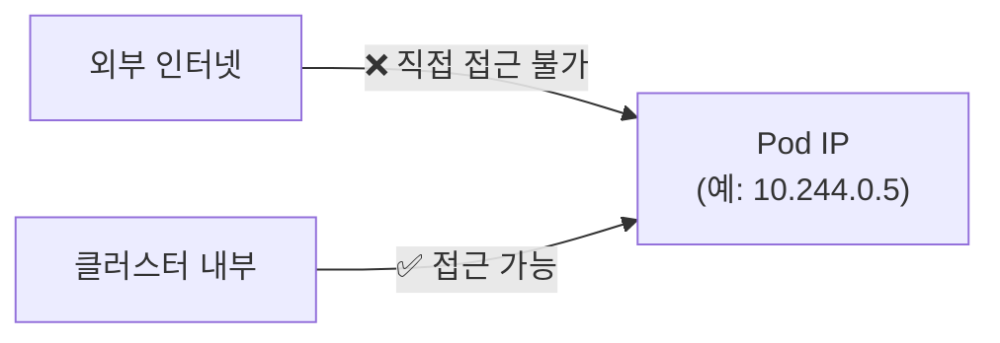
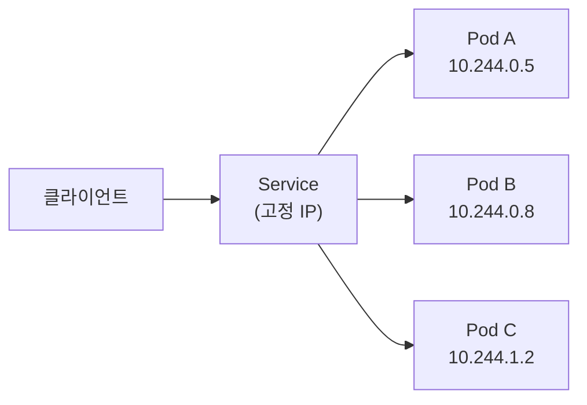
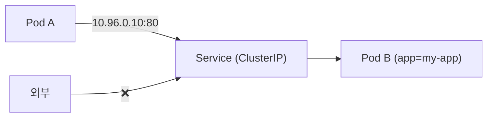
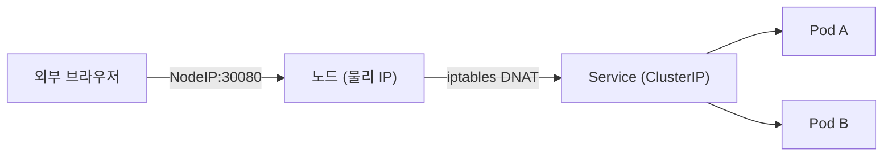
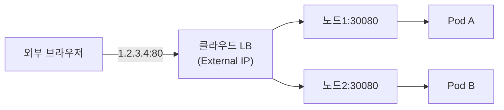
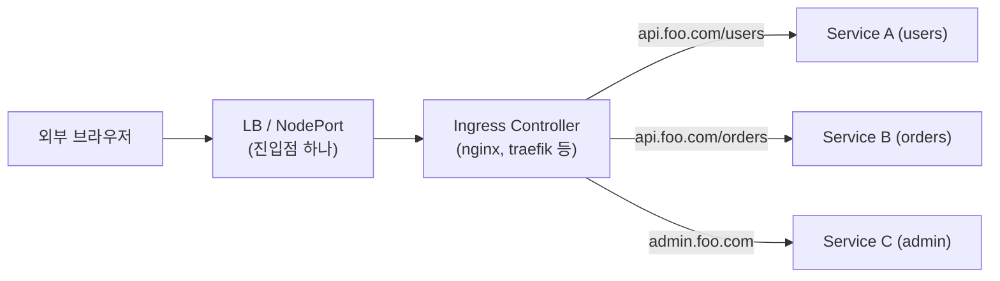
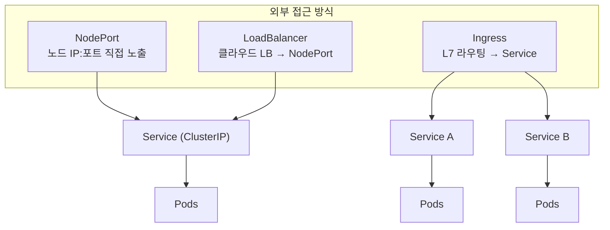

# K8s 외부 통신 — NodePort, Service, Ingress가 하는 일

> Pod에 외부에서 어떻게 접근하는가. ClusterIP → NodePort → LoadBalancer → Ingress 순서로 이해한다.

---

## 1. 기본 전제 — Pod IP는 외부에서 안 보인다

K8s 클러스터 안의 Pod들은 가상 IP를 갖는다. 이 IP는 클러스터 내부 네트워크에만 존재하고, 외부 인터넷에서는 라우팅이 불가능하다.



그래서 "외부에서 Pod에 어떻게 닿는가"가 문제가 된다.

---

## 2. Service — Pod 앞에 놓이는 고정 엔드포인트

Pod는 언제든 죽고 다시 태어나고, IP가 바뀐다. Service는 이 Pod들 앞에 고정된 IP/DNS를 제공한다.



Service 타입이 4가지 있는데, 외부 노출 방식이 다르다.

- **ClusterIP** — 클러스터 내부에서만 접근 가능. 기본값.
- **NodePort** — 노드의 물리 포트를 열어서 외부에서 접근 가능하게 함.
- **LoadBalancer** — 클라우드 로드밸런서를 프로비저닝해서 외부 IP를 받아옴.
- **ExternalName** — 외부 DNS 이름으로 리다이렉트. 특수 케이스.

---

## 3. ClusterIP — 내부 통신 전용

```yaml
apiVersion: v1
kind: Service
spec:
  type: ClusterIP       # 생략해도 기본값
  selector:
    app: my-app
  ports:
    - port: 80          # Service 포트
      targetPort: 8080  # Pod 포트
```

ClusterIP를 만들면 클러스터 내부에서만 쓸 수 있는 가상 IP(`10.96.x.x` 대역)가 할당된다.



마이크로서비스끼리 내부 통신할 때 쓰는 기본 형태다.

---

## 4. NodePort — 노드 포트를 직접 열기

외부에서 접근하려면 노드(VM)의 실제 IP + 포트가 필요하다. NodePort는 노드의 특정 포트(30000~32767)를 열고, 그 포트로 들어온 트래픽을 Service로 넘긴다.



```yaml
spec:
  type: NodePort
  ports:
    - port: 80          # 클러스터 내부용
      targetPort: 8080  # Pod 포트
      nodePort: 30080   # 외부에서 접근하는 노드 포트 (생략하면 자동 할당)
```

**실제 패킷 흐름:**

```
브라우저 → 노드IP:30080
→ kube-proxy가 iptables 규칙으로 DNAT
→ Service ClusterIP:80으로 변환
→ Pod:8080으로 전달
```

**한계:** 노드가 3개면 IP가 3개다. 어느 노드 IP로 붙어도 작동하지만, 외부에 노드 IP를 직접 노출해야 한다. 노드가 죽으면 해당 IP도 못 쓴다.

---

## 5. LoadBalancer — 클라우드에서 IP 하나 받기

NodePort의 문제를 해결하려면 노드 앞에 로드밸런서가 필요하다. LoadBalancer 타입은 클라우드 프로바이더(AWS, GCP, Azure)에 로드밸런서 생성을 요청하고, 거기서 단일 External IP를 받아온다.



내부적으로는 NodePort 위에 클라우드 LB가 얹히는 구조다. NodePort가 여전히 열린다.

**한계:** 서비스마다 LB가 하나씩 필요하다. 서비스 10개면 LB 10개 = 비용 10배.

---

## 6. Ingress — L7 라우팅으로 LB 하나로 여러 서비스 처리

Ingress는 Service 타입이 아니다. **L7(HTTP/HTTPS) 라우팅 규칙을 정의하는 오브젝트**다.

하나의 로드밸런서(또는 NodePort) 뒤에서 도메인/경로에 따라 여러 Service로 트래픽을 나눠준다.



```yaml
apiVersion: networking.k8s.io/v1
kind: Ingress
spec:
  rules:
    - host: api.foo.com
      http:
        paths:
          - path: /users
            backend:
              service:
                name: users-service
                port:
                  number: 80
          - path: /orders
            backend:
              service:
                name: orders-service
                port:
                  number: 80
```

**Ingress Controller:** Ingress 오브젝트 자체는 규칙만 정의한다. 이 규칙을 실제로 실행하는 것은 클러스터에 별도로 설치된 Ingress Controller(nginx, traefik, AWS ALB Controller 등)다.

---

## 7. 전체 구조 비교



- **ClusterIP** — 내부 통신만. 외부 노출 없음.
- **NodePort** — 노드 포트를 직접 열어 외부 접근. 개발/테스트에 적합.
- **LoadBalancer** — 클라우드 LB로 단일 IP 확보. 서비스 1개에 LB 1개.
- **Ingress** — LB 1개로 여러 서비스를 경로/도메인 기반으로 라우팅. 프로덕션 표준.

---

## 8. 실제로 어떻게 쓰나

로컬 개발 (minikube):
- NodePort 또는 `kubectl port-forward`로 접근

온프레미스 클러스터:
- MetalLB로 LoadBalancer IP를 직접 할당하거나, NodePort + 외부 LB 조합

클라우드 (EKS, GKE):
- 대부분 Ingress + LoadBalancer 조합. Ingress Controller가 AWS ALB나 GCP LB를 직접 프로비저닝하기도 함.

---

> 실행해보고 싶다면: `kubectl get svc`, `kubectl describe svc <name>`, `kubectl get ingress` 로 현재 상태 확인.
