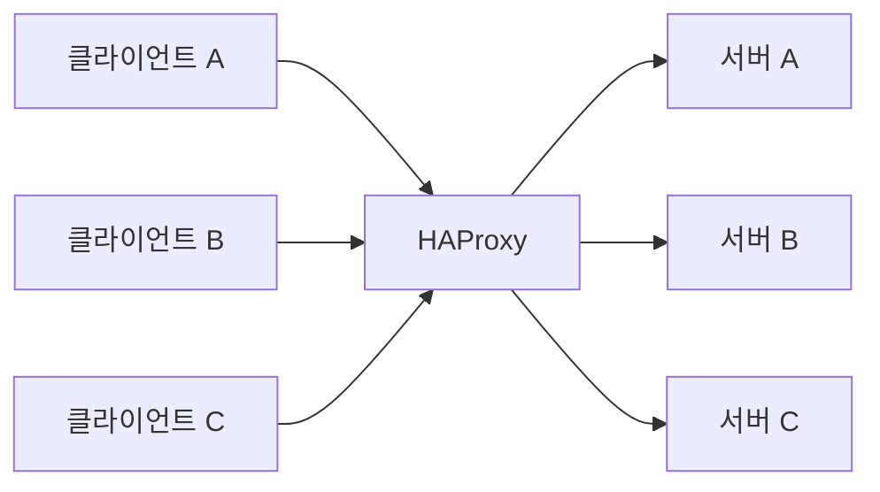
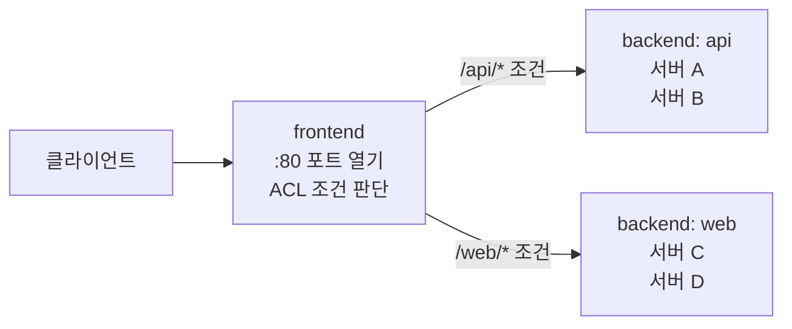
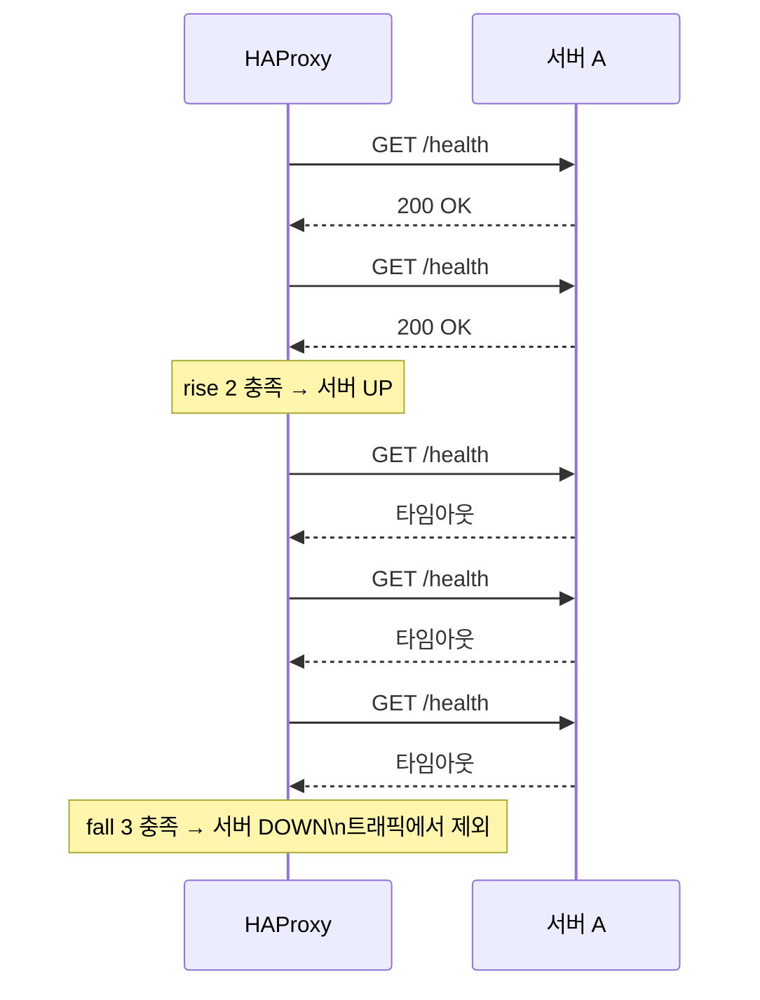
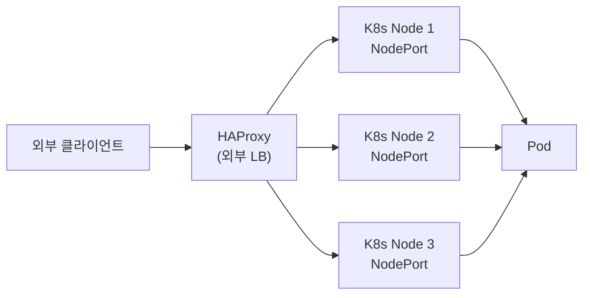

# HAProxy란 무엇인가

> High Availability Proxy. 이름 그대로 고가용성을 위한 프록시다. L4/L7 로드밸런서로 가장 많이 쓰인다.

---

## 1. HAProxy가 하는 일

클라이언트 요청을 받아서 뒤에 있는 여러 서버 중 하나로 전달한다. 스위치 개념으로 보면 "들어온 패킷을 보고 어디로 내보낼지 결정하는 것"이다.



단순히 트래픽을 분배하는 것 외에도 헬스체크, 연결 관리, 세션 고정, TLS 종료 등을 처리한다.

---

## 2. 핵심 구조 — frontend / backend

HAProxy 설정은 크게 두 블록으로 나뉜다.

**frontend** — 클라이언트가 접속하는 쪽. 어떤 포트를 열고, 어떤 조건으로 어느 backend로 보낼지 정의한다.

**backend** — 실제 서버들의 목록. 로드밸런싱 알고리즘과 헬스체크를 정의한다.



실제 설정 파일로 보면 이렇다.

```
global
    log /dev/log local0
    maxconn 50000

defaults
    mode http
    timeout connect 5s
    timeout client  30s
    timeout server  30s

frontend http_front
    bind *:80
    acl is_api path_beg /api
    use_backend api_back if is_api
    default_backend web_back

backend api_back
    balance roundrobin
    server api1 192.168.1.10:8080 check
    server api2 192.168.1.11:8080 check

backend web_back
    balance roundrobin
    server web1 192.168.1.20:3000 check
    server web2 192.168.1.21:3000 check
```

---

## 3. ACL — 조건 분기

ACL(Access Control List)은 요청을 보고 조건을 판단하는 규칙이다. L7 라우팅의 핵심이다.

```
# URL 경로로 분기
acl is_api path_beg /api
acl is_static path_beg /static

# Host 헤더로 분기
acl is_blog hdr(host) -i blog.example.com
acl is_app  hdr(host) -i app.example.com

# 조건에 따라 backend 선택
use_backend api_back    if is_api
use_backend static_back if is_static
use_backend blog_back   if is_blog
```

여러 조건을 AND/OR로 조합할 수도 있다.

```
acl is_post method POST
acl is_api  path_beg /api
use_backend write_back if is_api is_post   # /api 이고 POST 요청일 때
```

---

## 4. TCP 모드 vs HTTP 모드

HAProxy는 두 가지 모드로 동작한다.

**TCP 모드 (L4)** — HTTP를 열어보지 않는다. TCP 연결 자체를 그대로 뒤로 넘긴다.

```
mode tcp

# 이 모드에서는 URL, 헤더를 볼 수 없다
# ACL로 path_beg 같은 조건 사용 불가
# 대신 빠르다 — 파싱 비용이 없다
```

MySQL, Redis, gRPC 같은 TCP 기반 프로토콜 앞에 HAProxy를 둘 때 쓴다.

**HTTP 모드 (L7)** — HTTP를 파싱한다. URL, 헤더, 쿠키를 ACL로 판단할 수 있다.

```
mode http

# URL 기반 라우팅 가능
# 헤더 추가/제거 가능
# 세션 고정 가능
# 대신 파싱 비용이 있다
```

---

## 5. 헬스체크

`check` 옵션을 붙이면 HAProxy가 주기적으로 서버 상태를 확인한다. 서버가 죽으면 자동으로 트래픽에서 제외한다.

```
backend api_back
    balance roundrobin
    option httpchk GET /health        # HTTP GET /health 로 확인
    server api1 192.168.1.10:8080 check inter 2s rise 2 fall 3
    server api2 192.168.1.11:8080 check inter 2s rise 2 fall 3
```

- `inter 2s` — 2초마다 체크
- `rise 2` — 2번 연속 성공하면 복구된 것으로 판단
- `fall 3` — 3번 연속 실패하면 죽은 것으로 판단



---

## 6. 세션 고정 (Sticky Session)

같은 클라이언트가 항상 같은 서버로 가도록 고정한다. 로그인 세션을 서버 메모리에 저장하는 구조에서 필요하다.

```
backend api_back
    balance roundrobin
    cookie SERVERID insert indirect nocache   # 쿠키로 서버 고정
    server api1 192.168.1.10:8080 check cookie api1
    server api2 192.168.1.11:8080 check cookie api2
```

HAProxy가 응답에 `SERVERID=api1` 쿠키를 심는다. 다음 요청에 이 쿠키가 오면 항상 api1으로 보낸다.

---

## 7. 통계 대시보드

HAProxy는 내장 통계 페이지를 제공한다.

```
frontend stats
    bind *:8404
    stats enable
    stats uri /stats
    stats refresh 10s
    stats auth admin:password
```

`http://서버IP:8404/stats` 로 접속하면 서버별 연결 수, 요청 수, 에러율, 응답 시간을 실시간으로 볼 수 있다.

---

## 8. HAProxy가 K8s 앞에 붙는 구조

온프레미스 K8s 환경에서 HAProxy를 외부 로드밸런서로 쓰는 경우가 많다.



클라우드 환경에서는 ELB 같은 관리형 로드밸런서가 이 역할을 대신하지만, 온프레미스에서는 HAProxy가 그 자리를 채운다.

---

## 정리

HAProxy는 frontend에서 요청을 받아 ACL 조건으로 판단하고, backend의 서버 중 하나로 전달하는 L4/L7 로드밸런서다.

TCP 모드는 빠르지만 URL을 볼 수 없고, HTTP 모드는 URL/헤더 기반 라우팅이 가능하다.

헬스체크로 죽은 서버를 자동으로 제외하고, 세션 고정으로 같은 클라이언트를 같은 서버로 보낼 수 있다. 온프레미스 K8s 환경에서 외부 로드밸런서로 자주 쓰인다.
