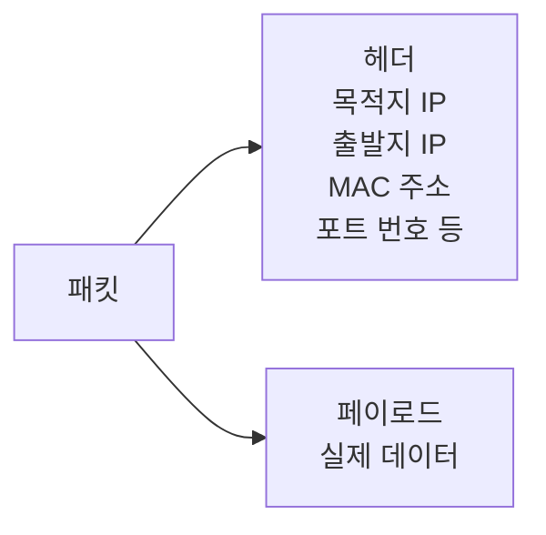
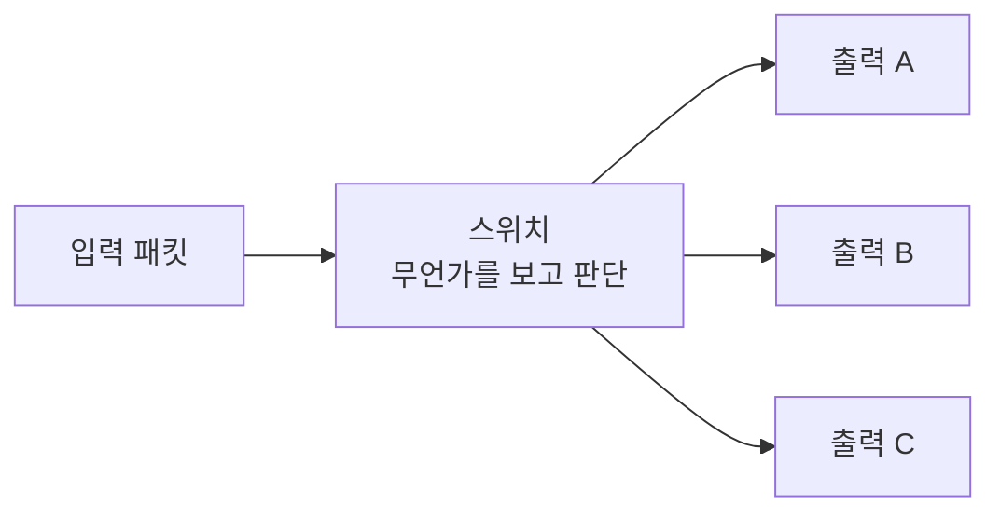
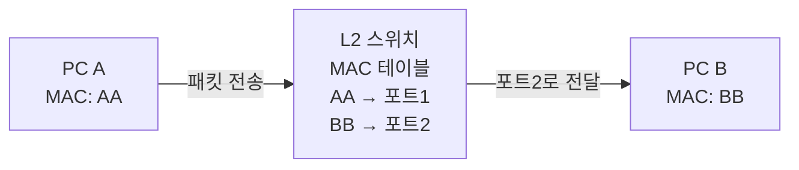
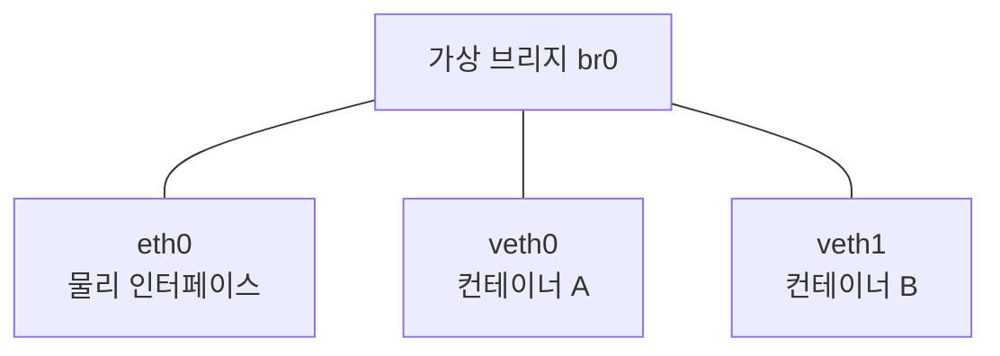
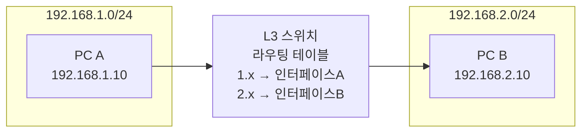
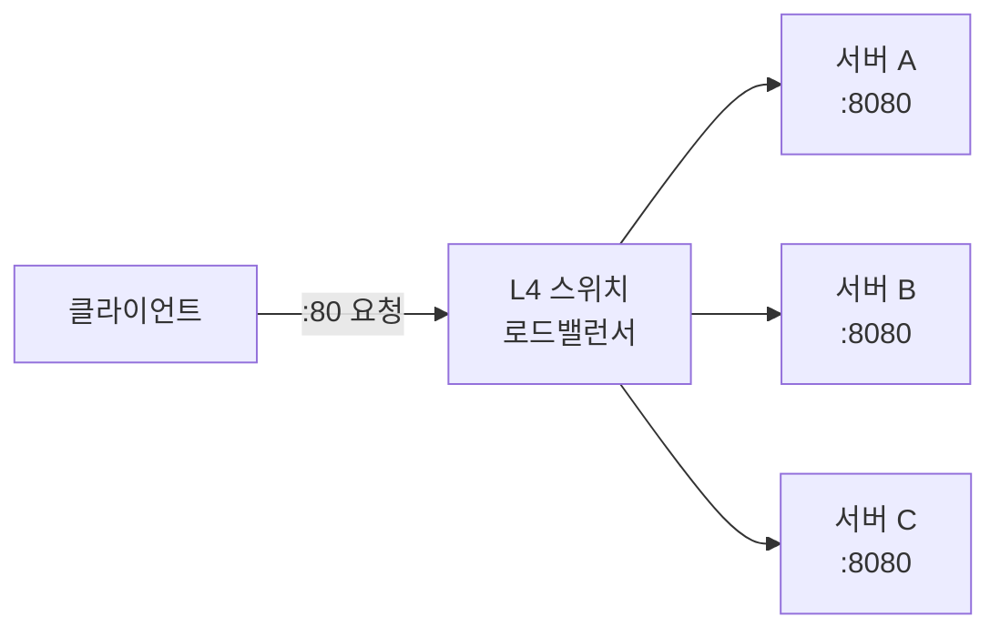
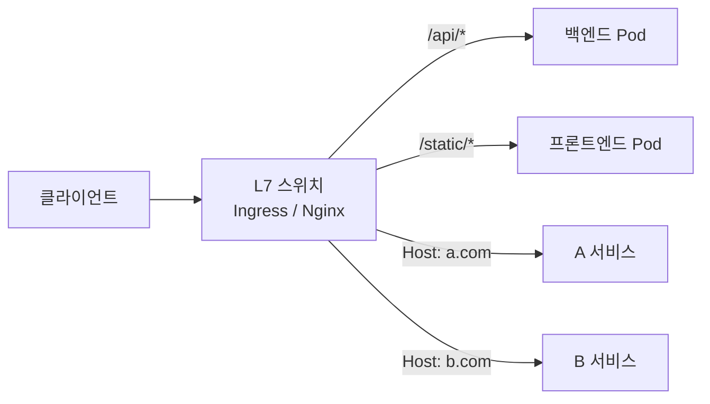
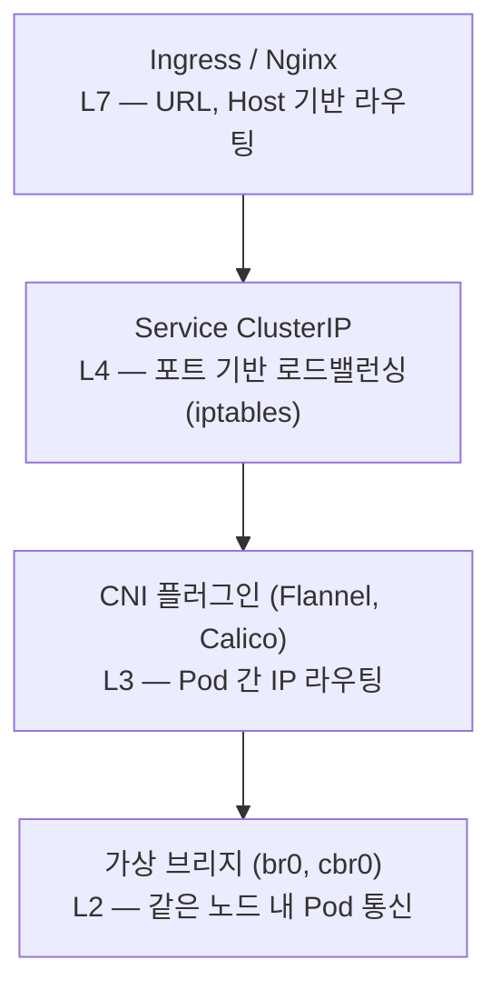
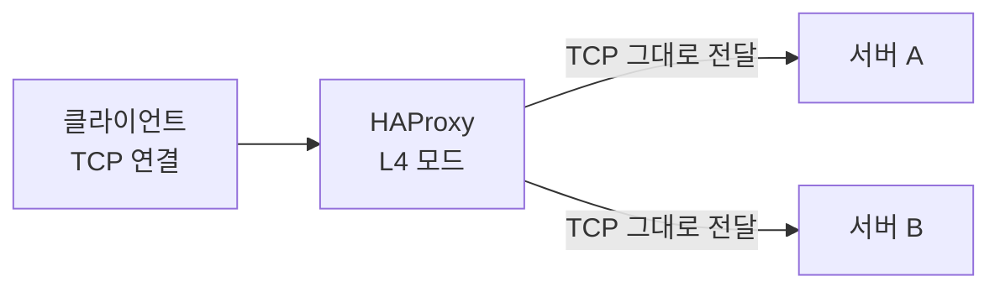
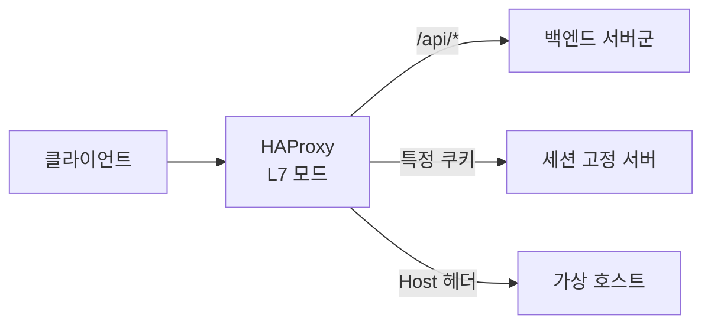

# 네트워크 스위치 계층 — L2부터 L7까지

> OSI 7계층 기준으로 어느 레이어에서 패킷을 처리하느냐에 따라 스위치의 역할이 달라진다.

---

## 0. 패킷이란 무엇인가

네트워크에서 데이터를 전송할 때 쪼개서 보내는 단위다. 파일 하나를 통째로 보내는 게 아니라 작은 조각으로 잘라서 각각 전송하고, 받는 쪽에서 다시 조립한다.

패킷 하나는 두 부분으로 구성된다.

- **헤더** — 목적지 IP, 출발지 IP, MAC 주소, 포트 번호 등 배송 정보
- **페이로드** — 실제 전송하려는 데이터



택배로 비유하면 헤더는 송장(주소, 수신자), 페이로드는 박스 안에 든 물건이다.

스위치가 "패킷을 보고 어디로 보낼지 결정한다"는 말은 이 헤더를 읽는다는 뜻이다. 어느 레이어의 헤더 정보를 읽느냐에 따라 L2/L3/L4/L7로 나뉜다.

같은 패킷에서 얼마나 깊이 들여다보느냐의 차이다.

```
[패킷]
  └── L2 헤더 (MAC 주소)            ← L2 스위치는 여기까지만 봄
        └── L3 헤더 (IP 주소)       ← L3 스위치는 여기까지
              └── L4 헤더 (포트)    ← L4 스위치는 여기까지
                    └── 페이로드    ← L7 스위치는 HTTP 내용까지 열어봄
                    (HTTP URL/헤더)
```

깊이 볼수록 더 세밀한 라우팅이 가능하다. 대신 그만큼 파싱 비용이 올라간다. L2가 가장 빠르고, L7이 가장 똑똑하다.

---

## 1. 스위치란 무엇인가

"들어온 패킷을 보고 어디로 내보낼지 결정하는 장비 또는 소프트웨어"를 통칭하는 말이다.



공통점은 하나다 — 입력을 받아서 판단 기준에 따라 출력을 선택한다. 어느 레이어의 정보를 보느냐만 다르다.

원래 "스위치"는 L2 물리 장비를 가리키는 말이었는데, 시간이 지나면서 "패킷을 특정 기준으로 분기시키는 것" 전반을 부르는 말로 확장됐다. HAProxy, Nginx, K8s Ingress도 결국 같은 역할이다.

---

## 2. L2 스위치 — MAC 주소로 전달

같은 네트워크(같은 서브넷) 안에서 동작한다. MAC 주소 테이블을 보고 어느 포트로 내보낼지 결정한다.



"BB한테 보내야 하네 → 포트 2로 내보내자" 이게 전부다. IP 주소는 모른다.

**브리지(Bridge)** 는 L2 스위치의 소프트웨어 버전이다. Linux에서 `br0` 같은 가상 브리지를 만들면 여러 네트워크 인터페이스를 하나의 L2 네트워크로 묶을 수 있다. Docker와 K8s가 컨테이너 네트워크를 구성할 때 이 방식을 쓴다.



---

## 3. L3 스위치 — IP 주소로 라우팅

다른 네트워크(다른 서브넷) 간 통신이 필요할 때 등장한다. IP 주소 기반 라우팅 테이블을 보고 어느 인터페이스로 내보낼지 결정한다.



L2는 같은 네트워크 안에서만 동작하지만, L3는 네트워크 경계를 넘는다. 인터넷 라우터가 대표적인 L3 장비다.

---

## 4. L4 스위치 — 포트 번호로 로드밸런싱

TCP/UDP 포트 번호까지 보고 트래픽을 분배한다. 로드밸런서가 대표적이다.



"포트 80으로 온 요청을 3대 서버에 나눠서 보내라" 같은 규칙을 처리한다. HTTP 내용은 모른다 — 포트 번호까지만 본다.

K8s의 `Service (ClusterIP / NodePort)`가 내부적으로 iptables 규칙으로 L4 로드밸런싱을 구현한다.

---

## 5. L7 스위치 — URL과 헤더로 라우팅

HTTP 헤더, URL 경로, 쿠키까지 열어보고 라우팅한다. Ingress, Nginx, API Gateway가 여기에 해당한다.



L4가 "어디로 보낼지"를 포트로 결정한다면, L7은 "무슨 요청인지"를 보고 결정한다. 애플리케이션 레벨의 라우팅이 가능해지는 이유다.

---

## 6. K8s에서 각 계층이 어디에 쓰이나



- 같은 노드 안 Pod끼리 → L2 브리지로 통신
- 다른 노드의 Pod끼리 → L3 CNI 플러그인이 라우팅
- 서비스 로드밸런싱 → L4 iptables 규칙
- 외부 트래픽 라우팅 → L7 Ingress

---

## 7. HAProxy — L4/L7을 모두 하는 소프트웨어 스위치

HAProxy는 L4와 L7 모드를 모두 지원한다. 설정에 따라 동작 방식이 달라진다.

**L4 모드 (TCP)** — HTTP를 열어보지 않는다. TCP 연결 자체를 그대로 뒤로 넘긴다. 빠르지만 URL 기반 라우팅은 불가능하다.



**L7 모드 (HTTP)** — HTTP를 파싱해서 헤더, URL, 쿠키까지 보고 라우팅한다.



Nginx도 두 모드를 지원하지만, HAProxy는 로드밸런싱 특화라 헬스체크, 연결 큐 관리, 실시간 통계 대시보드 같은 기능이 더 정교하다.

→ 로드밸런싱 알고리즘 (Round Robin, Least Connection, IP Hash)은 [별도 문서](network-load-balancing.md)에서 다룬다.

---

## 정리

- L2 — MAC 주소, 같은 네트워크 안. 브리지, 가상 스위치.
- L3 — IP 주소, 네트워크 간 라우팅. 라우터, CNI.
- L4 — 포트 번호, 로드밸런싱. K8s Service, ELB, HAProxy TCP 모드.
- L7 — URL/헤더, 애플리케이션 라우팅. Ingress, Nginx, HAProxy HTTP 모드.

숫자가 높아질수록 더 많은 정보를 보고 더 세밀하게 제어할 수 있다. 대신 처리 비용도 올라간다.
