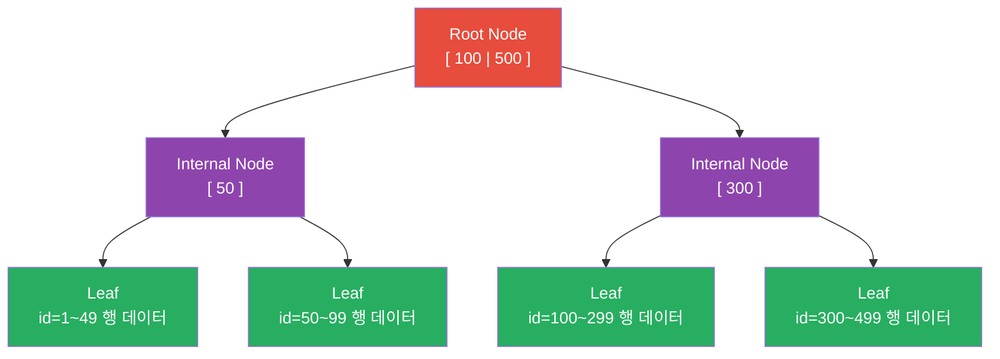
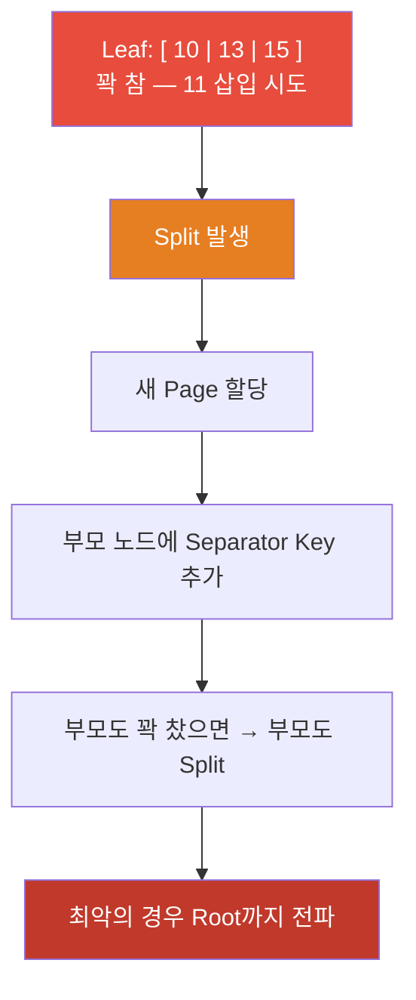

# UUID를 Primary Key로 쓰면 안 되는 이유 — B-Tree 구조로 설명하기

> "UUID는 PK로 쓰지 마세요" — 이걸 외우는 건 쉽다.
> 근데 왜? B-Tree 구조를 알면 이 말이 당연하게 들린다.

---

## 실제로 겪는 상황

서비스 초반에 UUID를 PK로 쓴다. 편하다. 분산 환경에서 충돌 없이 고유한 ID가 생긴다.

데이터가 수백만 건 쌓이기 시작한다. INSERT가 느려진다. EXPLAIN을 봐도 인덱스를 타고 있다. row 수도 적다. 근데 왜 느린가?

---

## InnoDB가 데이터를 저장하는 방식

InnoDB는 데이터를 **Clustered Index** 구조로 저장한다. Primary Key 순서로 B+Tree를 만들고, Leaf 노드에 실제 Row 데이터가 들어간다.



PK가 곧 물리적 정렬 순서다. 새 row를 삽입하면 PK 값에 해당하는 Leaf 노드를 찾아서 거기에 끼워 넣는다.

---

## AUTO_INCREMENT일 때

삽입 순서: 1, 2, 3, 4, 5 ...

새 row는 항상 PK가 가장 큰 값이다. B-Tree에서 가장 큰 값은 **가장 오른쪽 Leaf**에 있다.

```
Leaf 레벨:
[ 1 | 2 | 3 ] → [ 4 | 5 | 6 ] → [ 7 | 8 | 9 ]
                                              ↑
                               항상 여기에만 삽입
```

- 삽입 위치 탐색이 필요 없다. 오른쪽 끝 Leaf가 고정되어 있다.
- Page Split이 발생해도 오른쪽 끝 노드에서만 발생 — 예측 가능하고 기존 Page는 건드리지 않는다.
- 기존 Page들은 한 번 쓰이면 거의 수정되지 않는다 — Fragmentation이 거의 없다.

---

## UUID v4일 때

UUID v4는 128bit 완전 랜덤이다. 삽입 순서가 PK 크기 순서와 무관하다.

```
삽입 순서:
3f2a1b4c-...  →  B-Tree 어딘가 중간
1d4e9c7f-...  →  B-Tree 다른 중간
9a2f7d3e-...  →  B-Tree 또 다른 중간
```

매 삽입마다 일어나는 일:

```
1. 루트부터 탐색 시작 — 이 UUID가 어느 Leaf에 들어가야 하는지 찾기
2. 해당 Leaf Page를 Buffer Pool에서 확인
3. Buffer Pool에 없으면 → 디스크에서 읽어옴 (Random I/O)
4. Page가 꽉 차 있으면 → Page Split 발생
5. Split이 상위 노드까지 전파될 수 있음
```

데이터가 많아질수록 3번의 확률이 올라간다. Buffer Pool이 아무리 커도 랜덤하게 접근하는 Page 수가 전체 데이터에 비례해서 늘어나기 때문이다.

---

## Page Split이 왜 문제인가

Leaf Node가 꽉 찼을 때 새 row를 삽입하면 Split이 발생한다.



AUTO_INCREMENT는 Split이 오른쪽 끝에서만 일어난다. UUID는 트리 어디서든 일어날 수 있다. Split이 발생할 때마다:

- 새 Page 할당
- 기존 Page의 절반을 새 Page로 복사
- 부모 노드 업데이트
- 최악의 경우 루트까지 연쇄 전파

이게 INSERT마다 반복되면 쓰기 성능이 급격히 떨어진다.

---

## Fragmentation이 쌓이면 READ도 느려진다

Split이 반복되면 물리적으로 연속했던 Page들이 디스크 여기저기에 흩어진다.

```
AUTO_INCREMENT (Split 후):
디스크: [Page1][Page2][Page3][Page4] ← 여전히 연속

UUID (Split 후):
디스크: [Page1]...(간격)...[Page3]...(간격)...[Page2]...(간격)...[Page4]
```

Range scan(`WHERE id BETWEEN a AND b`)을 할 때 AUTO_INCREMENT는 연속된 Page를 Sequential I/O로 읽는다. UUID는 흩어진 Page를 Random I/O로 읽는다. INSERT뿐 아니라 SELECT도 느려진다.

---

## 그럼 뭘 써야 하는가

UUID의 고유성은 필요하지만 랜덤성이 문제다. 해결책은 **시간 기반 단조증가 ID**다.

**AUTO_INCREMENT** — 단일 DB에서 가장 단순. 분산 환경에서는 채번 충돌 가능.

**Snowflake** — 타임스탬프(41bit) + 워커ID(10bit) + 시퀀스(12bit). 분산 환경에서 서버마다 독립적으로 생성해도 단조증가가 보장된다. Twitter, Discord에서 사용하는 방식.

```
Snowflake 구조:
[ 타임스탬프 41bit ][ 워커ID 10bit ][ 시퀀스 12bit ]
         ↑
   시간이 지날수록 커짐 → 단조증가 보장
```

**UUID v7** — UUID 포맷을 유지하면서 앞 48bit가 타임스탬프다. 기존 UUID 인프라(라이브러리, 컬럼 타입)를 그대로 쓰면서 삽입 성능 문제를 해결한다.

**ULID** — 타임스탬프(48bit) + 랜덤(80bit). 문자열 표현이 시간순 정렬과 일치한다.

셋 다 "시간 기반 단조증가 + 고유성" 조합이라 B-Tree 삽입 패턴이 AUTO_INCREMENT와 동일하다.

---

## Galera Cluster 환경에서는 특히 주의

Galera Cluster는 멀티 마스터다. 모든 노드에서 동시에 쓰기가 가능하다. AUTO_INCREMENT를 그냥 쓰면 노드 A와 노드 B가 동시에 같은 값을 채번해서 충돌한다.

```
노드 A: INSERT → id = 5 채번
노드 B: INSERT → id = 5 채번  ← 충돌
```

Galera는 이를 위해 `auto_increment_increment`와 `auto_increment_offset`을 제공한다. 노드마다 채번 범위를 나눠서 충돌을 피한다.

```
노드 3개 설정 예시:
  auto_increment_increment = 3  ← 3씩 건너뜀

  노드 1 (offset=1): 1, 4, 7, 10 ...
  노드 2 (offset=2): 2, 5, 8, 11 ...
  노드 3 (offset=3): 3, 6, 9, 12 ...
```

충돌은 피하지만 문제가 남는다.

- ID에 구멍이 생긴다 (1, 4, 7 ... 연속하지 않음)
- 노드가 추가되거나 제거되면 increment/offset 설정을 전체 다시 해야 한다
- 노드 수와 설정이 맞지 않으면 채번이 겹칠 수 있다

Galera 환경에서 Snowflake를 쓰면 이 문제가 없다. 각 노드가 워커ID로 구분되어 독립적으로 ID를 생성하고, 노드를 추가해도 워커ID만 하나 더 할당하면 끝이다.

```
Snowflake + Galera:
  노드 1 (워커ID=1): 726497001, 726497004 ...
  노드 2 (워커ID=2): 726497002, 726497005 ...  ← 구조적으로 겹칠 수 없음
  노드 추가 시: 워커ID=3 할당, 설정 변경 없음
```

분산 DB를 운영하는 환경이라면 처음 설계 시점에 Snowflake나 UUID v7으로 가는 게 나중에 바꾸는 것보다 훨씬 낫다.

---

## 한 줄 정리

UUID v4가 느린 이유는 랜덤하기 때문이다. B-Tree는 정렬된 구조라 랜덤 삽입이 가장 비싸다. 시간 기반 단조증가 ID를 쓰면 UUID의 고유성을 유지하면서 삽입 성능 문제를 피할 수 있다.

---

## 관련 문서

- [B-Tree 내부 구조](../db-internals/db-btree-internals.md)
- [스토리지 기초 — Page와 Buffer Pool](../db-internals/db-storage-basics.md)
