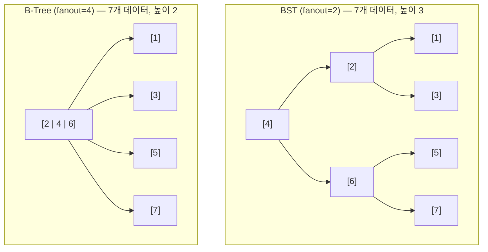
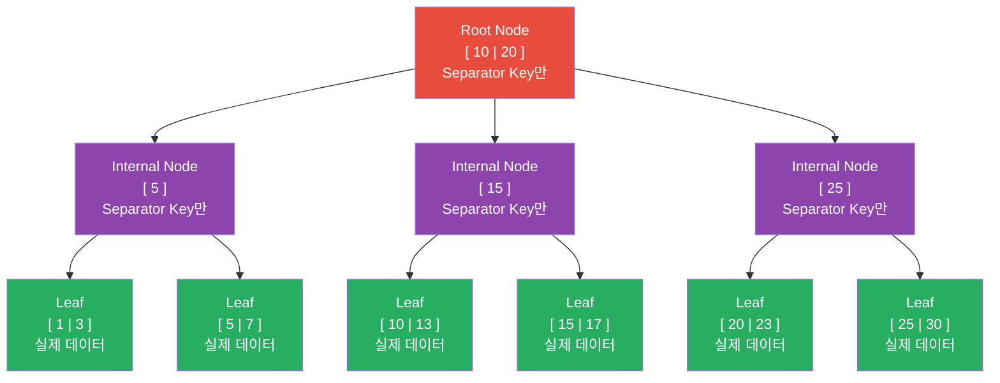
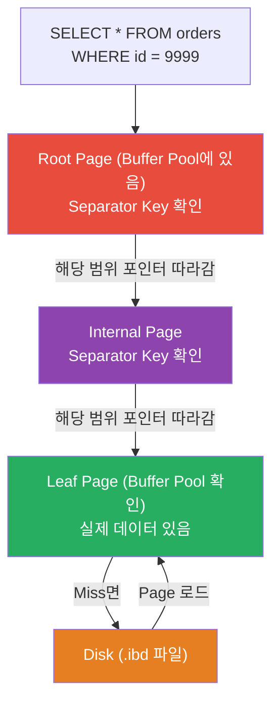

# Phase 2: B-Tree 내부 구조 — 왜 DB는 B-Tree를 선택했는가

> 완료 기준: "B-Tree 노드가 Page와 어떻게 연결되는지, 삽입 시 Page Split이 왜 일어나는지 설명 가능"

---

서비스 초기에 UUID를 PK로 썼다. 데이터가 수백만 건 쌓이자 INSERT가 눈에 띄게 느려졌다. EXPLAIN을 봐도 인덱스를 타고 있다. 근데 왜 느린가?

UUID는 랜덤 값이라 삽입할 때마다 B-Tree의 다른 위치에 꽂힌다. 그 위치의 Page가 꽉 차 있으면 Page Split이 일어나고, 디스크 여기저기에 Random I/O가 발생한다. AUTO_INCREMENT였으면 항상 마지막 Page에만 추가되니까 Split도 없고 Sequential I/O다.

이걸 모르면 "UUID는 쓰지 마세요"를 외우는 데서 끝난다. B-Tree 구조를 알면 왜 그런지, 어떤 상황에서 얼마나 느려지는지 설명할 수 있다.

---

## 1. Binary Search Tree의 한계 — 왜 BST는 디스크에서 안 되는가

B-Tree를 이해하려면 먼저 BST(Binary Search Tree)가 왜 디스크 기반 DB에 맞지 않는지부터 알아야 한다.

BST는 각 노드가 키 하나, 값 하나, 자식 포인터 둘로 구성된다. 메모리에서는 포인터를 따라가는 비용이 거의 없어서 잘 동작한다. 하지만 디스크에서는 두 가지 문제가 있다.

**첫째, Locality 문제다.** 노드가 삽입 순서대로 디스크 여기저기에 흩어진다. 자식 포인터를 따라가면 다른 디스크 블록으로 이동해야 할 수 있다. 노드를 하나 읽을 때마다 별도의 Disk I/O가 발생한다.

**둘째, 높이(height) 문제다.** fanout은 노드 하나가 가질 수 있는 자식 수다. BST의 fanout은 2 — 노드 하나가 자식을 2개밖에 못 가지니 트리가 깊어질 수밖에 없다. 40억 개 데이터를 담으면 높이가 32 — 루트에서 리프까지 32번 이동, 즉 32번 Disk I/O다.



fanout이 크면 트리가 옆으로 넓어지고 위아래로 얕아진다. 같은 데이터를 담아도 트리 높이가 낮다는 뜻이고, 루트에서 리프까지 거치는 노드 수 = I/O 횟수가 줄어든다.

실제 DB는 fanout이 수백이라 수억 건 데이터도 높이 3~4로 끝난다. 노드 하나를 읽는 게 Disk I/O 1번이므로, 높이 = I/O 횟수다.

구체적인 수치로 보면: 4KB Page에 branching factor 500이면 4레벨 트리로 **256TB**까지 저장 가능하다. 이 스케일에서 Leaf까지 내려가는 데 I/O가 4번뿐이다.

---

## 2. B-Tree 구조

> 실제 DB에서 쓰는 건 엄밀히는 **B+Tree**다. B-Tree는 모든 노드에 값을 저장하지만, B+Tree는 값을 리프 노드에만 저장한다. MySQL InnoDB는 B+Tree를 사용하지만 관례적으로 B-Tree라고 부른다. 이 문서에서도 이하 B-Tree는 B+Tree를 의미한다.



B-Tree 노드는 세 종류로 나뉜다.

- **Root Node**: 트리의 최상위. 탐색의 시작점.
- **Internal Nodes**: 루트와 리프 사이. 탐색 방향을 결정하는 Separator Key만 갖는다. 실제 데이터 없음.
- **Leaf Nodes**: 최하위 노드. 실제 데이터(키 + 값)가 여기에만 있다.

Separator Key가 어떻게 탐색 방향을 결정하는지는 3번에서 다룬다.

---

## 3. Separator Keys — 트리를 어떻게 탐색하는가

Separator Key는 구간의 경계값이다. 경계 N개가 구간을 N+1개로 쪼개고, 각 구간마다 자식이 하나씩 붙는다.

```
        경계      경계
          ↓        ↓
Root  [ 10   |   20 ]
      ↙           ↓           ↘
  ~9           10~19          20~
(왼쪽 자식)  (가운데 자식)  (오른쪽 자식)

찾는 키 13 → 10~19 구간 → 가운데 자식으로 내려감
```

경계 2개 → 구간 3개 → 자식 3개. 키 N개면 자식은 항상 N+1개인 이유다.

Separator Key는 항상 정렬된 상태로 노드 안에 저장된다. 정렬되어 있으니까 노드 안에서 Binary Search로 구간을 찾을 수 있다.

Lookup 알고리즘:
1. Root에서 시작
2. 현재 노드에서 Binary Search로 검색 키가 속하는 구간의 포인터를 찾음
3. 해당 포인터를 따라 한 레벨 내려감
4. Leaf 노드에 도달할 때까지 반복
5. Leaf에서 키를 찾으면 값 반환, 없으면 탐색 실패

Point query(=)는 Leaf에서 끝난다. Range query(<, >, BETWEEN)는 Leaf까지 내려간 후 **Sibling 포인터**를 따라 옆 노드로 이동하며 범위 전체를 스캔한다. Leaf 노드끼리 linked list로 연결되어 있기 때문에 가능하다.

---

## 4. Node Split — 삽입이 트리를 어떻게 바꾸는가

B-Tree는 항상 균형을 유지한다. 균형을 깨지 않기 위해 노드가 가득 차면 **Split**을 수행한다.

### Leaf Node Split

```
삽입 전:
Parent: [ 18 ]
           ↓
Leaf: [ 10 | 13 | 15 ]  ← 꽉 참. 11 삽입 시도 → 공간 없음 → Split

Split 후:
Parent: [ 13 | 18 ]  ← 중간 키 13이 부모로 승격(promote)됨
         ↓      ↓
[ 10 | 11 ]   [ 13 | 15 ]  ← 반으로 나뉜 두 Leaf
```

1. 현재 노드를 반으로 나눈다 (split point = 중간 인덱스)
2. 중간 키를 부모 노드로 **승격(promote)**시킨다 — 부모의 Separator Key가 하나 늘어남
3. Split point 이후 요소들을 새로 만든 형제 노드로 이동시킨다
4. 새 요소를 적절한 노드에 삽입한다

### Nonleaf Node Split (Internal/Root)

Internal 노드가 꽉 찬 경우도 같은 원리로 Split이 발생한다. 차이는 Internal 노드가 Split되면 그 위 부모도 꽉 찰 수 있다는 것이다. Split이 루트까지 전파될 수 있다.

루트가 Split되면:
- 새 루트 노드가 생성된다
- 기존 루트는 새 루트의 자식으로 내려간다
- 트리 높이가 1 증가한다

**B-Tree는 아래에서 위로 자란다.** Leaf 레벨과 Internal 레벨은 수평으로만 확장되고, 높이는 루트 Split 시에만 증가한다.

**Split 도중 Crash가 나면?**

Split은 여러 Page를 수정하는 작업이다. 새 Page 쓰기 → 부모 Page 업데이트 순서로 진행되는데, 그 사이에 서버가 죽으면 새 Page는 쓰였지만 부모가 가리키지 않는 **Orphan Page**가 생긴다. 트리 구조가 깨진 상태다.

이게 WAL(Write-Ahead Log)이 필요한 이유다. 데이터 정합성뿐 아니라 **인덱스 구조 자체의 corruption을 막기 위해** Split 전에 로그를 먼저 기록한다. Crash 후 재시작 시 WAL을 재적용해서 Split을 완성하거나 롤백한다.

---

## 5. Node Merge — 삭제가 트리를 어떻게 바꾸는가

삭제 시 노드가 너무 비면 **Merge**를 수행한다. B-Tree는 각 노드가 최소 절반 이상 차 있어야 한다는 invariant를 유지한다.

```
Merge 전:
Parent: [ 14 ]          ← 14가 두 자식을 나누는 Separator Key
         ↓      ↓
[ 10 | 13 ]   [ 15 ]   ← 오른쪽 노드가 삭제 후 너무 빔

Merge 후:
Parent: []              ← Separator Key 14가 아래로 내려감
         ↓
[ 10 | 13 | 14 | 15 ]  ← 두 노드 + 부모 Separator Key가 합쳐짐
```

두 자식을 합칠 때 그 사이를 구분하던 부모의 Separator Key도 함께 내려온다. 그래야 합쳐진 노드 안에서 키 순서가 유지된다. 부모는 Separator Key가 하나 줄고, 자식 포인터도 하나 줄어든다.

Merge도 Split처럼 위로 전파될 수 있다. 부모에서 Separator Key가 사라지면서 부모 자신도 최소 occupancy를 위반하면, 그 위 부모도 Merge가 필요해진다.

Split과 Merge를 통해 B-Tree는 항상 **모든 Leaf가 동일한 깊이에 있다**는 균형을 유지한다.

---

## 6. Page 내부 구조 — Slotted Page

지금까지 "노드"라고 불렀던 것이 실제로는 디스크의 **Page**다. B-Tree 노드 하나 = Page 하나 = InnoDB 기준 16KB. Split이 일어나면 새 Page가 할당되고, Buffer Pool도 Page 단위로 캐싱한다.

그런데 Page 안에 데이터를 어떻게 배치하는가? 단순하게 앞에서부터 순서대로 쌓으면 두 가지 문제가 생긴다.

**문제 1**: 삽입 순서와 키 정렬 순서가 다르다. 중간에 새 키를 끼워 넣으려면 뒤에 있는 레코드들을 전부 밀어야 한다.

**문제 2**: 삭제 후 생긴 빈 공간을 재활용하기 어렵다. 빈 공간 크기와 새 레코드 크기가 딱 맞지 않으면 낭비된다.

이 두 문제를 해결하는 방식이 **Slotted Page**다. PostgreSQL, InnoDB 등 대부분의 DB가 이 방식을 쓴다.

```
┌─────────────────────────────────────────────────────┐
│ Header │ Offsets (→→→) │  Free Space  │ ←←← Cells  │
│        │  [p1][p2][p3] │              │  [C3][C2][C1]│
└─────────────────────────────────────────────────────┘
         ↑               ↑             ↑
    포인터 배열은     포인터는         실제 Cell(데이터)은
    왼쪽에서 오른쪽  키 순서로 정렬   오른쪽에서 왼쪽으로
    으로 증가                          (삽입 순서대로)
```

핵심 아이디어: **데이터(Cell)와 포인터(Offset)를 분리한다.**

- Cell은 페이지 오른쪽에서 왼쪽으로 삽입 순서대로 쌓인다. 순서를 바꿀 필요가 없다.
- Offset 배열은 페이지 왼쪽에 있고, 키 순서로 정렬된다. Cell이 아니라 포인터만 재정렬하면 된다.

예를 들어 "Tom", "Leslie"를 삽입하면:
- Cell 영역: `[Leslie][Tom]` (삽입 순서)
- Offset 배열: `[→Leslie][→Tom]` (알파벳 순서)

여기에 "Ron"을 추가하면:
- Cell 영역: `[Ron][Leslie][Tom]` (삽입 순서, Cell은 이동 없음)
- Offset 배열: `[→Leslie][→Ron][→Tom]` (Ron 위치에 포인터 삽입, 재정렬)

이 방식의 장점:
- 삽입/삭제 시 Cell 자체를 이동하지 않아도 된다 — Offset 포인터만 조작
- 삭제는 Offset 포인터를 제거하거나 null로 만드는 것으로 충분
- 공간 회수는 페이지 전체를 재작성(defragment)할 때 한 번에 처리

### Page Header가 담는 정보

```
Page Header:
  - Magic number     : 파일 타입 식별 (corruption 감지용)
  - Node 타입        : Root / Internal / Leaf (enum으로 표현)
  - Sibling 포인터   : 왼쪽/오른쪽 형제 Leaf 연결 (Range scan용)
  - 현재 사용 중인 셀 수
  - Free space 오프셋
  - Flags            : variable-size 여부, overflow page 여부 등
```

InnoDB에서 B-Tree 노드 하나 = Page 하나 = 16KB다.

Buffer Pool에서 Page 단위로 캐싱되는 것이 곧 B-Tree 노드를 캐싱하는 것이다. Root 노드는 거의 항상 Buffer Pool에 있다. 자주 사용되기 때문이다. Leaf 노드는 조회 패턴에 따라 Buffer Pool에 있을 수도, 없을 수도 있다.

B-Tree 탐색은 레벨 수 = Disk I/O 횟수다. Root가 Buffer Pool에 있으면 Root 접근은 메모리 접근이 된다. Height가 4인 B-Tree에서 Root가 캐시에 있다면 실제 Disk I/O는 3번이다.

### Adaptive Hash Index

InnoDB는 B-Tree Page가 Buffer Pool에 올라오면 자동으로 **인메모리 Hash Index**를 추가로 만든다. 디스크의 B-Tree 구조는 그대로 유지되고, 메모리 위에서만 Hash로 가속하는 방식이다.

```
디스크: B-Tree (변하지 않음)
           ↓ Buffer Pool에 올라오면
메모리: B-Tree Page + Hash Index (자동 생성)

Point lookup (key=13):
  B-Tree 탐색: Root → Internal → Leaf (3번 이동)
  Hash Index:  Hash(13) → 바로 해당 슬롯 (1번)
```

Point lookup(`=` 쿼리)에서 B-Tree 탐색을 건너뛰고 Hash로 바로 찾아간다. Range query는 Hash로 할 수 없어서 여전히 B-Tree를 탄다. DBA가 설정할 필요 없이 InnoDB가 자동으로 관리한다.

### Page Directory — Page 내부 탐색

Page 안에 수백 개의 레코드가 있을 때, 원하는 키를 어떻게 찾는가? InnoDB는 **Page Directory**라는 sparse한 포인터 배열을 Page 안에 유지한다.

```
Page Directory (sparse):
  [ →slot1 | →slot5 | →slot9 | →slot13 ]
       ↓
  Binary Search로 범위를 좁힘
       ↓
  해당 slot에서 linked-list로 순차 탐색 (짧은 거리)
       ↓
  정확한 레코드 도달
```

전체를 순차 스캔하지 않고, Binary Search로 슬롯을 좁힌 뒤 짧은 구간만 linked-list로 따라간다. Slotted Page의 Offset 배열과 역할이 비슷하지만, Page Directory는 더 sparse하게 유지해서 오버헤드를 줄인다.

---

## 7. Rebalancing — Split/Merge 전에 먼저 시도하는 것

Split과 Merge는 비용이 크다. Split은 새 Page를 할당하고 부모에 Separator Key를 추가해야 하며, 최악의 경우 루트까지 전파된다. 그래서 많은 B-Tree 구현체는 Split/Merge 전에 먼저 **Rebalancing(재균형)**을 시도한다.

**삽입 시 Rebalancing**: 현재 노드가 꽉 찼을 때, 형제 노드에 여유 공간이 있으면 일부 요소를 형제로 옮긴다. Split을 피할 수 있다.

```
Rebalancing 전:
  형제 A: [ 10 | 13 | 16 ]  ← 꽉 참
  형제 B: [ 20 ]             ← 여유 있음
  부모: [ 18 ]

  → 18 삽입 시 A가 꽉 차서 Split 필요한 상황

Rebalancing 후:
  형제 A: [ 10 | 13 ]
  형제 B: [ 16 | 18 | 20 ]
  부모: [ 16 ]  ← Separator Key 업데이트
```

**삭제 시 Rebalancing**: 현재 노드가 너무 비었을 때, 형제 노드에서 요소를 빌려온다. Merge를 피할 수 있다.

B*-Tree는 이 전략을 극단까지 밀어붙인다. 두 형제 노드가 모두 꽉 찰 때까지 계속 재분배하고, 그래도 안 되면 2개 노드를 3개로 쪼갠다(각각 2/3씩 채움). InnoDB 기본 Split은 50/50이지만, B*-Tree는 67/67/새노드 방식으로 평균 Occupancy가 더 높다.

Rebalancing의 트레이드오프: Split/Merge 횟수는 줄지만, 형제 노드와 부모의 Separator Key를 업데이트해야 하므로 추가 I/O가 발생할 수 있다.

---

## 8. Right-Only Appends — AUTO_INCREMENT가 왜 빠른가

`AUTO_INCREMENT` Primary Key로 삽입할 때, 새 레코드는 항상 B-Tree의 **가장 오른쪽 Leaf**에 추가된다. 이 패턴을 Right-Only Append라고 부른다.

```
삽입 순서: 1 → 2 → 3 → 4 → 5 ...

B-Tree Leaf 레벨:
[ 1 | 2 | 3 ] → [ 4 | 5 | 6 ] → [ 7 | 8 | ... ]
                                              ↑
                               항상 여기에만 삽입
```

이 패턴의 장점:
- Split이 발생해도 항상 가장 오른쪽 노드에서만 발생 → 예측 가능하고 비용 최소화
- 기존 Page들은 한 번 쓰이면 거의 수정되지 않음 → Fragmentation 최소화
- PostgreSQL은 이를 **fastpath** 최적화로 구현: 마지막으로 삽입한 Leaf Page를 캐싱해두고, 다음 삽입 시 루트부터 탐색 없이 바로 그 Page로 점프

반면 UUID처럼 랜덤 키를 삽입하면 매번 트리 전체에서 삽입 위치를 탐색해야 하고, 어느 Page든 Split 대상이 될 수 있다. 해당 Page가 Buffer Pool에 없을 가능성도 높아서 Random I/O까지 발생한다. Fragmentation이 쌓이면 이후 range scan도 느려진다.

순차 키가 필요하지만 UUID의 고유성도 필요하다면 `ULID`나 `UUID v7`을 쓴다 — 시간 기반으로 정렬 가능하면서 랜덤성도 유지한다.

---

## 9. Page Fragmentation — 왜 주기적으로 정리가 필요한가

Slotted Page에서 삭제와 업데이트가 반복되면 Page 내부에 단편화가 쌓인다.

```
단편화된 Page:
┌────────────────────────────────────────────────────┐
│ Offsets │ Free space │ [garbage][live][garbage][live]│
│  [→][ ] │            │ (삭제된 Cell이 구멍을 만듦)  │
└────────────────────────────────────────────────────┘
```

논리적 공간(Offset이 비어있음)은 있지만, 물리적으로 연속된 공간이 없어서 새 Cell을 삽입하지 못하는 상황이 발생한다. 실제 남은 공간보다 더 일찍 Page가 꽉 찬 것처럼 보인다.

이를 해결하기 위해 DB는 백그라운드에서 **Page Defragmentation**을 수행한다.
- 살아있는 Cell들만 새 위치로 재작성
- 삭제된 Cell이 차지하던 공간 회수
- Offset 배열 정리

MySQL InnoDB에서는 `OPTIMIZE TABLE` 명령으로 강제 실행할 수 있고, 백그라운드 Purge 스레드가 주기적으로 처리한다.

---

## 11. 전체 흐름 정리



B-Tree 탐색 = 루트에서 리프까지 내려오면서 각 레벨에서 Binary Search로 방향 결정.
각 레벨 이동 = Page 1개 접근 = Buffer Pool Hit이면 메모리, Miss면 Disk I/O.
Height가 낮을수록 I/O 횟수가 적고, fanout이 높을수록 Height가 낮아진다.

---

## 실습

### 실습 1: B-Tree 높이 추정

```sql
-- 테이블의 row 수 확인
SELECT COUNT(*) FROM your_table;

-- 인덱스 통계 확인
SELECT
    TABLE_NAME,
    INDEX_NAME,
    STAT_NAME,
    STAT_VALUE
FROM mysql.innodb_index_stats
WHERE TABLE_NAME = 'your_table'
  AND STAT_NAME IN ('n_leaf_pages', 'size');
```
> 📷 **[직접 실행 결과 캡쳐 첨부]**

### 실습 2: 순차 삽입 vs 랜덤 삽입 성능 비교

```sql
-- 순차 삽입 테이블
CREATE TABLE seq_insert (
    id BIGINT AUTO_INCREMENT PRIMARY KEY,
    val VARCHAR(100)
);

-- UUID 삽입 테이블
CREATE TABLE uuid_insert (
    id CHAR(36) PRIMARY KEY,
    val VARCHAR(100)
);

-- 각각 100,000건 삽입 후 시간 비교
-- (직접 스크립트 작성해서 실행)
```
> 📷 **[순차 vs UUID 삽입 시간 비교 캡쳐 첨부]**

### 실습 3: EXPLAIN으로 Index Scan 경로 확인

```sql
EXPLAIN SELECT * FROM your_table WHERE id = 12345;
-- type: const 또는 ref 확인
-- key: PRIMARY 확인
-- rows: 1에 가까울수록 B-Tree가 정확히 찾아간 것
```
> 📷 **[EXPLAIN 결과 캡쳐 첨부]**

---

## 체크리스트

- [ ] BST가 디스크 기반 DB에 맞지 않는 이유를 fanout과 locality 관점에서 설명할 수 있다
- [ ] B+Tree와 B-Tree의 차이를 설명할 수 있다 (값이 어디에 저장되는가)
- [ ] Separator Key가 무엇인지, Lookup 알고리즘에서 어떻게 쓰이는지 설명할 수 있다
- [ ] Node Split이 왜 일어나는지, Leaf Split과 Nonleaf Split의 차이를 설명할 수 있다
- [ ] Split이 루트까지 전파되면 트리 높이가 어떻게 변하는지 설명할 수 있다
- [ ] B-Tree 노드와 Page가 어떻게 대응되는지 설명할 수 있다
- [ ] UUID Primary Key가 성능 문제를 유발하는 이유를 B-Tree 구조로 설명할 수 있다
- [ ] Range scan 시 Leaf 노드 간 이동이 어떻게 이루어지는지 설명할 수 있다
- [ ] Rebalancing이 Split/Merge와 어떻게 다른지 설명할 수 있다
- [ ] AUTO_INCREMENT가 UUID보다 삽입 성능이 좋은 이유를 Right-Only Append로 설명할 수 있다
- [ ] Page Fragmentation이 왜 생기고, 어떻게 해소되는지 설명할 수 있다

---

## B-Tree vs LSM-Tree — Phase 3 예고

LSM-Tree는 B-Tree의 쓰기 성능 약점을 해결하기 위해 나온 구조다. 두 구조의 트레이드오프를 미리 잡아두면 Phase 3가 수월하다.

**Write Amplification**

B-Tree는 논리적 쓰기 1번이 물리적으로 여러 번 기록된다.

```
논리적 쓰기 1번 →
  1. WAL에 기록
  2. 실제 Page에 기록
  (Split이 일어나면 추가 Page 쓰기 발생)
```

이를 **Write Amplification**이라 한다. SSD는 erase-cycle 한계가 있어서 Write Amplification이 높으면 수명이 줄어든다.

**B-Tree의 강점**

- 키가 트리에 딱 한 곳에만 존재한다 → 트랜잭션 Lock을 키 범위에 직접 걸 수 있어 구현이 단순하다
- Read latency가 예측 가능하다 — LSM-Tree는 compaction이 돌 때 I/O를 잡아먹어서 읽기 지연이 튄다

**LSM-Tree의 강점**

- 쓰기를 메모리(Memtable)에 모았다가 Sequential하게 한 번에 flush → Write Amplification이 낮다
- Compaction으로 주기적으로 파일을 재작성 → 파편화 없이 디스크를 compact하게 유지
- Leaf 페이지를 Sequential하게 배치 → Range scan에서 B-Tree보다 유리

**LSM-Tree의 약점**

- 같은 키가 여러 파일에 존재할 수 있다 → 읽을 때 여러 파일을 확인해야 함
- Compaction이 쓰기 속도를 못 따라가면 파일이 계속 쌓여서 읽기 성능이 저하되고 디스크가 고갈될 수 있다 — 운영 모니터링이 필수

---

## 다음 단계

Phase 3: [LSM-Tree — 쓰기 최적화 구조의 원리](db-lsm-tree.md)
- B-Tree의 약점(쓰기 성능)을 LSM-Tree는 어떻게 해결하는가
- Memtable, SSTable, Compaction의 동작 원리

---

## 참고 문헌

- *Database Internals* — Alex Petrov. 이 문서의 기반 교재. B-Tree, LSM-Tree, Storage Engine 내부 구조를 깊게 다룬다.
- *Designing Data-Intensive Applications* — Martin Kleppmann. B-Tree vs LSM-Tree 비교, Write Amplification, 분산 시스템 트레이드오프. Ch. 3 참고.
- *Understanding MySQL Internals* — Sasha Pachev. InnoDB 구현 레벨 상세. Adaptive Hash Index, Page Directory, MVCC hidden fields. Ch. 10~11 참고.
