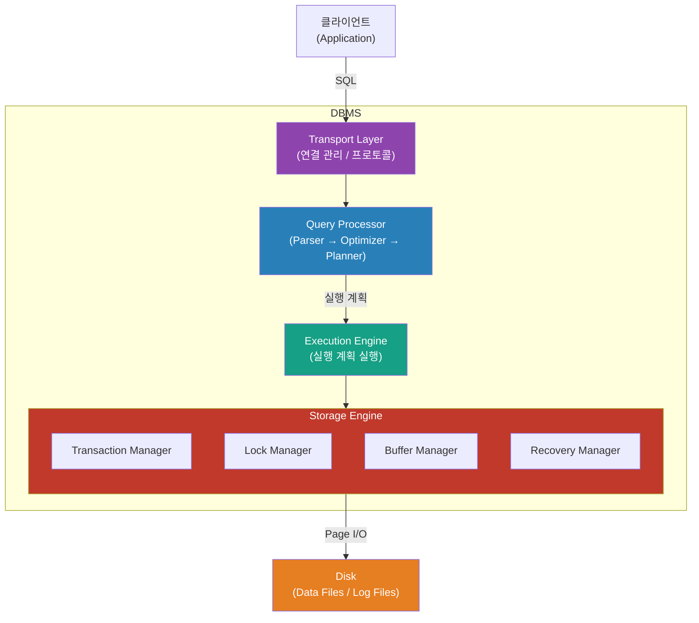
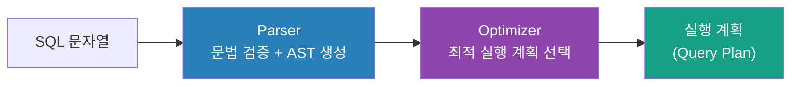
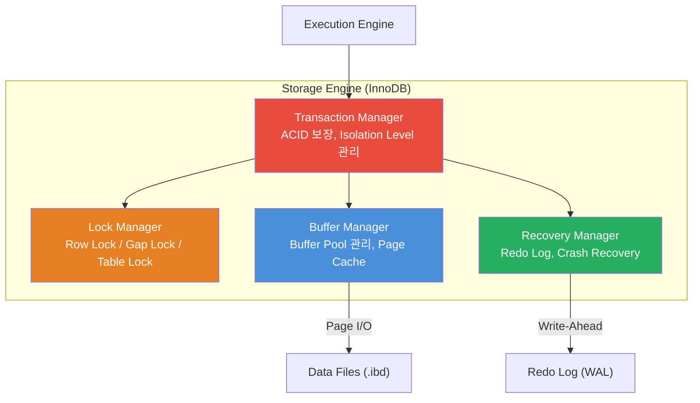

# Phase 1: DBMS 아키텍처 — Storage Engine은 어떻게 구성되는가

> 완료 기준: "쿼리가 들어와서 결과가 나올 때까지 어떤 컴포넌트를 거치는지 그림으로 설명 가능"

---

## 왜 이걸 알아야 하나?

`EXPLAIN`을 봐도 "왜 이 실행 계획이 나왔지?"를 모른다면, 쿼리 최적화는 찍기 게임이 된다.
DBMS 내부 컴포넌트 구조를 알면 **병목이 어디서 생기는지**, **트랜잭션이 왜 느려지는지** 구조적으로 설명할 수 있다.

---

## 1. DBMS 전체 아키텍처



쿼리 하나가 실행되는 경로:

```
클라이언트 SQL
  → Transport Layer  : 연결 수립, 프로토콜 처리 (MySQL의 경우 TCP 3306)
  → Query Processor  : SQL 파싱 → 실행 계획 수립 (Optimizer)
  → Execution Engine : 실행 계획을 실제로 수행
  → Storage Engine   : 데이터 읽기/쓰기 (InnoDB가 여기)
  → Disk             : Page 단위 I/O
```

각 레이어는 독립적이다. MySQL에서 Storage Engine을 InnoDB ↔ MyISAM으로 바꿀 수 있는 이유도 이 분리 구조 때문이다.

---

## 2. Transport Layer

클라이언트와 DBMS 사이의 연결을 담당하는 레이어다.

- 프로토콜 처리: MySQL Wire Protocol, PostgreSQL Frontend/Backend Protocol
- 연결 관리: Thread per connection (MySQL 기본) 또는 Connection Pool
- 인증 처리

**Connection Pool이 왜 중요한가?**

```
연결 수립 비용 = TCP Handshake + 인증 + 세션 초기화
               ≈ 수 ms ~ 수십 ms

쿼리 실행 자체: 수백 µs ~ 수 ms (캐시 히트 시)
```

연결 수립이 쿼리보다 느릴 수 있다. 그래서 Connection Pool로 연결을 재사용한다.
연결 고갈(Connection Pool Exhaustion)은 대표적인 운영 장애 원인이다.

---

## 3. Query Processor

SQL을 받아서 실행 계획으로 변환하는 레이어다. 3단계로 구성된다.



### Parser
- SQL 문자열을 파싱해서 AST(Abstract Syntax Tree)로 변환
- 문법 오류는 여기서 잡힘 (`You have an error in your SQL syntax...`)

### Optimizer (핵심)
- 동일한 결과를 내는 여러 실행 계획 중 **비용이 가장 낮은 것을 선택**
- Cost-based Optimizer: 테이블 통계 정보(row 수, cardinality, 데이터 분포)를 기반으로 비용 계산
- Full Scan vs Index Scan, Join 순서, Join 알고리즘 — 모두 Optimizer가 결정

**Optimizer가 틀릴 수 있는 경우:**
통계 정보가 오래됐거나 부정확하면 잘못된 실행 계획을 선택한다.
→ `ANALYZE TABLE`로 통계 갱신, `FORCE INDEX`로 강제 변경 (Phase 6에서 상세히)

### Planner
- Optimizer가 선택한 계획을 Execution Engine이 실행할 수 있는 형태로 직렬화

---

## 4. Execution Engine

실행 계획을 받아서 실제로 실행하는 레이어다.

- JOIN, SORT, AGGREGATION 등 연산 수행
- Storage Engine API를 호출해서 데이터를 가져옴
- 결과를 클라이언트에 스트리밍

Execution Engine은 Storage Engine의 내부를 모른다. 단순히 "row 줘"라고 API를 호출할 뿐이다. 이 분리가 MySQL Pluggable Storage Engine의 핵심이다.

---

## 5. Storage Engine 내부 구조

여기가 InnoDB가 동작하는 레이어다. 4개의 Manager로 구성된다.



### Transaction Manager
- 트랜잭션 시작/커밋/롤백 관리
- Isolation Level 적용 (READ COMMITTED, REPEATABLE READ 등)
- MVCC(Multi-Version Concurrency Control) 조율 → Phase 4에서 상세히

### Lock Manager
- 동시성 제어를 위한 Lock 관리
- Row Lock, Gap Lock, Next-Key Lock, Table Lock
- Deadlock 감지 및 victim 선택

### Buffer Manager
- Phase 0에서 다룬 **Buffer Pool**이 여기에 있음
- Disk에서 Page를 읽어와 메모리에 캐싱
- Dirty Page 관리, LRU 기반 페이지 교체

### Recovery Manager
- **WAL(Write-Ahead Log)** 관리 — Redo Log에 먼저 기록
- Crash 후 재시작 시 Redo Log로 복구
- Checkpoint 관리 → Phase 5에서 상세히

---

## 6. Row-oriented vs Column-oriented

같은 DBMS 아키텍처라도 데이터를 디스크에 배치하는 방식이 다르다.

```
Row-oriented (InnoDB, PostgreSQL)
┌──────────────────────────────────────────┐
│ id=1, name="Alice", age=30, dept="Eng"  │  ← 한 row가 연속으로 저장
│ id=2, name="Bob",   age=25, dept="Mkt"  │
│ id=3, name="Carol", age=28, dept="Eng"  │
└──────────────────────────────────────────┘

Column-oriented (ClickHouse, Redshift, BigQuery)
┌──────────────────────────────────────────┐
│ id:   1, 2, 3                           │  ← 같은 컬럼끼리 연속으로 저장
│ name: Alice, Bob, Carol                 │
│ age:  30, 25, 28                        │
│ dept: Eng, Mkt, Eng                     │
└──────────────────────────────────────────┘
```

| 기준 | Row-oriented | Column-oriented |
|------|-------------|----------------|
| 유리한 쿼리 | `SELECT * WHERE id = 1` (특정 row 전체) | `SELECT AVG(age) FROM users` (특정 컬럼 집계) |
| 유리한 workload | OLTP (insert/update 많음) | OLAP (대량 집계, 분석) |
| 이유 | row 단위 I/O → CRUD 효율적 | 필요한 컬럼만 읽음 + 압축률 높음 |

MySQL InnoDB는 Row-oriented다. OLTP 워크로드에 최적화되어 있다.

---

## 7. In-memory DB vs Disk-based DB

| 기준 | Disk-based (InnoDB) | In-memory (Redis, VoltDB) |
|------|--------------------|-----------------------|
| 데이터 위치 | 기본적으로 Disk, 일부 Buffer Pool | 기본적으로 메모리 |
| 속도 | µs ~ ms | ns ~ µs |
| 내구성 | WAL + Data Files → 기본 보장 | 별도 Persistence 설정 필요 |
| 용량 | 디스크 크기에 비례 (수 TB 가능) | 메모리 크기에 비례 (수십 GB 한계) |
| 용도 | 일반 OLTP | 캐시, 세션, 실시간 처리 |

In-memory DB도 내구성을 위해 WAL이나 스냅샷을 디스크에 쓰는 경우가 많다 (Redis AOF/RDB).

---

## 실습

### 실습 1: Storage Engine 목록 확인
```sql
SHOW ENGINES;
```
> 📷 **[직접 실행 결과 캡쳐 첨부]**

### 실습 2: 테이블별 Storage Engine 확인
```sql
SELECT TABLE_NAME, ENGINE
FROM information_schema.TABLES
WHERE TABLE_SCHEMA = 'your_database_name';
```
> 📷 **[직접 실행 결과 캡쳐 첨부]**

### 실습 3: EXPLAIN으로 실행 계획 확인
```sql
-- 인덱스 없는 컬럼 조회
EXPLAIN SELECT * FROM your_table WHERE non_indexed_column = 'value';

-- 인덱스 있는 컬럼 조회
EXPLAIN SELECT * FROM your_table WHERE indexed_column = 'value';
```
> 📷 **[두 결과 비교 캡쳐 첨부 — type, key, rows 컬럼에 집중]**

### 실습 4: Connection 상태 확인
```sql
SHOW STATUS LIKE 'Threads_%';
SHOW STATUS LIKE 'Connection%';
```
> 📷 **[직접 실행 결과 캡쳐 첨부]**

---

## 체크리스트

- [ ] DBMS 4개 레이어(Transport → Query Processor → Execution Engine → Storage Engine)를 순서대로 말할 수 있다
- [ ] Optimizer가 실행 계획을 잘못 선택하는 원인을 설명할 수 있다
- [ ] Storage Engine 내부 4개 Manager(Transaction / Lock / Buffer / Recovery)의 역할을 각각 한 문장으로 설명할 수 있다
- [ ] Row-oriented와 Column-oriented의 차이를 workload 관점에서 설명할 수 있다
- [ ] `SHOW ENGINES`로 InnoDB 외 어떤 Storage Engine이 있는지 직접 확인했다
- [ ] `EXPLAIN`에서 `type`, `key`, `rows` 컬럼이 무엇을 의미하는지 설명할 수 있다

---

## 다음 단계

Phase 2: [B-Tree 내부 구조](db-btree-internals.md)
- Storage Engine이 데이터를 어떤 자료구조로 구성하는가
- Page와 B-Tree 노드는 어떻게 맞물리는가
