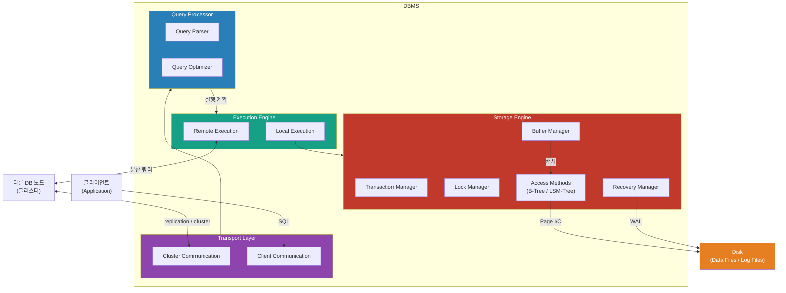
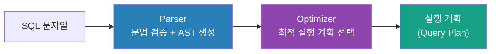
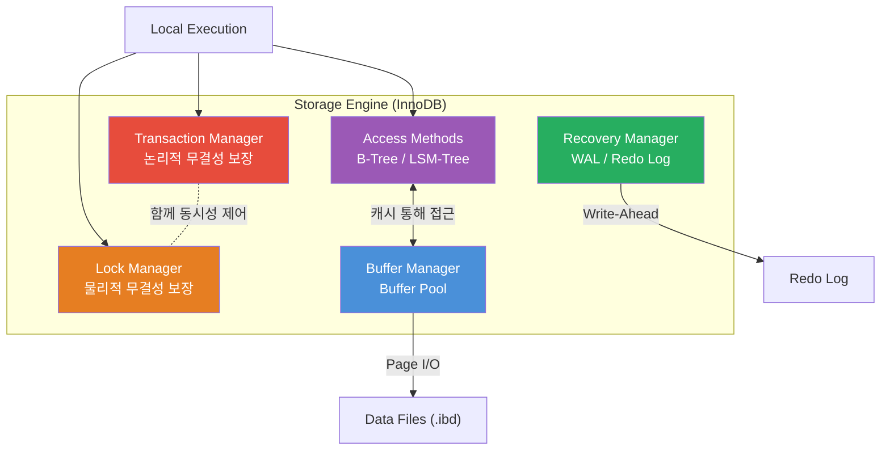

# Phase 1: DBMS 아키텍처 — Storage Engine은 어떻게 구성되는가

> 완료 기준: "쿼리가 들어와서 결과가 나올 때까지 어떤 컴포넌트를 거치는지 그림으로 설명 가능"

---

## 왜 이걸 알아야 하나?

`EXPLAIN`을 봐도 "왜 이 실행 계획이 나왔지?"를 모른다면, 쿼리 최적화는 찍기 게임이 된다.
DBMS 내부 컴포넌트 구조를 알면 **병목이 어디서 생기는지**, **트랜잭션이 왜 느려지는지** 구조적으로 설명할 수 있다.

---

## 1. DBMS 전체 아키텍처



쿼리 하나가 실행되는 경로:

```
클라이언트 SQL
  → Transport Layer  : 연결 수립, 프로토콜 처리 (MySQL의 경우 TCP 3306)
  → Query Processor  : SQL 파싱 → 실행 계획 수립 (Optimizer)
  → Execution Engine : 실행 계획을 실제로 수행
  → Storage Engine   : 데이터 읽기/쓰기 (InnoDB가 여기)
  → Disk             : Page 단위 I/O
```

각 레이어는 독립적이다. MySQL에서 Storage Engine을 InnoDB ↔ MyISAM으로 바꿀 수 있는 이유도 이 분리 구조 때문이다.

---

## 2. Transport Layer

DBMS는 client/server 모델로 동작한다. 클라이언트(애플리케이션)가 요청을 보내면 서버(DB 인스턴스, 즉 node)가 처리한다. Transport Layer는 이 요청이 들어오고 나가는 관문이다.

Transport Layer는 두 가지 통신을 담당한다.

**Client Communication** — 애플리케이션에서 오는 SQL 쿼리를 받는다. MySQL Wire Protocol, PostgreSQL Frontend/Backend Protocol 같은 DB 전용 프로토콜로 통신한다. 연결 수립, 인증, 세션 관리가 여기서 이루어진다.

**Cluster Communication** — 분산 DB 환경에서 다른 노드와 통신한다. 복제(replication), 분산 쿼리 처리, 노드 간 데이터 전송이 이 채널을 통한다.

쿼리가 도착하면 Transport Layer는 쿼리를 Query Processor에 넘긴다. 접근 제어(Access Control) 검사는 Parser가 쿼리의 의미를 해석한 이후에 이루어진다. 어떤 테이블과 컬럼에 접근하는지 알아야 권한 검사를 할 수 있기 때문이다.

**Connection Pool이 왜 중요한가?**

```
연결 수립 비용 = TCP Handshake + 인증 + 세션 초기화
               ≈ 수 ms ~ 수십 ms

쿼리 실행 자체: 수백 µs ~ 수 ms (캐시 히트 시)
```

연결 수립이 쿼리 실행보다 오래 걸릴 수 있다. 요청마다 새 연결을 맺으면 이 비용이 계속 누적된다. Connection Pool은 연결을 미리 만들어두고 재사용해서 이 비용을 제거한다. Connection Pool이 고갈되면 새 요청이 연결을 기다리다 타임아웃이 나는데, 이것이 대표적인 운영 장애 원인이다.

---

## 3. Query Processor

SQL을 받아서 실행 계획으로 변환하는 레이어다. 3단계로 구성된다.



### Parser

SQL 문자열을 받아서 파싱하고 검증한다. 구문 오류(syntactic)와 의미 오류(semantic) 모두 여기서 잡힌다. 구문 오류는 SQL 키워드가 잘못 쓰인 경우이고, 의미 오류는 존재하지 않는 테이블이나 컬럼을 참조하는 경우다.

검증을 통과한 SQL은 **AST(Abstract Syntax Tree)**로 변환된다. 이 트리가 이후 Optimizer에 넘어가는 내부 표현이다. 사람이 읽는 SQL 텍스트에서 DB가 다룰 수 있는 구조로 바뀌는 단계다.

파싱 이후 접근 제어(Access Control) 검사도 이 시점에 이루어진다. 쿼리의 의미를 해석해야 어떤 권한이 필요한지 판단할 수 있기 때문이다.

### Optimizer

Optimizer는 DBMS에서 가장 복잡한 컴포넌트 중 하나다. Parser에서 넘어온 AST를 받아서 두 가지 일을 한다.

첫째, **불가능하거나 중복된 연산을 제거한다.** 예를 들어 `WHERE 1=0` 같은 조건은 항상 거짓이므로 실행 자체를 생략할 수 있다.

둘째, **가장 효율적인 실행 계획을 찾는다.** 같은 결과를 내는 실행 방법이 여러 가지 있을 때, Optimizer는 내부 통계(index cardinality, 예상 row 수, 데이터 분포)를 기반으로 각 방법의 비용을 추정하고 가장 낮은 비용의 계획을 선택한다.

Optimizer가 다루는 선택지들:

- 각 테이블을 Full Scan으로 읽을 것인가, Index Scan으로 읽을 것인가
- Index Scan이라면 어떤 인덱스를 쓸 것인가
- JOIN이 있을 때 어떤 알고리즘을 쓸 것인가 (Nested Loop, Hash Join, Sort Merge Join)
- JOIN 순서는 어떻게 할 것인가 — Nested Loop에서는 순서가 성능에 큰 영향을 준다

이 과정은 **dependency tree** 형태로 표현된다. 각 연산이 어떤 연산에 의존하는지 트리 구조로 나타내고, Optimizer는 이 트리를 탐색하면서 최적 조합을 찾는다.

최종적으로 선택된 계획이 **execution plan (query plan)**이다. 실행해야 할 연산들의 순서와 방법이 담긴 명세서다.

**Optimizer가 틀릴 수 있는 이유:**
통계 정보는 실제 데이터 분포를 근사할 뿐이다. 통계가 오래됐거나 데이터 분포가 편향되어 있으면 잘못된 계획을 선택한다. `ANALYZE TABLE`로 통계를 갱신하거나 `FORCE INDEX`로 강제 변경할 수 있다 (Phase 6에서 상세히).

### Planner

Optimizer가 선택한 최적 실행 계획을 Execution Engine이 실제로 수행할 수 있는 형태로 변환한다. 논리적인 "무엇을 할지"를 물리적인 "어떻게 할지"로 바꾸는 단계다.

예를 들어 Optimizer가 "Index Scan 후 Nested Loop Join"을 선택했다면, Planner는 그 계획을 Execution Engine이 순서대로 호출할 수 있는 연산 트리로 직렬화한다. Execution Engine은 이 트리를 위에서 아래로 실행한다.

---

## 4. Execution Engine

Optimizer가 만든 execution plan을 실제로 실행하는 컴포넌트다.

Execution Engine은 **Local Execution**과 **Remote Execution** 두 가지를 담당한다.

Local Execution은 현재 노드에서 직접 처리하는 쿼리다. Storage Engine API를 호출해서 데이터를 읽어오고, JOIN, SORT, AGGREGATION 같은 연산을 수행한 뒤 결과를 클라이언트에 돌려준다.

Remote Execution은 분산 DB 환경에서 다른 노드에 있는 데이터를 읽거나 쓰는 경우다. 다른 노드로 하위 쿼리를 보내고 결과를 모아서 합친다.

Execution Engine이 Storage Engine을 어떻게 다루는지가 중요하다. Execution Engine은 Storage Engine의 내부 구현을 전혀 모른다. "이 row 줘", "이 row 써" 같은 단순한 API만 호출한다. 이 분리 덕분에 MySQL에서 InnoDB, MyISAM, RocksDB 같은 Storage Engine을 교체해도 Execution Engine 코드는 바뀌지 않는다.

결과적으로 Execution Engine의 성능은 두 가지에 달려 있다. Buffer Pool이 클수록 Storage Engine의 I/O가 줄어서 빠르다. Lock 경쟁이 심할수록 동시에 실행 가능한 연산 수가 줄어서 느려진다.

---

## 5. Storage Engine 내부 구조

Local Execution에서 실제로 데이터를 읽고 쓰는 레이어다. InnoDB가 여기에 해당한다. 5개의 컴포넌트로 구성된다.



### Transaction Manager

트랜잭션을 스케줄링하고 DB가 논리적으로 일관된 상태를 유지하도록 보장한다. 트랜잭션 시작/커밋/롤백을 관리하고, Isolation Level에 따라 어떤 데이터 버전을 보여줄지 결정한다. MVCC(Multi-Version Concurrency Control)가 여기서 조율된다 → Phase 4에서 상세히.

### Lock Manager

실행 중인 트랜잭션을 위해 DB 오브젝트에 Lock을 걸어서 물리적 데이터 무결성을 보장한다. 동시에 실행되는 연산들이 서로 충돌하지 않도록 제어한다.

Transaction Manager와 Lock Manager는 함께 **동시성 제어(Concurrency Control)**를 책임진다. Transaction Manager가 논리적 무결성(트랜잭션 간 격리)을, Lock Manager가 물리적 무결성(실제 데이터 블록 보호)을 각각 담당하고, 둘이 협력해서 완전한 동시성 제어를 구현한다.

Lock의 종류: Row Lock, Gap Lock, Next-Key Lock, Table Lock. Deadlock 감지 및 victim 선택도 Lock Manager의 역할이다.

### Access Methods

디스크에서 데이터를 실제로 읽고 쓰는 방법을 구현한다. Heap file(정렬 없이 순서대로 쌓는 파일), B-Tree, LSM-Tree 같은 스토리지 구조가 여기에 속한다. Execution Engine은 "이 키로 row 찾아줘"라고 요청하고, Access Methods가 어떤 구조에서 어떻게 찾을지를 처리한다. B-Tree는 Phase 2에서, LSM-Tree는 Phase 3에서 상세히 다룬다.

### Buffer Manager

Phase 0에서 다룬 **Buffer Pool**이 여기에 있다. Disk에서 Page를 읽어서 메모리에 캐싱하고, Access Methods가 데이터를 요청하면 디스크 대신 메모리에서 제공한다. Dirty Page 관리, LRU 기반 페이지 교체, 캐시 eviction 정책을 담당한다.

### Recovery Manager

장애 발생 시 DB를 일관된 상태로 복구하기 위해 **[WAL(Write-Ahead Log)](../glossary/wal.md)**을 유지한다. 데이터를 디스크에 쓰기 전에 Redo Log에 먼저 기록하는 것이 핵심 원칙이다. Crash 후 재시작 시 Redo Log를 재적용해서 복구한다. Checkpoint로 복구 범위를 줄인다 → Phase 5에서 상세히.

---

## 6. Row-oriented vs Column-oriented

같은 DBMS 아키텍처라도 데이터를 디스크에 배치하는 방식이 다르다.

```
Row-oriented (InnoDB, PostgreSQL)
┌──────────────────────────────────────────┐
│ id=1, name="Alice", age=30, dept="Eng"  │  ← 한 row가 연속으로 저장
│ id=2, name="Bob",   age=25, dept="Mkt"  │
│ id=3, name="Carol", age=28, dept="Eng"  │
└──────────────────────────────────────────┘

Column-oriented (ClickHouse, Redshift, BigQuery)
┌──────────────────────────────────────────┐
│ id:   1, 2, 3                           │  ← 같은 컬럼끼리 연속으로 저장
│ name: Alice, Bob, Carol                 │
│ age:  30, 25, 28                        │
│ dept: Eng, Mkt, Eng                     │
└──────────────────────────────────────────┘
```

Row-oriented는 특정 row 전체를 읽을 때 유리하다. `SELECT * WHERE id = 1`처럼 한 건의 레코드를 통째로 읽는 OLTP 패턴이 여기에 맞다. row 단위로 연속 저장되어 있어서 CRUD가 효율적이다.

Column-oriented는 특정 컬럼만 대량으로 읽을 때 유리하다. `SELECT AVG(age) FROM users`처럼 수백만 행에서 컬럼 몇 개만 집계하는 OLAP 패턴이 여기에 맞다. 필요한 컬럼만 읽고 압축률도 높다.

MySQL InnoDB는 Row-oriented다. OLTP 워크로드에 최적화되어 있다.

---

## 7. In-memory DB vs Disk-based DB

Disk-based DB (InnoDB)는 데이터가 기본적으로 디스크에 있고, 자주 쓰는 Page만 Buffer Pool에 올린다. WAL + Data Files로 내구성이 기본 보장되고, 디스크 크기만큼 용량을 쓸 수 있다. 속도는 µs ~ ms 수준이다.

In-memory DB (Redis, VoltDB)는 데이터가 메모리에 있다. 속도는 ns ~ µs 수준으로 훨씬 빠르지만, 메모리 크기가 용량 한계다. 내구성을 위해 별도 설정이 필요하다.

In-memory DB도 내구성을 위해 WAL이나 스냅샷을 디스크에 쓰는 경우가 많다 (Redis AOF/RDB).

---

## 실습

### 실습 1: Storage Engine 목록 확인
```sql
SHOW ENGINES;
```
> 📷 **[직접 실행 결과 캡쳐 첨부]**

### 실습 2: 테이블별 Storage Engine 확인
```sql
SELECT TABLE_NAME, ENGINE
FROM information_schema.TABLES
WHERE TABLE_SCHEMA = 'your_database_name';
```
> 📷 **[직접 실행 결과 캡쳐 첨부]**

### 실습 3: EXPLAIN으로 실행 계획 확인
```sql
-- 인덱스 없는 컬럼 조회
EXPLAIN SELECT * FROM your_table WHERE non_indexed_column = 'value';

-- 인덱스 있는 컬럼 조회
EXPLAIN SELECT * FROM your_table WHERE indexed_column = 'value';
```
> 📷 **[두 결과 비교 캡쳐 첨부 — type, key, rows 컬럼에 집중]**

### 실습 4: Connection 상태 확인
```sql
SHOW STATUS LIKE 'Threads_%';
SHOW STATUS LIKE 'Connection%';
```
> 📷 **[직접 실행 결과 캡쳐 첨부]**

---

## 체크리스트

- [ ] DBMS 4개 레이어(Transport → Query Processor → Execution Engine → Storage Engine)를 순서대로 말할 수 있다
- [ ] Optimizer가 실행 계획을 잘못 선택하는 원인을 설명할 수 있다
- [ ] Storage Engine 내부 4개 Manager(Transaction / Lock / Buffer / Recovery)의 역할을 각각 한 문장으로 설명할 수 있다
- [ ] Row-oriented와 Column-oriented의 차이를 workload 관점에서 설명할 수 있다
- [ ] `SHOW ENGINES`로 InnoDB 외 어떤 Storage Engine이 있는지 직접 확인했다
- [ ] `EXPLAIN`에서 `type`, `key`, `rows` 컬럼이 무엇을 의미하는지 설명할 수 있다

---

## 다음 단계

Phase 2: [B-Tree 내부 구조](db-btree-internals.md)
- Storage Engine이 데이터를 어떤 자료구조로 구성하는가
- Page와 B-Tree 노드는 어떻게 맞물리는가
