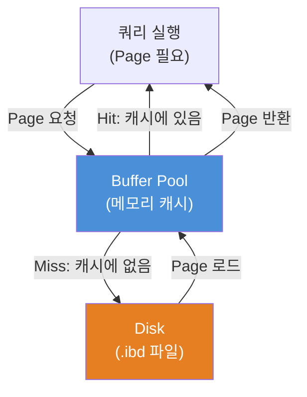
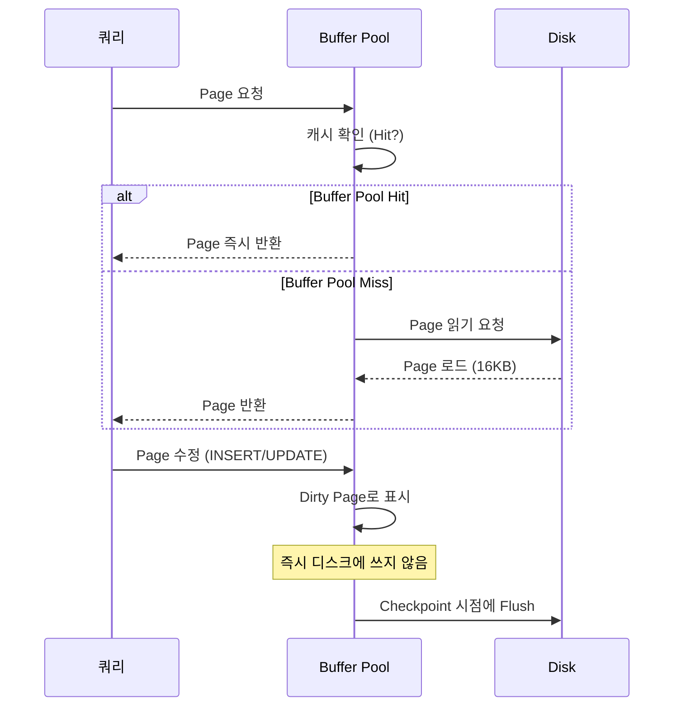
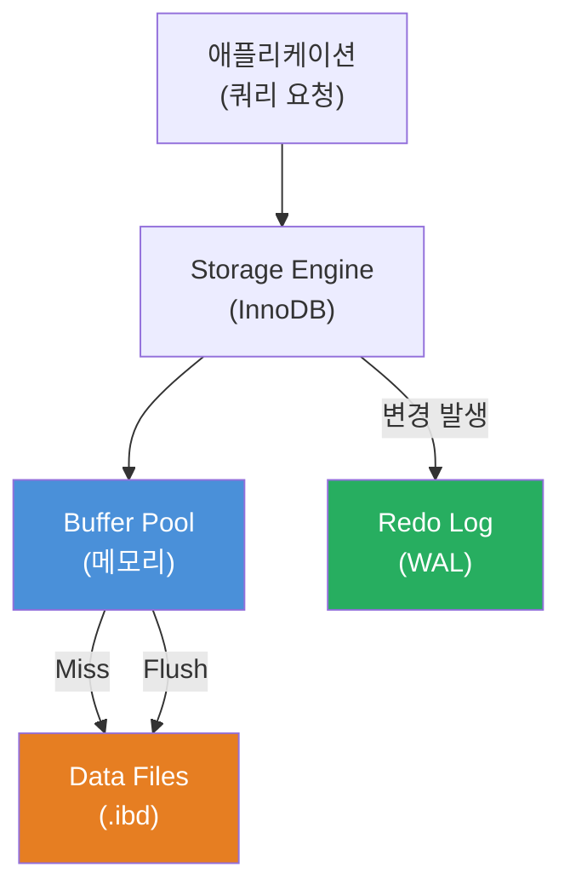

# Phase 0: 스토리지 기초 — 데이터는 디스크에 어떻게 저장되는가

> 완료 기준: "Page가 뭔지, Buffer Pool이 왜 필요한지 동료에게 5분 설명 가능"

---

## 왜 이걸 먼저 알아야 하나?

인덱스, 트랜잭션, 쿼리 최적화 — 모든 DB 내부 동작의 기반은 "디스크에서 데이터를 어떻게 읽고 쓰는가"에 있다.
이 구조를 모르면 `EXPLAIN` 결과를 봐도 왜 느린지 근본 원인을 설명하지 못한다.

---

## 1. Disk I/O가 왜 병목인가

```
CPU 연산:      ~1 ns
메모리 접근:   ~100 ns
SSD 읽기:      ~100 µs   (메모리보다 1,000배 느림)
HDD 읽기:      ~10 ms    (메모리보다 100,000배 느림)
```

DB의 데이터는 결국 디스크에 있다. 쿼리가 느린 이유의 대부분은 **CPU가 아니라 Disk I/O**다.

그래서 DB 설계의 핵심 목표는 하나다: **디스크를 최대한 적게, 효율적으로 읽는다.**

---

## 2. Page — DB의 기본 I/O 단위

디스크는 물리적으로 데이터를 **블록(block)** 단위로 읽고 쓴다. 1바이트만 필요해도 블록 하나를 통째로 읽어야 한다.

DB는 이 특성을 활용해서 자체적인 단위인 **Page**를 정의한다.

```
┌─────────────────────────────────────────┐
│              Disk Block                 │  ← OS/하드웨어 단위 (보통 512B ~ 4KB)
└─────────────────────────────────────────┘

┌─────────────────────────────────────────┐
│               DB Page                   │  ← DB가 정의한 단위 (InnoDB 기본: 16KB)
│  ┌──────┐ ┌──────┐ ┌──────┐ ┌──────┐  │
│  │ row  │ │ row  │ │ row  │ │ row  │  │
│  └──────┘ └──────┘ └──────┘ └──────┘  │
└─────────────────────────────────────────┘
```

**왜 바이트 단위가 아닌 Page 단위인가?**

- 디스크 I/O는 요청 횟수가 비용이다. 1바이트를 읽든 16KB를 읽든 I/O 1회 비용은 거의 같다.
- 어차피 한 번 디스크에 접근할 때 Page 통째로 읽어오면, 근처 row를 조회할 때 추가 I/O 없이 재사용할 수 있다.
- 인덱스 구조(B-Tree)도 Page 단위로 노드를 구성한다 → Phase 1에서 다룸

MySQL InnoDB의 기본 Page 크기는 **16KB**다.

```sql
SHOW VARIABLES LIKE 'innodb_page_size';
-- 결과: 16384 (bytes = 16KB)
```

---

## 3. Random I/O vs Sequential I/O

디스크 I/O에는 두 종류가 있고, 성능 차이가 크다.

```
Sequential I/O (순차 읽기)
┌──┬──┬──┬──┬──┬──┬──┬──┐
│P1│P2│P3│P4│P5│P6│P7│P8│  ← 연속된 Page를 순서대로 읽음
└──┴──┴──┴──┴──┴──┴──┴──┘
   →→→→→→→→→→→→→→→→

Random I/O (랜덤 읽기)
┌──┬──┬──┬──┬──┬──┬──┬──┐
│P1│  │P3│  │  │P6│  │P8│  ← 흩어진 Page를 각각 읽음
└──┴──┴──┴──┴──┴──┴──┴──┘
   ↗        ↗     ↗    ↗   (헤드 이동 비용 발생 — HDD에서 특히 심각)
```

- **Full Table Scan**: Sequential I/O → 데이터가 많아도 예측 가능한 속도
- **Index Scan (비효율적)**: Random I/O → 인덱스가 있어도 느릴 수 있음

"인덱스가 있는데 왜 Full Scan이 더 빠르지?"라는 상황이 생기는 이유가 여기에 있다.
Selectivity가 낮은 인덱스 → Random I/O가 너무 많이 발생 → Full Scan이 오히려 빠름.

---

## 4. Buffer Pool — 디스크를 덜 읽기 위한 핵심 장치

매번 디스크에서 Page를 읽으면 느리다. 그래서 DB는 **메모리에 Page 캐시**를 둔다. 이게 **Buffer Pool**이다.



**Buffer Pool Hit** — 디스크 접근 없이 메모리에서 바로 반환. 빠름.
**Buffer Pool Miss** — 디스크에서 Page를 읽어서 Buffer Pool에 올린 후 반환. 느림.

따라서 **Buffer Pool 크기 = DB 성능에 직접적인 영향**.

MySQL InnoDB 기본값은 128MB인데, 실제 운영 환경에서는 가용 메모리의 70~80%까지 잡는 게 일반적이다.

```sql
SHOW VARIABLES LIKE 'innodb_buffer_pool_size';
-- 기본값: 134217728 (128MB)
```

---

## 5. Page의 생애주기



**Dirty Page**: 메모리에서 수정됐지만 아직 디스크에 반영되지 않은 Page.
DB는 성능을 위해 수정 즉시 디스크에 쓰지 않는다. 대신 주기적으로 묶어서 씀 (Checkpoint).
이 구조가 Crash Recovery와 연결된다 → Phase 4에서 다룸.

---

## 6. 전체 그림



---

## 실습

### 실습 1: InnoDB Page 크기 확인
```sql
SHOW VARIABLES LIKE 'innodb_page_size';
SHOW VARIABLES LIKE 'innodb_buffer_pool_size';
```

### 실습 2: Buffer Pool 상태 확인
```sql
SHOW ENGINE INNODB STATUS\G
-- "BUFFER POOL AND MEMORY" 섹션 확인
-- Buffer pool hit rate가 얼마인지 본다 (정상: 999/1000 이상)
```

### 실습 3: .ibd 파일 크기 관찰
```bash
# MySQL 데이터 디렉토리에서 실제 파일 확인
ls -lh /var/lib/mysql/{database_name}/
# .ibd 파일이 16KB 배수로 증가하는 것을 확인
```

### 실습 4: Buffer Pool 크기 변경 후 성능 비교
```sql
-- 테스트 테이블 생성 후 대량 데이터 삽입
-- Buffer Pool을 작게 줄였을 때 vs 크게 늘렸을 때 쿼리 시간 비교
SET GLOBAL innodb_buffer_pool_size = 32 * 1024 * 1024;  -- 32MB로 줄이기
```

---

## 체크리스트

- [ ] `innodb_page_size`가 16384인 것을 직접 확인했다
- [ ] Buffer Pool hit rate를 `SHOW ENGINE INNODB STATUS`에서 찾았다
- [ ] "왜 Page 단위인가"를 한 문장으로 설명할 수 있다
- [ ] "Buffer Pool Miss가 왜 느린가"를 설명할 수 있다

---

## 다음 단계

Phase 1: [B-Tree vs LSM-Tree](db-btree-vs-lsmtree.md)
- Page들이 어떤 자료구조로 구성되는가
- 왜 MySQL은 B-Tree를 선택했는가
