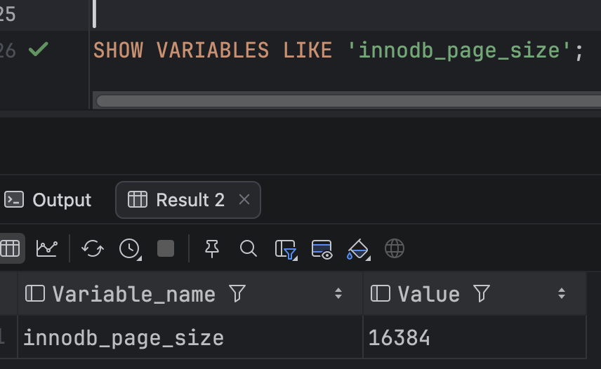
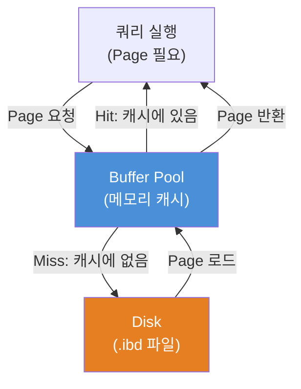
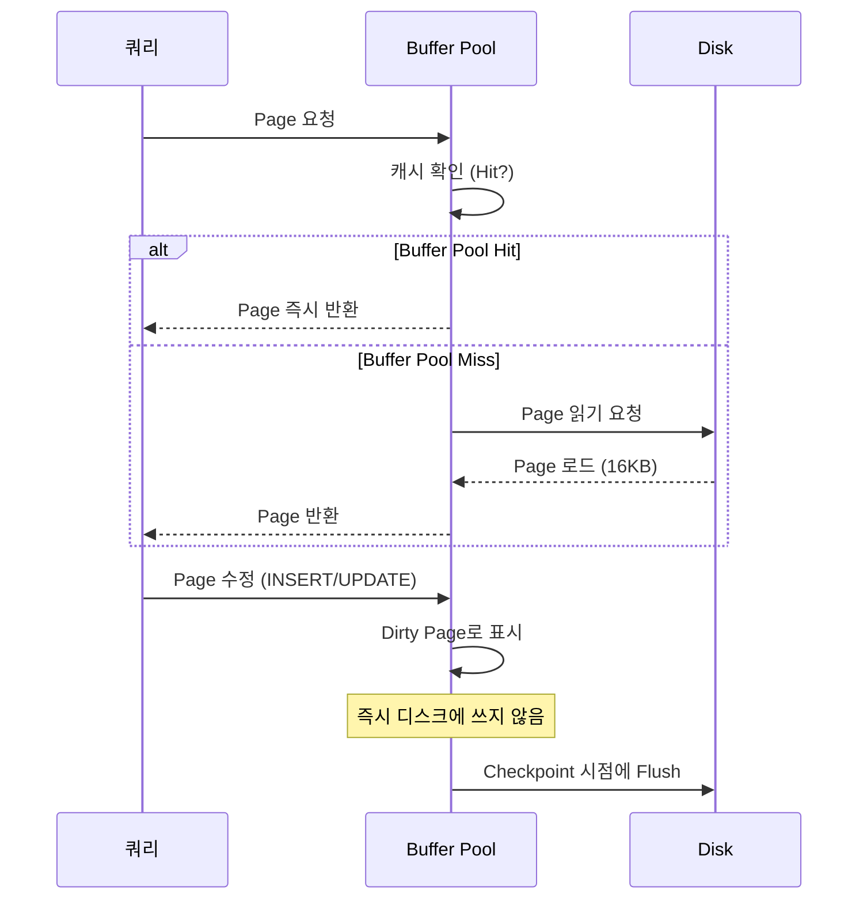
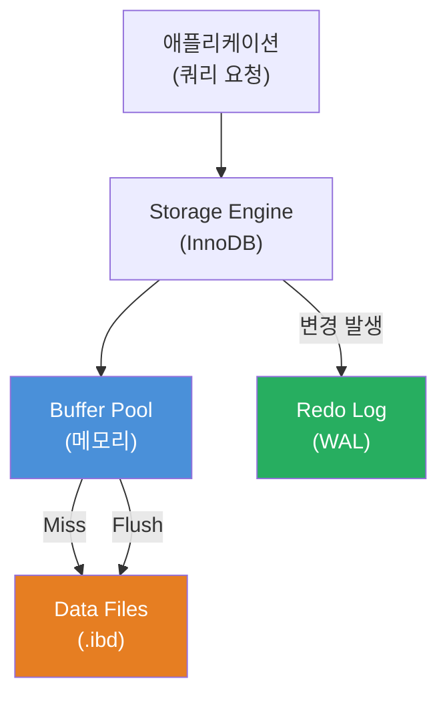

# Phase 0: 스토리지 기초 — 데이터는 디스크에 어떻게 저장되는가

> 완료 기준: "Page가 뭔지, Buffer Pool이 왜 필요한지 동료에게 5분 설명 가능"

---

## 왜 이걸 먼저 알아야 하나?

인덱스, 트랜잭션, 쿼리 최적화 — 모든 DB 내부 동작의 기반은 "디스크에서 데이터를 어떻게 읽고 쓰는가"에 있다.
이 구조를 모르면 `EXPLAIN` 결과를 봐도 왜 느린지 근본 원인을 설명하지 못한다.

---

## 1. Disk I/O가 왜 병목인가

```
CPU 연산:      ~1 ns
메모리 접근:   ~100 ns
SSD 읽기:      ~100 µs   (메모리보다 1,000배 느림)
HDD 읽기:      ~10 ms    (메모리보다 100,000배 느림)
```

DB의 데이터는 결국 디스크에 있다. 쿼리가 느린 이유의 대부분은 **CPU가 아니라 Disk I/O**다.

그래서 DB 설계의 핵심 목표는 하나다: **디스크를 최대한 적게, 효율적으로 읽는다.**

그 목표를 달성하기 위해 DB는 두 가지 전략을 쓴다 — 한 번 읽을 때 크게 묶어서 읽고(Page), 자주 쓰는 건 메모리에 캐시해둔다(Buffer Pool). 2번과 3번이 각각 그 이야기다.

---

## 2. Page — DB의 기본 I/O 단위

디스크 I/O의 핵심 특성이 하나 있다: **"얼마나 많이 읽냐"가 아니라 "몇 번 읽냐"가 비용이다.**

HDD는 헤드가 해당 위치로 이동하는 seek time이 I/O 비용의 대부분이다. 실제 데이터 전송 시간은 그것에 비하면 미미하다. SSD도 I/O 요청 자체의 레이턴시가 지배적이다. 결론: **4KB를 읽든 16KB를 읽든 I/O 1회 비용은 거의 같다.**

DB는 이 특성을 이용한다. 어차피 비용이 같다면, 한 번 읽을 때 더 많이 묶어서 읽어오는 게 이득이다. 그래서 DB는 자체적인 단위인 **Page**를 정의하고, 항상 Page 단위로 읽고 쓴다.

```
┌─────────────────────────────────────────┐
│              Disk Block                 │  ← OS/하드웨어 단위 (보통 512B ~ 4KB)
└─────────────────────────────────────────┘

┌─────────────────────────────────────────┐
│               DB Page                   │  ← DB가 정의한 단위 (InnoDB 기본: 16KB)
│  ┌──────┐ ┌──────┐ ┌──────┐ ┌──────┐  │
│  │ row  │ │ row  │ │ row  │ │ row  │  │
│  └──────┘ └──────┘ └──────┘ └──────┘  │
└─────────────────────────────────────────┘
```

**왜 Page 크기를 16KB로 정했는가?**

어차피 I/O 1회 비용이 같다면, 한 번 읽을 때 더 많이 읽어오는 게 이득이다. 하지만 무작정 크게 하면 안 된다:

| Page 크기 | 문제 |
|-----------|------|
| 너무 작음 (4KB) | row 하나 읽었는데 근처 row 조회 시 또 I/O 발생 |
| 너무 큼 (1MB) | row 1개 때문에 1MB를 Buffer Pool(메모리)에 올려야 함 → 메모리 낭비 |
| **16KB (InnoDB 기본)** | row 여러 개를 한 번에 올리고, 근처 row 재사용 — I/O 최소화 + 메모리 효율 균형 |

16KB는 1990년대 말 InnoDB 설계 당시 서버 메모리(256MB~1GB)와 일반적인 row 크기(수백 바이트)를 기준으로 실험적으로 정착된 값이다. PostgreSQL은 8KB, SQL Server는 8KB로 DB마다 다르지만, 이후 메모리가 충분히 저렴해지면서 InnoDB의 16KB가 균형점으로 검증됐다.

**핵심 정리:**
- Disk Block은 하드웨어가 강제하는 최소 단위 (DB가 선택할 수 없음)
- DB Page는 그 위에서 DB가 효율을 위해 선택한 단위 (I/O 횟수를 줄이기 위한 전략)
- 인덱스 구조(B-Tree)도 Page 단위로 노드를 구성한다 — B-Tree가 Page와 어떻게 맞물리는지는 Phase 1에서 다루지만, 지금은 "Page 하나 = 인덱스 트리의 노드 하나"라는 것만 기억해두면 된다

MySQL InnoDB의 기본 Page 크기는 **16KB**다.

```sql
SHOW VARIABLES LIKE 'innodb_page_size';
```
> 

---

## 3. Random I/O vs Sequential I/O

디스크 I/O에는 두 종류가 있고, 성능 차이가 크다.

```
Sequential I/O (순차 읽기)
┌──┬──┬──┬──┬──┬──┬──┬──┐
│P1│P2│P3│P4│P5│P6│P7│P8│  ← 연속된 Page를 순서대로 읽음
└──┴──┴──┴──┴──┴──┴──┴──┘
   →→→→→→→→→→→→→→→→

Random I/O (랜덤 읽기)
┌──┬──┬──┬──┬──┬──┬──┬──┐
│P1│  │P3│  │  │P6│  │P8│  ← 흩어진 Page를 각각 읽음
└──┴──┴──┴──┴──┴──┴──┴──┘
   ↗        ↗     ↗    ↗   (헤드 이동 비용 발생 — HDD에서 특히 심각)
```

- **Full Table Scan**: Sequential I/O → 데이터가 많아도 예측 가능한 속도
- **Index Scan (비효율적)**: Random I/O → 인덱스가 있어도 느릴 수 있음

**"인덱스가 있는데 왜 Full Scan이 더 빠르지?"**

이게 처음엔 직관에 반한다. 이유는 **Selectivity(선택도)** 개념으로 설명된다.

Selectivity = 인덱스 조건이 전체 row 중 얼마나 걸러내는가.

```
Selectivity 높음 (인덱스가 유리한 경우)
  SELECT * FROM orders WHERE order_id = 9999;
  → 1억 건 중 1건만 반환 → Random I/O 1회 → 인덱스가 압도적으로 유리

Selectivity 낮음 (Full Scan이 유리한 경우)
  SELECT * FROM orders WHERE status = 'PENDING';
  → 1억 건 중 3,000만 건 반환
  → 인덱스를 타면: 3,000만 번 Random I/O (각각 다른 Page로 점프)
  → Full Scan이면: Page를 처음부터 끝까지 Sequential I/O 1회
  → Full Scan이 오히려 빠름
```

MySQL 옵티마이저는 이 판단을 통계 기반으로 자동으로 한다. `EXPLAIN`에서 `type: ALL`(Full Scan)이 나올 때 무조건 나쁜 게 아니라, Selectivity가 낮아서 옵티마이저가 의도적으로 선택한 경우일 수 있다.

---

## 4. Buffer Pool — 디스크를 덜 읽기 위한 핵심 장치

매번 디스크에서 Page를 읽으면 느리다. 그래서 DB는 **메모리에 Page 캐시**를 둔다. 이게 **Buffer Pool**이다.



**Buffer Pool Hit** — 디스크 접근 없이 메모리에서 바로 반환. 빠름.
**Buffer Pool Miss** — 디스크에서 Page를 읽어서 Buffer Pool에 올린 후 반환. 느림.

따라서 **Buffer Pool 크기 = DB 성능에 직접적인 영향**.

MySQL InnoDB 기본값은 128MB다. 실제 운영 환경에서는 가용 메모리의 **70~80%** 를 잡는 게 일반적인 권장값이다.

왜 70~80%인가? 100%를 주면 안 되는 이유가 있다:

```
서버 메모리 = Buffer Pool + 나머지
                              ├── OS 커널
                              ├── MySQL 프로세스 자체 (연결 관리, 정렬 버퍼 등)
                              ├── Redo Log 버퍼
                              └── 기타 스레드 스택

→ Buffer Pool에 100% 주면 OS와 MySQL 자체가 메모리 부족으로 죽음
→ 70~80%는 "Buffer Pool에 최대한 주되, 나머지가 굶지 않는" 경험적 균형점
```

```sql
SHOW VARIABLES LIKE 'innodb_buffer_pool_size';
```
> 📷 **[직접 실행 결과 캡쳐 첨부]**

---

## 5. Page의 생애주기



**Dirty Page**: 메모리에서 수정됐지만 아직 디스크에 반영되지 않은 Page.

DB는 수정이 발생해도 즉시 디스크에 쓰지 않는다. 왜냐하면:

```
row 1건 수정 → 즉시 디스크 쓰기
row 2건 수정 → 즉시 디스크 쓰기
row 3건 수정 → 즉시 디스크 쓰기
...
→ 수정 1번마다 Disk I/O 1번 → 너무 느림

대신:
수정 발생 → 메모리(Buffer Pool)에만 반영 → Dirty Page로 표시
수정 발생 → 메모리에만 반영 → Dirty Page
...
→ Checkpoint 시점에 Dirty Page 모아서 한 번에 디스크에 씀 → I/O 횟수 최소화
```

단, 여기서 문제가 생긴다. 메모리에만 있는 수정 내용이 서버가 갑자기 꺼지면 사라진다.
이걸 막기 위해 **Redo Log(WAL)** 가 존재한다 — 수정 내용을 디스크의 로그 파일에 먼저 순차적으로 기록해두고, 장애 시 이 로그로 복구한다. 이 구조가 Crash Recovery의 핵심이다 → Phase 4에서 상세히 다룬다.

---

## 6. 전체 그림



**Storage Engine**은 MySQL에서 실제 데이터를 읽고 쓰는 역할을 담당하는 레이어다. MySQL은 쿼리 파싱/실행 계획까지만 담당하고, 실제 디스크 I/O는 Storage Engine에 위임한다. InnoDB가 기본이며, 트랜잭션·Buffer Pool·Redo Log를 모두 Storage Engine이 관리한다.

**`.ibd` 파일**은 InnoDB가 테이블 데이터와 인덱스를 저장하는 실제 디스크 파일이다. 테이블마다 하나씩 생성된다(`테이블명.ibd`). 내부는 16KB Page의 연속으로 구성되어 있고, Buffer Pool에 올라오는 Page가 결국 이 파일에서 읽혀온다.

흐름을 읽는 방법:

1. **쿼리 진입** — 애플리케이션이 쿼리를 보내면 InnoDB Storage Engine이 받는다.
2. **Buffer Pool 확인** — Storage Engine은 먼저 메모리(Buffer Pool)를 뒤진다. 원하는 Page가 있으면 디스크를 건드리지 않는다.
3. **Cache Miss → 디스크 읽기** — Page가 없으면(Miss) `.ibd` 파일에서 Page를 읽어 Buffer Pool에 올린다.
4. **변경은 메모리에 먼저** — UPDATE/DELETE 등 변경이 생기면 Buffer Pool의 Page를 수정하고 Dirty Page로 표시한다. 디스크는 아직 건드리지 않는다.
5. **WAL 선기록** — 변경과 동시에 Redo Log에 "무엇을 바꿨다"는 로그를 순차 기록한다. 서버가 꺼져도 이 로그로 복구할 수 있다.
6. **Flush** — Checkpoint 시점에 Dirty Page를 모아 `.ibd`에 한 번에 쓴다. 여기서 랜덤 I/O가 발생하지만, 모아서 쓰기 때문에 횟수가 줄어든다.

핵심 트레이드오프: **쓰기 성능(메모리 버퍼링)** vs **내구성(WAL)** 을 동시에 잡는 구조다.


---

## 실습

### 실습 1: InnoDB Page 크기 확인
```sql
SHOW VARIABLES LIKE 'innodb_page_size';
SHOW VARIABLES LIKE 'innodb_buffer_pool_size';
```
> 📷 **[직접 실행 결과 캡쳐 첨부]**

### 실습 2: Buffer Pool 상태 확인
```sql
SHOW ENGINE INNODB STATUS\G
```
> 📷 **["BUFFER POOL AND MEMORY" 섹션 캡쳐 첨부 — Buffer pool hit rate 수치 포함]**

### 실습 3: .ibd 파일 크기 관찰
```bash
ls -lh /var/lib/mysql/{database_name}/
```
> 📷 **[.ibd 파일 목록 캡쳐 첨부 — 파일 크기가 16KB 배수인지 확인]**

### 실습 4: Buffer Pool 크기 변경 후 성능 비교
```sql
SET GLOBAL innodb_buffer_pool_size = 32 * 1024 * 1024;  -- 32MB로 줄이기
```
> 📷 **[Buffer Pool 축소 전/후 쿼리 실행 시간 비교 캡쳐 첨부]**

---

## 체크리스트

- [ ] `innodb_page_size`가 16384인 것을 직접 확인했다
- [ ] Buffer Pool hit rate를 `SHOW ENGINE INNODB STATUS`에서 찾았다
- [ ] "왜 Page 단위인가"를 한 문장으로 설명할 수 있다
- [ ] "Buffer Pool Miss가 왜 느린가"를 설명할 수 있다
- [ ] "Selectivity가 낮으면 왜 Full Scan이 더 빠른가"를 설명할 수 있다
- [ ] "Dirty Page를 즉시 디스크에 쓰지 않는 이유"를 설명할 수 있다

---

## 다음 단계

Phase 1: [B-Tree vs LSM-Tree](db-btree-vs-lsmtree.md)
- Page들이 어떤 자료구조로 구성되는가
- 왜 MySQL은 B-Tree를 선택했는가
