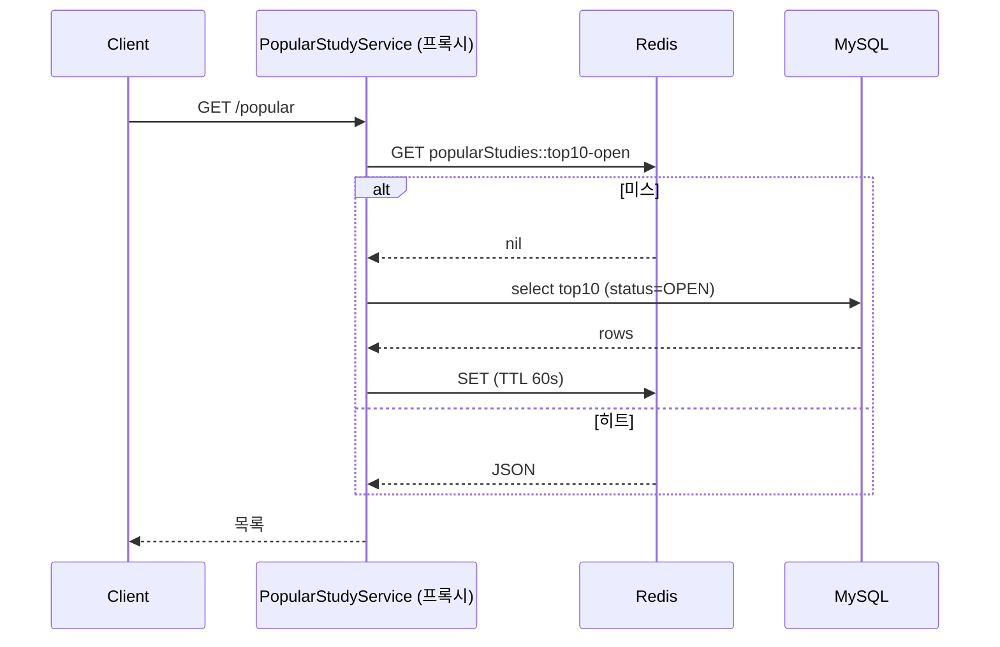
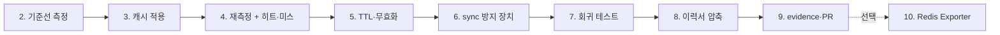

# 6주차 구현 가이드

`missions/README.md` Week 6 요구사항과 `studypass`(`/Users/jihochoi/Documents/dingco/challenge-backend-resume-2026-08-wlghsp-r17`) 현재 코드를 근거로 "무엇을 어떤 순서로 구현할지"만 정리한다. 실제 코드는 지호님이 직접 작성한다. 실행 결과·수치·판단 근거는 실제로 실행한 뒤 evidence와 prep-questions에 채운다.

`week6/prep-questions.md`의 답이 아직 비어 있다. 그래서 아래 "결정 사항"은 지호님이 판단을 Claude에게 위임해 정한 값이다. prep-questions에 답하면서 바꾸고 싶은 게 생기면 바꾸고, 바꾼 이유를 evidence에 남긴다. 위임했더라도 근거형 질문 답변은 지호님 말로 설명할 수 있어야 하므로, 각 결정의 이유를 prep-questions에서 한 번씩 직접 풀어 써 본다.

## 결정 사항

- 캐싱 방식: `@Cacheable`. 이유: 대상이 키 하나·읽기 전용 목록이고, `sync`·무효화·히트미스 지표가 Spring Cache 위에 이미 있다. `RedisTemplate`은 TTL·직렬화·동시 갱신 방어를 직접 짜야 해서 이 미션이 재려는 판단과 무관한 구현량만 늘어난다.
- TTL과 무효화: TTL 60초 + 신청 커밋 후 능동 무효화. 이유: `popular`이 바뀌는 쓰기 경로가 `enroll()` 하나라 무효화를 구현할 수 있고, 무효화 버그 시 최악의 경우를 TTL이 60초로 막는다. 60초는 출발값이며 4단계 실측 후 바꿀 수 있다.
- 방지할 문제: Hot Key의 만료 순간 stampede를 `sync = true`로 방어. 이유: 키가 하나라 penetration·avalanche는 해당하지 않고, 통과 기준(방지 장치 + 동작 확인)을 동시 요청 재현으로 충족할 수 있는 것이 이것뿐이다.
- 무효화 구현: 이벤트 발행 + `@TransactionalEventListener(AFTER_COMMIT)`. 이유: 트랜잭션 밖 호출 처리를 프레임워크가 해 준다.
- 이력서: 문장 1·4 제외, 2·3·5·6 + 6주차 문장. 이유: 전후 측정과 재현 가능한 근거가 있는 문장을 남긴다는 기준(8단계).

---

## 0. 현재 코드 상태 확인

- `StudyController.popular()`: `studyRepository.findTop10ByStatusOrderByEnrolledCountDesc("OPEN")`을 매 호출마다 실행한다. 주석에 "6주차 캐싱 대상 후보"라고 적혀 있다.
- `StudyRepository`: 위 메서드에 6주차 미션 주석이 있다.
- `schema.sql`의 `study` 테이블: `status`, `enrolled_count`에 인덱스가 없다. 이 쿼리는 전체 스캔 후 정렬이다. 다만 시드가 300건이라 DB 비용 자체는 작다. 캐시 전후 차이가 "DB 조회 수 1 → 0"으로는 선명해도, 응답 시간 차이는 5주차(178ms → 13.7ms)만큼 크지 않을 수 있다. 크지 않게 나와도 그대로 기록한다. 이게 정직한 측정값이고, 이력서 문장에도 그 수치 그대로 쓴다.
- `EnrollmentService.enroll()`: `study.enroll()`로 `enrolledCount`를 올린다. `popular` 결과가 바뀌는 유일한 쓰기 경로다(`EnrollmentOptimisticService`는 4주차 비교용이라 운영 경로가 아니다).
- `build.gradle`: `spring-boot-starter-data-redis`, `actuator`, `micrometer-registry-prometheus`가 이미 있다. 의존성 추가는 필요 없다.
- `application.yml`: `spring.data.redis`가 `localhost:6379`로 이미 잡혀 있고, `docker-compose.yml`에 `redis:7`이 있다.
- `QueryCountProbe`(5주차)가 그대로 재사용 가능하다. `generate_statistics: true`도 테스트·로컬 yml 둘 다 켜져 있다.
- **테스트 환경 주의**: `src/test/resources/application.yml`이 `RedisAutoConfiguration`을 exclude한다. 채점 러너에 Redis가 없기 때문이다. 이 설정은 건드리지 않는다. 그러면 테스트에서는 Spring Boot가 Redis 캐시 대신 인메모리(ConcurrentMap) 캐시로 자동 폴백한다. 회귀 테스트는 이 폴백 위에서 "캐시 로직(히트·무효화·동시성)"을 검증하고, TTL·직렬화·실제 Redis 동작은 로컬 수동 측정으로 확인한다. 이 경계를 evidence에 명시한다.

## 1단계: 브랜치

`submit/week-06__weekly-pr`을 만든다. 5주차 PR이 main에 머지됐는지 먼저 확인하고, 머지됐으면 main에서, 아니면 `submit/week-05__weekly-pr`에서 딴다(5주차 `QueryCountProbe`가 필요하다).

- [ ] 브랜치 생성 (`submit/week-06__weekly-pr`)

## 2단계: 캐시 적용 전 기준선 측정

미션 2번의 "같은 조건"을 지키려면 캐시 코드를 넣기 **전에** 먼저 재야 한다. 5주차에서 2단계를 먼저 한 것과 같은 이유다.

로컬로 띄운다(`docker compose up -d` → `./gradlew bootRun`). 조건은 고정한다: 같은 URL, 워밍업 1회 제외 후 연속 5회.

```bash
for i in 1 2 3 4 5 6; do
  curl -s -o /dev/null -w "call=$i status=%{http_code} time=%{time_total}s\n" \
    "http://localhost:8080/api/studies/popular"
done
```

첫 호출은 JIT·커넥션 워밍업이라 별도 처리한다(1주차에서 한 방식 그대로).

DB 조회 수는 두 가지로 센다.

- 콘솔 SQL 로그(`org.hibernate.SQL: debug`)에서 `from study ... where status=? order by enrolled_count desc limit 10` 형태의 select가 호출마다 찍히는지 눈으로 센다.
- 테스트에서 `QueryCountProbe.reset()` → 호출 → `queryCount()`. 이건 5단계 회귀 테스트에서 쓴다.

- [ ] 개선 전 응답 시간 5회 기록
- [ ] 호출 1회당 DB 조회 수 확인 (예측: 1건)

### 측정 기록 (evidence용 — 여기에 채움)

```
조건: GET /api/studies/popular, studies 300건, 워밍업 1회 제외 5회
응답 시간:
호출당 DB 조회 수:
```

## 3단계: 캐싱 방식과 키 설계

미션 1번(필수)이다. prep-questions 1번의 `RedisTemplate` vs `@Cacheable` 판단에 대한 제안은 `@Cacheable`이다.

- 캐시 대상이 키 하나(인기 TOP10), 값이 읽기 전용 목록이라 직접 `RedisTemplate`을 다룰 이유가 적다.
- 4단계 방지 장치(`sync = true`), 무효화(`@CacheEvict`/캐시 API), 히트·미스 지표(Boot의 캐시 메트릭)가 모두 Spring Cache 추상화 위에 이미 있다.
- `RedisTemplate`을 택하면 TTL, 직렬화, 히트·미스 카운트, 동시 갱신 방어를 전부 직접 짜야 한다. 이 미션이 재려는 것은 그 구현량이 아니라 판단이다.

구현 시 걸리는 점 세 가지.

1. **`@Cacheable`은 프록시를 거쳐야 동작한다.** `StudyController.popular()` 안에서 private 메서드로 호출하면 안 먹는다. 계산 로직을 별도 서비스(예: `PopularStudyService`)로 빼고 거기에 `@Cacheable`을 붙인다. 컨트롤러는 이 서비스를 호출만 한다. 응답 형식(`toSummary`)은 바꾸지 않는다.
2. **캐시에 엔티티를 넣지 않는다.** `Study` 엔티티는 지연 로딩·프록시·직렬화 문제가 있다. 지금 컨트롤러가 이미 `List<Map<String,Object>>`로 변환하므로, 변환된 결과를 캐시 값으로 쓴다. Redis 직렬화는 JDK 직렬화 대신 JSON(`GenericJackson2JsonRedisSerializer`)으로 한다. 이래야 `redis-cli GET`으로 값을 눈으로 확인할 수 있다.
3. **키는 명시한다.** 인자 없는 메서드는 기본 키가 `SimpleKey []`라 읽기 어렵다. `key = "'top10-open'"`처럼 고정 문자열로 준다. 키가 하나뿐이라는 사실이 코드에 보인다는 점도 4단계 설명에 쓸 수 있다.

설정은 `@EnableCaching`(설정 클래스 또는 Application 클래스)과 `RedisCacheConfiguration` 빈 하나다.

```java
@Bean
RedisCacheConfiguration redisCacheConfiguration() {
    return RedisCacheConfiguration.defaultCacheConfig()
            .entryTtl(Duration.ofSeconds(60))   // 5단계 근거로 확정
            .serializeValuesWith(RedisSerializationContext.SerializationPair
                    .fromSerializer(new GenericJackson2JsonRedisSerializer()));
}
```

이 클래스는 `RedisConnectionFactory`를 주입받지 않는다. 그래야 테스트에서 Redis 자동 설정이 exclude돼 있어도 컨텍스트가 뜬다(0단계 주의사항).

`application.yml`에 히트·미스 관측용 설정도 넣는다.

```yaml
spring:
  cache:
    cache-names: popularStudies
    redis:
      enable-statistics: true
```

`cache-names`를 미리 선언해야 Micrometer가 시작 시점에 이 캐시를 바인딩해 `cache_gets_total{result="hit|miss"}`를 노출한다. 캐시가 첫 호출 때 지연 생성되면 지표에서 빠진다. 사용 중인 Boot 3.5.3에서 `RedisCacheConfiguration` 빈을 직접 정의했을 때 `enable-statistics`와 `time-to-live` 프로퍼티가 어떻게 합쳐지는지는 실제 기동해서 `/actuator/prometheus`에 `cache_gets_total`이 뜨는지로 확인한다. 안 뜨면 `RedisCacheManagerBuilderCustomizer`로 `enableStatistics()`를 직접 켠다.

- [ ] 계산 로직을 서비스로 분리하고 `@Cacheable(cacheNames = "popularStudies", key = "'top10-open'")` 적용
- [ ] `@EnableCaching` + `RedisCacheConfiguration` 빈(JSON 직렬화, TTL)
- [ ] `application.yml`에 `cache-names`, `enable-statistics`
- [ ] 컨트롤러 응답 형식 변경 없음 확인

## 4단계: 캐시 적용 후 재측정과 히트·미스 관측

2단계와 같은 조건(같은 URL, 워밍업 후 5회)으로 다시 잰다. 이번에는 **캐시를 먼저 비우고** 시작해 첫 호출이 미스인지 확인한다.

```bash
redis-cli FLUSHDB    # 또는 docker compose exec redis redis-cli FLUSHDB
for i in 1 2 3 4 5 6; do
  curl -s -o /dev/null -w "call=$i status=%{http_code} time=%{time_total}s\n" \
    "http://localhost:8080/api/studies/popular"
done
```

히트·미스를 세 방법으로 교차 확인한다. 하나만 쓰지 말고 서로 맞는지 본다.

1. **SQL 로그**: 첫 호출에만 `from study` select가 찍히고 2~6번째 호출에는 안 찍힌다. 이게 "DB 조회 수 1 → 0"의 직접 증거다.
2. **redis-cli**: 별도 터미널에서 `redis-cli MONITOR`를 켜 두면 호출마다 `GET popularStudies::top10-open`이 보이고, 미스일 때만 그 뒤에 `SET`이 보인다. 호출 후 `redis-cli TTL popularStudies::top10-open`으로 남은 TTL이 줄어드는 것도 확인한다.
3. **Micrometer 지표**: `curl -s localhost:8080/actuator/prometheus | grep cache_gets`에서 `result="miss"` 1, `result="hit"` 5가 되는지 본다.



- [ ] 첫 호출 미스, 이후 히트를 SQL 로그·MONITOR·지표 세 곳에서 확인
- [ ] 개선 후 응답 시간 5회 기록, 2단계와 나란히 비교

### 측정 기록 (evidence용 — 여기에 채움)

```
조건: 2단계와 동일 (캐시 FLUSH 후 시작)
응답 시간: 미스 1회 / 히트 5회
호출당 DB 조회 수: 미스 1건 / 히트 0건
cache_gets: hit=, miss=
개선 전/후 비교:
```

## 5단계: TTL과 무효화 전략

미션 3번(필수)이다. 판단 근거는 데이터 변경 주기와 연결돼야 한다(통과 기준).

**제안: TTL 60초 + 신청 커밋 후 능동 무효화, 둘 다.**

- `popular`이 바뀌는 시점은 `EnrollmentService.enroll()` 하나뿐이다. 쓰기 경로가 하나로 특정되므로 능동 무효화를 구현할 수 있고, 구현 비용도 작다.
- 능동 무효화만 쓰면 무효화 코드에 버그가 났을 때(prep-questions 5번) 오래된 데이터가 영원히 남는다. TTL은 그 최악의 경우를 60초로 막는 상한이다. 반대로 TTL만 쓰면 신청이 몰릴 때 순위가 최대 60초 어긋난다.
- 60초는 출발값이다. "인기 스터디 목록이 몇 초 안 맞으면 사용자가 이상함을 느끼는가"는 prep-questions 3번에서 직접 판단해 확정한다.

**무효화 시점이 가장 중요한 부분이다.** `enroll()` 안에서 곧바로 캐시를 지우면 prep-questions 3번의 경고대로 커밋 전에 지우게 된다. 지운 직후, 커밋 전에 다른 요청이 들어오면 아직 옛 값인 DB를 읽어 옛 값을 캐시에 다시 채운다. 롤백되면 지운 게 무의미하고, 커밋돼도 이미 늦다. 그래서 **커밋 후에** 지운다.

방법은 두 가지가 있고, 제안은 첫 번째다.

1. `enroll()` 끝에서 이벤트를 발행하고(`ApplicationEventPublisher`), 별도 리스너에 `@TransactionalEventListener(phase = AFTER_COMMIT)`로 캐시를 비운다. 리스너는 `CacheManager.getCache("popularStudies").evict("top10-open")`을 호출한다.
2. `TransactionSynchronizationManager.registerSynchronization`으로 `afterCommit()`에서 지운다. 코드는 짧지만 트랜잭션 밖에서 호출될 때를 따로 처리해야 해서 1번이 낫다.

한 가지 한계를 evidence에 솔직하게 적는다. 커밋 후 무효화를 해도 "리더가 커밋 전 옛 값을 읽고 → 커밋·무효화 → 리더가 옛 값을 캐시에 씀" 순서의 경합은 이론상 남는다. 이 윈도우는 아주 짧고, 남은 틈은 TTL(60초)이 막아 준다. 이것이 TTL을 안전망으로 같이 두는 이유이기도 하다.

또 `enroll()` 한 건마다 캐시가 날아가므로, 신청이 매우 몰리면 캐시 효과가 줄어든다. 그래도 읽기(`popular`) 대비 쓰기(신청)가 훨씬 적다는 가정으로 간다. 이 가정이 틀릴 수 있다는 점은 한계로 적는다.

- [ ] `enroll()`에서 이벤트 발행, `AFTER_COMMIT` 리스너에서 `top10-open` 키 evict
- [ ] 로컬 확인: popular 호출(캐시 생성) → 신청 1건 → `redis-cli GET`으로 키가 사라졌는지, 다음 popular 호출이 미스인지
- [ ] `redis-cli TTL`로 TTL 60초가 실제로 걸려 있는지 확인

## 6단계: 캐시 문제 사례 방지

미션 4번(필수)은 penetration, avalanche, Hot Key 중 **하나**만 골라 방지 장치와 동작 확인을 남기는 것이다.

이 프로젝트는 단일 Redis, 단일 캐시 키다. 세 문제를 이 조건에 대 보면 다음과 같다(prep-questions 4번에서 직접 확인).

- penetration: 존재하지 않는 키를 반복 조회하는 문제인데, 키가 고정 하나라 입력으로 키를 바꿀 수 없다. 해당 없음.
- avalanche: 여러 키가 동시에 만료되는 문제인데 키가 하나다. TTL jitter는 "키들의 만료 시점 분산"이 목적이라 키 하나에서는 의미가 없다. 해당 없음. 이 이유를 evidence에 적어 제외 근거로 쓴다.
- Hot Key: 요청이 하나의 키에 몰린다. 키가 하나뿐이라 모든 `popular` 요청이 정의상 이 키 하나에 몰린다. 이 프로젝트에서 가장 해당한다. 특히 위험한 순간은 **TTL 만료(또는 5단계의 무효화) 직후**다. 키가 비는 순간 동시에 들어온 N개의 요청이 전부 미스가 되어 같은 쿼리를 N번 DB로 보낸다(cache stampede / 캐시 브레이크다운).

**제안: Hot Key 만료 순간의 stampede를 `@Cacheable(sync = true)`로 방어한다.** 같은 키에 대한 미스가 동시에 여러 개 와도 한 스레드만 DB를 조회하고 나머지는 그 결과를 기다려 받는다. 4단계 어노테이션에 `sync = true` 한 줄을 더하는 것이다.

알아둘 한계: `sync = true`의 잠금은 **JVM 하나 안에서만** 유효하다. 앱이 인스턴스 여러 개로 늘면 인스턴스당 1건씩은 DB로 간다. 지금은 단일 인스턴스라 충분하지만, 이 한계를 한계 항목에 적는다. 그리고 `sync = true`가 막는 것은 "만료 순간의 동시 미스"이지, 키 하나에 읽기가 몰려 Redis 한 노드에 부하가 쏠리는 구조적 Hot Key(로컬 캐시 도입 등이 필요한 영역)까지 해결하는 것은 아니다. 이번 미션에서는 전자로 범위를 좁히고, 후자는 다루지 않았다고 명시한다.

**동작 확인(필수).** "방지 장치가 코드로 있고 동작이 확인되었다"가 통과 기준이다. 확인 방법은 `sync = true`를 켰을 때와 껐을 때를 같은 조건으로 비교하는 것이다.

- 캐시를 비운 상태에서 동시에 N건(예: 30건)을 `CountDownLatch`로 동시 출발시킨다(4주차 `EnrollmentConcurrencyTest`와 같은 패턴).
- 끝난 뒤 `QueryCountProbe`로 `from study` 조회 수를 센다.
- 예측: `sync = true`에서는 1건, 끈 상태에서는 여러 건(최대 30건 근처).

끈 상태의 수치를 한 번 실측해 "방지 전"으로 남겨야 비교가 된다. `sync`를 `false`로 바꿔 재현 테스트만 한 번 돌려 결과를 기록하고, 다시 `true`로 되돌린다. 5주차 Grafana 확인 때 코드를 되돌렸다가 원상복구한 것과 같은 절차다.

참고: 인메모리 폴백 캐시(`ConcurrentMapCache`)도 `sync = true`를 지원하므로 이 동시성 테스트는 Redis 없이 H2 테스트 환경에서 돌아간다.

- [ ] 캐시 문제 세 가지 중 이 프로젝트에 해당하는 것(Hot Key / 만료 순간 stampede)과, 나머지 둘을 제외한 이유 정리
- [ ] `sync = true` 적용
- [ ] `sync` 끈 상태에서 동시 N건 → 조회 수 기록 (방지 전)
- [ ] `sync = true`에서 같은 조건 → 조회 수 기록 (방지 후)

## 7단계: 회귀 테스트

미션 3·4번의 "코드로 남긴다"를 테스트로 고정한다. 새 파일 `PopularStudyCacheTest.java`로 분리한다. `StudyControllerTest` 스타일(`@SpringBootTest(webEnvironment = RANDOM_PORT)`)을 따른다. 아래는 테스트 목록과 구조만 정리한다.

공통: `@BeforeEach`에서 `CacheManager`로 `popularStudies` 캐시를 비운다. 테스트 DB 데이터는 롤백되지 않고 누적된다(5주차 `CommentQueryTest`와 같은 이유). 그래서 다른 테스트가 만든 스터디가 섞여 있어도 깨지지 않게, **특정 값이 아니라 DB 조회 수 변화로** assert한다.

1. **두 번째 호출은 DB를 안 탄다**: `reset()` → popular 2회 호출 → 쿼리 수가 1회 호출분을 넘지 않는다(첫 미스 한 번만 조회). prep-questions 7번에서 쿼리 수를 절대값이 아닌 상한으로 assert한 방식을 이어간다.
2. **신청하면 무효화된다**: popular 호출로 캐시를 채운다 → `EnrollmentService.enroll()` 호출 → 캐시에 `top10-open` 키가 사라졌는지(`cache.get(key) == null`) 확인, 다음 호출에서 쿼리 수가 늘어나는지 확인.
3. **롤백되면 무효화되지 않는다(선택)**: 트랜잭션이 실패한 경우 `AFTER_COMMIT` 리스너가 안 불려 캐시가 유지되는지. 커밋 후 무효화를 택한 근거를 코드로 보여준다.
4. **동시 미스에서 DB 조회는 1건**: 6단계 재현 테스트. 캐시 비움 → 30 스레드 동시 호출 → 조회 수 `isEqualTo(1)`. 5주차에서는 구현 세부(쿼리가 2건으로 늘 수 있는 상황)에 테스트가 깨지지 않게 상한을 썼지만, 여기서는 `sync = true`의 보장 자체가 검증 대상이라 1건으로 고정하는 게 맞다.

주의: 테스트는 인메모리 폴백 캐시에서 도므로 TTL 만료 자체는 검증하지 못한다. TTL은 4~5단계 로컬의 `redis-cli TTL` 기록이 근거라는 것을 evidence에 적는다.

**실행 명령어**

```bash
./gradlew test --tests '*PopularStudyCacheTest*'
./gradlew test    # 기존 테스트가 안 깨졌는지 전체 확인
```

- [ ] 두 번째 호출 DB 미조회 테스트
- [ ] 신청 후 무효화 테스트
- [ ] 동시 미스 1건 테스트
- [ ] 전체 `./gradlew test` 통과

### 실행 기록 (evidence용 — 여기에 채움)

```
실행 커맨드:
결과:
시행착오:
```

## 8단계: 이력서 압축

미션 5번(필수)이다. 지금 `resume/resume.md`에는 문장이 **6개** 있고, 6주차 문장을 더하면 7개다. 규칙은 3~5개이므로 최소 2개는 빠져야 한다. 판단 기준은 prep-questions 6번에서 정한다. 아래는 현재 문장의 증거 강도를 본 제안이다.

기준: 전후 측정값이 있는가, 같은 조건으로 재현 가능한가, 근거 파일이 명확한가, 한계가 이력서 문장 안에 적혀 있는가.

- 문장 1(GET /api/studies 기준선 측정): 개선 전만 측정했다. 전후 비교가 없고, 문장 2·3이 같은 API의 후속 개선이라 흡수된다. 제외 후보 1순위.
- 문장 4(집계 테이블): 전후 수치가 HTTP 응답 시간이 아니라 `EXPLAIN ANALYZE`이고, 개선 전 HTTP 5회가 기록되지 않았다고 한계에 스스로 적었다. 다른 문장보다 약하다. 제외 후보 2순위.
- 문장 2(커서 페이징), 3(복합 인덱스), 5(비관적 락), 6(N+1): 전후 수치와 근거 파일이 있다. 남긴다.
- 새 6주차 문장: 3·4단계 측정이 나오면 쓴다. 남기는 문장은 2, 3, 5, 6 + 새 문장 = 5개.

이건 제안이다. 문장 4를 남기고 문장 2를 빼는 등 다르게 판단해도 되지만, 그 이유가 "측정값의 재현 가능성"처럼 기준에 연결돼야 한다.

작업은 세 가지다.

- 남길 문장을 5개 이하로 정리하고 번호를 다시 매긴다.
- `## 제외한 주장` 섹션을 채운다. 제외한 문장과 이유를 함께 적는다(미션 요구사항). 이 섹션은 지금 템플릿 문구 상태다.
- 이력서 상단도 같이 점검한다. `## 한 줄 소개`는 아직 템플릿 문구("해결한 문장과 강점을…")가 그대로이고, `## 근거 범위`는 1주차 시점 내용(GET /api/studies 응답 시간 3회)에 머물러 있다. 6주 전체를 압축하는 PR이므로 둘 다 갱신 대상이다. 문장 2의 `nextCusor` 오타도 눈에 띄므로 같이 고친다.

6주차 문장 초안(수치는 4단계 실측 후 채운다):

```text
인기 스터디 목록 API(GET /api/studies/popular)가 호출마다 DB를 재계산하는 것을 SQL 로그로 확인한 뒤
Redis 캐시(TTL 60초 + 신청 커밋 후 무효화)를 적용해, 같은 조건에서 호출당 DB 조회를 [1]건에서 [0]건으로,
응답 시간을 [개선 전]ms에서 [개선 후]ms로 줄였고, 만료 순간 동시 요청 30건이 DB를 [N]번 치던 것을
sync 적용으로 1번으로 줄였다.
```

문장 아래 필드(본인 행동, 전후 조건과 결과, 저장소 안 근거, 한계)는 기존 형식을 그대로 따른다. 한계에는 최소한 다음을 적는다: 시드 300건이라 DB 쿼리 비용 자체가 작고, `sync`는 단일 JVM 한정이고, 로컬 단일 Redis이며, 테스트의 TTL은 실 Redis가 아니라 수동 측정에 근거한다.

- [ ] 남길 문장 3~5개 확정, 번호 재정렬
- [ ] `## 제외한 주장`에 제외 문장과 이유
- [ ] `한 줄 소개`, `근거 범위` 갱신
- [ ] 6주차 문장 추가 (실측값으로 채움)

## 9단계: evidence·PR

`evidence/week-06__weekly-pr.md`에는 다음을 빠짐없이 남긴다.

- [ ] 캐싱 대상 선정 근거와 적용 코드 경로 (prep-questions 1번, 3단계)
- [ ] 캐시 전후 응답 시간·DB 조회 수 비교, 히트·미스 관측 기록 (SQL 로그·MONITOR·`cache_gets` 세 곳)
- [ ] TTL·무효화 전략과 근거 (데이터 변경 주기 = `enroll()`, 커밋 후 무효화 이유, 남는 경합과 TTL 안전망)
- [ ] 선택한 캐시 문제 사례(Hot Key / 만료 순간 stampede)의 방지 장치, 제외한 둘의 이유, `sync` 전/후 동시 N건 조회 수 비교
- [ ] 회귀 테스트 통과 출력
- [ ] 이력서 bullet 3~5개와 제외한 주장, 각 bullet의 근거 파일
- [ ] 근거형 질문 1~5 답변 (prep-questions 7번 "확인할 것"을 근거로)
- [ ] `## 리뷰 반영`: 최초에는 `자동 리뷰 수신 전`, 이후 지적 유무에 따라 갱신 (통과 기준: 지적 공백을 같은 PR에서 보완하고 변경 내용 기록)

제출 계약 확인:

- [ ] `resume/resume.md`, `src/main/`, `src/test/`, `evidence/week-06__weekly-pr.md`를 모두 변경했다.
- [ ] `missions/`, `challenge.json`, 채점 workflow는 변경하지 않았다.
- [ ] `src/test/resources/application.yml`의 Redis exclude를 건드리지 않았고 `./gradlew test`가 Redis 없이 통과한다.
- [ ] 전후 수치·히트미스 기록이 저장소 안에 실제로 남아 있다.

---

## 10단계 (선택 확장): Redis Exporter + Grafana 캐시 대시보드

미션 6번. 5주차 8단계와 같은 방식으로, 이미 떠 있는 Prometheus·Grafana에 지표만 추가한다.

두 계층의 지표가 있다.

- 애플리케이션 관점: 3단계에서 켠 `cache_gets_total{result="hit|miss"}`. 히트율은 `hit / (hit + miss)`로 그린다.
- Redis 서버 관점: Redis Exporter가 내보내는 `redis_keyspace_hits_total`, `redis_keyspace_misses_total`, `redis_memory_used_bytes` 등.

작업 순서:

1. `docker-compose.yml`에 exporter 서비스 추가(예: `oliver006/redis_exporter`, `REDIS_ADDR=redis://redis:6379`, 포트 9121).
2. `monitoring/prometheus.yml`에 `redis` job 추가(`targets: ["redis-exporter:9121"]`). 앱은 호스트에서 돌고 Prometheus는 컨테이너 안이라 앱 job은 `host.docker.internal`을 쓰지만, exporter는 같은 compose 네트워크이므로 서비스 이름으로 접근한다는 차이를 확인한다.
3. Prometheus Targets에서 두 job이 `UP`인지 확인.
4. Grafana 패널 두 개: 캐시 히트율, 그리고 `popular` 호출 대비 DB 조회 수(`hibernate_statements_total`, 5주차 8단계 지표 재사용).
5. 4단계 같은 호출 시퀀스를 반복하며 히트율 상승과 DB 조회 카운터 정체를 캡처. 5단계 무효화(신청 1건) 직후 미스가 한 번 튀는 모양도 같이 찍으면 TTL·무효화 근거로 쓸 수 있다.

`docker-compose.yml`과 `monitoring/`은 미션이 금지한 경로(`missions/`, `challenge.json`, 채점 workflow)가 아니므로 수정해도 된다.

- [ ] exporter 추가, Prometheus Targets `UP` 확인
- [ ] 히트율·DB 조회 수 패널 구성
- [ ] 캐시 적용/무효화 시점 캡처, 4~5단계 수치와 대조

---

## 작업 순서 요약



6주차 prep-questions를 채울 때 가장 먼저 걸릴 곳은 3번(TTL 값 판단)과 4번(세 문제 중 무엇을 고를지)이다. 이 가이드의 제안(TTL 60초 + 커밋 후 무효화 + Hot Key stampede를 `sync = true`로 방어)에 동의하는지 먼저 정하고, 다르게 가고 싶으면 그 지점부터 바꾼다.
