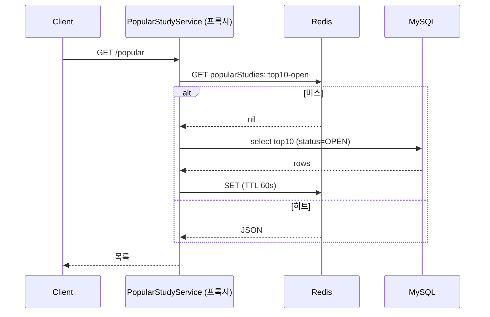
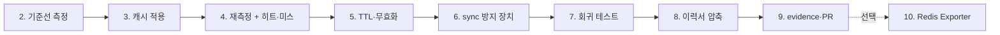

# 6주차 구현 가이드

`missions/README.md` Week 6 요구사항과 `studypass`(`/Users/jihochoi/Documents/study/dingco/challenge-backend-resume-2026-08-wlghsp-r17`) 현재 코드를 근거로 "무엇을 어떤 순서로 구현할지"만 정리한다. 실제 코드는 지호님이 직접 작성한다. 실행 결과·수치·판단 근거는 실제로 실행한 뒤 evidence와 prep-questions에 채운다.

`week6/prep-questions.md`의 답이 아직 비어 있다. 그래서 아래 "결정 사항"은 지호님이 판단을 Claude에게 위임해 정한 값이다. prep-questions에 답하면서 바꾸고 싶은 게 생기면 바꾸고, 바꾼 이유를 evidence에 남긴다. 위임했더라도 근거형 질문 답변은 지호님 말로 설명할 수 있어야 하므로, 각 결정의 이유를 prep-questions에서 한 번씩 직접 풀어 써 본다.

## 결정 사항

- 캐싱 방식: `@Cacheable`. 이유: 대상이 키 하나·읽기 전용 목록이고, `sync`·무효화·히트미스 지표가 Spring Cache 위에 이미 있다. `RedisTemplate`은 TTL·직렬화·동시 갱신 방어를 직접 짜야 해서 이 미션이 재려는 판단과 무관한 구현량만 늘어난다.
- TTL과 무효화: TTL 60초 + 신청 커밋 후 능동 무효화. 이유: `popular`이 바뀌는 쓰기 경로가 `enroll()` 하나라 무효화를 구현할 수 있고, 무효화 버그 시 최악의 경우를 TTL이 60초로 막는다. 60초는 출발값이며 4단계 실측 후 바꿀 수 있다.
- 방지할 문제: Hot Key의 만료 순간 stampede를 `sync = true`로 방어. 이유: 키가 하나라 penetration·avalanche는 해당하지 않고, 통과 기준(방지 장치 + 동작 확인)을 동시 요청 재현으로 충족할 수 있는 것이 이것뿐이다.
- 무효화 구현: 이벤트 발행 + `@TransactionalEventListener(AFTER_COMMIT)`. 이유: 트랜잭션 밖 호출 처리를 프레임워크가 해 준다.
- 이력서: 문장 1·4 제외, 2·3·5·6 + 6주차 문장. 이유: 전후 측정과 재현 가능한 근거가 있는 문장을 남긴다는 기준(8단계).

---

## 0. 현재 코드 상태 확인

- `StudyController.popular()`: `studyRepository.findTop10ByStatusOrderByEnrolledCountDesc("OPEN")`을 매 호출마다 실행한다. 주석에 "6주차 캐싱 대상 후보"라고 적혀 있다.
- `StudyRepository`: 위 메서드에 6주차 미션 주석이 있다.
- `schema.sql`의 `study` 테이블: `status`, `enrolled_count`에 인덱스가 없다. 이 쿼리는 전체 스캔 후 정렬이다. 다만 시드가 300건이라 DB 비용 자체는 작다. 캐시 전후 차이가 "DB 조회 수 1 → 0"으로는 선명해도, 응답 시간 차이는 5주차(178ms → 13.7ms)만큼 크지 않을 수 있다. 크지 않게 나와도 그대로 기록한다. 이게 정직한 측정값이고, 이력서 문장에도 그 수치 그대로 쓴다.
- `EnrollmentService.enroll()`: `study.enroll()`로 `enrolledCount`를 올린다. `popular` 결과가 바뀌는 유일한 쓰기 경로다(`EnrollmentOptimisticService`는 4주차 비교용이라 운영 경로가 아니다).
- `build.gradle`: `spring-boot-starter-data-redis`, `actuator`, `micrometer-registry-prometheus`가 이미 있다. 의존성 추가는 필요 없다.
- `application.yml`: `spring.data.redis`가 `localhost:6379`로 이미 잡혀 있고, `docker-compose.yml`에 `redis:7`이 있다.
- `QueryCountProbe`(5주차)가 그대로 재사용 가능하다. `generate_statistics: true`도 테스트·로컬 yml 둘 다 켜져 있다.
- **테스트 환경 주의**: `src/test/resources/application.yml`이 `RedisAutoConfiguration`을 exclude한다. 채점 러너에 Redis가 없기 때문이다. 이 설정은 건드리지 않는다. 그러면 테스트에서는 Spring Boot가 Redis 캐시 대신 인메모리(ConcurrentMap) 캐시로 자동 폴백한다. 회귀 테스트는 이 폴백 위에서 "캐시 로직(히트·무효화·동시성)"을 검증하고, TTL·직렬화·실제 Redis 동작은 로컬 수동 측정으로 확인한다. 이 경계를 evidence에 명시한다.

## 1단계: 브랜치

`submit/week-06__weekly-pr`을 만든다. 5주차 PR이 main에 머지됐는지 먼저 확인하고, 머지됐으면 main에서, 아니면 `submit/week-05__weekly-pr`에서 딴다(5주차 `QueryCountProbe`가 필요하다).

- [ ] 브랜치 생성 (`submit/week-06__weekly-pr`)

## 2단계: 캐시 적용 전 기준선 측정

미션 2번의 "같은 조건"을 지키려면 캐시 코드를 넣기 **전에** 먼저 재야 한다. 5주차에서 2단계를 먼저 한 것과 같은 이유다.

로컬로 띄운다(`docker compose up -d` → `./gradlew bootRun`). 조건은 고정한다: 같은 URL, 워밍업 1회 제외 후 연속 5회.

```bash
for i in 1 2 3 4 5 6; do
  curl -s -o /dev/null -w "call=$i status=%{http_code} time=%{time_total}s\n" \
    "http://localhost:8080/api/studies/popular"
done
```

첫 호출은 JIT·커넥션 워밍업이라 별도 처리한다(1주차에서 한 방식 그대로).

DB 조회 수는 두 가지로 센다.

- 콘솔 SQL 로그(`org.hibernate.SQL: debug`)에서 `from study ... where status=? order by enrolled_count desc limit 10` 형태의 select가 호출마다 찍히는지 눈으로 센다.
- 테스트에서 `QueryCountProbe.reset()` → 호출 → `queryCount()`. 이건 5단계 회귀 테스트에서 쓴다.

- [ ] 개선 전 응답 시간 5회 기록
- [ ] 호출 1회당 DB 조회 수 확인 (예측: 1건)

### 측정 기록 (evidence용 — 여기에 채움)

```
조건: GET /api/studies/popular, studies 300건, 워밍업 1회 제외 5회
응답 시간:
호출당 DB 조회 수:
```

붙여넣기 — curl 출력, SQL 로그(호출 구간)

```
jihochoi@Jiho-MacBook-Pro challenge-backend-resume-2026-08-wlghsp-r17 % for i in 1 2 3 4 5 6; do
  curl -s -o /dev/null -w "call=$i status=%{http_code} time=%{time_total}s\n" \
    "http://localhost:8080/api/studies/popular"
done
call=1 status=200 time=0.119827s
call=2 status=200 time=0.008247s
call=3 status=200 time=0.005185s
call=4 status=200 time=0.005316s
call=5 status=200 time=0.007352s
call=6 status=200 time=0.009569s


let        : Initializing Servlet 'dispatcherServlet'
2026-10-06T13:16:17.988+09:00  INFO 61296 --- [nio-8080-exec-1] o.s.web.servlet.DispatcherServlet        : Completed initialization in 0 ms
2026-10-06T13:16:33.540+09:00 DEBUG 61296 --- [nio-8080-exec-5] org.hibernate.SQL                        : 
    select
        s1_0.id,
        s1_0.capacity,
        s1_0.category,
        s1_0.created_at,
        s1_0.enrolled_count,
        s1_0.fee,
        s1_0.opened_at,
        s1_0.status,
        s1_0.title,
        s1_0.version 
    from
        study s1_0 
    where
        s1_0.status=? 
    order by
        s1_0.enrolled_count desc 
    limit
        ?
2026-10-06T13:16:33.545+09:00 TRACE 61296 --- [nio-8080-exec-5] org.hibernate.orm.jdbc.bind              : binding parameter (1:VARCHAR) <- [OPEN]
2026-10-06T13:16:33.546+09:00 TRACE 61296 --- [nio-8080-exec-5] org.hibernate.orm.jdbc.bind              : binding parameter (2:INTEGER) <- [10]
2026-10-06T13:16:33.560+09:00  INFO 61296 --- [nio-8080-exec-5] i.StatisticalLoggingSessionEventListener : Session Metrics {
    2447375 nanoseconds spent acquiring 1 JDBC connections;
    0 nanoseconds spent releasing 0 JDBC connections;
    4087125 nanoseconds spent preparing 1 JDBC statements;
    2099000 nanoseconds spent executing 1 JDBC statements;
    0 nanoseconds spent executing 0 JDBC batches;
    0 nanoseconds spent performing 0 L2C puts;
    0 nanoseconds spent performing 0 L2C hits;
    0 nanoseconds spent performing 0 L2C misses;
    0 nanoseconds spent executing 0 flushes (flushing a total of 0 entities and 0 collections);
    0 nanoseconds spent executing 0 pre-partial-flushes;
    0 nanoseconds spent executing 0 partial-flushes (flushing a total of 0 entities and 0 collections)
}
2026-10-06T13:16:33.594+09:00 DEBUG 61296 --- [nio-8080-exec-7] org.hibernate.SQL                        : 
    select
        s1_0.id,
        s1_0.capacity,
        s1_0.category,
        s1_0.created_at,
        s1_0.enrolled_count,
        s1_0.fee,
        s1_0.opened_at,
        s1_0.status,
        s1_0.title,
        s1_0.version 
    from
        study s1_0 
    where
        s1_0.status=? 
    order by
        s1_0.enrolled_count desc 
    limit
        ?
2026-10-06T13:16:33.595+09:00 TRACE 61296 --- [nio-8080-exec-7] org.hibernate.orm.jdbc.bind              : binding parameter (1:VARCHAR) <- [OPEN]
2026-10-06T13:16:33.595+09:00 TRACE 61296 --- [nio-8080-exec-7] org.hibernate.orm.jdbc.bind              : binding parameter (2:INTEGER) <- [10]
2026-10-06T13:16:33.598+09:00  INFO 61296 --- [nio-8080-exec-7] i.StatisticalLoggingSessionEventListener : Session Metrics {
    24167 nanoseconds spent acquiring 1 JDBC connections;
    0 nanoseconds spent releasing 0 JDBC connections;
    124375 nanoseconds spent preparing 1 JDBC statements;
    1627666 nanoseconds spent executing 1 JDBC statements;
    0 nanoseconds spent executing 0 JDBC batches;
    0 nanoseconds spent performing 0 L2C puts;
    0 nanoseconds spent performing 0 L2C hits;
    0 nanoseconds spent performing 0 L2C misses;
    0 nanoseconds spent executing 0 flushes (flushing a total of 0 entities and 0 collections);
    0 nanoseconds spent executing 0 pre-partial-flushes;
    0 nanoseconds spent executing 0 partial-flushes (flushing a total of 0 entities and 0 collections)
}
2026-10-06T13:16:33.611+09:00 DEBUG 61296 --- [nio-8080-exec-9] org.hibernate.SQL                        : 
    select
        s1_0.id,
        s1_0.capacity,
        s1_0.category,
        s1_0.created_at,
        s1_0.enrolled_count,
        s1_0.fee,
        s1_0.opened_at,
        s1_0.status,
        s1_0.title,
        s1_0.version 
    from
        study s1_0 
    where
        s1_0.status=? 
    order by
        s1_0.enrolled_count desc 
    limit
        ?
2026-10-06T13:16:33.611+09:00 TRACE 61296 --- [nio-8080-exec-9] org.hibernate.orm.jdbc.bind              : binding parameter (1:VARCHAR) <- [OPEN]
2026-10-06T13:16:33.611+09:00 TRACE 61296 --- [nio-8080-exec-9] org.hibernate.orm.jdbc.bind              : binding parameter (2:INTEGER) <- [10]
2026-10-06T13:16:33.614+09:00  INFO 61296 --- [nio-8080-exec-9] i.StatisticalLoggingSessionEventListener : Session Metrics {
    20958 nanoseconds spent acquiring 1 JDBC connections;
    0 nanoseconds spent releasing 0 JDBC connections;
    113625 nanoseconds spent preparing 1 JDBC statements;
    1429500 nanoseconds spent executing 1 JDBC statements;
    0 nanoseconds spent executing 0 JDBC batches;
    0 nanoseconds spent performing 0 L2C puts;
    0 nanoseconds spent performing 0 L2C hits;
    0 nanoseconds spent performing 0 L2C misses;
    0 nanoseconds spent executing 0 flushes (flushing a total of 0 entities and 0 collections);
    0 nanoseconds spent executing 0 pre-partial-flushes;
    0 nanoseconds spent executing 0 partial-flushes (flushing a total of 0 entities and 0 collections)
}
2026-10-06T13:16:33.626+09:00 DEBUG 61296 --- [nio-8080-exec-1] org.hibernate.SQL                        : 
    select
        s1_0.id,
        s1_0.capacity,
        s1_0.category,
        s1_0.created_at,
        s1_0.enrolled_count,
        s1_0.fee,
        s1_0.opened_at,
        s1_0.status,
        s1_0.title,
        s1_0.version 
    from
        study s1_0 
    where
        s1_0.status=? 
    order by
        s1_0.enrolled_count desc 
    limit
        ?
2026-10-06T13:16:33.626+09:00 TRACE 61296 --- [nio-8080-exec-1] org.hibernate.orm.jdbc.bind              : binding parameter (1:VARCHAR) <- [OPEN]
2026-10-06T13:16:33.626+09:00 TRACE 61296 --- [nio-8080-exec-1] org.hibernate.orm.jdbc.bind              : binding parameter (2:INTEGER) <- [10]
2026-10-06T13:16:33.628+09:00  INFO 61296 --- [nio-8080-exec-1] i.StatisticalLoggingSessionEventListener : Session Metrics {
    23209 nanoseconds spent acquiring 1 JDBC connections;
    0 nanoseconds spent releasing 0 JDBC connections;
    123792 nanoseconds spent preparing 1 JDBC statements;
    1563750 nanoseconds spent executing 1 JDBC statements;
    0 nanoseconds spent executing 0 JDBC batches;
    0 nanoseconds spent performing 0 L2C puts;
    0 nanoseconds spent performing 0 L2C hits;
    0 nanoseconds spent performing 0 L2C misses;
    0 nanoseconds spent executing 0 flushes (flushing a total of 0 entities and 0 collections);
    0 nanoseconds spent executing 0 pre-partial-flushes;
    0 nanoseconds spent executing 0 partial-flushes (flushing a total of 0 entities and 0 collections)
}
2026-10-06T13:16:33.643+09:00 DEBUG 61296 --- [nio-8080-exec-3] org.hibernate.SQL                        : 
    select
        s1_0.id,
        s1_0.capacity,
        s1_0.category,
        s1_0.created_at,
        s1_0.enrolled_count,
        s1_0.fee,
        s1_0.opened_at,
        s1_0.status,
        s1_0.title,
        s1_0.version 
    from
        study s1_0 
    where
        s1_0.status=? 
    order by
        s1_0.enrolled_count desc 
    limit
        ?
2026-10-06T13:16:33.643+09:00 TRACE 61296 --- [nio-8080-exec-3] org.hibernate.orm.jdbc.bind              : binding parameter (1:VARCHAR) <- [OPEN]
2026-10-06T13:16:33.643+09:00 TRACE 61296 --- [nio-8080-exec-3] org.hibernate.orm.jdbc.bind              : binding parameter (2:INTEGER) <- [10]
2026-10-06T13:16:33.646+09:00  INFO 61296 --- [nio-8080-exec-3] i.StatisticalLoggingSessionEventListener : Session Metrics {
    38709 nanoseconds spent acquiring 1 JDBC connections;
    0 nanoseconds spent releasing 0 JDBC connections;
    224208 nanoseconds spent preparing 1 JDBC statements;
    2416459 nanoseconds spent executing 1 JDBC statements;
    0 nanoseconds spent executing 0 JDBC batches;
    0 nanoseconds spent performing 0 L2C puts;
    0 nanoseconds spent performing 0 L2C hits;
    0 nanoseconds spent performing 0 L2C misses;
    0 nanoseconds spent executing 0 flushes (flushing a total of 0 entities and 0 collections);
    0 nanoseconds spent executing 0 pre-partial-flushes;
    0 nanoseconds spent executing 0 partial-flushes (flushing a total of 0 entities and 0 collections)
}
2026-10-06T13:16:33.661+09:00 DEBUG 61296 --- [nio-8080-exec-5] org.hibernate.SQL                        : 
    select
        s1_0.id,
        s1_0.capacity,
        s1_0.category,
        s1_0.created_at,
        s1_0.enrolled_count,
        s1_0.fee,
        s1_0.opened_at,
        s1_0.status,
        s1_0.title,
        s1_0.version 
    from
        study s1_0 
    where
        s1_0.status=? 
    order by
        s1_0.enrolled_count desc 
    limit
        ?

```

## 3단계: 캐싱 방식과 키 설계

미션 1번(필수)이다. prep-questions 1번의 `RedisTemplate` vs `@Cacheable` 판단에 대한 제안은 `@Cacheable`이다.

- 캐시 대상이 키 하나(인기 TOP10), 값이 읽기 전용 목록이라 직접 `RedisTemplate`을 다룰 이유가 적다.
- 4단계 방지 장치(`sync = true`), 무효화(`@CacheEvict`/캐시 API), 히트·미스 지표(Boot의 캐시 메트릭)가 모두 Spring Cache 추상화 위에 이미 있다.
- `RedisTemplate`을 택하면 TTL, 직렬화, 히트·미스 카운트, 동시 갱신 방어를 전부 직접 짜야 한다. 이 미션이 재려는 것은 그 구현량이 아니라 판단이다.

구현 시 걸리는 점 세 가지.

1. **`@Cacheable`은 프록시를 거쳐야 동작한다.** `StudyController.popular()` 안에서 private 메서드로 호출하면 안 먹는다. 계산 로직을 별도 서비스(예: `PopularStudyService`)로 빼고 거기에 `@Cacheable`을 붙인다. 컨트롤러는 이 서비스를 호출만 한다. 응답 형식(`toSummary`)은 바꾸지 않는다.
2. **캐시에 엔티티를 넣지 않는다.** `Study` 엔티티는 지연 로딩·프록시·직렬화 문제가 있다. 지금 컨트롤러가 이미 `List<Map<String,Object>>`로 변환하므로, 변환된 결과를 캐시 값으로 쓴다. Redis 직렬화는 JDK 직렬화 대신 JSON(`GenericJackson2JsonRedisSerializer`)으로 한다. 이래야 `redis-cli GET`으로 값을 눈으로 확인할 수 있다.
3. **키는 명시한다.** 인자 없는 메서드는 기본 키가 `SimpleKey []`라 읽기 어렵다. `key = "'top10-open'"`처럼 고정 문자열로 준다. 키가 하나뿐이라는 사실이 코드에 보인다는 점도 4단계 설명에 쓸 수 있다.

설정은 `@EnableCaching`(설정 클래스 또는 Application 클래스)과 `RedisCacheConfiguration` 빈 하나다.

```java
@Bean
RedisCacheConfiguration redisCacheConfiguration() {
    return RedisCacheConfiguration.defaultCacheConfig()
            .entryTtl(Duration.ofSeconds(60))   // 5단계 근거로 확정
            .serializeValuesWith(RedisSerializationContext.SerializationPair
                    .fromSerializer(new GenericJackson2JsonRedisSerializer()));
}
```

이 클래스는 `RedisConnectionFactory`를 주입받지 않는다. 그래야 테스트에서 Redis 자동 설정이 exclude돼 있어도 컨텍스트가 뜬다(0단계 주의사항).

`application.yml`에 히트·미스 관측용 설정도 넣는다.

```yaml
spring:
  cache:
    cache-names: popularStudies
    redis:
      enable-statistics: true
```

`cache-names`를 미리 선언해야 Micrometer가 시작 시점에 이 캐시를 바인딩해 `cache_gets_total{result="hit|miss"}`를 노출한다. 캐시가 첫 호출 때 지연 생성되면 지표에서 빠진다. 사용 중인 Boot 3.5.3에서 `RedisCacheConfiguration` 빈을 직접 정의했을 때 `enable-statistics`와 `time-to-live` 프로퍼티가 어떻게 합쳐지는지는 실제 기동해서 `/actuator/prometheus`에 `cache_gets_total`이 뜨는지로 확인한다. 안 뜨면 `RedisCacheManagerBuilderCustomizer`로 `enableStatistics()`를 직접 켠다.

- [ ] 계산 로직을 서비스로 분리하고 `@Cacheable(cacheNames = "popularStudies", key = "'top10-open'")` 적용
- [ ] `@EnableCaching` + `RedisCacheConfiguration` 빈(JSON 직렬화, TTL)
- [ ] `application.yml`에 `cache-names`, `enable-statistics`
- [ ] 컨트롤러 응답 형식 변경 없음 확인

### 실행 기록 (evidence용 — 여기에 채움)

```
기동 후 /actuator/prometheus에 cache_gets_total이 떴는가: 예 (호출 2번 후 hit=1, miss=1, pending=0). 첫 시도에서는 안 떴음(시행착오 1)
enable-statistics 동작 여부: 동작함. customizer 없이 yml의 cache-names 선언과 enable-statistics: true만으로 노출됨
redis-cli GET popularStudies::top10-open 값: JSON 배열로 보임, @class 없음. TTL 60
시행착오:
1. CacheConfig에 @EnableCaching이 없고 클래스에 @Configuration 대신 @Service가 붙어 있어 캐시가 동작하지 않았다.
   증상: 호출은 200인데 redis-cli KEYS가 빈 배열, GET이 nil, TTL이 -2, grep cache_gets 출력이 없었다.
   조치: @Configuration + @EnableCaching으로 수정 후 재기동.
2. 값 직렬화는 GenericJackson2JsonRedisSerializer 대신 Jackson2JsonRedisSerializer에 List<PopularStudyResponse> 타입(JavaType)을 지정했다.
   이유: record DTO와 공유 직렬화기의 타입 정보 처리가 불확실했다. 캐시가 popularStudies 하나뿐이라 가능한 선택이다.
```

붙여넣기 — 첫 시도 (캐시 미동작): FLUSHDB 후 호출 2번, grep cache_gets 출력 없음, 키 없음

```
% docker compose exec redis redis-cli FLUSHDB
OK
call=1 status=200
call=2 status=200

% curl -s localhost:8080/actuator/prometheus | grep cache_gets
(출력 없음)

% docker compose exec redis redis-cli KEYS '*'
(empty array)
% docker compose exec redis redis-cli GET popularStudies::top10-open
(nil)
% docker compose exec redis redis-cli TTL popularStudies::top10-open
(integer) -2
```

붙여넣기 — 수정 후 (캐시 동작): FLUSHDB 후 호출 2번, redis-cli, grep cache_gets

```
% docker compose exec redis redis-cli FLUSHDB
OK
call=1 status=200
call=2 status=200

% docker compose exec redis redis-cli KEYS '*'
1) "popularStudies::top10-open"

% docker compose exec redis redis-cli GET popularStudies::top10-open
"[{\"id\":94,\"title\":\"\xec\x8a\xa4\xed\x84\xb0\xeb\x94\x94 94\xea\xb8\xb0\",\"category\":\"MOBILE\",\"fee\":80000,\"capacity\":14,\"enrolledCount\":260},{\"id\":235,\"title\":\"\xec\x8a\xa4\xed\x84\xb0\xeb\x94\x94 235\xea\xb8\xb0\",\"category\":\"BACKEND\",\"fee\":85000,\"capacity\":20,\"enrolledCount\":258},{\"id\":69,\"title\":\"\xec\x8a\xa4\xed\x84\xb0\xeb\x94\x94 69\xea\xb8\xb0\",\"category\":\"MOBILE\",\"fee\":55000,\"capacity\":19,\"enrolledCount\":257},{\"id\":175,\"title\":\"\xec\x8a\xa4\xed\x84\xb0\xeb\x94\x94 175\xea\xb8\xb0\",\"category\":\"BACKEND\",\"fee\":85000,\"capacity\":20,\"enrolledCount\":253},{\"id\":70,\"title\":\"\xec\x8a\xa4\xed\x84\xb0\xeb\x94\x94 70\xea\xb8\xb0\",\"category\":\"BACKEND\",\"fee\":60000,\"capacity\":20,\"enrolledCount\":253},{\"id\":180,\"title\":\"\xec\x8a\xa4\xed\x84\xb0\xeb\x94\x94 180\xea\xb8\xb0\",\"category\":\"BACKEND\",\"fee\":10000,\"capacity\":10,\"enrolledCount\":252},{\"id\":119,\"title\":\"\xec\x8a\xa4\xed\x84\xb0\xeb\x94\x94 119\xea\xb8\xb0\",\"category\":\"MOBILE\",\"fee\":105000,\"capacity\":24,\"enrolledCount\":252},{\"id\":207,\"title\":\"\xec\x8a\xa4\xed\x84\xb0\xeb\x94\x94 207\xea\xb8\xb0\",\"category\":\"DATA\",\"fee\":45000,\"capacity\":22,\"enrolledCount\":250},{\"id\":52,\"title\":\"\xec\x8a\xa4\xed\x84\xb0\xeb\x94\x94 52\xea\xb8\xb0\",\"category\":\"DATA\",\"fee\":70000,\"capacity\":17,\"enrolledCount\":250},{\"id\":102,\"title\":\"\xec\x8a\xa4\xed\x84\xb0\xeb\x94\x94 102\xea\xb8\xb0\",\"category\":\"DATA\",\"fee\":20000,\"capacity\":22,\"enrolledCount\":249}]"

% docker compose exec redis redis-cli TTL popularStudies::top10-open
(integer) 60

% curl -s localhost:8080/actuator/prometheus | grep cache_gets
# HELP cache_gets_total The number of pending requests
# TYPE cache_gets_total counter
cache_gets_total{application="studypass",cache="popularStudies",cache_manager="cacheManager",name="popularStudies",result="hit"} 1.0
cache_gets_total{application="studypass",cache="popularStudies",cache_manager="cacheManager",name="popularStudies",result="miss"} 1.0
cache_gets_total{application="studypass",cache="popularStudies",cache_manager="cacheManager",name="popularStudies",result="pending"} 0.0
```

붙여넣기 — 수정 후 서버 SQL 로그 (호출 2번 구간에서 `from study` select는 1건만 찍힘, 지호님이 서버 콘솔에서 직접 확인. 호출 2번째는 select 없음)

```
2026-10-06T16:08:21.001+09:00 DEBUG 29759 --- [nio-8080-exec-4] org.hibernate.SQL                        : 
    select
        s1_0.id,
        s1_0.capacity,
        s1_0.category,
        s1_0.created_at,
        s1_0.enrolled_count,
        s1_0.fee,
        s1_0.opened_at,
        s1_0.status,
        s1_0.title,
        s1_0.version 
    from
        study s1_0 
    where
        s1_0.status=? 
    order by
        s1_0.enrolled_count desc 
    limit
        ?
2026-10-06T16:08:21.006+09:00 TRACE 29759 --- [nio-8080-exec-4] org.hibernate.orm.jdbc.bind              : binding parameter (1:VARCHAR) <- [OPEN]
2026-10-06T16:08:21.006+09:00 TRACE 29759 --- [nio-8080-exec-4] org.hibernate.orm.jdbc.bind              : binding parameter (2:INTEGER) <- [10]
```

## 4단계: 캐시 적용 후 재측정과 히트·미스 관측

2단계와 같은 조건(같은 URL, 워밍업 후 5회)으로 다시 잰다. 이번에는 **캐시를 먼저 비우고** 시작해 첫 호출이 미스인지 확인한다.

```bash
redis-cli FLUSHDB    # 또는 docker compose exec redis redis-cli FLUSHDB
for i in 1 2 3 4 5 6; do
  curl -s -o /dev/null -w "call=$i status=%{http_code} time=%{time_total}s\n" \
    "http://localhost:8080/api/studies/popular"
done
```

히트·미스를 세 방법으로 교차 확인한다. 하나만 쓰지 말고 서로 맞는지 본다.

1. **SQL 로그**: 첫 호출에만 `from study` select가 찍히고 2~6번째 호출에는 안 찍힌다. 이게 "DB 조회 수 1 → 0"의 직접 증거다.
2. **redis-cli**: 별도 터미널에서 `redis-cli MONITOR`를 켜 두면 호출마다 `GET popularStudies::top10-open`이 보이고, 미스일 때만 그 뒤에 `SET`이 보인다. 호출 후 `redis-cli TTL popularStudies::top10-open`으로 남은 TTL이 줄어드는 것도 확인한다.
3. **Micrometer 지표**: `curl -s localhost:8080/actuator/prometheus | grep cache_gets`에서 `result="miss"` 1, `result="hit"` 5가 되는지 본다.



- [ ] 첫 호출 미스, 이후 히트를 SQL 로그·MONITOR·지표 세 곳에서 확인
- [ ] 개선 후 응답 시간 5회 기록, 2단계와 나란히 비교

### 측정 기록 (evidence용 — 여기에 채움)

```
조건: 2단계와 동일 (캐시 FLUSH 후 시작). 같은 조건으로 2회 측정했다.
  - 1차: curl 응답 시간 + cache_gets
  - 2차: curl 응답 시간 + SQL 로그 + redis-cli MONITOR + TTL
응답 시간 (미스 1회 / 히트 5회):
  - 1차: 18.7ms / 2.4~4.7ms (히트 평균 약 3.16ms)
  - 2차: 22.2ms / 2.2~4.4ms (히트 평균 약 3.35ms)
호출당 DB 조회 수: 미스 1건 / 히트 0건 (2차 SQL 로그에서 6호출 구간에 from study select가 1건만 찍힘)
Redis 동작 (MONITOR): 미스 호출에서 GET 뒤에 SET(PX 60000), 이후 히트 5호출은 GET만 5번, SET 없음. 호출 직후 TTL 60
cache_gets: 1차 직후 누적 hit=6, miss=2 (앱 재기동 없이 3단계 hit 1·miss 1 + 4단계 1차 hit 5·miss 1이 합산된 값. 1차 6호출분은 미스 1, 히트 5로 일치). 2차 직후 값은 따로 재지 않았다.
개선 전/후 비교: 워밍업 제외 5회 평균 약 7.13ms(2단계) → 히트 5회 평균 약 3.2~3.3ms. 약 53~56% 감소(약 2.1~2.3배).
  - 미스 호출은 18.7~22.2ms로 2단계 평균(7.13ms)보다 느리다. Redis GET + DB 조회 + SET을 모두 거치기 때문이다.
  - 예상(4~6ms)보다 히트가 빨랐다. 2단계 로그의 DB 실행 시간이 호출당 약 1.4~2.4ms였고, 히트 시 이 비용이 사라지면서 Redis 왕복 비용은 예상보다 작았다.
  - 한계: 각 5회씩 2회 측정이고 로컬 단일 Redis다. 2단계 call=1(119.8ms)은 JVM 워밍업이 섞여 있어 미스 호출과 직접 비교하지 않는다.
```

붙여넣기 — curl 출력 (1차)

```
% docker compose exec redis redis-cli FLUSHDB
OK
% for i in 1 2 3 4 5 6; do
  curl -s -o /dev/null -w "call=$i status=%{http_code} time=%{time_total}s\n" \
    "http://localhost:8080/api/studies/popular"
done
call=1 status=200 time=0.018698s
call=2 status=200 time=0.004730s
call=3 status=200 time=0.002907s
call=4 status=200 time=0.002746s
call=5 status=200 time=0.002405s
call=6 status=200 time=0.002991s
```

붙여넣기 — curl 출력과 TTL (2차)

```
% docker compose exec redis redis-cli FLUSHDB
OK
call=1 status=200 time=0.022179s
call=2 status=200 time=0.003609s
call=3 status=200 time=0.004145s
call=4 status=200 time=0.004447s
call=5 status=200 time=0.002351s
call=6 status=200 time=0.002184s
% docker compose exec redis redis-cli TTL popularStudies::top10-open
(integer) 60
```

붙여넣기 — SQL 로그 (2차 6호출 구간. from study select는 호출 1(미스) 한 번만 찍히고 호출 2~6에는 없음. 콘솔의 Gradle 진행 표시줄이 섞여 겹친 줄은 제외하고 select 1건만 옮겼다)

```
2026-10-06T16:16:29.818+09:00 DEBUG 29759 --- [io-8080-exec-10] org.hibernate.SQL                        : 
    select
        s1_0.id,
        s1_0.capacity,
        s1_0.category,
        s1_0.created_at,
        s1_0.enrolled_count,
        s1_0.fee,
        s1_0.opened_at,
        s1_0.status,
        s1_0.title,
        s1_0.version 
    from
        study s1_0 
    where
        s1_0.status=? 
    order by
        s1_0.enrolled_count desc 
    limit
        ?
2026-10-06T16:16:29.820+09:00 TRACE 29759 --- [io-8080-exec-10] org.hibernate.orm.jdbc.bind              : binding parameter (1:VARCHAR) <- [OPEN]
2026-10-06T16:16:29.820+09:00 TRACE 29759 --- [io-8080-exec-10] org.hibernate.orm.jdbc.bind              : binding parameter (2:INTEGER) <- [10]
2026-10-06T16:16:29.826+09:00  INFO 29759 --- [io-8080-exec-10] i.StatisticalLoggingSessionEventListener : Session Metrics {
    1351000 nanoseconds spent acquiring 1 JDBC connections;
    0 nanoseconds spent releasing 0 JDBC connections;
    1754333 nanoseconds spent preparing 1 JDBC statements;
    2820375 nanoseconds spent executing 1 JDBC statements;
    0 nanoseconds spent executing 0 JDBC batches;
    0 nanoseconds spent performing 0 L2C puts;
    0 nanoseconds spent performing 0 L2C hits;
    0 nanoseconds spent performing 0 L2C misses;
    0 nanoseconds spent executing 0 flushes (flushing a total of 0 entities and 0 collections);
    0 nanoseconds spent executing 0 pre-partial-flushes;
    0 nanoseconds spent executing 0 partial-flushes (flushing a total of 0 entities and 0 collections)
}
```

붙여넣기 — redis-cli MONITOR 출력 (2차 6호출. 호출 1: GET 뒤 SET, 호출 2~6: GET만)

```
1791270989.855287 [0 127.0.0.1:49992] "FLUSHDB"
1791270989.874806 [0 172.24.0.1:35278] "GET" "popularStudies::top10-open"
1791270989.888609 [0 172.24.0.1:35278] "SET" "popularStudies::top10-open" "[{\"id\":94,\"title\":\"\xec\x8a\xa4\xed\x84\xb0\xeb\x94\x94 94\xea\xb8\xb0\",\"category\":\"MOBILE\",\"fee\":80000,\"capacity\":14,\"enrolledCount\":260},{\"id\":235,\"title\":\"\xec\x8a\xa4\xed\x84\xb0\xeb\x94\x94 235\xea\xb8\xb0\",\"category\":\"BACKEND\",\"fee\":85000,\"capacity\":20,\"enrolledCount\":258},{\"id\":69,\"title\":\"\xec\x8a\xa4\xed\x84\xb0\xeb\x94\x94 69\xea\xb8\xb0\",\"category\":\"MOBILE\",\"fee\":55000,\"capacity\":19,\"enrolledCount\":257},{\"id\":175,\"title\":\"\xec\x8a\xa4\xed\x84\xb0\xeb\x94\x94 175\xea\xb8\xb0\",\"category\":\"BACKEND\",\"fee\":85000,\"capacity\":20,\"enrolledCount\":253},{\"id\":70,\"title\":\"\xec\x8a\xa4\xed\x84\xb0\xeb\x94\x94 70\xea\xb8\xb0\",\"category\":\"BACKEND\",\"fee\":60000,\"capacity\":20,\"enrolledCount\":253},{\"id\":180,\"title\":\"\xec\x8a\xa4\xed\x84\xb0\xeb\x94\x94 180\xea\xb8\xb0\",\"category\":\"BACKEND\",\"fee\":10000,\"capacity\":10,\"enrolledCount\":252},{\"id\":119,\"title\":\"\xec\x8a\xa4\xed\x84\xb0\xeb\x94\x94 119\xea\xb8\xb0\",\"category\":\"MOBILE\",\"fee\":105000,\"capacity\":24,\"enrolledCount\":252},{\"id\":207,\"title\":\"\xec\x8a\xa4\xed\x84\xb0\xeb\x94\x94 207\xea\xb8\xb0\",\"category\":\"DATA\",\"fee\":45000,\"capacity\":22,\"enrolledCount\":250},{\"id\":52,\"title\":\"\xec\x8a\xa4\xed\x84\xb0\xeb\x94\x94 52\xea\xb8\xb0\",\"category\":\"DATA\",\"fee\":70000,\"capacity\":17,\"enrolledCount\":250},{\"id\":102,\"title\":\"\xec\x8a\xa4\xed\x84\xb0\xeb\x94\x94 102\xea\xb8\xb0\",\"category\":\"DATA\",\"fee\":20000,\"capacity\":22,\"enrolledCount\":249}]" "PX" "60000"
1791270989.905392 [0 172.24.0.1:35278] "GET" "popularStudies::top10-open"
1791270989.920005 [0 172.24.0.1:35278] "GET" "popularStudies::top10-open"
1791270989.935035 [0 172.24.0.1:35278] "GET" "popularStudies::top10-open"
1791270989.949935 [0 172.24.0.1:35278] "GET" "popularStudies::top10-open"
1791270989.960980 [0 172.24.0.1:35278] "GET" "popularStudies::top10-open"
1791270990.049330 [0 127.0.0.1:50002] "TTL" "popularStudies::top10-open"
```

참고: MONITOR의 시각(Redis, Colima VM)과 앱 SQL 로그의 시각(호스트)은 서로 다른 시계라 수십 ms 어긋나 있다(SQL 로그 16:16:29.818이 MONITOR의 GET 시각보다 이르다). 호출 순서(GET → select → SET)는 같은 호출에서 일어난 것으로 본다. 시계 차이의 원인은 확인하지 않았다.

붙여넣기 — grep cache_gets 출력 (4단계 6호출 직후, 누적값)

```
% curl -s localhost:8080/actuator/prometheus | grep cache_gets
# HELP cache_gets_total The number of pending requests
# TYPE cache_gets_total counter
cache_gets_total{application="studypass",cache="popularStudies",cache_manager="cacheManager",name="popularStudies",result="hit"} 6.0
cache_gets_total{application="studypass",cache="popularStudies",cache_manager="cacheManager",name="popularStudies",result="miss"} 2.0
cache_gets_total{application="studypass",cache="popularStudies",cache_manager="cacheManager",name="popularStudies",result="pending"} 0.0
```

## 5단계: TTL과 무효화 전략

미션 3번(필수)이다. 판단 근거는 데이터 변경 주기와 연결돼야 한다(통과 기준).

**제안: TTL 60초 + 신청 커밋 후 능동 무효화, 둘 다.**

- `popular`이 바뀌는 시점은 `EnrollmentService.enroll()` 하나뿐이다. 쓰기 경로가 하나로 특정되므로 능동 무효화를 구현할 수 있고, 구현 비용도 작다.
- 능동 무효화만 쓰면 무효화 코드에 버그가 났을 때(prep-questions 5번) 오래된 데이터가 영원히 남는다. TTL은 그 최악의 경우를 60초로 막는 상한이다. 반대로 TTL만 쓰면 신청이 몰릴 때 순위가 최대 60초 어긋난다.
- 60초는 출발값이다. "인기 스터디 목록이 몇 초 안 맞으면 사용자가 이상함을 느끼는가"는 prep-questions 3번에서 직접 판단해 확정한다.

**무효화 시점이 가장 중요한 부분이다.** `enroll()` 안에서 곧바로 캐시를 지우면 prep-questions 3번의 경고대로 커밋 전에 지우게 된다. 지운 직후, 커밋 전에 다른 요청이 들어오면 아직 옛 값인 DB를 읽어 옛 값을 캐시에 다시 채운다. 롤백되면 지운 게 무의미하고, 커밋돼도 이미 늦다. 그래서 **커밋 후에** 지운다.

방법은 두 가지가 있고, 제안은 첫 번째다.

1. `enroll()` 끝에서 이벤트를 발행하고(`ApplicationEventPublisher`), 별도 리스너에 `@TransactionalEventListener(phase = AFTER_COMMIT)`로 캐시를 비운다. 리스너는 `CacheManager.getCache("popularStudies").evict("top10-open")`을 호출한다.
2. `TransactionSynchronizationManager.registerSynchronization`으로 `afterCommit()`에서 지운다. 코드는 짧지만 트랜잭션 밖에서 호출될 때를 따로 처리해야 해서 1번이 낫다.

한 가지 한계를 evidence에 솔직하게 적는다. 커밋 후 무효화를 해도 "리더가 커밋 전 옛 값을 읽고 → 커밋·무효화 → 리더가 옛 값을 캐시에 씀" 순서의 경합은 이론상 남는다. 이 윈도우는 아주 짧고, 남은 틈은 TTL(60초)이 막아 준다. 이것이 TTL을 안전망으로 같이 두는 이유이기도 하다.

또 `enroll()` 한 건마다 캐시가 날아가므로, 신청이 매우 몰리면 캐시 효과가 줄어든다. 그래도 읽기(`popular`) 대비 쓰기(신청)가 훨씬 적다는 가정으로 간다. 이 가정이 틀릴 수 있다는 점은 한계로 적는다.

- [ ] `enroll()`에서 이벤트 발행, `AFTER_COMMIT` 리스너에서 `top10-open` 키 evict
- [ ] 로컬 확인: popular 호출(캐시 생성) → 신청 1건 → `redis-cli GET`으로 키가 사라졌는지, 다음 popular 호출이 미스인지
- [ ] `redis-cli TTL`로 TTL 60초가 실제로 걸려 있는지 확인

### 실행 기록 (evidence용 — 여기에 채움)

```
popular 호출 직후 redis-cli TTL: 60 (EXISTS 1)
신청 1건 후 redis-cli GET (키가 사라졌는가): 사라짐 (EXISTS 1 → 0). 신청 응답 enrollmentId=200001
신청 후 다음 popular 호출이 미스였는가 (SQL 로그 / cache_gets miss 증가): 미스로 판단.
  - 근거: 호출 후 EXISTS 1, TTL 60으로 키가 다시 채워짐(채워지는 것은 미스일 때뿐).
  - cache_gets: 재기동 이후 hit=0, miss=4. 재기동 후 popular를 4번 호출했고 매번 FLUSHDB 또는 무효화 직후라 전부 미스로 계산이 맞는다. 이 호출 직전의 miss 값은 따로 재지 않았다.
  - SQL 로그: 신청(16:36:27) 30초 뒤 popular 호출(16:36:57)에서 `from study` select가 다시 찍힘. 신청이 없었다면 TTL 60초 안(캐시가 채워진 16:36:27 기준)이라 히트로 select가 없었을 시점이므로, 이 select가 무효화가 동작했다는 증거다. 재기동 이후 `from study` select 4건이 cache_gets miss=4와 일치한다.
롤백 케이스 확인 여부: 로컬 수동 확인은 하지 않음. 7단계 테스트(rolledBackEnrollDoesNotEvictCache)로 확인 예정
시행착오:
  1. 시드 스터디는 전부 정원 초과(enrolled_count >= capacity)라, 정원 여유 있는 스터디 조회 결과가 0건이었다. 그대로는 신청이 정원 마감으로 실패한다. 신청 테스트용 스터디를 INSERT했다(id 301, capacity 5).
  2. 신청 대상 스터디는 인기 TOP10에 들지 않아 순위가 바뀌지 않는데도 캐시는 지워졌다. enroll()이 순위 변화 여부와 무관하게 무조건 무효화한다는 뜻이고, 신청이 몰리면 캐시 효과가 줄어드는 한계의 근거다.
```

붙여넣기 — 신청 가능한 스터디 조회(결과 없음), 테스트용 스터디 INSERT, 회원 조회

```
% docker compose exec db mysql -ustudypass -pstudypass1234 studypass -e \
  "select id, capacity, enrolled_count from study where status='OPEN' and enrolled_count < capacity limit 3;"
(결과 없음: 정원에 여유 있는 OPEN 스터디가 0건)

% docker compose exec db mysql -ustudypass -pstudypass1234 studypass -e \
  "insert into study (title, category, fee, capacity, enrolled_count, status, opened_at, created_at, version) \
   values ('cache-evict-check', 'BACKEND', 10000, 5, 0, 'OPEN', now(6), now(6), 0); \
   select last_insert_id() as study_id;"
+----------+
| study_id |
+----------+
|      301 |
+----------+

% docker compose exec db mysql -ustudypass -pstudypass1234 studypass -e "select id from member limit 1;"
+----+
| id |
+----+
|  1 |
+----+
```

붙여넣기 — 캐시 채움 → 신청 → 무효화 확인

```
% docker compose exec redis redis-cli FLUSHDB
OK
popular status=200
% docker compose exec redis redis-cli EXISTS popularStudies::top10-open
(integer) 1

% curl -s -X POST "http://localhost:8080/api/enrollments/studies/301?memberId=1"
{"enrollmentId":200001}

% docker compose exec redis redis-cli EXISTS popularStudies::top10-open
(integer) 0
```

붙여넣기 — 신청 후 다음 popular 호출 (미스 확인), TTL, cache_gets

```
% curl -s -o /dev/null -w "popular status=%{http_code}\n" http://localhost:8080/api/studies/popular
popular status=200
% docker compose exec redis redis-cli EXISTS popularStudies::top10-open
(integer) 1
% docker compose exec redis redis-cli TTL popularStudies::top10-open
(integer) 60
% curl -s localhost:8080/actuator/prometheus | grep cache_gets
# HELP cache_gets_total The number of pending requests
# TYPE cache_gets_total counter
cache_gets_total{application="studypass",cache="popularStudies",cache_manager="cacheManager",name="popularStudies",result="hit"} 0.0
cache_gets_total{application="studypass",cache="popularStudies",cache_manager="cacheManager",name="popularStudies",result="miss"} 4.0
cache_gets_total{application="studypass",cache="popularStudies",cache_manager="cacheManager",name="popularStudies",result="pending"} 0.0
```

붙여넣기 — SQL 로그 (재기동 이후 전체 흐름. 각 select 앞은 시각. TRACE 바인딩과 Session Metrics 줄은 생략하고 SQL 본문만 옮겼다)

```
16:33:59.063  from study select  (popular, 1단계 확인 중 첫 호출, FLUSHDB 직후 미스)
16:34:06.637  from study select  (popular, 1단계 확인 반복, FLUSHDB 직후 미스)
16:36:27.093  from study select  (popular, 신청 전 캐시 채움, 미스)
              select member where id=?            (신청 트랜잭션 시작, memberId=1)
              select study where id=? for update  (studyId=301)
              insert into study_enrollment ...
              update study set ..., enrolled_count=1 ... where id=301 and version=0
16:36:57.452  from study select  (popular, 신청 30초 뒤. 캐시가 무효화되어 DB를 다시 조회 = 미스)
```

위에서 `from study` select의 SQL 본문은 모두 같다.

```
    select
        s1_0.id, s1_0.capacity, s1_0.category, s1_0.created_at, s1_0.enrolled_count,
        s1_0.fee, s1_0.opened_at, s1_0.status, s1_0.title, s1_0.version
    from
        study s1_0
    where
        s1_0.status=?
    order by
        s1_0.enrolled_count desc
    limit
        ?
    바인딩: (1) OPEN, (2) 10
```

## 6단계: 캐시 문제 사례 방지

미션 4번(필수)은 penetration, avalanche, Hot Key 중 **하나**만 골라 방지 장치와 동작 확인을 남기는 것이다.

이 프로젝트는 단일 Redis, 단일 캐시 키다. 세 문제를 이 조건에 대 보면 다음과 같다(prep-questions 4번에서 직접 확인).

- penetration: 존재하지 않는 키를 반복 조회하는 문제인데, 키가 고정 하나라 입력으로 키를 바꿀 수 없다. 해당 없음.
- avalanche: 여러 키가 동시에 만료되는 문제인데 키가 하나다. TTL jitter는 "키들의 만료 시점 분산"이 목적이라 키 하나에서는 의미가 없다. 해당 없음. 이 이유를 evidence에 적어 제외 근거로 쓴다.
- Hot Key: 요청이 하나의 키에 몰린다. 키가 하나뿐이라 모든 `popular` 요청이 정의상 이 키 하나에 몰린다. 이 프로젝트에서 가장 해당한다. 특히 위험한 순간은 **TTL 만료(또는 5단계의 무효화) 직후**다. 키가 비는 순간 동시에 들어온 N개의 요청이 전부 미스가 되어 같은 쿼리를 N번 DB로 보낸다(cache stampede / 캐시 브레이크다운).

**제안: Hot Key 만료 순간의 stampede를 `@Cacheable(sync = true)`로 방어한다.** 같은 키에 대한 미스가 동시에 여러 개 와도 한 스레드만 DB를 조회하고 나머지는 그 결과를 기다려 받는다. 4단계 어노테이션에 `sync = true` 한 줄을 더하는 것이다.

알아둘 한계: `sync = true`의 잠금은 **JVM 하나 안에서만** 유효하다. 앱이 인스턴스 여러 개로 늘면 인스턴스당 1건씩은 DB로 간다. 지금은 단일 인스턴스라 충분하지만, 이 한계를 한계 항목에 적는다. 그리고 `sync = true`가 막는 것은 "만료 순간의 동시 미스"이지, 키 하나에 읽기가 몰려 Redis 한 노드에 부하가 쏠리는 구조적 Hot Key(로컬 캐시 도입 등이 필요한 영역)까지 해결하는 것은 아니다. 이번 미션에서는 전자로 범위를 좁히고, 후자는 다루지 않았다고 명시한다.

**동작 확인(필수).** "방지 장치가 코드로 있고 동작이 확인되었다"가 통과 기준이다. 확인 방법은 `sync = true`를 켰을 때와 껐을 때를 같은 조건으로 비교하는 것이다.

- 캐시를 비운 상태에서 동시에 N건(예: 30건)을 `CountDownLatch`로 동시 출발시킨다(4주차 `EnrollmentConcurrencyTest`와 같은 패턴).
- 끝난 뒤 `QueryCountProbe`로 `from study` 조회 수를 센다.
- 예측: `sync = true`에서는 1건, 끈 상태에서는 여러 건(최대 30건 근처).

끈 상태의 수치를 한 번 실측해 "방지 전"으로 남겨야 비교가 된다. `sync`를 `false`로 바꿔 재현 테스트만 한 번 돌려 결과를 기록하고, 다시 `true`로 되돌린다. 5주차 Grafana 확인 때 코드를 되돌렸다가 원상복구한 것과 같은 절차다.

참고: 인메모리 폴백 캐시(`ConcurrentMapCache`)도 `sync = true`를 지원하므로 이 동시성 테스트는 Redis 없이 H2 테스트 환경에서 돌아간다.

- [ ] 캐시 문제 세 가지 중 이 프로젝트에 해당하는 것(Hot Key / 만료 순간 stampede)과, 나머지 둘을 제외한 이유 정리
- [ ] `sync = true` 적용
- [ ] `sync` 끈 상태에서 동시 N건 → 조회 수 기록 (방지 전)
- [ ] `sync = true`에서 같은 조건 → 조회 수 기록 (방지 후)

### 실행 기록 (evidence용 — 여기에 채움)

```
조건: 캐시 비움, 동시 N=30건(THREAD_COUNT), CountDownLatch로 동시 출발, 인메모리 폴백 캐시
sync=false (방지 전) from study 조회 수: 30건 (동시 30건 전부가 DB 조회. 테스트 실패: expected 1L, but was 30L)
sync=true (방지 후) from study 조회 수: 1건 (THREAD_COUNT=30, sync = true에서 cleanTest 후 재실행해 테스트 통과, BUILD SUCCESSFUL in 4s)
sync를 true로 되돌렸는가: 예 (최종 코드에 sync = true 적용, 방지 후 테스트가 이 상태에서 통과)
시행착오:
  1. 방지 전 실패 출력(기본 출력)에는 기대값과 실제값이 나오지 않아 조회 수를 바로 알 수 없었다. `-i` 옵션으로 실행하고 `grep -E "expected|but was"`로 걸러 10건임을 확인했다. (AssertJ의 isEqualTo 실패 메시지는 "expected: ... but was: ..." 형식이다.)
  2. 방지 전을 처음 잰 값이 10건이었는데, 테스트의 THREAD_COUNT를 실수로 10으로 두고 있었기 때문이었다(동시 10건이 전부 미스). 30으로 고쳐 다시 재니 30건이 나왔다. 앞선 "30건 중 10건" 해석은 틀렸고, 이 시행착오로 대체한다.
  3. THREAD_COUNT가 바뀌었으므로 방지 후 통과를 30 기준으로 다시 확인했다. 직전에 `./gradlew test`만 다시 돌렸을 때는 `5 up-to-date`(635ms)로 테스트가 실행되지 않았다. Gradle이 입력이 같으면 테스트를 건너뛰기 때문이다. `cleanTest`를 붙여 강제로 실행해 확인했다.
```

붙여넣기 — 방지 전 조회 수 확인 (-i 실행 후 grep)

```
(THREAD_COUNT를 실수로 10으로 둔 실행, 참고용)
% ./gradlew test --tests '*PopularStudyCacheTest.concurrentMissesHitDatabaseOnce' -i 2>&1 | grep -E "expected|but was"
    expected: 1L
     but was: 10L

(THREAD_COUNT = 30으로 고친 실행, 방지 전 기준값)
% ./gradlew test --tests '*PopularStudyCacheTest.concurrentMissesHitDatabaseOnce' -i 2>&1 | grep -E "expected|but was"
    expected: 1L
     but was: 30L
```

붙여넣기 — sync=false 테스트 실행 출력 (방지 전. 실패)

```
% ./gradlew test --tests '*PopularStudyCacheTest.concurrentMissesHitDatabaseOnce'
...
> Task :test

PopularStudyCacheTest > 캐시가 빈 순간 동시 요청 30건이 몰려도 DB 조회는 1건이다 (sync=true) FAILED
    org.opentest4j.AssertionFailedError at PopularStudyCacheTest.java:117

1 test completed, 1 failed

> Task :test FAILED

FAILURE: Build failed with an exception.

* What went wrong:
Execution failed for task ':test'.
> There were failing tests. See the report at: file:///Users/jihochoi/Documents/study/dingco/challenge-backend-resume-2026-08-wlghsp-r17/build/reports/tests/test/index.html

BUILD FAILED in 4s
5 actionable tasks: 3 executed, 2 up-to-date
```

참고: 테스트 이름에 `(sync=true)`가 고정으로 적혀 있어서, sync를 끈 이 실행에서도 이름은 그대로 나온다. 이 실행은 `sync` 없이 돌린 것이다.

붙여넣기 — sync=true 테스트 실행 출력 (방지 후. 통과. THREAD_COUNT=30, cleanTest로 강제 실행)

```
% ./gradlew cleanTest test --tests '*PopularStudyCacheTest.concurrentMissesHitDatabaseOnce' -i 2>&1 | grep -E "PASSED|FAILED|BUILD|tests completed"

BUILD SUCCESSFUL in 4s
```

참고: 필터(`PASSED|FAILED|...`) 때문에 `PASSED` 줄은 출력되지 않았다. 4초가 걸렸고 cleanTest를 앞에 붙였으므로 테스트가 실제로 실행된 것이다.

## 7단계: 회귀 테스트

미션 3·4번의 "코드로 남긴다"를 테스트로 고정한다. 새 파일 `PopularStudyCacheTest.java`로 분리한다. `StudyControllerTest` 스타일(`@SpringBootTest(webEnvironment = RANDOM_PORT)`)을 따른다. 아래는 테스트 목록과 구조만 정리한다.

공통: `@BeforeEach`에서 `CacheManager`로 `popularStudies` 캐시를 비운다. 테스트 DB 데이터는 롤백되지 않고 누적된다(5주차 `CommentQueryTest`와 같은 이유). 그래서 다른 테스트가 만든 스터디가 섞여 있어도 깨지지 않게, **특정 값이 아니라 DB 조회 수 변화로** assert한다.

1. **두 번째 호출은 DB를 안 탄다**: `reset()` → popular 2회 호출 → 쿼리 수가 1회 호출분을 넘지 않는다(첫 미스 한 번만 조회). prep-questions 7번에서 쿼리 수를 절대값이 아닌 상한으로 assert한 방식을 이어간다.
2. **신청하면 무효화된다**: popular 호출로 캐시를 채운다 → `EnrollmentService.enroll()` 호출 → 캐시에 `top10-open` 키가 사라졌는지(`cache.get(key) == null`) 확인, 다음 호출에서 쿼리 수가 늘어나는지 확인.
3. **롤백되면 무효화되지 않는다(선택)**: 트랜잭션이 실패한 경우 `AFTER_COMMIT` 리스너가 안 불려 캐시가 유지되는지. 커밋 후 무효화를 택한 근거를 코드로 보여준다.
4. **동시 미스에서 DB 조회는 1건**: 6단계 재현 테스트. 캐시 비움 → 30 스레드 동시 호출 → 조회 수 `isEqualTo(1)`. 5주차에서는 구현 세부(쿼리가 2건으로 늘 수 있는 상황)에 테스트가 깨지지 않게 상한을 썼지만, 여기서는 `sync = true`의 보장 자체가 검증 대상이라 1건으로 고정하는 게 맞다.

주의: 테스트는 인메모리 폴백 캐시에서 도므로 TTL 만료 자체는 검증하지 못한다. TTL은 4~5단계 로컬의 `redis-cli TTL` 기록이 근거라는 것을 evidence에 적는다.

**실행 명령어**

```bash
./gradlew test --tests '*PopularStudyCacheTest*'
./gradlew test    # 기존 테스트가 안 깨졌는지 전체 확인
```

- [ ] 두 번째 호출 DB 미조회 테스트
- [ ] 신청 후 무효화 테스트
- [ ] 동시 미스 1건 테스트
- [ ] 전체 `./gradlew test` 통과

### 실행 기록 (evidence용 — 여기에 채움)

```
실행 커맨드:
  - ./gradlew cleanTest test --tests '*PopularStudyCacheTest*' -i
  - ./gradlew cleanTest test (전체)
결과:
  - PopularStudyCacheTest 4개 테스트가 실행되고 BUILD SUCCESSFUL (4s). 두 번째 호출 DB 미조회, 신청 후 무효화, 롤백 시 캐시 유지, 동시 미스 1건(sync).
  - 전체 ./gradlew test도 BUILD SUCCESSFUL (5s). 기존 테스트가 깨지지 않았다.
  - 한계: 출력 필터와 요약만 남겨서 개별 PASSED 줄과 전체 테스트 개수는 캡처하지 않았다. 통과는 BUILD SUCCESSFUL로 판단한다.
시행착오: 없음 (6단계에서 겪은 THREAD_COUNT 실수와 up-to-date 문제는 6단계 기록 참고)
```

붙여넣기 — `./gradlew test --tests '*PopularStudyCacheTest*'` 출력 (cleanTest로 강제 실행)

```
% ./gradlew cleanTest test --tests '*PopularStudyCacheTest*' -i 2>&1 | grep -E "PopularStudyCacheTest >|BUILD|tests completed"

PopularStudyCacheTest > 같은 요청을 두 번 보내면 첫 호출만 DB를 조회하고 두 번째는 캐시에서 답한다 STANDARD_OUT
PopularStudyCacheTest > 신청 트랜잭션이 롤백되면 캐시는 지워지지 않는다. STANDARD_OUT
PopularStudyCacheTest > 캐시가 빈 순간 동시 요청 30건이 몰려도 DB 조회는 1건이다 (sync=true) STANDARD_OUT
PopularStudyCacheTest > 스터디 신청이 커밋되면 인기 목록 캐시가 지워지고 다음 호출은 DB를 다시 조회한다 STANDARD_OUT
BUILD SUCCESSFUL in 4s
```

붙여넣기 — 전체 `./gradlew test` 출력 (BUILD SUCCESSFUL, 테스트 수)

```
% ./gradlew cleanTest test 2>&1 | tail -15

> Task :testClasses UP-TO-DATE
OpenJDK 64-Bit Server VM warning: Sharing is only supported for boot loader classes because bootstrap classpath has been appended
2026-10-06T17:49:37.758+09:00  INFO 63363 --- [ionShutdownHook] j.LocalContainerEntityManagerFactoryBean : Closing JPA EntityManagerFactory for persistence unit 'default'
2026-10-06T17:49:37.759+09:00  INFO 63363 --- [ionShutdownHook] com.zaxxer.hikari.HikariDataSource       : HikariPool-1 - Shutdown initiated...
2026-10-06T17:49:37.760+09:00  INFO 63363 --- [ionShutdownHook] com.zaxxer.hikari.HikariDataSource       : HikariPool-1 - Shutdown completed.
2026-10-06T17:49:37.760+09:00  INFO 63363 --- [ionShutdownHook] o.s.b.w.e.tomcat.GracefulShutdown        : Commencing graceful shutdown. Waiting for active requests to complete
2026-10-06T17:49:37.764+09:00  INFO 63363 --- [tomcat-shutdown] o.s.b.w.e.tomcat.GracefulShutdown        : Graceful shutdown complete
2026-10-06T17:49:37.766+09:00  INFO 63363 --- [ionShutdownHook] j.LocalContainerEntityManagerFactoryBean : Closing JPA EntityManagerFactory for persistence unit 'default'
2026-10-06T17:49:37.767+09:00  INFO 63363 --- [ionShutdownHook] com.zaxxer.hikari.HikariDataSource       : HikariPool-2 - Shutdown initiated...
2026-10-06T17:49:37.767+09:00  INFO 63363 --- [ionShutdownHook] com.zaxxer.hikari.HikariDataSource       : HikariPool-2 - Shutdown completed.
> Task :test

BUILD SUCCESSFUL in 5s
6 actionable tasks: 2 executed, 4 up-to-date
```

## 8단계: 이력서 압축

미션 5번(필수)이다. 지금 `resume/resume.md`에는 문장이 **6개** 있고, 6주차 문장을 더하면 7개다. 규칙은 3~5개이므로 최소 2개는 빠져야 한다. 판단 기준은 prep-questions 6번에서 정한다. 아래는 현재 문장의 증거 강도를 본 제안이다.

기준: 전후 측정값이 있는가, 같은 조건으로 재현 가능한가, 근거 파일이 명확한가, 한계가 이력서 문장 안에 적혀 있는가.

- 문장 1(GET /api/studies 기준선 측정): 개선 전만 측정했다. 전후 비교가 없고, 문장 2·3이 같은 API의 후속 개선이라 흡수된다. 제외 후보 1순위.
- 문장 4(집계 테이블): 전후 수치가 HTTP 응답 시간이 아니라 `EXPLAIN ANALYZE`이고, 개선 전 HTTP 5회가 기록되지 않았다고 한계에 스스로 적었다. 다른 문장보다 약하다. 제외 후보 2순위.
- 문장 2(커서 페이징), 3(복합 인덱스), 5(비관적 락), 6(N+1): 전후 수치와 근거 파일이 있다. 남긴다.
- 새 6주차 문장: 3·4단계 측정이 나오면 쓴다. 남기는 문장은 2, 3, 5, 6 + 새 문장 = 5개.

이건 제안이다. 문장 4를 남기고 문장 2를 빼는 등 다르게 판단해도 되지만, 그 이유가 "측정값의 재현 가능성"처럼 기준에 연결돼야 한다.

작업은 세 가지다.

- 남길 문장을 5개 이하로 정리하고 번호를 다시 매긴다.
- `## 제외한 주장` 섹션을 채운다. 제외한 문장과 이유를 함께 적는다(미션 요구사항). 이 섹션은 지금 템플릿 문구 상태다.
- 이력서 상단도 같이 점검한다. `## 한 줄 소개`는 아직 템플릿 문구("해결한 문장과 강점을…")가 그대로이고, `## 근거 범위`는 1주차 시점 내용(GET /api/studies 응답 시간 3회)에 머물러 있다. 6주 전체를 압축하는 PR이므로 둘 다 갱신 대상이다. 문장 2의 `nextCusor` 오타도 눈에 띄므로 같이 고친다.

6주차 문장 초안(수치는 4단계 실측 후 채운다):

```text
인기 스터디 목록 API(GET /api/studies/popular)가 호출마다 DB를 재계산하는 것을 SQL 로그로 확인한 뒤
Redis 캐시(TTL 60초 + 신청 커밋 후 무효화)를 적용해, 같은 조건에서 호출당 DB 조회를 [1]건에서 [0]건으로,
응답 시간을 [개선 전]ms에서 [개선 후]ms로 줄였고, 만료 순간 동시 요청 30건이 DB를 [N]번 치던 것을
sync 적용으로 1번으로 줄였다.
```

문장 아래 필드(본인 행동, 전후 조건과 결과, 저장소 안 근거, 한계)는 기존 형식을 그대로 따른다. 한계에는 최소한 다음을 적는다: 시드 300건이라 DB 쿼리 비용 자체가 작고, `sync`는 단일 JVM 한정이고, 로컬 단일 Redis이며, 테스트의 TTL은 실 Redis가 아니라 수동 측정에 근거한다.

- [ ] 남길 문장 3~5개 확정, 번호 재정렬
- [ ] `## 제외한 주장`에 제외 문장과 이유
- [ ] `한 줄 소개`, `근거 범위` 갱신
- [ ] 6주차 문장 추가 (실측값으로 채움)

## 9단계: evidence·PR

`evidence/week-06__weekly-pr.md`에는 다음을 빠짐없이 남긴다.

- [ ] 캐싱 대상 선정 근거와 적용 코드 경로 (prep-questions 1번, 3단계)
- [ ] 캐시 전후 응답 시간·DB 조회 수 비교, 히트·미스 관측 기록 (SQL 로그·MONITOR·`cache_gets` 세 곳)
- [ ] TTL·무효화 전략과 근거 (데이터 변경 주기 = `enroll()`, 커밋 후 무효화 이유, 남는 경합과 TTL 안전망)
- [ ] 선택한 캐시 문제 사례(Hot Key / 만료 순간 stampede)의 방지 장치, 제외한 둘의 이유, `sync` 전/후 동시 N건 조회 수 비교
- [ ] 회귀 테스트 통과 출력
- [ ] 이력서 bullet 3~5개와 제외한 주장, 각 bullet의 근거 파일
- [ ] 근거형 질문 1~5 답변 (prep-questions 7번 "확인할 것"을 근거로)
- [ ] `## 리뷰 반영`: 최초에는 `자동 리뷰 수신 전`, 이후 지적 유무에 따라 갱신 (통과 기준: 지적 공백을 같은 PR에서 보완하고 변경 내용 기록)

제출 계약 확인:

- [ ] `resume/resume.md`, `src/main/`, `src/test/`, `evidence/week-06__weekly-pr.md`를 모두 변경했다.
- [ ] `missions/`, `challenge.json`, 채점 workflow는 변경하지 않았다.
- [ ] `src/test/resources/application.yml`의 Redis exclude를 건드리지 않았고 `./gradlew test`가 Redis 없이 통과한다.
- [ ] 전후 수치·히트미스 기록이 저장소 안에 실제로 남아 있다.

---

## 10단계 (선택 확장): Redis Exporter + Grafana 캐시 대시보드

미션 6번. 5주차 8단계와 같은 방식으로, 이미 떠 있는 Prometheus·Grafana에 지표만 추가한다.

두 계층의 지표가 있다.

- 애플리케이션 관점: 3단계에서 켠 `cache_gets_total{result="hit|miss"}`. 히트율은 `hit / (hit + miss)`로 그린다.
- Redis 서버 관점: Redis Exporter가 내보내는 `redis_keyspace_hits_total`, `redis_keyspace_misses_total`, `redis_memory_used_bytes` 등.

작업 순서:

1. `docker-compose.yml`에 exporter 서비스 추가(예: `oliver006/redis_exporter`, `REDIS_ADDR=redis://redis:6379`, 포트 9121).
2. `monitoring/prometheus.yml`에 `redis` job 추가(`targets: ["redis-exporter:9121"]`). 앱은 호스트에서 돌고 Prometheus는 컨테이너 안이라 앱 job은 `host.docker.internal`을 쓰지만, exporter는 같은 compose 네트워크이므로 서비스 이름으로 접근한다는 차이를 확인한다.
3. Prometheus Targets에서 두 job이 `UP`인지 확인.
4. Grafana 패널 두 개: 캐시 히트율, 그리고 `popular` 호출 대비 DB 조회 수(`hibernate_statements_total`, 5주차 8단계 지표 재사용).
5. 4단계 같은 호출 시퀀스를 반복하며 히트율 상승과 DB 조회 카운터 정체를 캡처. 5단계 무효화(신청 1건) 직후 미스가 한 번 튀는 모양도 같이 찍으면 TTL·무효화 근거로 쓸 수 있다.

`docker-compose.yml`과 `monitoring/`은 미션이 금지한 경로(`missions/`, `challenge.json`, 채점 workflow)가 아니므로 수정해도 된다.

- [ ] exporter 추가, Prometheus Targets `UP` 확인
- [ ] 히트율·DB 조회 수 패널 구성
- [ ] 캐시 적용/무효화 시점 캡처, 4~5단계 수치와 대조

### 실행 기록 (evidence용 — 여기에 채움, 하지 않았으면 "미실시")

```
Prometheus Targets UP 여부:
Grafana 캡처 파일 경로 (저장소 안):
히트율 상승 / 무효화 직후 미스 확인:
시행착오:
```

---

## 기타 메모 (어느 단계에도 안 맞는 로그·에러·관찰)

```
```

---

## 구현 코드 (참고용 전체)

> ✏️ 지호님 요청으로 추가함. 이 가이드 위쪽의 "실제 코드는 지호님이 직접 작성한다"는 원칙의 예외다. 작성한 사람이 아니라 읽고 설명할 수 있는 사람이어야 하므로, 붙여 넣기 전에 각 코드가 왜 그렇게 생겼는지 읽고 prep-questions 답과 맞는지 확인한다.
>
> 이 코드는 현재 studypass 소스(`StudyController`, `EnrollmentService`, `QueryCountProbe`, 두 `application.yml`)를 읽고 썼지만, 컴파일하거나 실행해 보지 못했다. 컴파일 오류, 패키지 import, `cache_gets_total` 노출 여부는 실제로 돌려서 확인하고, 안 맞으면 "실행 기록"의 시행착오에 남긴다.

경로는 `src/main/java/co/dingcodingco/studypass/` 기준이다.

### 코드를 읽기 전에: 값 타입 주의

> ✏️ 값 타입을 `List<Map<String, Object>>`에서 record DTO(`PopularStudyResponse`)로 바꿨다 (지호님 결정: 이번 미션에 필수는 아니지만 타입 안전성과 실무 관행 때문에 DTO로 간다). 아래 코드는 DTO 버전이다.

`toSummary`의 값은 `Long`, `String`, `int`뿐이라 날짜 타입 직렬화 걱정은 해당하지 않는다. 캐시 값의 타입을 정할 때 걸리는 점은 두 가지다.

1. **`Map<String, Object>`는 타입 안전성이 약하다.** 필드 이름이 문자열 키라 오타를 컴파일러가 못 잡고 값 타입도 `Object`다. 캐시에 넣는 값은 형태가 고정이므로 record DTO가 낫다. 응답 JSON의 필드 이름과 값은 그대로다.
2. **DTO를 `GenericJackson2JsonRedisSerializer`로 직렬화하면 위험이 있다.** 이 직렬화기는 타입 정보(`@class`)를 JSON에 같이 쓰는데, 기본 설정에서는 final 클래스(record 포함)에는 타입 정보를 안 붙이는 것으로 알고 있다. 그러면 캐시 히트 때 record가 아니라 `LinkedHashMap`으로 읽혀 `ClassCastException`이 날 수 있다(확인하지는 못했다). 그래서 **값 타입을 직렬화기에 직접 알려 주는 `Jackson2JsonRedisSerializer`**를 쓴다. `@class` 정보가 필요 없어서 `redis-cli GET`으로 보이는 JSON도 깔끔하다.

인메모리 폴백 테스트는 직렬화를 거치지 않아서 이 문제를 못 잡는다. 그래서 반드시 로컬 Redis에서 **두 번째 호출(캐시 히트)이 200으로 오고 `redis-cli GET`에 JSON이 보이는지**로 확인한다. `Jackson2JsonRedisSerializer`의 `(ObjectMapper, JavaType)` 생성자가 현재 버전에 있는지는 확인하지 못했으므로 컴파일해서 안 되면 에러를 시행착오에 남긴다. `list()`는 `Map`을 그대로 두므로 두 API의 반환 방식이 달라지는 점은 evidence 한계에 적는다.

### 3단계 코드

**캐시 설정** — `cache/CacheConfig.java` (새 파일)

```java
package co.dingcodingco.studypass.cache;

import co.dingcodingco.studypass.study.PopularStudyResponse;
import com.fasterxml.jackson.databind.JavaType;
import com.fasterxml.jackson.databind.ObjectMapper;
import java.time.Duration;
import java.util.List;
import org.springframework.cache.annotation.EnableCaching;
import org.springframework.context.annotation.Bean;
import org.springframework.context.annotation.Configuration;
import org.springframework.data.redis.cache.RedisCacheConfiguration;
import org.springframework.data.redis.serializer.Jackson2JsonRedisSerializer;
import org.springframework.data.redis.serializer.RedisSerializationContext;

@Configuration
@EnableCaching
public class CacheConfig {

    // 테스트(Redis 없음)에서도 기동되도록 RedisConnectionFactory를 주입받지 않는다.
    // 이 빈은 TTL과 직렬화 설정값일 뿐이고, 연결은 Redis 자동 설정이 있을 때 Boot가 만든다.
    @Bean
    RedisCacheConfiguration redisCacheConfiguration() {
        // 값 타입(List<PopularStudyResponse>)을 직렬화기에 직접 알려 준다. 캐시가 popularStudies 하나뿐이라 이렇게 묶는다.
        ObjectMapper mapper = new ObjectMapper();
        JavaType valueType = mapper.getTypeFactory()
                .constructCollectionType(List.class, PopularStudyResponse.class);

        return RedisCacheConfiguration.defaultCacheConfig()
                .entryTtl(Duration.ofSeconds(60))
                .serializeValuesWith(RedisSerializationContext.SerializationPair
                        .fromSerializer(new Jackson2JsonRedisSerializer<>(mapper, valueType)));
    }
}
```

**캐시 대상 서비스** — `study/PopularStudyService.java` (새 파일)

```java
package co.dingcodingco.studypass.study;

import java.util.ArrayList;
import java.util.List;
import java.util.stream.Collectors;
import org.springframework.cache.annotation.Cacheable;
import org.springframework.stereotype.Service;

@Service
public class PopularStudyService {

    public static final String CACHE_NAME = "popularStudies";
    public static final String CACHE_KEY = "top10-open";

    private final StudyRepository studyRepository;

    public PopularStudyService(StudyRepository studyRepository) {
        this.studyRepository = studyRepository;
    }

    // 키가 하나뿐이라는 사실이 코드에 보이도록 고정 문자열로 준다. (6단계에서 sync = true를 추가한다)
    @Cacheable(cacheNames = CACHE_NAME, key = "'" + CACHE_KEY + "'")
    public List<PopularStudyResponse> popular() {
        return studyRepository.findTop10ByStatusOrderByEnrolledCountDesc("OPEN").stream()
                .map(PopularStudyResponse::from)
                .collect(Collectors.toCollection(ArrayList::new));
    }
}
```

**`study/PopularStudyResponse.java`** (새 파일)

```java
package co.dingcodingco.studypass.study;

public record PopularStudyResponse(
        Long id, String title, String category, int fee, int capacity, int enrolledCount) {

    static PopularStudyResponse from(Study study) {
        return new PopularStudyResponse(study.getId(), study.getTitle(), study.getCategory(),
                study.getFee(), study.getCapacity(), study.getEnrolledCount());
    }
}
```

`StudyController.toSummary`는 `list()`도 쓰기 때문에 건드리지 않았다. `list()`는 기존대로 `Map`을 반환하므로 두 API의 반환 타입이 달라지지만, 변경 범위를 `popular()`로 한정하는 쪽을 택했다. `Stream.toList()` 대신 `ArrayList`로 모으는 것은 JSON 역직렬화에서 불변 리스트 타입을 피하기 위해서다.

**컨트롤러 수정** — `study/StudyController.java`

```java
    private final StudyRepository studyRepository;
    private final StudyQueryService studyQueryService;
    private final PopularStudyService popularStudyService;

    public StudyController(StudyRepository studyRepository, StudyQueryService studyQueryService,
                           PopularStudyService popularStudyService) {
        this.studyRepository = studyRepository;
        this.studyQueryService = studyQueryService;
        this.popularStudyService = popularStudyService;
    }

    /** 캐싱된 인기 스터디 목록. 계산은 PopularStudyService가 한다. */
    @GetMapping("/popular")
    public List<PopularStudyResponse> popular() {
        return popularStudyService.popular();
    }
```

기존 `popular()` 본문은 위 한 줄로 바뀌고, 나머지(`list`, `comments`, `toSummary`)는 그대로 둔다.

**yml** — `src/main/resources/application.yml`의 `spring:` 아래에 추가 (테스트 yml은 건드리지 않는다)

```yaml
spring:
  cache:
    cache-names: popularStudies
    redis:
      enable-statistics: true
```

### 5단계 코드

**이벤트** — `study/StudyEnrolledEvent.java` (새 파일)

```java
package co.dingcodingco.studypass.study;

public record StudyEnrolledEvent(Long studyId) {
}
```

**커밋 후 무효화 리스너** — `study/PopularStudyCacheEvictor.java` (새 파일)

```java
package co.dingcodingco.studypass.study;

import org.springframework.cache.Cache;
import org.springframework.cache.CacheManager;
import org.springframework.stereotype.Component;
import org.springframework.transaction.event.TransactionPhase;
import org.springframework.transaction.event.TransactionalEventListener;

@Component
public class PopularStudyCacheEvictor {

    private final CacheManager cacheManager;

    public PopularStudyCacheEvictor(CacheManager cacheManager) {
        this.cacheManager = cacheManager;
    }

    // 커밋 후에 지운다. 커밋 전에 지우면 그 사이 들어온 읽기가 옛 값을 다시 캐시에 채우고, 롤백되면 지운 게 무의미하다.
    @TransactionalEventListener(phase = TransactionPhase.AFTER_COMMIT)
    public void onStudyEnrolled(StudyEnrolledEvent event) {
        Cache cache = cacheManager.getCache(PopularStudyService.CACHE_NAME);
        if (cache != null) {
            cache.evict(PopularStudyService.CACHE_KEY);
        }
    }
}
```

**이벤트 발행** — `enrollment/EnrollmentService.java`

```java
// import 추가
import co.dingcodingco.studypass.study.StudyEnrolledEvent;
import org.springframework.context.ApplicationEventPublisher;

// 필드와 생성자 파라미터 추가
private final ApplicationEventPublisher eventPublisher;

public EnrollmentService(
        StudyRepository studyRepository,
        MemberRepository memberRepository,
        EnrollmentRepository enrollmentRepository,
        MemberEnrollmentStatsRepository memberEnrollmentStatsRepository,
        ApplicationEventPublisher eventPublisher) {
    // ... 기존 대입
    this.eventPublisher = eventPublisher;
}

// enroll() 끝, return saved.getId() 바로 앞
eventPublisher.publishEvent(new StudyEnrolledEvent(study.getId()));
```

`EnrollmentService`는 `@Transactional`이라 이 이벤트는 트랜잭션에 묶이고, 리스너는 커밋이 끝난 뒤에만 실행된다. 롤백되면 실행되지 않는다. `new EnrollmentService(...)`로 직접 만드는 곳은 없고(소스 확인), 모두 스프링이 주입하므로 생성자 파라미터 추가로 깨지는 곳은 없다.

한계: Redis가 죽어 있으면 이 리스너의 `evict`가 예외를 낼 수 있다. 그 경우 신청 자체는 이미 커밋돼 있다. 이런 상황의 동작은 이번 범위에서 확인하지 않았고, 한계 항목에 "Redis 장애 시 무효화 실패 처리는 다루지 않았다"로 적는다.

### 6단계 코드

3단계의 `@Cacheable`에 `sync = true`만 추가한다. 방지 전 측정에서는 이 한 줄을 지운 상태로 4번 테스트를 돌리고, 결과를 기록한 뒤 다시 붙인다.

```java
@Cacheable(cacheNames = CACHE_NAME, key = "'" + CACHE_KEY + "'", sync = true)
```

### 7단계 코드

`src/test/java/co/dingcodingco/studypass/study/PopularStudyCacheTest.java` (새 파일). 테스트는 `RedisAutoConfiguration`이 제외된 환경이라 인메모리 폴백 캐시 위에서 돈다.

```java
package co.dingcodingco.studypass.study;

import static org.assertj.core.api.Assertions.assertThat;

import co.dingcodingco.studypass.enrollment.EnrollmentService;
import co.dingcodingco.studypass.member.Member;
import co.dingcodingco.studypass.member.MemberRepository;
import co.dingcodingco.studypass.support.QueryCountProbe;
import java.time.LocalDateTime;
import java.util.ArrayList;
import java.util.List;
import java.util.UUID;
import java.util.concurrent.CountDownLatch;
import java.util.concurrent.ExecutorService;
import java.util.concurrent.Executors;
import java.util.concurrent.Future;
import java.util.concurrent.TimeUnit;
import org.junit.jupiter.api.BeforeEach;
import org.junit.jupiter.api.DisplayName;
import org.junit.jupiter.api.Test;
import org.springframework.beans.factory.annotation.Autowired;
import org.springframework.boot.test.context.SpringBootTest;
import org.springframework.boot.test.web.client.TestRestTemplate;
import org.springframework.cache.Cache;
import org.springframework.cache.CacheManager;
import org.springframework.transaction.support.TransactionTemplate;

@SpringBootTest(webEnvironment = SpringBootTest.WebEnvironment.RANDOM_PORT)
class PopularStudyCacheTest {

    private static final int THREAD_COUNT = 30;

    @Autowired
    private TestRestTemplate restTemplate;
    @Autowired
    private CacheManager cacheManager;
    @Autowired
    private QueryCountProbe queryCountProbe;
    @Autowired
    private PopularStudyService popularStudyService;
    @Autowired
    private EnrollmentService enrollmentService;
    @Autowired
    private StudyRepository studyRepository;
    @Autowired
    private MemberRepository memberRepository;
    @Autowired
    private TransactionTemplate transactionTemplate;

    @BeforeEach
    void clearCache() {
        cache().clear();
    }

    @DisplayName("같은 요청을 두 번 보내면 첫 호출만 DB를 조회하고 두 번째는 캐시에서 답한다")
    @Test
    void secondCallDoesNotHitDatabase() {
        queryCountProbe.reset();

        restTemplate.getForEntity("/api/studies/popular", List.class);
        restTemplate.getForEntity("/api/studies/popular", List.class);

        assertThat(cache().get(PopularStudyService.CACHE_KEY)).isNotNull();
        assertThat(queryCountProbe.queryCount()).isLessThanOrEqualTo(1);
    }

    @DisplayName("스터디 신청이 커밋되면 인기 목록 캐시가 지워지고 다음 호출은 DB를 다시 조회한다")
    @Test
    void enrollEvictsCache() {
        restTemplate.getForEntity("/api/studies/popular", List.class);
        assertThat(cache().get(PopularStudyService.CACHE_KEY)).isNotNull();

        enrollmentService.enroll(saveStudyId(), saveMemberId());

        assertThat(cache().get(PopularStudyService.CACHE_KEY)).isNull();
        queryCountProbe.reset();
        restTemplate.getForEntity("/api/studies/popular", List.class);
        assertThat(queryCountProbe.queryCount()).isEqualTo(1);
    }

    @DisplayName("신청 트랜잭션이 롤백되면 캐시는 지워지지 않는다")
    @Test
    void rolledBackEnrollDoesNotEvictCache() {
        restTemplate.getForEntity("/api/studies/popular", List.class);
        assertThat(cache().get(PopularStudyService.CACHE_KEY)).isNotNull();
        Long studyId = saveStudyId();
        Long memberId = saveMemberId();

        transactionTemplate.executeWithoutResult(status -> {
            enrollmentService.enroll(studyId, memberId);
            status.setRollbackOnly();
        });

        assertThat(cache().get(PopularStudyService.CACHE_KEY)).isNotNull();
    }

    @DisplayName("캐시가 빈 순간 동시 요청 30건이 몰려도 DB 조회는 1건이다 (sync = true)")
    @Test
    void concurrentMissesHitDatabaseOnce() throws Exception {
        ExecutorService executor = Executors.newFixedThreadPool(THREAD_COUNT);
        CountDownLatch ready = new CountDownLatch(THREAD_COUNT);
        CountDownLatch start = new CountDownLatch(1);
        List<Future<?>> futures = new ArrayList<>();

        queryCountProbe.reset();
        for (int i = 0; i < THREAD_COUNT; i++) {
            futures.add(executor.submit(() -> {
                ready.countDown();
                start.await();
                return popularStudyService.popular();
            }));
        }
        ready.await();
        start.countDown();
        for (Future<?> future : futures) {
            future.get(10, TimeUnit.SECONDS);
        }
        executor.shutdown();

        assertThat(queryCountProbe.queryCount()).isEqualTo(1);
    }

    private Cache cache() {
        return cacheManager.getCache(PopularStudyService.CACHE_NAME);
    }

    private Long saveStudyId() {
        return studyRepository.save(new Study("캐시 테스트 스터디", "BACKEND", 10000, 5, LocalDateTime.now())).getId();
    }

    private Long saveMemberId() {
        // 테스트 데이터는 롤백되지 않고 쌓이므로 email은 매번 유일한 값으로 만든다.
        return memberRepository.save(
                new Member("cache-" + UUID.randomUUID() + "@studypass.test", "캐시테스트회원")).getId();
    }
}
```

테스트 yml이 `src/main`의 `application.yml`을 대신하므로 `cache-names`와 `enable-statistics`는 테스트에서 적용되지 않는다. 이때 폴백 캐시는 필요할 때 캐시를 만드는 방식이라 위 테스트는 그대로 동작해야 한다. 기대 결과는 `sync = true`에서 4번 테스트가 통과하는 것이고, `sync`를 지우면 4번이 실패하면서 조회 수가 1보다 크게 나오는 것이다. 이 "실패 출력"이 6단계의 방지 전 기록이다.

## 작업 순서 요약



6주차 prep-questions를 채울 때 가장 먼저 걸릴 곳은 3번(TTL 값 판단)과 4번(세 문제 중 무엇을 고를지)이다. 이 가이드의 제안(TTL 60초 + 커밋 후 무효화 + Hot Key stampede를 `sync = true`로 방어)에 동의하는지 먼저 정하고, 다르게 가고 싶으면 그 지점부터 바꾼다.
