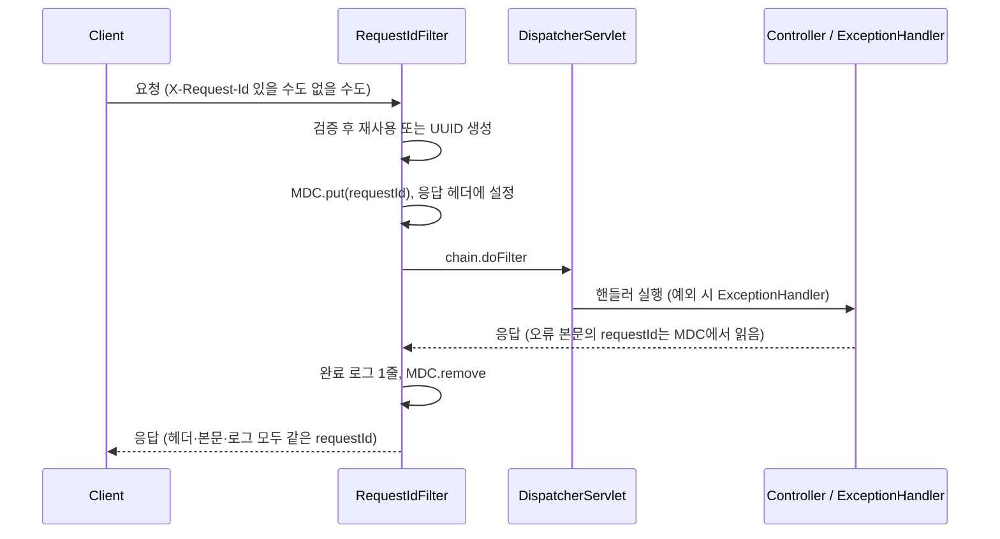

# Week 4 — 운영 가능한 API 완성 (execution-guide)

prep-questions.md의 판단을 실제 구현 순서로 정리한 것. 대상 저장소는
`challenge-spring-boot-2026-09-wlghsp-r20`, 브랜치는 `submit/week-04__weekly-pr`.

## 기존 코드 확인 결과 (2026-10-07 시점)

- `TodoController`에는 `POST /todos`, `GET /todos/{id}` 두 개뿐이다. `UserController`는 아직 없다.
- `ErrorResponse`는 `record ErrorResponse(String code, String message)`. 생성하는 곳은 `GlobalExceptionHandler`의 세 핸들러(MethodArgumentNotValid, TodoNotFound, IllegalArgument)뿐이다.
- `GlobalExceptionHandler`에 없는 400/404 경로가 있다. 이 상태로는 "모든 400·404 응답이 공통 형식"이라는 요구를 못 채운다.
  - `/todos/abc` 같은 타입 불일치 (`MethodArgumentTypeMismatchException`) → 현재 스프링 기본 오류 JSON이 나간다.
  - 깨진 JSON 본문 (`HttpMessageNotReadableException`) → 마찬가지.
  - 매핑 없는 URL (`NoResourceFoundException`) → 마찬가지.
- `TodoRepository`는 `save / findById / count` 세 개. 구현체는 `JdbcTodoRepository`(@Primary)와 `InMemoryTodoRepository` 두 개라서, 인터페이스에 메서드를 추가하면 둘 다 구현해야 컴파일된다.
- `UserRepository`에는 `findById`가 이미 있다. 존재하지 않는 userId 404 판정에 그대로 쓴다.
- `TodoApiTest`는 `@SpringBootTest + @AutoConfigureMockMvc` 구조. 새 테스트도 같은 구조로 간다.
- `application.yml`은 `logging.level.org.springframework.web: DEBUG` 한 줄뿐이다. 로그 패턴 설정이 없어서 requestId가 로그에 안 찍힌다.
- Spring Boot 3.3.5. 내장 구조화 로깅(JSON 포맷)은 3.4부터라서 이 버전에선 쓸 수 없다. 이번 주 "구조화 로그"는 `key=value` 형식 패턴으로 간다.

## 이번 가이드가 따르는 결정

prep-questions.md에 적힌 답에서 가져온 것:
- 컨트롤러는 `UserController`를 새로 만들어 `POST /users`, `POST /users/{userId}/todos`, `GET /users/{userId}/todos`를 둔다. `TodoController`는 그대로 둔다.
- `POST /todos`(user_id 없는 Todo)는 유지한다. user_id 없는 Todo가 생겨도 된다.
- 이미 있는 userId로 Todo만 만드는 서비스 메서드를 `UserTodoService`에 새로 추가한다.
- requestId는 요청 진입점(서블릿 필터)에서 한 번만 정하고, MDC로 공유한다.
- 페이징 응답은 제네릭 `PageResponse<T>`로 감싼다. 최대 size는 100, 범위 밖이나 음수는 400.
- 외부 X-Request-Id가 비었거나 형식이 틀리면 새로 만든다.

prep-questions.md에 답이 없어서 이 가이드가 임시로 정한 것 (바꾸고 싶으면 알려주세요):
- 테스트 격리 (필수 3): 테스트마다 새 User를 만들고 그 사용자의 목록만 조회한다. `totalElements`가 사용자별 집계라서 다른 테스트의 잔재가 섞여도 영향이 없고, `@BeforeEach` 클린징이 필요 없다.
- 형식 검증 규칙: `^[A-Za-z0-9._-]{1,64}$`. 영숫자와 `.`, `_`, `-`만 허용한다. 개행이나 공백이 들어간 값이 로그에 그대로 찍히는 로그 인젝션을 막는다.

## 요청 흐름



예외 핸들러는 DispatcherServlet 안에서 실행되므로 필터가 MDC를 세팅한 뒤에 돈다. 그래서 오류 본문에서도 `MDC.get("requestId")`로 같은 값을 꺼낼 수 있다.

## 순서

### 1. requestId 기반 만들기 (필수 4 + 필수 2의 requestId 부분)

가장 먼저 한다. 이후 모든 응답과 테스트가 이 위에 올라간다.

`src/main/java/co/dingcodingco/challenge/common/RequestIdFilter.java` (새 파일)

```java
package co.dingcodingco.challenge.common;

import jakarta.servlet.FilterChain;
import jakarta.servlet.ServletException;
import jakarta.servlet.http.HttpServletRequest;
import jakarta.servlet.http.HttpServletResponse;
import org.slf4j.Logger;
import org.slf4j.LoggerFactory;
import org.slf4j.MDC;
import org.springframework.core.Ordered;
import org.springframework.core.annotation.Order;
import org.springframework.stereotype.Component;
import org.springframework.web.filter.OncePerRequestFilter;

import java.io.IOException;
import java.util.UUID;
import java.util.regex.Pattern;

@Component
@Order(Ordered.HIGHEST_PRECEDENCE)
public class RequestIdFilter extends OncePerRequestFilter {
    public static final String HEADER = "X-Request-Id";
    public static final String MDC_KEY = "requestId";

    private static final Pattern VALID_ID = Pattern.compile("^[A-Za-z0-9._-]{1,64}$");
    private static final Logger log = LoggerFactory.getLogger(RequestIdFilter.class);

    @Override
    protected void doFilterInternal(HttpServletRequest request, HttpServletResponse response,
                                    FilterChain chain) throws ServletException, IOException {
        String requestId = resolve(request.getHeader(HEADER));
        MDC.put(MDC_KEY, requestId);
        response.setHeader(HEADER, requestId);
        long start = System.nanoTime();
        try {
            chain.doFilter(request, response);
        } finally {
            long durationMs = (System.nanoTime() - start) / 1_000_000;
            log.info("request completed method={} path={} status={} durationMs={}",
                    request.getMethod(), request.getRequestURI(), response.getStatus(), durationMs);
            MDC.remove(MDC_KEY);
        }
    }

    private String resolve(String incoming) {
        if (incoming != null && VALID_ID.matcher(incoming).matches()) {
            return incoming;
        }
        return UUID.randomUUID().toString();
    }
}
```

- `@Order(HIGHEST_PRECEDENCE)`로 다른 필터보다 먼저 돈다. 그래야 이후 단계의 로그에도 requestId가 붙는다.
- 로그에는 method, path, status, 소요 시간만 남긴다. 요청 본문, 헤더 전체, 쿼리 스트링은 찍지 않는다 (미션의 "본문·인증 정보 제외"). `getRequestURI()`는 쿼리 스트링을 포함하지 않는다.
- MDC는 스레드 로컬이라 톰캣 스레드 풀에서 스레드가 재사용된다. `finally`에서 `remove`하지 않으면 다음 요청에 이전 requestId가 샌다.

`ErrorResponse.java` 수정

```java
package co.dingcodingco.challenge.common;

import org.slf4j.MDC;

public record ErrorResponse(String code, String message, String requestId) {

    public static ErrorResponse of(String code, String message) {
        return new ErrorResponse(code, message, MDC.get(RequestIdFilter.MDC_KEY));
    }
}
```

`GlobalExceptionHandler.java`의 기존 세 핸들러에서 `new ErrorResponse("...", msg)`를 `ErrorResponse.of("...", msg)`로 바꾼다. 이 시점에 컴파일이 깨지는 곳은 그 세 곳뿐이다.

`application.yml` 수정 (기존 DEBUG 설정은 유지)

```yaml
logging:
  level:
    org.springframework.web: DEBUG
  pattern:
    level: "%5p [requestId=%X{requestId:-}]"
```

기존 `org.springframework.web: DEBUG`는 요청 본문을 찍지 않는다 (헤더·파라미터 상세는 `spring.mvc.log-request-details=true`를 켜야 찍힌다). 이 옵션은 켜지 않는다. `CommonsRequestLoggingFilter`도 등록하지 않는다 (prep-questions 필수 4에 적은 위험 지점).

verify: 앱을 띄우고 `curl -i localhost:8080/todos/999999`
- 응답 헤더에 `X-Request-Id`가 있다.
- 본문의 `requestId`가 그 헤더 값과 같다.
- 콘솔의 `request completed ...` 줄에 같은 `requestId=`가 찍힌다.

### 2. 오류 처리 빠진 경로 채우기 (필수 2)

`UserNotFoundException.java` (user 패키지, 새 파일. `TodoNotFoundException`과 같은 형태)

```java
package co.dingcodingco.challenge.user;

public class UserNotFoundException extends RuntimeException {
    public UserNotFoundException(Long id) {
        super("User not found: id=" + id);
    }
}
```

`GlobalExceptionHandler.java`에 핸들러 추가

```java
@ExceptionHandler(UserNotFoundException.class)
public ResponseEntity<ErrorResponse> handleUserNotFound(UserNotFoundException ex) {
    return ResponseEntity.status(HttpStatus.NOT_FOUND)
            .body(ErrorResponse.of("USER_NOT_FOUND", ex.getMessage()));
}

@ExceptionHandler(MethodArgumentTypeMismatchException.class)
public ResponseEntity<ErrorResponse> handleTypeMismatch(MethodArgumentTypeMismatchException ex) {
    return ResponseEntity.status(HttpStatus.BAD_REQUEST)
            .body(ErrorResponse.of("INVALID_REQUEST", ex.getName() + " has invalid value"));
}

@ExceptionHandler(HttpMessageNotReadableException.class)
public ResponseEntity<ErrorResponse> handleUnreadable(HttpMessageNotReadableException ex) {
    return ResponseEntity.status(HttpStatus.BAD_REQUEST)
            .body(ErrorResponse.of("INVALID_REQUEST", "malformed request body"));
}

@ExceptionHandler(NoResourceFoundException.class)
public ResponseEntity<ErrorResponse> handleNoResource(NoResourceFoundException ex) {
    return ResponseEntity.status(HttpStatus.NOT_FOUND)
            .body(ErrorResponse.of("NOT_FOUND", "resource not found"));
}
```

- `HttpMessageNotReadableException`의 메시지에는 파싱 실패한 본문 조각이 들어갈 수 있다. 그래서 `ex.getMessage()`를 쓰지 않고 고정 문구를 쓴다 (본문을 응답과 로그에 흘리지 않기 위해).
- `NoResourceFoundException`은 Spring 6.1(Boot 3.3)에서 매핑 없는 경로에 던져진다.

verify: `/todos/abc`, 깨진 JSON을 보낸 `POST /todos`, `/nope` 세 요청이 모두 `code·message·requestId` 형식의 400/404를 돌려준다.

### 3. User API: POST /users (필수 1)

`UserCreateRequest.java`, `UserResponse.java`, `UserService.java`, `UserController.java`를 user 패키지에 만든다.

```java
public record UserCreateRequest(
        @NotBlank
        @Size(min = 1, max = 100)
        String name
) {
}

public record UserResponse(Long id, String name) {
    public static UserResponse from(User user) {
        return new UserResponse(user.getId(), user.getName());
    }
}

@Service
public class UserService {
    private final UserRepository userRepository;

    public UserService(UserRepository userRepository) {
        this.userRepository = userRepository;
    }

    public User create(String name) {
        return userRepository.save(new User(name));
    }
}
```

`@Size(max = 100)`은 `challenge_user.name varchar(100)`에 맞춘 것이다. 검증 없이 두면 101자에서 DB 오류(500)가 난다.

`UserController`에는 우선 `POST /users`만 둔다 (나머지 둘은 4, 5번에서 추가).

```java
@RestController
public class UserController {
    private final UserService userService;
    private final UserTodoService userTodoService;

    public UserController(UserService userService, UserTodoService userTodoService) {
        this.userService = userService;
        this.userTodoService = userTodoService;
    }

    @PostMapping("/users")
    public ResponseEntity<UserResponse> createUser(@Valid @RequestBody UserCreateRequest request) {
        User result = userService.create(request.name());
        return ResponseEntity.status(HttpStatus.CREATED).body(UserResponse.from(result));
    }
}
```

verify: `POST /users {"name":"지호"}` → 201 + `id`. 빈 name → 400 INVALID_REQUEST.

### 4. POST /users/{userId}/todos (필수 1)

`TodoResponse`에 `userId`를 추가한다. 기존 `TodoApiTest`는 `jsonPath`로 필드를 개별 확인하고, `TodoResponse`로 역직렬화하는 부분도 필드가 늘어도 깨지지 않는다.

```java
public record TodoResponse(Long id, Long userId, String title, boolean completed) {
    public static TodoResponse from(Todo todo) {
        return new TodoResponse(todo.getId(), todo.getUserId(), todo.getTitle(), todo.isCompleted());
    }
}
```

`TodoApiTest.findById_existing_returns200`이 `new TodoResponse(...)`를 직접 호출하지 않는지만 확인한다 (지금 코드에는 없음).

`UserTodoService`에 메서드 추가 (기존 두 메서드는 손대지 않는다)

```java
public Todo createTodoForUser(Long userId, String title, boolean completed) {
    userRepository.findById(userId).orElseThrow(() -> new UserNotFoundException(userId));
    return todoRepository.save(new Todo(userId, title, completed));
}
```

`UserController`에 추가

```java
@PostMapping("/users/{userId}/todos")
public ResponseEntity<TodoResponse> createTodo(@PathVariable Long userId,
                                               @Valid @RequestBody TodoCreateRequest request) {
    Todo result = userTodoService.createTodoForUser(userId, request.title(), request.completed());
    return ResponseEntity.status(HttpStatus.CREATED).body(TodoResponse.from(result));
}
```

조회 후 저장이라 그 사이에 User가 지워지는 경쟁 상태가 이론상 있다. 이 레포엔 User 삭제 기능이 없고, 있더라도 `fk_todo_user` 외래키가 최종 방어선이라 이번 주엔 트랜잭션을 더 얹지 않는다.

verify: 존재하는 userId → 201 + `userId` 포함. 없는 userId → 404 USER_NOT_FOUND.

### 5. GET /users/{userId}/todos 페이징 (필수 2)

`common/PageResponse.java` (새 파일)

```java
package co.dingcodingco.challenge.common;

import java.util.List;
import java.util.function.Function;

public record PageResponse<T>(List<T> content, int page, int size, long totalElements, boolean hasNext) {

    public static <T> PageResponse<T> of(List<T> content, int page, int size, long totalElements) {
        boolean hasNext = (long) (page + 1) * size < totalElements;
        return new PageResponse<>(content, page, size, totalElements, hasNext);
    }

    public <R> PageResponse<R> map(Function<T, R> mapper) {
        return new PageResponse<>(content.stream().map(mapper).toList(), page, size, totalElements, hasNext);
    }
}
```

`TodoRepository`에 메서드 두 개 추가

```java
List<Todo> findByUserId(Long userId, int page, int size);
long countByUserId(Long userId);
```

`JdbcTodoRepository` 구현. `findById`의 행 매핑 람다를 필드로 빼서 둘이 공유한다 (같은 매핑을 두 번 쓰지 않으려는 정리이고, 동작은 같다).

```java
private static final RowMapper<Todo> TODO_ROW_MAPPER = (rs, rowNum) -> new Todo(
        rs.getLong("id"),
        (Long) rs.getObject("user_id"),
        rs.getString("title"),
        rs.getBoolean("completed"));

@Override
public List<Todo> findByUserId(Long userId, int page, int size) {
    return jdbcTemplate.query(
            "select id, user_id, title, completed from todo "
                    + "where user_id = ? order by id asc limit ? offset ?",
            TODO_ROW_MAPPER, userId, size, (long) page * size);
}

@Override
public long countByUserId(Long userId) {
    return jdbcTemplate.queryForObject(
            "select count(*) from todo where user_id = ?", Long.class, userId);
}
```

`order by id asc`가 "안정된 정렬"의 핵심이다. 정렬 없이 `limit/offset`을 쓰면 DB가 행 순서를 보장하지 않아서 페이지 사이에 중복·누락이 생길 수 있다. id는 유일하고 증가하므로 동률이 없다.

`InMemoryTodoRepository` 구현 (`@Primary`가 아니라 실제 서비스에선 안 쓰이지만, 인터페이스를 구현하므로 컴파일을 위해 필요)

```java
@Override
public List<Todo> findByUserId(Long userId, int page, int size) {
    return store.values().stream()
            .filter(t -> userId.equals(t.getUserId()))
            .sorted(Comparator.comparing(Todo::getId))
            .skip((long) page * size)
            .limit(size)
            .toList();
}

@Override
public long countByUserId(Long userId) {
    return store.values().stream().filter(t -> userId.equals(t.getUserId())).count();
}
```

`UserTodoService`에 메서드 추가

```java
private static final int MAX_PAGE_SIZE = 100;

public PageResponse<Todo> findTodosByUser(Long userId, int page, int size) {
    if (page < 0) {
        throw new IllegalArgumentException("page must be >= 0");
    }
    if (size < 1 || size > MAX_PAGE_SIZE) {
        throw new IllegalArgumentException("size must be between 1 and " + MAX_PAGE_SIZE);
    }
    userRepository.findById(userId).orElseThrow(() -> new UserNotFoundException(userId));
    List<Todo> content = todoRepository.findByUserId(userId, page, size);
    long total = todoRepository.countByUserId(userId);
    return PageResponse.of(content, page, size, total);
}
```

- 파라미터 검증을 사용자 조회보다 먼저 한다. 잘못된 요청은 DB를 건드리기 전에 400으로 끝난다.
- 기존 `IllegalArgumentException` 핸들러가 400 INVALID_REQUEST로 바꿔준다.
- 사용자는 있는데 Todo가 0건이면 200 + 빈 `content`, 사용자가 없으면 404다. 둘을 구분하려고 존재 확인을 한다.

`UserController`에 추가

```java
@GetMapping("/users/{userId}/todos")
public ResponseEntity<PageResponse<TodoResponse>> getTodos(
        @PathVariable Long userId,
        @RequestParam(defaultValue = "0") int page,
        @RequestParam(defaultValue = "20") int size) {
    PageResponse<TodoResponse> result =
            userTodoService.findTodosByUser(userId, page, size).map(TodoResponse::from);
    return ResponseEntity.ok(result);
}
```

`page=abc`처럼 숫자가 아닌 값은 컨트롤러에 들어오기 전에 `MethodArgumentTypeMismatchException`이 되고, 2번에서 추가한 핸들러가 400으로 바꾼다.

### 6. 통합 테스트 (필수 3, 필수 4 증거)

테스트 격리: 테스트마다 새 User를 만들고 그 사용자의 목록만 본다. `totalElements`가 `where user_id = ?` 집계라서 다른 테스트가 남긴 Todo가 섞이지 않는다. Week 3처럼 `@BeforeEach`로 테이블을 지우지 않아도 된다.

`src/test/java/co/dingcodingco/challenge/user/UserTodoApiTest.java`

```java
@SpringBootTest
@AutoConfigureMockMvc
class UserTodoApiTest {

    @Autowired
    private MockMvc mockMvc;
    @Autowired
    private ObjectMapper objectMapper;

    private long createUser(String name) throws Exception {
        String body = mockMvc.perform(post("/users")
                        .contentType(MediaType.APPLICATION_JSON)
                        .content("{\"name\":\"" + name + "\"}"))
                .andExpect(status().isCreated())
                .andReturn().getResponse().getContentAsString(StandardCharsets.UTF_8);
        return objectMapper.readTree(body).get("id").asLong();
    }

    private void createTodo(long userId, String title) throws Exception {
        mockMvc.perform(post("/users/{userId}/todos", userId)
                        .contentType(MediaType.APPLICATION_JSON)
                        .content("{\"title\":\"" + title + "\",\"completed\":false}"))
                .andExpect(status().isCreated());
    }

    @Test
    void emptyList_returns200WithEmptyContent() throws Exception {
        long userId = createUser("empty");

        mockMvc.perform(get("/users/{userId}/todos", userId))
                .andExpect(status().isOk())
                .andExpect(jsonPath("$.content.length()").value(0))
                .andExpect(jsonPath("$.totalElements").value(0))
                .andExpect(jsonPath("$.hasNext").value(false));
    }

    @Test
    void multiplePages_ascendingById_withMetadata() throws Exception {
        long userId = createUser("paging");
        for (int i = 1; i <= 5; i++) {
            createTodo(userId, "todo-" + i);
        }

        mockMvc.perform(get("/users/{userId}/todos", userId).param("page", "0").param("size", "2"))
                .andExpect(status().isOk())
                .andExpect(jsonPath("$.content.length()").value(2))
                .andExpect(jsonPath("$.content[0].title").value("todo-1"))
                .andExpect(jsonPath("$.content[1].title").value("todo-2"))
                .andExpect(jsonPath("$.totalElements").value(5))
                .andExpect(jsonPath("$.hasNext").value(true));

        mockMvc.perform(get("/users/{userId}/todos", userId).param("page", "2").param("size", "2"))
                .andExpect(jsonPath("$.content.length()").value(1))
                .andExpect(jsonPath("$.content[0].title").value("todo-5"))
                .andExpect(jsonPath("$.hasNext").value(false));
    }

    @Test
    void defaults_pageZeroSizeTwenty() throws Exception {
        long userId = createUser("defaults");
        createTodo(userId, "only");

        mockMvc.perform(get("/users/{userId}/todos", userId))
                .andExpect(jsonPath("$.page").value(0))
                .andExpect(jsonPath("$.size").value(20));
    }

    @ParameterizedTest
    @CsvSource({"-1,20", "0,0", "0,101", "0,-5"})
    void invalidPageOrSize_returns400(String page, String size) throws Exception {
        long userId = createUser("invalid");

        mockMvc.perform(get("/users/{userId}/todos", userId).param("page", page).param("size", size))
                .andExpect(status().isBadRequest())
                .andExpect(jsonPath("$.code").value("INVALID_REQUEST"))
                .andExpect(jsonPath("$.requestId").isNotEmpty());
    }

    @Test
    void nonNumericPage_returns400() throws Exception {
        long userId = createUser("nan");

        mockMvc.perform(get("/users/{userId}/todos", userId).param("page", "abc"))
                .andExpect(status().isBadRequest())
                .andExpect(jsonPath("$.code").value("INVALID_REQUEST"));
    }

    @Test
    void unknownUser_list_returns404() throws Exception {
        mockMvc.perform(get("/users/{userId}/todos", 999999L))
                .andExpect(status().isNotFound())
                .andExpect(jsonPath("$.code").value("USER_NOT_FOUND"))
                .andExpect(jsonPath("$.requestId").isNotEmpty());
    }

    @Test
    void unknownUser_createTodo_returns404() throws Exception {
        mockMvc.perform(post("/users/{userId}/todos", 999999L)
                        .contentType(MediaType.APPLICATION_JSON)
                        .content("{\"title\":\"x\",\"completed\":false}"))
                .andExpect(status().isNotFound())
                .andExpect(jsonPath("$.code").value("USER_NOT_FOUND"));
    }

    @Test
    void createUser_blankName_returns400() throws Exception {
        mockMvc.perform(post("/users")
                        .contentType(MediaType.APPLICATION_JSON)
                        .content("{\"name\":\"\"}"))
                .andExpect(status().isBadRequest())
                .andExpect(jsonPath("$.code").value("INVALID_REQUEST"));
    }   

    @Test
    void legacyPostTodos_stillWorks_withNullUserId() throws Exception {
        mockMvc.perform(post("/todos")
                        .contentType(MediaType.APPLICATION_JSON)
                        .content("{\"title\":\"legacy\",\"completed\":false}"))
                .andExpect(status().isCreated())
                .andExpect(jsonPath("$.userId").doesNotExist());
    }
}
```

`legacyPostTodos_stillWorks_withNullUserId`는 필수 1의 "1주차 계약 유지"를 테스트로 고정하는 것이다. `userId`가 null이면 Jackson 기본 설정에서 `"userId": null`로 직렬화되므로, `doesNotExist()`가 실패하면 `jsonPath("$.userId").value(nullValue())`로 바꾼다 (실행해보고 정한다).

`src/test/java/co/dingcodingco/challenge/common/RequestIdTest.java`

```java
@SpringBootTest
@AutoConfigureMockMvc
@ExtendWith(OutputCaptureExtension.class)
class RequestIdTest {

    @Autowired
    private MockMvc mockMvc;

    @Test
    void validIncomingId_isReused_inHeaderBodyAndLog(CapturedOutput output) throws Exception {
        mockMvc.perform(get("/todos/{id}", 999999L).header("X-Request-Id", "abc-123"))
                .andExpect(status().isNotFound())
                .andExpect(header().string("X-Request-Id", "abc-123"))
                .andExpect(jsonPath("$.requestId").value("abc-123"));

        assertThat(output.getOut()).contains("requestId=abc-123");
    }

    @Test
    void missingId_isGenerated() throws Exception {
        MvcResult result = mockMvc.perform(get("/todos/{id}", 999999L)).andReturn();

        String header = result.getResponse().getHeader("X-Request-Id");
        assertThat(header).matches("[0-9a-f-]{36}");
        assertThat(result.getResponse().getContentAsString()).contains(header);
    }

    @ParameterizedTest
    @ValueSource(strings = {"has space", "bad/id", "", " "})
    void invalidIncomingId_isReplaced(String incoming) throws Exception {
        MvcResult result = mockMvc.perform(get("/todos/{id}", 999999L)
                .header("X-Request-Id", incoming)).andReturn();

        assertThat(result.getResponse().getHeader("X-Request-Id")).isNotEqualTo(incoming).matches("[0-9a-f-]{36}");
    }

    @Test
    void tooLongIncomingId_isReplaced() throws Exception {
        String tooLong = "a".repeat(65);

        MvcResult result = mockMvc.perform(get("/todos/{id}", 999999L)
                .header("X-Request-Id", tooLong)).andReturn();

        assertThat(result.getResponse().getHeader("X-Request-Id")).isNotEqualTo(tooLong);
    }
}
```

로그 증거(`output.getOut()`)는 `request completed ...` 한 줄과 Spring 쪽 로그에 `requestId=abc-123`이 붙었는지를 본다. 이 테스트의 출력이 곧 "응답·오류·로그에서 같은 requestId를 확인한 관측 증거"가 된다. 캡처 대상은 실행 결과 콘솔 한 줄이다.

verify: `./mvnw test` (또는 `mvn test`)에서 새 테스트와 기존 테스트 전부 통과. 기존 `TodoApiTest`의 `jsonPath("$.code")` 단언은 영향이 없다.

### 7. 근거형 질문 1~4 답변과 증거 정리

prep-questions.md의 "근거형 질문 사전 판단" 네 칸이 아직 비어 있다. 코드를 쓰기 전 시점의 최초 판단을 먼저 적어야 한다. 구현이 끝난 뒤 PR 설명에 실제 코드와 연결해서 반영한다.
- 질문 1 (오류 형식 공통화): 이 가이드의 `ErrorResponse.of`, 핸들러 전체가 근거 코드다.
- 질문 2 (페이지 vs 커서): `order by id asc limit offset` 구현과 총 개수 메타데이터가 근거 코드다.
- 질문 3 (로그에 남길 것과 남기면 안 될 것): `RequestIdFilter`의 로그 필드 목록과 prep-questions 필수 4에서 짚은 위험 지점 두 가지가 근거다.
- 질문 4 (첫 관측 지표): 이번 주 `request completed` 로그가 요청 수, 상태 코드, 지연 시간의 원천이라는 점에서 출발한다.

리뷰 지적 반영: 3주차 리뷰의 "TodoApiTest/TodoServiceAopTest 클린징 부재"는 이번 주 범위 밖이다. 새 테스트는 사용자별 필터링으로 격리를 확보하므로 같은 문제가 재발하지 않는다. 이 사실을 PR의 "리뷰 지적 반영" 항목에 적는다.

### 8. (선택 확장) 첫 관측 지표 추가 (선택 5)

미션 5번은 커서 페이징 비교 실험 또는 첫 관측 지표 추가 중 하나다.
이 가이드는 관측 지표를 고른다.

고른 이유:
- 근거형 질문 4번("운영 전 첫 관측 지표와 장애 검증")의 답을 구현과 실측으로 채울 수 있다.
- 규모가 작다. Spring Boot가 `http_server_requests`로 요청 수, 상태 코드, 지연 시간을 이미 계측한다.
- 커서 비교는 데이터를 크게 늘려 같은 조건으로 재야 의미가 있고 새 쿼리도 필요해서 상대적으로 무겁다.

필수 1~4가 끝난 뒤에 진행한다. 필수 증거가 먼저 완성돼 있어야 한다.

**8-1. 의존성 추가** — `pom.xml`의 `<dependencies>`에 두 개를 더한다.

```xml
<dependency>
    <groupId>org.springframework.boot</groupId>
    <artifactId>spring-boot-starter-actuator</artifactId>
</dependency>
<dependency>
    <groupId>io.micrometer</groupId>
    <artifactId>micrometer-registry-prometheus</artifactId>
</dependency>
```

- 버전은 Spring Boot 3.3.5의 BOM이 정하므로 쓰지 않는다.
- 현재 `pom.xml`에는 둘 다 없다.

**8-2. 엔드포인트 노출** — `application.yml`에 추가한다.

```yaml
management:
  endpoints:
    web:
      exposure:
        include: health,prometheus
```

- 기존 `GET /health`(HealthController)와 `/actuator/health`는 다른 경로라 충돌하지 않는다.
- 로그에서 `/actuator/prometheus`가 404로 찍히던 것은 이 엔드포인트가 없었기 때문으로 보인다.
  (5초마다 오는 요청이 스크레이프로 보인다. 확인한 것은 아니다.)
- 스크레이프 요청도 `RequestIdFilter`를 지나서 `request completed` 로그가 5초마다 한 줄씩 찍힌다.
  로그가 시끄러우면 이 경로를 로그에서 제외하는 것을 검토한다 (필수 증거에는 영향 없음).

선택: p95 같은 분위수를 보려면 히스토그램을 켠다.

```yaml
management:
  metrics:
    distribution:
      percentiles-histogram:
        http.server.requests: true
```

**8-3. 실행해서 확인한다**

앱을 띄우고 성공, 400, 404를 섞어서 호출한다.

```bash
curl -s -X POST localhost:8080/users -H 'Content-Type: application/json' -d '{"name":"jiho"}'
curl -s localhost:8080/users/1/todos
curl -s localhost:8080/users/999999/todos
curl -s "localhost:8080/users/1/todos?size=0"
```

지표를 확인한다.

```bash
curl -s localhost:8080/actuator/prometheus | grep http_server_requests_seconds_count


2026-09-wlghsp-r20 % curl -s localhost:8080/actuator/prometheus | grep http_server_r
grepsts_seconds_count
http_server_requests_seconds_count{error="none",exception="none",method="GET",outcome="CLIENT_ERROR",status="400",uri="/users/{userId}/todos"} 1
http_server_requests_seconds_count{error="none",exception="none",method="GET",outcome="CLIENT_ERROR",status="404",uri="/users/{userId}/todos"} 1
http_server_requests_seconds_count{error="none",exception="none",method="GET",outcome="SUCCESS",status="200",uri="/users/{userId}/todos"} 1
http_server_requests_seconds_count{error="none",exception="none",method="POST",outcome="SUCCESS",status="201",uri="/users"} 1
```

기대하는 것:
- 줄마다 `method`, `status`, `outcome`, `uri` 태그가 붙는다.
- `uri`는 `/users/{userId}/todos`처럼 경로 변수가 템플릿으로 집계된다.
  (`/users/1/todos`, `/users/999999/todos`가 한 줄로 합쳐진다. 실제로 확인한다.)
- 호출할 때마다 해당 줄의 `_count`가 늘고, 200, 400, 404가 `status`별로 나뉜다.

지표 세 가지의 읽는 법:
- 요청 수: `http_server_requests_seconds_count`
- 오류율: 4xx·5xx `_count`의 합을 전체 `_count`로 나눈 값
- 지연 시간: `_sum / _count`가 평균이고, 히스토그램을 켰다면 `_bucket`으로 p95를 계산

**8-4. (선택) 지표가 나오는지 테스트로 고정**

```java
@SpringBootTest
@AutoConfigureMockMvc
@AutoConfigureObservability
class MetricsTest {
    @Autowired
    private MockMvc mockMvc;

    @Test
    void httpServerRequests_areExposed() throws Exception {
        mockMvc.perform(get("/todos/{id}", 999999L));

        mockMvc.perform(get("/actuator/prometheus"))
                .andExpect(status().isOk())
                .andExpect(content().string(containsString("http_server_requests_seconds_count")));
    }
}
```

- `@SpringBootTest`에서는 메트릭 내보내기가 기본으로 꺼져 있어서 `@AutoConfigureObservability`가 필요하다고 알고 있다.
  (이 테스트는 실행해서 확인하지 않았다.)
- 안 되면 이 테스트는 건너뛰고 8-3의 수동 확인 결과를 증거로 쓴다.

**8-5. evidence에 남길 것**

- `curl`로 호출한 요청 목록과 `grep http_server_requests_seconds_count` 출력
- 근거형 질문 4번 답:
  - 첫 지표: 엔드포인트별 요청 수·오류율·지연 시간
  - 장애 검증: 이번 주 확인한 것과 하지 않은 것을 구분해서 적는다
    (현재 `GlobalExceptionHandler`에는 `Exception` 전체를 받는 핸들러가 없어서 500은 Spring 기본 오류 본문이 나간다.
    500의 공통 형식은 미션 범위가 아니라서 한계로만 적는다.)
- 한계: 로컬에서 직접 호출한 소수의 요청으로 확인한 것이고 부하 상태의 값이 아니다.

verify: `/actuator/prometheus`에 `http_server_requests_seconds_count`가 나오고, 200·400·404 호출이 `status`별로 갈려서 늘어난다. 기존 46개 테스트가 그대로 통과한다.

#### 실행 기록 (evidence용, 2026-10-07)

호출한 요청 (8-3의 네 개를 한 번씩):
- `POST /users` → 201
- `GET /users/1/todos` → 200
- `GET /users/999999/todos` → 404
- `GET /users/1/todos?size=0` → 400

요청 수 (`http_server_requests_seconds_count`):

```
http_server_requests_seconds_count{error="none",exception="none",method="GET",outcome="CLIENT_ERROR",status="400",uri="/users/{userId}/todos"} 1
http_server_requests_seconds_count{error="none",exception="none",method="GET",outcome="CLIENT_ERROR",status="404",uri="/users/{userId}/todos"} 1
http_server_requests_seconds_count{error="none",exception="none",method="GET",outcome="SUCCESS",status="200",uri="/users/{userId}/todos"} 1
http_server_requests_seconds_count{error="none",exception="none",method="POST",outcome="SUCCESS",status="201",uri="/users"} 1
```

지연 시간 (`_count`와 `_sum`, `uri="/users/{userId}/todos"`만):

```
http_server_requests_seconds_count{error="none",exception="none",method="GET",outcome="CLIENT_ERROR",status="400",uri="/users/{userId}/todos"} 1
http_server_requests_seconds_sum{error="none",exception="none",method="GET",outcome="CLIENT_ERROR",status="400",uri="/users/{userId}/todos"} 0.00262975
http_server_requests_seconds_count{error="none",exception="none",method="GET",outcome="CLIENT_ERROR",status="404",uri="/users/{userId}/todos"} 1
http_server_requests_seconds_sum{error="none",exception="none",method="GET",outcome="CLIENT_ERROR",status="404",uri="/users/{userId}/todos"} 0.00575225
http_server_requests_seconds_count{error="none",exception="none",method="GET",outcome="SUCCESS",status="200",uri="/users/{userId}/todos"} 1
http_server_requests_seconds_sum{error="none",exception="none",method="GET",outcome="SUCCESS",status="200",uri="/users/{userId}/todos"} 0.014646833
```

읽은 결과 (평균 = `_sum / _count`):
- 400: 약 2.6ms (0.00262975s)
- 404: 약 5.8ms (0.00575225s)
- 200: 약 14.6ms (0.014646833s)
- 요청 4건 중 4xx가 2건이라 이번 샘플의 오류율은 2/4다.
  (계산 방식을 보여 주는 값이고 의미 있는 비율은 아니다.)

확인한 것:
- `uri`가 `/users/{userId}/todos` 템플릿으로 집계됐다.
  `/users/1/todos`와 `/users/999999/todos`가 한 줄로 합쳐졌다.
- `method`, `status`, `outcome` 태그로 200, 400, 404가 갈렸다.

한계:
- 한 번씩 호출한 값이라 평균이 아니라 단일 요청의 시간이다.
  200이 가장 느린 것은 앱을 띄운 뒤 처음 실행된 요청이라 초기화 비용이 섞였을 가능성이 있다(확인하지 않았다).
- 카운터는 앱을 띄운 뒤의 누적값이고 재기동하면 0부터 다시 센다.
- 부하 상태의 값이 아니다. 히스토그램(`percentiles-histogram`)은 켜 두었지만 p95는 계산하지 않았다.

## 검증 기준

1. 네 엔드포인트가 동작한다 → verify: 위 6번 테스트의 201/200/404 케이스 통과
2. 모든 400·404가 `code·message·requestId` 형식이다 → verify: `INVALID_REQUEST`, `USER_NOT_FOUND`, `TODO_NOT_FOUND`, `NOT_FOUND` 케이스 모두 `$.requestId` 단언 포함
3. 페이징 명세 → verify: 기본값(0/20), 최대 size 100, id 오름차순, `totalElements`·`hasNext` 단언
4. 경계값 → verify: 빈 목록, 여러 페이지, `page=-1`, `size=0`, `size=101`, `page=abc`
5. X-Request-Id → verify: 유효값 재사용, 없음/잘못됨/너무 김 → 새 UUID, 헤더·본문·로그 같은 값
6. 요청 본문·인증 정보가 로그에 없다 → verify: 콘솔 로그에 `request completed ...` 한 줄 형식만 있고 본문이 없는지 눈으로 확인

7. (선택 확장) 첫 관측 지표 → verify: `/actuator/prometheus`에 `http_server_requests_seconds_count`가 보이고 200·400·404가 `status`별로 갈려 늘어난다

5번(선택 확장)은 위 8번 단계로 진행한다. 지표 방식을 골랐고, 커서 페이징 비교는 하지 않는다.
