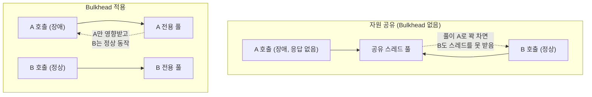

# Bulkhead (격벽)

여러 호출 대상이 공유하는 자원(스레드 풀, 커넥션 풀 등)을 대상별로 분리해서, 하나가 장애를 겪어도 그 여파가 나머지로 번지지 않게 막는 패턴이다.

## 이름의 유래

배의 격벽(bulkhead)에서 따온 이름이다. 배 안을 여러 방수 구획으로 나눠두면, 한 칸에 구멍이 나 물이 차도 그 물이 다른 칸으로 넘어가지 않아 배 전체가 가라앉지 않는다. 소프트웨어에서도 같은 발상을 쓴다 — 여러 호출 대상이 자원을 한데 모아 쓰게 두는 대신, 대상별로 자원을 나눠서 한 대상의 장애가 전체로 번지지 않게 한다.

## 왜 필요한가

여러 외부 시스템을 호출하는 애플리케이션이 그 호출들에 스레드 풀이나 커넥션 풀을 공유하고 있다고 하자. 이 중 하나(A)가 응답하지 않으면, A를 호출하는 스레드들이 계속 점유된 채로 쌓인다. 풀에 있는 스레드가 전부 A를 기다리는 데 쓰이면, A와 전혀 무관한 다른 대상(B)을 호출하려는 요청도 스레드를 못 받아 대기하게 된다. 결국 A 하나의 장애가 B까지 함께 멈추는 결과로 번진다.

## 어떻게 구현하는가

대상별로 별도의 스레드 풀이나 커넥션 풀, 세마포어를 두고 그 한도 안에서만 동시 호출을 허용한다. Resilience4j는 스레드 풀 기반과 세마포어 기반, 두 가지 방식의 Bulkhead 구현을 제공한다.

## 서킷브레이커와 함께 쓰는 이유

서킷브레이커는 "이 대상에 대한 반복 실패를 차단한다"는 시간 축의 보호이고, Bulkhead는 "이 대상이 쓰는 자원을 다른 대상과 분리한다"는 자원 축의 보호다. 서킷브레이커만 있으면 판단이 내려지기 전(CLOSED 상태에서 실패가 누적되는 구간)까지는 자원이 여전히 공유된 채로 영향을 주고받을 수 있다. 이 구간까지 완전히 막으려면 Bulkhead가 필요하다. 자세한 비교는 bulkhead-vs-circuit-breaker.md 참고.

참고: bulkhead-vs-circuit-breaker.md
참고: rate-limiter.md
참고: circuit-breaker.md
