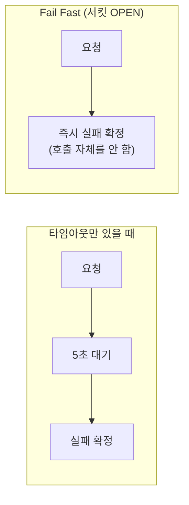

# Fail Fast — 실패를 빨리 확정하고 즉시 대안으로 보낸다

서킷브레이커가 OPEN 상태에서 하는 일을 한 단어로 요약하면 Fail Fast다. 호출을 아예 시도하지 않고 곧바로 실패로 간주해 fallback으로 보낸다.

## 왜 "빠른 실패"가 목표인가

타임아웃만 걸어둔 시스템은 매 호출마다 타임아웃 시간만큼 기다린 뒤에야 실패를 확정한다. 호출 하나당 5초가 걸린다면, 장애 상황에서도 매번 5초씩 소모하며 실패를 반복하게 된다.

Fail Fast는 이 대기 시간 자체를 없앤다. 이미 실패율이 임계값을 넘은 대상이니 이번에도 실패할 확률이 높다고 판단하고 호출 자체를 스킵한다. 실패를 확정하는 데 걸리는 시간이 타임아웃(수 초)에서 사실상 즉시(수 ms)로 줄어든다.

## Fail Fast가 해결하는 것과 못 하는 것

Fail Fast는 이미 실패가 반복되고 있다고 판단된 이후의 대기 시간을 없앤다. 하지만 판단이 내려지기 전, 즉 실패율이 임계값을 넘기 전까지의 호출들은 여전히 실제 타임아웃을 그대로 겪는다. 이 판단 이전/이후의 경계가 정확히 무엇으로 정해지는지는 circuit-breaker-state-transition.md에서 다룬다.

참고: circuit-breaker-state-transition.md
