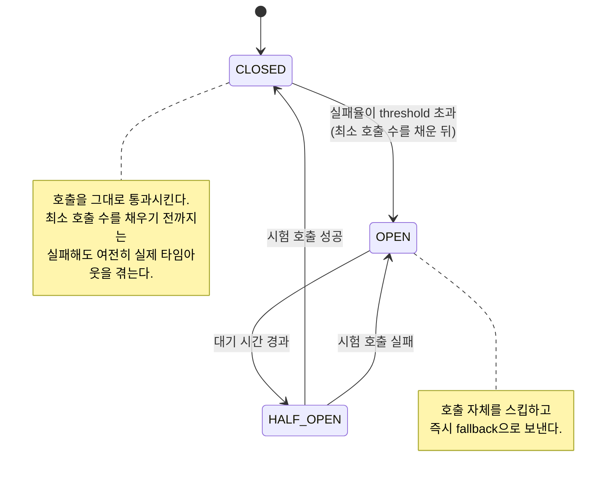

# 서킷브레이커 상태 전이 (CLOSED / OPEN / HALF_OPEN)

서킷브레이커는 세 가지 상태를 오간다. 각 상태가 정확히 무엇을 하고 무엇을 못 하는지 아는 게 중요하다.

## 세 가지 상태

- CLOSED: 기본 상태. 호출을 그대로 통과시키고 실패율만 관찰한다.
- OPEN: 실패율이 임계값을 넘으면 전환된다. 호출 자체를 하지 않고 즉시 fallback으로 보낸다.
- HALF_OPEN: 정해진 대기 시간이 지나면 전환된다. 일부 호출만 시험 삼아 흘려보낸다. 성공하면 CLOSED로, 실패하면 다시 OPEN으로 돌아간다.

## 판단 기준이 되는 값들

- sliding-window-size: 최근 몇 회 호출을 기준으로 실패율을 계산할지
- minimum-number-of-calls: 판단을 시작하려면 최소 몇 회는 실제로 호출해봐야 하는지
- failure-rate-threshold: 이 비율을 넘으면 OPEN으로 전환
- wait-duration-in-open-state: OPEN 상태를 얼마나 유지할지

## 흔히 놓치는 한계 — CLOSED 상태에서도 실패는 그대로 겪는다

서킷브레이커는 minimum-number-of-calls만큼은 실제로 실패해봐야 판단을 시작한다. 즉 장애가 막 시작된 시점부터 서킷이 OPEN되기까지, 그 사이의 호출들은 여전히 타임아웃을 실제로 겪는다. 서킷브레이커가 이 구간을 원천 차단해주지는 않는다.

sliding-window-size나 minimum-number-of-calls를 낮추면 더 빨리 OPEN되지만, 일시적 지연에도 서킷이 쉽게 열려버리는 트레이드오프가 생긴다.

서킷브레이커와 여러 요청을 공유하는 자원(스레드 풀 등)이 얽혀 있으면, CLOSED 구간의 반복 실패가 그 자원을 공유하는 무관한 다른 작업까지 지연시킬 수 있다. 이 경우 서킷브레이커만으로는 해결이 안 되고, 자원 자체를 분리해야 완전히 해결된다.

## 요약

서킷브레이커는 "반복되는 실패"를 빠르게 차단하는 도구이지, "첫 실패까지 걸리는 시간"이나 "그 실패가 다른 기능에 미치는 부수 효과"까지 막아주는 도구는 아니다. 진짜 격리가 필요하면 서킷브레이커와 자원 분리를 함께 봐야 한다.

참고: circuit-breaker-fail-fast.md
참고: bulkhead-vs-circuit-breaker.md
