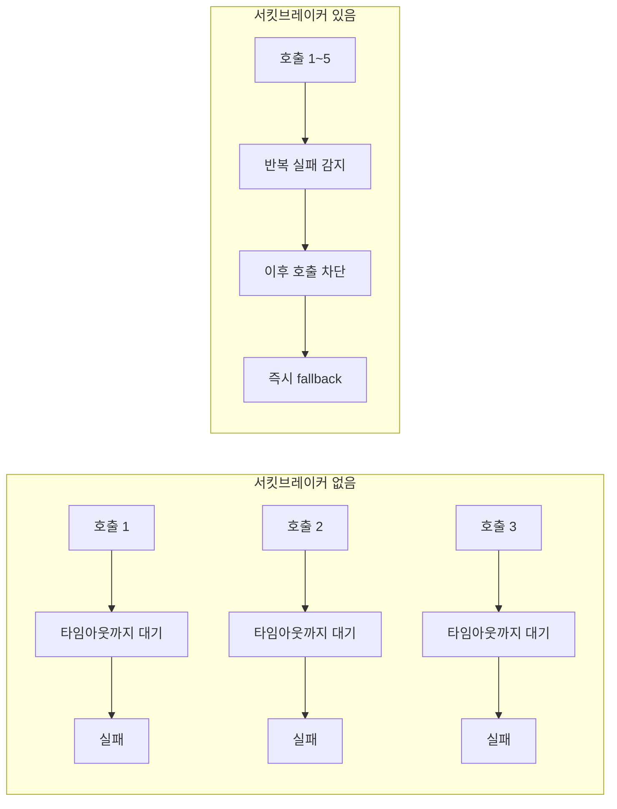

# 서킷브레이커

특정 대상(주로 외부 API나 원격 서비스)에 대한 반복적인 실패를 감지해, 더 이상의 호출을 일시적으로 차단하는 패턴이다.

## 이름의 유래

전기 회로의 차단기(circuit breaker)에서 따온 이름이다. 회로에 과전류가 흐르면 차단기가 회로를 끊어 그 뒤의 기기들을 보호한다. 문제가 있는 회로 구간을 계속 통전시키는 대신 아예 끊어버리는 것이다. 소프트웨어에서도 같은 발상을 쓴다 — 계속 실패하는 호출 경로를 계속 시도하게 두는 대신, 그 경로 자체를 일시적으로 끊어버린다.

## 왜 필요한가

타임아웃만 걸어두면 "각 호출이 얼마나 오래 걸리는지"는 제한할 수 있지만, "실패하는 호출을 계속 반복해서 시도한다"는 문제는 그대로 남는다. 외부 시스템이 응답하지 않는 상황에서도 클라이언트는 매번 타임아웃 시간만큼 기다리며 실패를 반복하게 된다.

이렇게 반복되는 실패는 두 가지 방식으로 문제를 키운다. 하나는 실패마다 소모되는 대기 시간이 누적되는 것이고, 다른 하나는 그 호출이 쓰는 자원(스레드, 커넥션)이 실패한 호출들로 계속 점유되는 것이다. 자원이 점유된 채로 쌓이면, 그 자원을 공유하는 다른 기능까지 영향을 받을 수 있다.

서킷브레이커는 "이 대상은 지금 반복적으로 실패하고 있다"고 판단되면 호출 자체를 멈춘다. 실패를 기다리는 대신 즉시 대안(fallback)으로 넘어가므로, 대기 시간과 자원 점유를 둘 다 줄인다.

## 어떻게 판단하는가

무작정 첫 실패에 반응하지 않는다. 최근 호출들의 실패율을 관찰하다가, 정해둔 기준(예: 최근 10회 중 50% 이상 실패)을 넘으면 차단 모드로 전환한다. 이 판단 과정과 상태가 어떻게 바뀌는지는 circuit-breaker-state-transition.md에서 다룬다.

## 어디서 쓰이는가

주로 마이크로서비스 간 호출, 외부 API 연동, DB나 캐시 같은 원격 자원 접근처럼 "실패할 수 있고, 그 실패가 반복될 수 있는" 네트워크 호출 지점에 적용한다. Java/Spring 생태계에서는 Resilience4j가 대표적인 구현체다.

참고: circuit-breaker-state-transition.md
