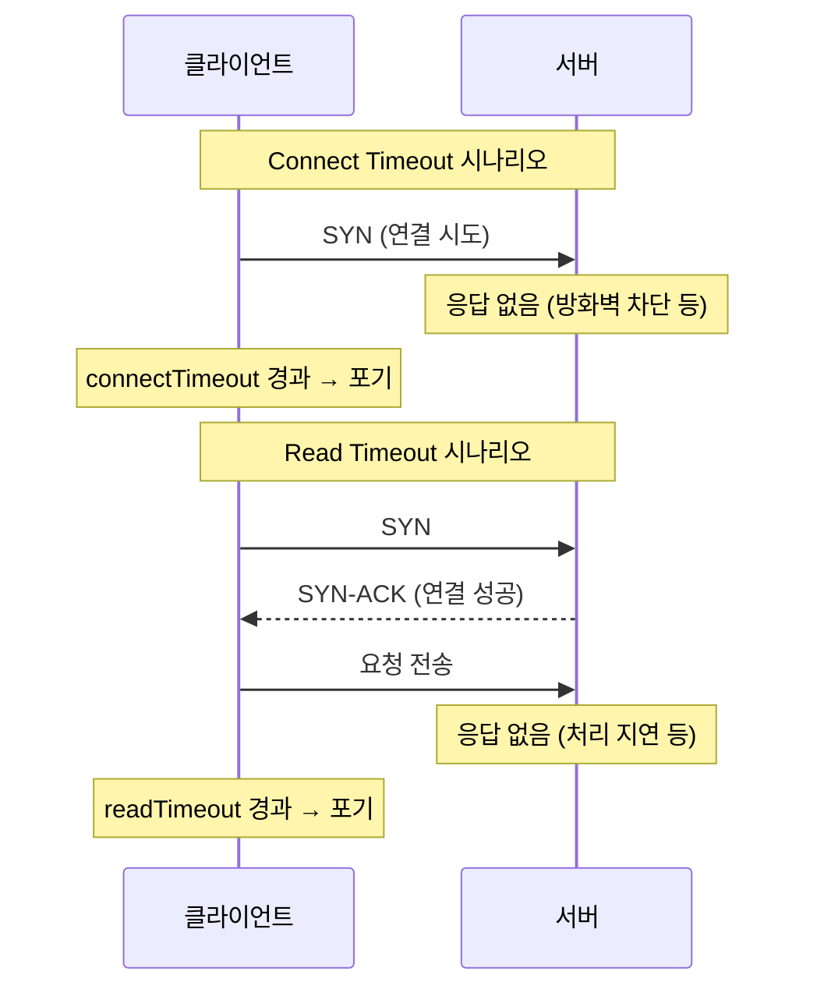

# Connect Timeout vs Read Timeout

외부 API 호출이 멈추는 이유는 크게 두 단계 중 하나에서 발생한다. 이 두 단계를 구분해야 장애 상황을 정확히 재현하고 진단할 수 있다.

## Connect Timeout — 연결 자체가 안 되는 상황

TCP 연결(3-way handshake)이 성립되지 않아 대기하는 시간이다. 방화벽이 SYN 패킷 자체를 버리거나, 존재하지 않는 IP·포트로 요청을 보내는 경우가 여기에 해당한다. 클라이언트는 연결이 맺어지길 기다리다가 connect timeout에 도달하면 포기한다.

## Read Timeout — 연결은 됐는데 응답이 없는 상황

TCP 연결은 정상적으로 맺어졌지만, 서버가 응답 데이터를 보내지 않아 대기하는 시간이다. 서버가 요청을 받고 처리 중이거나, 응답을 보낼 의도가 없거나, 네트워크 중간에서 응답 패킷만 누락되는 경우다. 클라이언트는 응답을 기다리다가 read timeout에 도달하면 포기한다.

