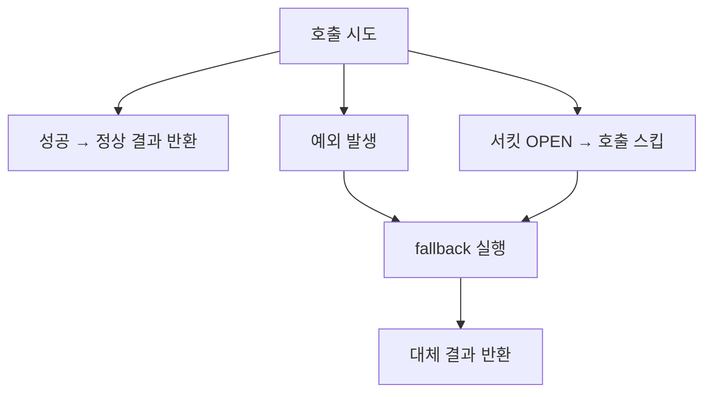

# Fallback (대체 로직)

원래 하려던 호출이 실패했을 때, 예외를 그대로 던지는 대신 실행하는 대체 로직이다. 정상 흐름을 대신할 결과값을 반환해서, 실패가 호출자에게까지 그대로 전파되지 않게 막는다.

## 왜 필요한가

예외를 처리하지 않고 그대로 던지면, 그 예외는 호출자를 타고 계속 위로 전파된다. 어디선가 잡히지 않으면 결국 요청 전체가 실패로 끝난다. 하지만 실패한 호출 하나가 전체 응답을 망칠 만큼 치명적이지 않은 경우도 많다. 예를 들어 화면에 부가 정보를 채워주는 API 하나가 실패했다고 해서 화면 전체를 못 띄울 필요는 없다. Fallback은 이런 경우에 "이 부분만 비어 있거나 기본값으로 채우고, 나머지는 정상 진행한다"를 가능하게 한다.

## 언제 실행되는가

서킷브레이커 맥락에서 fallback은 두 상황에서 실행된다. 하나는 실제로 호출을 시도했는데 예외가 발생한 경우, 다른 하나는 서킷이 이미 OPEN 상태라 호출 자체를 스킵한 경우다. 둘 다 "정상적인 결과를 못 얻었다"는 점은 같지만, 원인이 다르다는 걸 fallback 메서드 안에서 구분하고 싶다면 `Throwable` 파라미터의 타입을 확인하면 된다.

## 무엇을 반환할지 정하는 것도 설계다

흔히 빈 리스트, null, 기본값, 마지막으로 캐시된 값을 반환한다. 어떤 값을 고르느냐는 그 결과를 받는 다음 로직에 영향을 준다. 예를 들어 빈 리스트를 "정상적으로 데이터가 없다"와 "장애가 있었다"를 구분 못 하고 똑같이 처리하는 로직이 있다면, fallback이 반환한 빈 리스트가 예상 못 한 부작용(다음 단계에서 실제로 있던 데이터를 없는 것으로 착각하는 등)을 만들 수 있다. 이 선택 자체를 어떻게 볼지는 graceful-degradation.md에서 더 다룬다.

## Resilience4j에서 정하는 방법

`@CircuitBreaker(fallbackMethod = "메서드명")`으로 지정한다. 지정한 메서드는 정해진 시그니처 규칙을 따라야 하며, 규칙을 어기면 컴파일은 되지만 런타임에야 문제가 드러난다. 자세한 규칙은 resilience4j-fallback-method-contract.md 참고.

참고: graceful-degradation.md
참고: resilience4j-fallback-method-contract.md
참고: circuit-breaker.md
