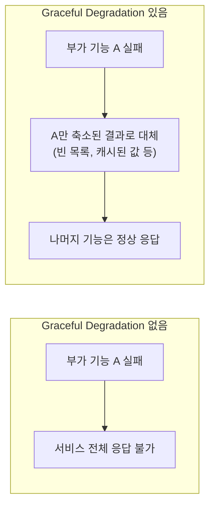

# Graceful Degradation (우아한 성능 저하)

일부 기능이 실패해도 전체 시스템이 완전히 죽는 대신, 기능을 낮춘 상태로라도 계속 응답하게 만드는 설계 철학이다.

## 왜 필요한가

시스템은 여러 부품(외부 API, DB, 캐시 등)이 얽혀서 동작한다. 이 중 하나가 실패했을 때 전체가 함께 죽어버리는 설계라면, 사소한 부품 하나의 장애가 서비스 전체 장애로 번진다. Graceful Degradation은 이 연쇄를 끊는다 — 실패한 부품이 맡던 기능만 낮추고, 나머지는 정상적으로 계속 서비스한다.

## fallback과의 관계

서킷브레이커가 실패나 OPEN 상태에서 실행하는 fallback 메서드가, 이 철학을 실제 코드로 구현한 결과물이다. 예외를 던지는 대신 빈 리스트나 기본값, 캐시된 이전 결과를 반환하는 방식이 흔하다. fallback을 "그냥 에러를 감추는 코드"로만 볼 게 아니라, "이 기능이 없어도 서비스는 계속되게 한다"는 설계 의도로 이해해야 한다.

## 대가 없는 선택은 아니다

기능을 낮춰서 응답한다는 것은, 사용자가 최신 데이터나 완전한 기능 대신 부분적이거나 오래된 결과를 받는다는 뜻이다. 어떤 기능까지 낮춰도 괜찮은지, 낮춘 결과가 이후 로직에 어떤 영향을 주는지는 도메인 관점에서 별도로 검토해야 한다. 예를 들어 fallback이 빈 결과를 반환하도록 만들었다면, 그 빈 결과를 받은 다음 로직이 "정상적으로 처리할 게 없다"와 "장애가 있었다"를 구분하지 못하면 예상 못 한 부작용이 생길 수 있다.

참고: circuit-breaker.md
참고: fallback.md
