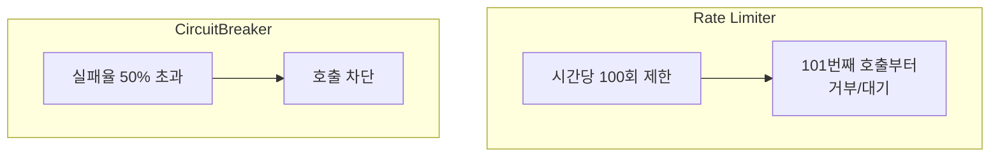

# Rate Limiter (호출량 제한)

정해진 시간 동안 허용할 호출 횟수의 상한을 두고, 그 이상은 거부하거나 대기시키는 패턴이다.

## 서킷브레이커·Bulkhead와 무엇이 다른가

셋 다 "과도한 호출로부터 시스템을 보호한다"는 점은 같지만 판단 기준이 다르다.

- 서킷브레이커는 **실패율**을 본다. 얼마나 많이 실패하고 있는지가 기준이다(circuit-breaker-state-transition.md 참고).
- Bulkhead는 **동시 자원 사용량**을 본다. 하나의 대상이 자원을 얼마나 차지하고 있는지가 기준이다(bulkhead-vs-circuit-breaker.md 참고).
- Rate Limiter는 **호출 횟수 자체**를 본다. 성공이든 실패든 상관없이, 단위 시간당 몇 번 호출했는지가 기준이다.

## 왜 필요한가

서킷브레이커는 "이미 실패하고 있는 대상"을 보호하는 반면, Rate Limiter는 실패 여부와 무관하게 "애초에 감당 못 할 만큼 많이 부르지 않도록" 미리 막는다. 외부 API가 초당 요청 수 제한(quota)을 걸어둔 경우, 그 한도를 넘기지 않으려고 호출하는 쪽에서 스스로 속도를 제한할 때 쓴다.

## 서킷브레이커와 같이 쓰는 이유

Rate Limiter로 애초에 과도한 호출 자체를 막아두면, 서킷브레이커가 판단할 실패 상황 자체가 줄어든다. 두 패턴은 순서상 앞뒤 관계다 — Rate Limiter가 "얼마나 부를지"를 정하고, 그렇게 통과된 호출들 중에서 서킷브레이커가 "계속 실패하면 끊을지"를 판단한다.

참고: circuit-breaker.md
참고: bulkhead-vs-circuit-breaker.md
