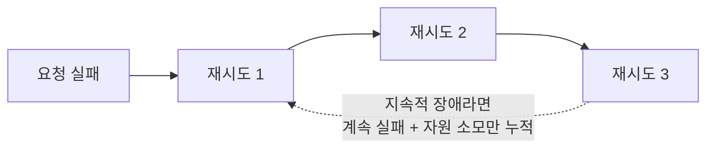

# Retry (재시도)

호출이 실패했을 때 곧바로 포기하지 않고 다시 시도하는 패턴이다. 장애 대응 패턴 중 가장 먼저 떠올리게 되는, 가장 원초적인 방법이다.

## 왜 재시도가 통하는 경우가 있는가

모든 실패가 계속되는 실패는 아니다. 네트워크 패킷이 한 번 유실되거나, 서버가 순간적으로 과부하였거나, GC로 잠깐 멈췄다가 다시 정상으로 돌아오는 경우처럼 일시적인(transient) 실패라면, 잠깐 뒤에 같은 요청을 다시 보내는 것만으로 성공할 수 있다.

## 왜 무한정 재시도하면 안 되는가

실패의 원인이 일시적이지 않고 지속적인 장애(서버 다운, 방화벽 차단 등)라면, 재시도는 성공 확률을 높이지 못하고 오히려 문제를 키운다. 실패할 요청을 계속 다시 보내면서 대기 시간과 자원(스레드, 커넥션)만 반복해서 소모하게 된다. 여러 클라이언트가 동시에 재시도를 반복하면, 이미 어려운 상태인 서버에 더 많은 요청이 몰리는 역효과(retry storm)도 생길 수 있다.

## 서킷브레이커와의 관계

서킷브레이커는 "재시도를 무한정 반복하면 안 된다"는 문제의식에서 나온 다음 단계의 패턴이다. 재시도가 몇 번이고 계속 실패하는 걸 감지하면, 서킷브레이커는 재시도 자체를 중단시키고 즉시 실패로 확정한다(circuit-breaker.md 참고). 실무에서는 둘을 함께 쓴다 — 일시적 실패는 Retry로 흡수하고, 지속적 실패는 CircuitBreaker로 차단한다.

## 재시도가 안전하려면

재시도는 같은 요청을 여러 번 보내는 것이므로, 그 요청이 여러 번 실행돼도 결과가 같아야(멱등해야) 안전하다. 결제 요청처럼 재시도할 때마다 부작용이 쌓이는 요청은 재시도 전에 이 성질부터 확인해야 한다. 참고: idempotency.md

참고: circuit-breaker.md
참고: idempotency.md
