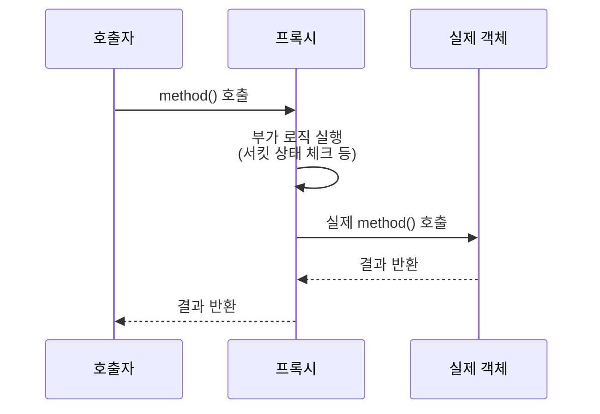

# Spring AOP 프록시

Spring이 `@Transactional`, `@Async`, `@CircuitBreaker` 같은 어노테이션을 실제로 동작시키는 방식이다. 대상 객체를 직접 바꾸는 대신, 그 객체를 감싸는 프록시 객체를 만들어 중간에 끼워 넣는다.

## AOP가 하려는 일

트랜잭션 시작·커밋, 비동기 실행, 서킷 상태 체크 같은 로직은 비즈니스 로직 자체와는 성격이 다르다. 여러 메서드에 공통으로 걸쳐 적용돼야 하는(cross-cutting) 관심사다. 이런 로직을 메서드마다 직접 작성하는 대신, 어노테이션 하나로 선언하고 실제 실행은 Spring이 대신 끼워 넣게 하는 방식이 AOP(Aspect-Oriented Programming)다.

## 프록시로 구현하는 이유

Spring은 대상 클래스를 감싸는 프록시 객체를 런타임에 생성한다. 외부에서 이 프록시를 통해 메서드를 호출하면, 프록시가 먼저 요청을 가로채 부가 로직(트랜잭션 시작, 서킷 상태 체크 등)을 실행한 다음 실제 대상 객체의 메서드를 호출한다.

## 두 가지 프록시 방식

Spring은 대상이 인터페이스를 구현했는지에 따라 두 방식 중 하나를 자동으로 선택한다. 인터페이스가 있으면 JDK 동적 프록시(인터페이스 기반)를 쓰고, 없으면 CGLIB(클래스 상속 기반)을 쓴다. 어느 쪽이든 "프록시를 거쳐야 부가 로직이 실행된다"는 핵심은 같다 — 각 방식의 세부 동작은 jdk-dynamic-proxy.md, cglib-proxy.md에 정리했다.

## 이 구조가 만드는 한계

프록시가 개입하려면 호출이 반드시 프록시를 거쳐야 한다. 클래스 내부에서 자기 자신의 메서드를 직접 호출하면 프록시를 우회하게 되어 어노테이션이 무시된다. 이 문제는 self-invocation-and-spring-aop-proxy.md에서 자세히 다룬다.

참고: self-invocation-and-spring-aop-proxy.md
참고: feign-proxy-and-aop-annotation-limit.md
