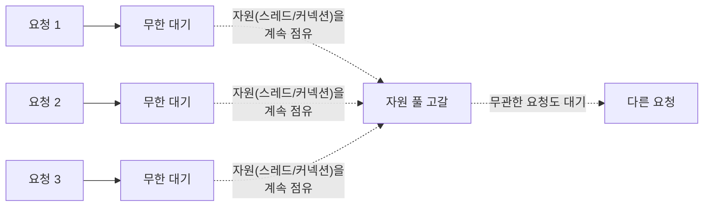

# Timeout — 왜 무한정 기다리면 안 되는가

호출이 응답을 받기까지 기다리는 시간의 상한이다. 이 상한을 넘으면 응답을 포기하고 실패로 처리한다. 장애 대응 패턴 중 가장 기본이 되는 개념이다.

## 타임아웃이 없으면 무슨 일이 생기는가

타임아웃을 걸어두지 않으면, 상대가 응답하지 않을 때 호출자는 그 응답을 무한정 기다린다. 그 호출을 처리하던 스레드나 커넥션은 응답이 오지 않는 한 계속 점유된 채로 남는다. 이런 호출이 반복해서 쌓이면, 결국 스레드 풀이나 커넥션 풀 같은 자원이 고갈되고 그 자원을 쓰는 다른 요청들도 함께 멈춘다.

## 타임아웃이 하는 일과 못 하는 일

타임아웃은 "이 호출 하나가 얼마나 오래 걸릴 수 있는지"의 상한을 정해줄 뿐이다. 상한을 짧게 잡으면 개별 호출은 빨리 실패로 확정되지만, 그 대상이 계속 실패하고 있다면 다음 호출도 똑같이 타임아웃까지 기다렸다가 실패한다. 즉 타임아웃은 "반복되는 실패를 막는" 역할은 하지 못한다. 이 역할을 보완하는 것이 Retry와 CircuitBreaker다.

## 어디에 거는가

호출 경로에는 보통 두 종류의 타임아웃이 있다. 연결 자체가 맺어지길 기다리는 시간과, 연결된 뒤 응답을 기다리는 시간이다. 이 둘의 구분은 connect-timeout-vs-read-timeout.md에서 다룬다.

참고: connect-timeout-vs-read-timeout.md
참고: retry.md
참고: circuit-breaker.md
