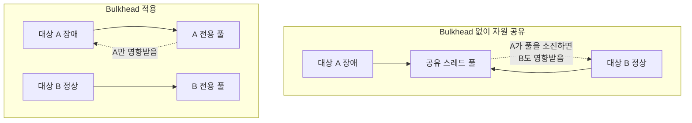

# Bulkhead와 서킷브레이커 — 막는 대상이 다르다

둘 다 장애 격리를 위한 패턴이라 같이 묶여 언급되지만, 실제로 막는 대상이 다르다. 서킷브레이커는 시간 축에서 반복되는 실패를 막고, Bulkhead는 자원 축에서 장애의 전파 범위를 막는다.

## 서킷브레이커가 막는 것

같은 대상(하나의 외부 API 등)에 대한 반복 호출이 계속 실패할 때, 그 호출 자체를 빠르게 차단한다. 시간이 지나면서 반복되는 실패를 막는 것이 목적이다.

## Bulkhead가 막는 것

여러 대상(서로 다른 외부 시스템 여러 개 등)이 스레드 풀이나 커넥션 풀 같은 자원을 공유하고 있을 때, 하나가 장애를 겪어도 그 자원 고갈이 나머지로 번지지 않도록 자원 자체를 분리한다. 배 안의 방을 격벽(bulkhead)으로 나눠서 한 칸에 물이 차도 배 전체가 가라앉지 않게 하는 것과 같은 발상이다.

## 왜 서킷브레이커만으로는 부족한가

서킷브레이커를 하나의 호출에 붙여도, 그 호출이 다른 대상들과 같은 스레드 풀·커넥션 풀을 쓰고 있다면 그 풀 자체의 고갈은 막지 못한다. 서킷브레이커는 "이 호출을 더 이상 시도하지 않는다"까지만 보장하고, "이 호출이 쓰던 자원이 다른 호출에 영향을 안 준다"는 별개의 보장이라 Bulkhead로 따로 챙겨야 한다.

여러 소스를 다루는 시스템에서, 한 소스에 서킷브레이커를 붙였다고 해도 그것만으로는 "이 소스의 서킷이 열린 동안 다른 소스가 영향을 안 받는다"는 게 자동으로 보장되지 않는다. 소스별로 별도 클라이언트와 별도 스케줄을 쓰는 구조라면 어느 정도 자연스럽게 격리되지만, 자원을 공유하는 부분이 있다면 그 지점은 별도로 확인해야 한다.

참고: circuit-breaker-state-transition.md
참고: scheduled-fixed-delay-and-blocking-propagation.md
