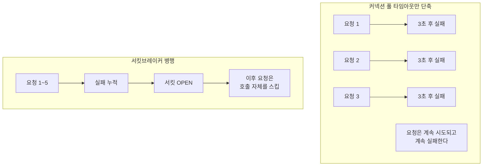

# 커넥션 풀 타임아웃 단축과 서킷브레이커의 역할 차이

DB 커넥션 풀(HikariCP 등)의 connection-timeout을 짧게 잡는 것과 서킷브레이커를 붙이는 것은 둘 다 "장애 상황에서 오래 안 기다리게 한다"는 점에서 비슷해 보이지만, 해결하는 문제의 층위가 다르다.

## 커넥션 풀 타임아웃 단축이 하는 일

풀에서 커넥션을 빌리려고 대기하는 시간의 상한을 짧게 잡는다. 예를 들어 기본값이 30초라면 이를 3초로 줄인다. 이렇게 하면 커넥션을 못 구한 요청이 30초가 아니라 3초 만에 실패로 확정된다.

## 이것만으로는 부족한 이유

이 값을 줄여도 "요청이 계속 쌓이는 구조" 자체는 그대로 남는다. 외부 호출이 반복적으로 실패하면서 계속 재시도되는 상황이라면, 커넥션 풀 타임아웃을 줄여도 각 요청이 더 빨리 실패할 뿐, 실패가 반복되는 근본 원인(계속 호출을 시도한다는 것)은 그대로다.

## 역할 분담

커넥션 풀 타임아웃은 "커넥션을 못 구했을 때 얼마나 기다릴지"를 제한하는 설정이다. 서킷브레이커는 "반복되는 실패에 대해 아예 시도를 멈출지"를 판단하는 메커니즘이다. 전자는 개별 요청의 대기 시간을 줄이고, 후자는 요청 자체의 발생을 막는다. 두 층위가 다르기 때문에 하나가 다른 하나를 대체하지 못하고, 함께 적용해야 온전한 방어가 된다.

참고: circuit-breaker-state-transition.md
