# @Scheduled(fixedDelay)와 블로킹 호출의 지연 전파

`@Scheduled(fixedDelay = N)`은 이전 실행이 끝난 시점부터 N만큼 지난 뒤 다음 실행을 시작한다는 뜻이다(시작 시점 기준인 `fixedRate`와 다르다). 이 방식 자체는 흔하고 별문제 없지만, 같은 스레드를 여러 `@Scheduled` 메서드가 공유하는 상황과 만나면 예상 못 한 지연 전파가 생긴다.

## 왜 문제가 되는가

Spring Boot는 `@EnableScheduling`만 켜고 별도 `TaskScheduler` 빈을 등록하지 않으면, 모든 `@Scheduled` 메서드에 풀 크기 1인 스케줄러 하나를 자동 구성해서 공유시킨다. 서로 무관한 스케줄 여러 개가 스레드 하나를 순서대로 나눠 쓴다는 뜻이다.

이 상태에서 한 스케줄이 외부 API 호출 등으로 블로킹되면, 그 시간 동안 큐에서 대기 중인 다른 스케줄의 실행도 그대로 지연된다. 스레드 개수 자체는 늘지 않으니 "스레드 풀 고갈"은 아니지만, 기능적으로는 무관한 다른 작업까지 멈추는 것과 같은 결과가 된다.

## 실측 예시

외부 API 호출 스케줄이 타임아웃(5초)으로 블로킹되고, 같은 스레드를 쓰는 다른 스케줄이 5초 주기로 도는 상황을 실측하면 다음과 같은 패턴이 나온다.

```mermaid
gantt
    dateFormat  HH:mm:ss
    axisFormat  %H:%M:%S
    section 공유 스레드 (1개)
    스케줄 B (정상 5초 간격) :done, 17:31:06, 5s
    스케줄 A - 외부 호출 블로킹(5초) :crit, 17:31:06, 5s
    스케줄 B          :done, 17:31:16, 5s
    스케줄 B          :done, 17:31:21, 5s
    스케줄 A - 외부 호출 블로킹(5초) :crit, 17:31:26, 5s
    스케줄 B (10초 만에 실행 = 지연 전파) :active, 17:31:31, 5s
```

외부 호출이 5초간 블로킹될 때마다, 정상 5초 주기였던 다른 스케줄이 정확히 10초로 벌어진다. 스레드 덤프로 확인해도 스레드 개수는 늘지 않는다 — 공유 스케줄러가 한쪽에 붙잡히면 다른 쪽도 못 도는 것이 실제 메커니즘이다.

## 해결 — 성격이 다른 스케줄은 스레드를 분리

외부 I/O 리스크가 있는 스케줄과 지연에 민감한 스케줄을 별도 `TaskScheduler`로 나눈다. 자세한 구현은 task-scheduler-vs-async-executor.md 참고.

## 왜 서킷브레이커만으로는 부족한가

서킷브레이커를 붙이면 OPEN 상태 이후로는 이 블로킹이 사라진다. 하지만 CLOSED 상태에서 실패가 누적되는 구간(서킷이 열리기 전)에는 여전히 블로킹이 그대로 발생하고, 그동안은 이 지연 전파도 그대로 재현된다. 자세한 내용은 circuit-breaker-state-transition.md 참고.

참고: task-scheduler-vs-async-executor.md
참고: circuit-breaker-state-transition.md
