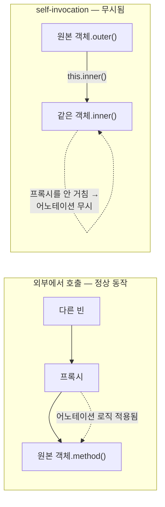

# self-invocation과 Spring AOP 프록시 한계

같은 클래스 안에서 `this.someMethod()`처럼 자기 자신의 메서드를 호출하면, `@Transactional`·`@Async`·`@CircuitBreaker`·`@Cacheable` 같은 어노테이션이 조용히 무시된다. 컴파일 에러도 안 나고 런타임 예외도 없다.

## 왜 이런 일이 생기는가

Spring AOP는 기본적으로 프록시 기반으로 동작한다. 어노테이션이 실제로 적용되려면, 스프링이 그 클래스를 감싼 프록시 객체를 만들고 외부에서 프록시를 거쳐 메서드를 호출해야 어노테이션 로직(서킷 상태 체크, 트랜잭션 시작 등)이 끼어들 수 있다.

클래스 내부에서 `this.method()`처럼 자기 자신을 호출하면 이건 프록시를 거치지 않고 원본 객체를 직접 호출하는 것이다. 프록시가 개입할 기회 자체가 없으니 어노테이션이 무시된다.



## 해결 방법 — 별도 컴포넌트로 분리

어노테이션이 적용돼야 하는 메서드를 별도 클래스(별도 빈)로 뽑아내고, 그 빈을 주입받아 호출한다. 이러면 호출이 항상 프록시를 거치게 된다.

```java
@Component
public class ExternalCallService {

    @CircuitBreaker(name = "example", fallbackMethod = "fallback")
    public Result call(String key) {
        return client.call(key);
    }

    private Result fallback(String key, Throwable t) {
        return Result.empty();
    }
}
```

호출하는 쪽은 이 빈을 주입받아 부른다. 같은 클래스 안에서 직접 부르면 안 된다.

## 이 문제가 적용되는 어노테이션들

같은 프록시 메커니즘을 쓰는 어노테이션은 전부 동일한 함정을 갖는다. `@Transactional`, `@Async`, `@Cacheable`, `@CircuitBreaker`, `@Retryable` 등이 해당한다.

참고: task-scheduler-vs-async-executor.md
참고: resilience4j-fallback-method-contract.md
참고: feign-proxy-and-aop-annotation-limit.md
