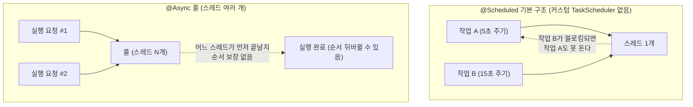

# TaskScheduler vs @Async Executor

Spring에서 "백그라운드로 뭔가를 돈다"는 느낌이 같아서 자주 헷갈리는 두 개념이다. 실제로는 완전히 다른 목적, 다른 스레드 풀을 쓴다.

## 핵심 차이

`@Scheduled` + `TaskScheduler`는 정해진 주기·시각에 반복 실행하는 것이 목적이고, 스케줄러가 실행 순서와 주기를 보장한다. 커스텀 빈이 없으면 기본 풀 크기는 1이다.

`@Async` + `Executor`는 호출자가 기다리지 않고 다른 스레드에 실행을 위임하는 것이 목적이다. 풀의 아무 스레드나 배정되므로 실행 순서를 보장하지 않는다.

`@EnableScheduling`만 켜고 `TaskScheduler` 빈을 따로 안 만들면, Spring Boot는 `@Scheduled` 메서드 전체에 풀 크기 1인 스케줄러 하나를 자동으로 준다. 서로 무관한 여러 `@Scheduled` 메서드가 이 스레드 하나를 순서대로 나눠 쓰게 된다. 한 메서드가 블로킹되면 다른 메서드도 그 시간만큼 못 돈다.

`@Async`는 이 문제를 겉보기엔 해결해준다. 다른 스레드로 실행이 넘어가기 때문이다. 하지만 풀에 스레드가 여러 개면, 이번 실행과 이전 실행이 어느 스레드에서 언제 끝날지 순서를 보장하지 못한다.



## 왜 `@Async`로 스케줄을 분리하면 안 되는 경우가 있는가

`@Scheduled` 메서드가 매번 최신 상태를 정해진 순서대로 어딘가에 보내야 하는 성격이라면(예: 데이터와 그에 딸린 알림을 함께 실시간 전송), `@Async`를 붙이는 순간 그 순서 보장이 사라진다. 풀에 스레드가 여러 개라 이번 사이클 실행과 직전 사이클 실행이 뒤바뀐 순서로 끝날 수 있기 때문이다.

이런 순서 의존적인 스케줄에 `@Async`를 붙이면, 데이터가 화면에 반영되는 시점과 그에 딸린 알림(소리, 알림음 등)이 나가는 시점이 어긋나는 문제가 생길 수 있다. 원인은 `@Async`가 실행을 스레드 여러 개짜리 풀에 흩뿌리면서 스케줄러가 갖고 있던 순서 보장을 잃어버리기 때문이다.

## 그럼 스레드는 어떻게 분리하나 — 전용 TaskScheduler

`@Async`의 문제는 스레드를 분리해서가 아니라 풀에 스레드가 여러 개라 순서가 뒤섞여서다. 필요한 건 풀 크기 1짜리 전용 `TaskScheduler`를 만들어 특정 `@Scheduled` 메서드에 지정하는 것이다.

```java
@Configuration
public class SchedulerConfig {

    @Bean
    public TaskScheduler dedicatedTaskScheduler() {
        ThreadPoolTaskScheduler scheduler = new ThreadPoolTaskScheduler();
        scheduler.setPoolSize(1);   // 이 스케줄 전용 단일 스레드
        scheduler.setThreadNamePrefix("dedicated-scheduler-");
        scheduler.initialize();
        return scheduler;
    }
}
```

```java
@Scheduled(scheduler = "dedicatedTaskScheduler", fixedDelay = 5000)
public void pushToFrontend() { ... }
```

이렇게 하면 이 메서드는 자기 전용 스레드에서 자기 주기·순서를 그대로 보장받으면서, 다른 `@Scheduled` 메서드(기본 풀을 쓰는)와 스레드를 공유하지 않는다. 순서 보장과 스레드 분리를 동시에 얻는 방법이다.

## 요약

`@Async`는 실행을 다른 스레드에 맡기고 순서는 신경 안 쓴다는 선택이다. `@Scheduled`에 전용 `TaskScheduler`(풀 크기 1)를 지정하는 것은 이 스케줄만의 스레드를 갖되 그 안에서는 여전히 순서대로 실행된다는 선택이다. 스케줄 결과의 순서·최신성이 중요하다면 후자를 쓴다.

참고: circuit-breaker-state-transition.md
참고: scheduled-fixed-delay-and-blocking-propagation.md
참고: self-invocation-and-spring-aop-proxy.md
