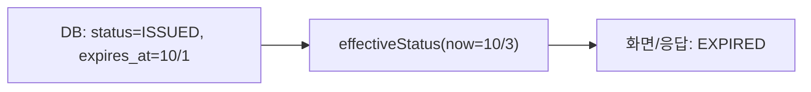

# Lazy Expiration (지연 만료 확인)

만료를 스케줄러로 미리 처리하지 않고, 만료 여부를 읽거나 쓰는 시점에 `expires_at`과 현재 시각을 비교해서 판단하는 방식.

---

## 핵심 아이디어

만료는 "상태가 바뀌는 사건"이 아니라 "현재 시각이 `expires_at`을 넘었다는 사실"이다. 그래서 DB에 `EXPIRED`를 저장하지 않고, 필요할 때 계산해서 만료로 취급한다.



이 방식에서는 두 가지 상태가 구분된다.
- **저장된 상태**: DB 컬럼 값. 만료되어도 `ISSUED`로 남는다
- **유효 상태(effective status)**: 저장된 상태에 현재 시각을 적용한 값. 사용자에게 보이는 건 이쪽이다

참고: state-machine.md 에서 시간으로 일어나는 전이를 계산으로 대체한 형태다.

## 스케줄러 방식과 비교

스케줄러는 주기적으로 `expires_at`이 지난 행을 찾아 `status='EXPIRED'`로 바꾼다. 문제는 만료 시각과 배치 실행 시각 사이의 틈이다. 그 사이에 사용 요청이 오면 이미 만료된 쿠폰이 통과할 수 있다. 이 틈을 막으려면 결국 사용 시점에도 `expires_at`을 비교해야 하므로, 스케줄러만으로는 정확성을 보장할 수 없다.

지연 확인은 비교 시점이 곧 판단 시점이라 틈이 없다. 쓰기 부하, 다중 인스턴스 중복 실행 방지, 배치 실패 재처리 같은 운영 부담도 없다.

## 지켜야 할 것

**사용 처리는 조건부 UPDATE 한 번으로 한다.** 읽고 검사하고 쓰는 방식은 동시 요청에서 깨진다.

```sql
UPDATE coupon SET status='USED', used_at=:now
WHERE id=:id AND status='ISSUED' AND expires_at > :now
```

**읽는 모든 곳에 같은 계산을 적용한다.** 표시 상태는 컬럼 값이 아니라 계산값으로 내려준다. 목록 조회도 `status='ISSUED' AND expires_at > :now` 조건을 쓴다. 이 계산이 여러 곳에 복사되면 누락이 생기므로 도메인 메서드나 쿼리 한곳에 모은다.

**시계 기준을 하나로 통일한다.** 앱 서버 시각과 DB 시각을 섞으면 경계에서 어긋난다. `expires_at`과 같은 시각이 만료인지 아닌지도 정해 둔다.

**`expires_at`에 인덱스를 둔다.**

## DB를 직접 읽는 쪽이 있으면

저장된 상태와 유효 상태가 다르다는 점이 문제가 되는 건 DB를 직접 읽는 소비자다. 운영자가 SQL로 `status='ISSUED'`를 세거나 BI가 컬럼을 그대로 읽으면 만료된 쿠폰이 사용 가능으로 집계된다. 이런 소비자가 있다면 조건이 들어간 뷰를 쓰게 하거나, 스케줄러로 컬럼을 실제 `EXPIRED`로 갱신해야 한다.

모든 읽기가 애플리케이션을 거친다면 이 차이는 문제가 되지 않는다.

## 스케줄러가 필요해지는 경우

만료 자체가 아니라 만료에 따른 후처리가 있을 때다. 만료 알림, 재고나 한도 복구, 환불, 아카이빙이 그렇다. 이때도 만료 판단의 정확성은 지연 확인이 맡고, 스케줄러는 후처리만 한다. 스케줄러가 늦거나 죽어도 정합성이 깨지지 않는다.

## Recap

지연 만료 확인은 만료를 저장된 전이가 아니라 `now > expires_at`이라는 사실에서 계산되는 값으로 다루는 방식이다. DB 컬럼은 `ISSUED`로 남아도 응답과 화면에는 계산한 유효 상태가 나가고, 사용 시점에는 조건부 UPDATE에 `expires_at > :now`를 넣어 원자적으로 막는다. 스케줄러는 배치 주기 사이의 틈 때문에 정확성을 보장하지 못하므로 지연 확인이 항상 필요하다. 스케줄러는 알림이나 복구 같은 만료 후처리가 있을 때만 추가하고, DB를 직접 읽는 소비자가 있다면 뷰나 컬럼 갱신으로 저장 상태와 유효 상태의 차이를 메워야 한다.
