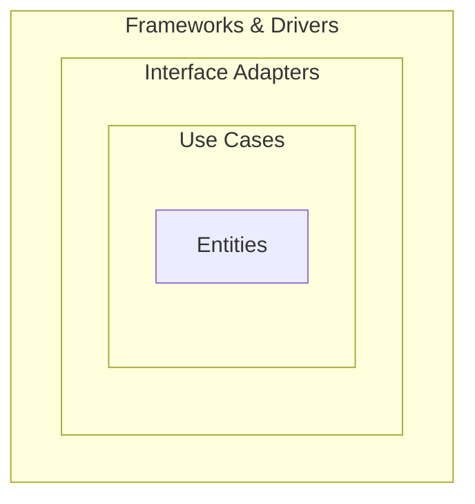

# Clean Architecture

## 핵심 규칙: 의존성은 항상 안쪽으로

클린 아키텍처는 로버트 마틴(Uncle Bob)이 제안한 아키텍처로, 하나의 규칙으로 요약된다. 소스 코드 의존성은 반드시 안쪽(더 고수준의 정책)을 향해야 한다는 것이다. 바깥쪽 레이어에 있는 것은 안쪽 레이어에 있는 것을 알 수 있지만, 안쪽 레이어는 바깥쪽 레이어에 있는 것을 몰라야 한다.

이 규칙을 지키면 안쪽에 있는 코드(비즈니스 로직)는 바깥쪽에 있는 것(DB, 프레임워크, UI)이 무엇으로 바뀌든 영향을 받지 않는다. 반대로 DB를 MySQL에서 PostgreSQL로 바꾸는 것은 바깥쪽 레이어의 일이므로 안쪽 로직은 건드릴 필요가 없다.

## 동심원 구조

클린 아키텍처는 보통 4개의 동심원으로 그려진다. 중심에서 바깥쪽 순서로:

1. Entities — 가장 일반적이고 고수준의 규칙. 애플리케이션 전체가 공유하는 핵심 비즈니스 규칙을 담는다. 어떤 특정 애플리케이션의 사정과도 무관하게 존재할 수 있는 규칙이어야 한다.
2. Use Cases — 애플리케이션 고유의 비즈니스 규칙. "이 시스템이 무엇을 할 수 있는가"를 정의한다. Entities로의 데이터 흐름을 조율하지만, Entities는 Use Case를 몰라야 한다.
3. Interface Adapters — 데이터를 Use Case와 Entities에 가장 편한 형태에서, DB나 웹 같은 외부 기관에 가장 편한 형태로 변환하는 어댑터 집합. Controller, Presenter, Gateway 등이 여기 속한다.
4. Frameworks & Drivers — 가장 바깥쪽 레이어. DB, 웹 프레임워크 같은 도구들. 여기는 세부사항(detail)일 뿐이고, 안쪽 레이어에 아무것도 알려주지 않는다.

## 의존성 역전으로 원 방향을 지키기

문제는 실행 흐름(제어 흐름)이 종종 바깥에서 안으로 향한다는 것이다. 예를 들어 Use Case가 DB에서 데이터를 가져와야 한다면, 제어 흐름은 Use Case → DB 방향이다. 하지만 소스 코드 의존성은 반대여야 한다.

이걸 가능하게 하는 게 의존성 역전 원칙(DIP)이다. Use Case 레이어에 인터페이스(예: 리포지토리 인터페이스)를 정의해두고, 실제 구현은 바깥쪽 레이어(Frameworks & Drivers 근처)에서 그 인터페이스를 구현한다. 그러면 제어 흐름은 안→밖으로 넘어가는 것처럼 보이지만, 소스 코드 의존성(인터페이스를 누가 참조하는가)은 여전히 안쪽을 향한다.

## 경계를 넘는 데이터

레이어 경계를 데이터가 넘어갈 때는 항상 그 경계 안쪽 레이어에 가장 편한 형태로 변환해서 넘어가야 한다. Entity 객체나 DB row 같은 것을 그대로 경계 밖으로 넘기면 안 된다. 대신 단순한 데이터 구조체(DTO 같은 것)로 변환해서 전달한다.

## 참고

헥사고날 아키텍처(hexagonal-architecture.md 참고)와 어니언 아키텍처(onion-architecture.md 참고)는 클린 아키텍처와 같은 목표(의존성이 도메인을 향하게 하기)를 다른 형태로 표현한 것이다. 모두 "포트 앤 어댑터" 계열의 사고방식을 공유한다.
