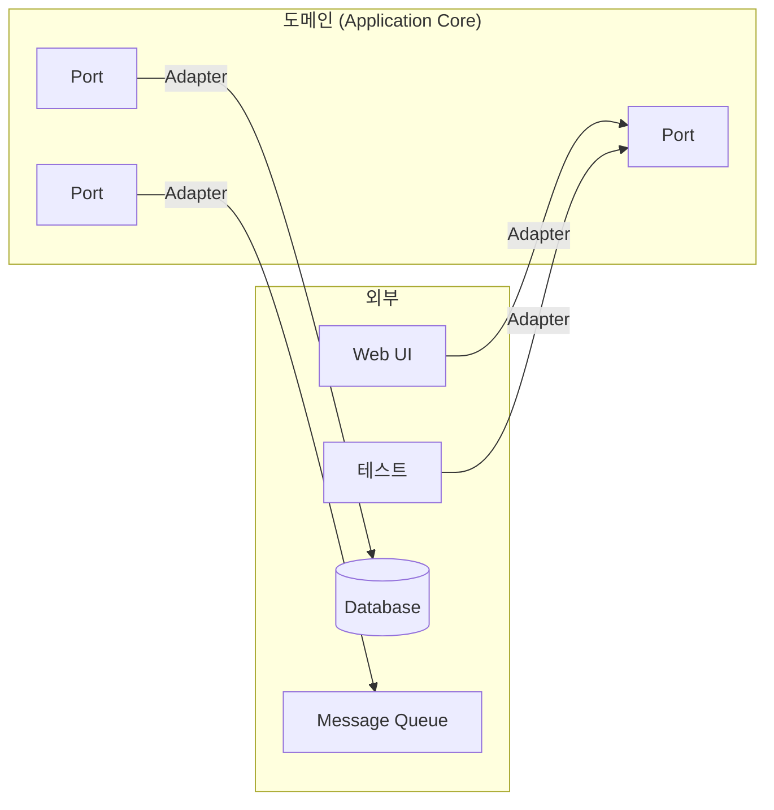

# Hexagonal Architecture (Ports and Adapters)

## 핵심 규칙: 도메인은 외부 기술을 모른다

헥사고날 아키텍처는 앨리스터 코오번(Alistair Cockburn)이 제안했고, "Ports and Adapters"라는 이름으로도 불린다. 핵심 목표는 애플리케이션의 핵심 로직(도메인)을 외부 기술(DB, UI, 메시지 큐, 외부 API 등)로부터 완전히 분리하는 것이다.

육각형 모양 자체에는 특별한 의미가 없다. 육각형은 단지 "중앙에 도메인이 있고, 그 주변에 여러 개의 외부 연결 지점이 있다"는 걸 시각적으로 표현하기 위한 형태일 뿐이다. 사각형이든 원이든 상관없다.

## Port: 도메인이 정의하는 경계

포트는 도메인이 외부와 상호작용하기 위해 정의하는 인터페이스다. 포트는 두 종류로 나뉜다.

- Driving Port (Inbound Port) — 외부에서 도메인으로 들어오는 요청을 받는 인터페이스. 예를 들어 "주문을 생성한다"는 유스케이스 인터페이스.
- Driven Port (Outbound Port) — 도메인이 외부 자원을 사용하기 위해 필요로 하는 인터페이스. 예를 들어 "주문을 저장한다"는 리포지토리 인터페이스.

중요한 건 포트는 항상 도메인 쪽에 속한다는 것이다. DB가 어떤 인터페이스를 요구하는 게 아니라, 도메인이 "나는 이런 기능이 필요하다"고 인터페이스를 선언한다.

## Adapter: 포트를 구체 기술에 연결

어댑터는 포트를 실제 기술과 연결하는 구현체다.

- Driving Adapter — 외부 요청을 받아서 Driving Port를 호출하는 쪽. REST 컨트롤러, CLI, 테스트 코드 등이 여기 해당한다.
- Driven Adapter — Driven Port를 구현해서 실제 DB나 외부 API를 호출하는 쪽. JPA 리포지토리 구현체, HTTP 클라이언트 구현체 등이 여기 해당한다.

같은 포트에 대해 어댑터는 여러 개 있을 수 있다. 예를 들어 저장소 포트 하나에 대해 MySQL 어댑터, 인메모리 어댑터(테스트용)를 각각 구현해서 갈아끼울 수 있다.

## 클린 아키텍처와의 관계

헥사고날 아키텍처가 강조하는 "포트(인터페이스)를 도메인 쪽에 정의하고 바깥에서 구현한다"는 구조는 클린 아키텍처(clean-architecture.md 참고)에서 말하는 의존성 역전과 같은 메커니즘이다. 클린 아키텍처가 레이어를 동심원으로 세분화해서 설명한다면, 헥사고날 아키텍처는 "안(도메인) vs 밖(어댑터)"이라는 더 단순한 이분법으로 같은 원칙을 표현한다.
