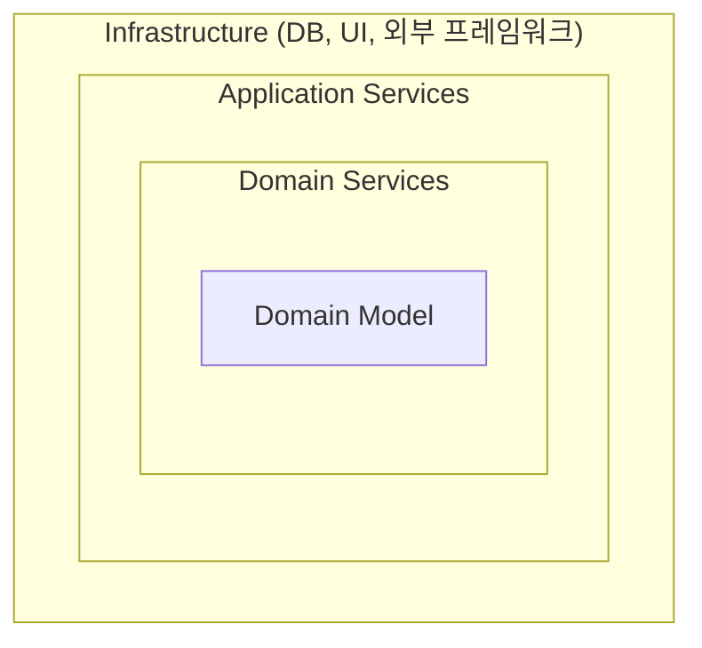

# Onion Architecture

## 핵심 규칙: 모든 의존성은 중심을 향한다

어니언 아키텍처는 제프리 팔레르모(Jeffrey Palermo)가 제안했다. 이름 그대로 양파처럼 여러 겹의 레이어가 도메인을 감싸는 구조로 그려지며, 핵심 규칙은 클린 아키텍처와 동일하다. 바깥 레이어는 안쪽 레이어를 참조할 수 있지만, 안쪽 레이어는 바깥 레이어를 몰라야 한다.

어니언 아키텍처가 특히 강조하는 지점은 "도메인 모델이 인프라(DB, 프레임워크)로부터 완전히 독립적이어야 한다"는 것이다. 전통적인 레이어드 아키텍처(Presentation → Business → Data Access)에서는 Business 레이어가 Data Access 레이어에 의존하는 경우가 흔했는데, 어니언 아키텍처는 이 의존 방향 자체를 뒤집는다.

## 레이어 구성

중심에서 바깥쪽 순서로:

1. Domain Model — 엔티티, 값 객체(Value Object) 같은 핵심 도메인 개념. 어떤 외부 레이어에도 의존하지 않는다.
2. Domain Services — 도메인 모델만으로는 자연스럽게 표현하기 어려운 도메인 로직. 여전히 인프라를 모른다.
3. Application Services — 유스케이스를 조율하는 레이어. 인터페이스(DB 접근, 외부 API 호출 등)를 정의는 하지만 구현은 하지 않는다.
4. Infrastructure / Presentation — DB 구현체, UI, 프레임워크 설정 등 실제 기술이 위치하는 가장 바깥 레이어. Application Services가 정의한 인터페이스를 여기서 구현한다.

## 전통적 레이어드 아키텍처와의 차이

전통적인 레이어드 아키텍처는 레이어를 수직으로 쌓고, 위 레이어가 아래 레이어를 호출하는 방식으로 그린다. 이 경우 Business 레이어가 Data Access 레이어를 직접 참조하기 때문에, DB 관련 코드가 바뀌면 Business 로직까지 영향을 받을 수 있다.

어니언 아키텍처는 레이어를 수직이 아니라 동심원으로 그려서, "의존 방향은 항상 중심(도메인)을 향한다"는 것을 강제한다. Infrastructure가 Application Services가 정의한 인터페이스를 구현하는 형태이므로, DB를 교체해도 도메인 모델과 Application Services는 변경할 필요가 없다.

## 클린/헥사고날 아키텍처와의 관계

어니언 아키텍처가 도메인 모델을 중심에 두고 동심원으로 감싸는 방식은 클린 아키텍처(clean-architecture.md 참고)와 사실상 같은 구조다. 그리고 "인프라가 도메인이 정의한 인터페이스를 구현한다"는 원칙은 헥사고날 아키텍처(hexagonal-architecture.md 참고)의 포트-어댑터 개념과도 동일하다. 세 아키텍처는 이름과 도식이 다를 뿐, "의존성 역전으로 도메인을 인프라로부터 독립시킨다"는 같은 목표를 공유한다.
