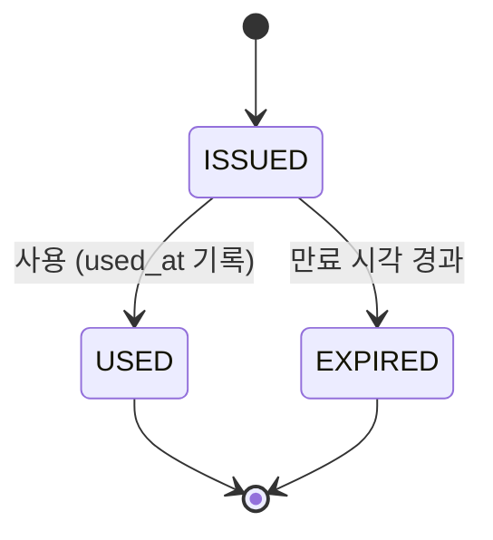

# State Machine (상태 머신)

엔티티가 가질 수 있는 상태를 미리 정해 두고, 어떤 상태에서 어떤 상태로만 넘어갈 수 있는지를 규칙으로 고정한 모델.

---

## 구성 요소

- **상태(State)**: 엔티티가 어느 시점에 놓여 있는 국면. 발급된 쿠폰이라면 `ISSUED`, `USED`, `EXPIRED`
- **전이(Transition)**: 한 상태에서 다른 상태로 넘어가는 것. 반드시 어떤 사건(사용, 시간 경과 등)이 계기가 된다
- **시작 상태**: 엔티티가 생성되면 처음 놓이는 상태
- **종료 상태**: 더 이상 나가는 전이가 없는 상태. 여기 도달하면 되돌릴 수 없다



## 왜 쓰는가

상태를 `status` 컬럼 하나로 두고 코드 곳곳에서 `if`로 바꾸면, "어떤 상태에서 어떤 상태로 가도 되는가"가 코드 여러 곳에 흩어진다. 그러면 `USED → ISSUED`처럼 있어서는 안 되는 전이를 누가 실수로 만들어도 막을 방법이 없다.

상태 머신은 허용되는 전이를 한곳에 명시한다. 그 밖의 전이는 거부하면 된다. 쿠폰이 한 번 사용되면 다시 사용할 수 없다는 규칙이 "USED는 종료 상태"라는 모델 한 줄로 표현된다.

## 전이의 계기가 두 종류다

**사건으로 일어나는 전이.** 사용자가 쿠폰을 쓰는 순간 `ISSUED → USED`가 일어난다. 이때는 DB를 직접 바꾼다.

**시간으로 일어나는 전이.** `ISSUED → EXPIRED`는 아무도 요청하지 않아도 시간이 흐르면 일어나야 한다. 이 전이를 저장할지(스케줄러가 컬럼을 바꾼다), 읽을 때 계산할지(지연 확인)는 별개의 설계 결정이다. 참고: lazy-expiration.md

## 전이를 DB에서 지키는 법

애플리케이션에서 "현재 상태 읽고 → 검사하고 → 쓰기"를 나눠서 하면 동시 요청에서 깨진다. 전이의 출발 상태를 조건에 넣은 단일 UPDATE로 원자적으로 처리한다.

```sql
UPDATE coupon SET status='USED', used_at=:now
WHERE id=:id AND status='ISSUED' AND expires_at > :now
```

영향 행이 0이면 전이가 허용되지 않은 상태였다는 뜻이다. 이미 사용됐거나 만료된 경우다. 이 방식이면 같은 쿠폰에 동시에 두 요청이 와도 한 건만 성공한다.

## Recap

상태 머신은 엔티티의 상태와 허용되는 전이를 미리 정해 두고 그 밖의 이동은 막는 모델이다. 종료 상태에서는 나가는 전이가 없어서 되돌릴 수 없다는 규칙이 모델 자체에 담긴다. 전이는 사용자 행위 같은 사건으로 일어나기도 하고 만료처럼 시간으로 일어나기도 하는데, 시간 전이는 저장할지 읽을 때 계산할지를 따로 정해야 한다. 구현에서는 출발 상태를 조건에 넣은 원자적 UPDATE로 전이를 지키고, 영향 행이 0이면 허용되지 않은 전이로 처리한다.
