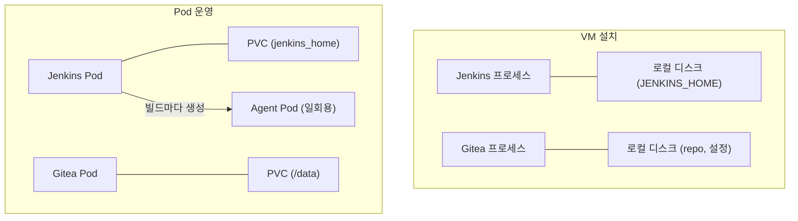
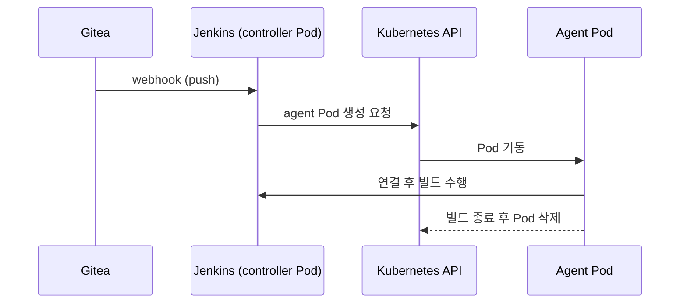

# CI/CD 서버를 Pod로 운영한다는 것 (Jenkins, Gitea)

Jenkins와 Gitea를 VM이 아니라 Pod로 올리면 설치 명령어보다 운영 모델이 바뀐다. Pod는 언제든 죽고 다시 뜨는 휘발성 단위인데, Jenkins와 Gitea는 데이터를 가진 상태 있는(stateful) 서비스이기 때문이다. 이 문서는 "상태를 가진 서비스를 휘발성 환경에 올릴 때 무엇이 달라지는가"를 따라간다.

## 1. 데이터는 Pod 밖에 둔다

Pod의 컨테이너 파일시스템은 재시작하면 사라진다. 그래서 두 서비스의 데이터 디렉토리는 PVC로 분리해야 한다.

- Jenkins는 `/var/jenkins_home`에 job 설정, 플러그인, 빌드 이력이 쌓인다.
- Gitea는 `/data`에 repo, 설정, LFS가 쌓인다. 내장 SQLite를 쓰면 DB 파일도 여기 들어간다.

VM에서는 디스크에 쌓이는 게 당연해서 의식하지 않던 부분이다. Pod에서는 이 경계를 직접 그어야 한다.

두 서비스 모두 사실상 단일 인스턴스다. 같은 데이터 디렉토리를 두 프로세스가 동시에 쓰면 깨지기 때문이다. 그래서 RWO PVC에 replicas 1로 두고, 업데이트 전략은 `Recreate`를 쓴다. `RollingUpdate`를 쓰면 새 Pod가 뜨는 동안 옛 Pod가 같은 볼륨을 쥐고 있어 충돌한다.

PVC 뒤의 스토리지가 NFS라면 문제가 더 생긴다. SQLite는 파일 락에 의존하는데 NFS에서 락이 불안정하다. git은 작은 파일을 많이 읽고 써서 네트워크 지연이 그대로 체감된다. 컨테이너 uid와 NFS 소유권이 어긋나 권한 오류도 잦다(`fsGroup`으로 맞춘다). Gitea는 SQLite 대신 외부 Postgres나 MySQL로 DB를 분리하는 편이 안전하다. 참고: k8s-nfs-storage.md

## 2. 빌드 실행 방식이 바뀐다

VM의 Jenkins는 서버 자신이나 고정된 agent VM에서 빌드를 돌린다. JDK, Gradle, docker 같은 도구를 미리 설치해 두고 계속 쓴다.

Pod에서는 Jenkins Kubernetes plugin이 **빌드 하나마다 agent Pod를 만들고, 끝나면 지운다**. 도구는 설치하는 게 아니라 이미지에 담긴다. 빌드가 몰리면 클러스터 자원만큼 늘어나고, 빌드가 없으면 agent는 0개다. 대신 매번 새 Pod라서 Gradle/Maven 캐시가 사라진다. 캐시가 필요하면 캐시용 PVC를 마운트하거나 원격 캐시를 써야 한다.

가장 까다로운 부분은 컨테이너 이미지 빌드다. VM에서는 호스트의 `docker.sock`을 쓰면 끝난다. 그런데 클러스터 런타임이 containerd면 docker 소켓 자체가 없다. 선택지는 세 가지다.

- DinD: agent Pod 안에 docker daemon을 띄운다. privileged가 필요해서 보안 부담이 크다.
- Kaniko, BuildKit, buildah: daemon 없이 Pod 안에서 이미지를 빌드한다. 권한 요구가 적다.

## 3. 네트워크 경로가 달라진다

VM은 `IP:포트`로 접근하면 된다. Pod는 Service와 Ingress를 거친다. 참고: k8s-nodeport-ingress-service.md

- Gitea의 SSH(22)는 HTTP Ingress로 나갈 수 없다. NodePort, LoadBalancer, TCP 노출 중 하나를 따로 열어야 한다.
- Gitea의 `ROOT_URL`과 `DOMAIN`은 사용자가 접속하는 외부 주소와 같아야 한다. 어긋나면 clone URL이 내부 주소로 표시된다.
- Gitea에서 Jenkins로 가는 webhook은 클러스터 내부 DNS(`jenkins.<namespace>.svc:8080`)로 보낼 수 있다. 외부를 돌지 않아 단순하다. 다만 Gitea는 내부 주소로 향하는 webhook을 기본 차단하므로 `webhook.ALLOWED_HOST_LIST` 설정이 필요하다.

## 4. 설정은 파일 수정이 아니라 코드로 관리한다

VM에서는 `app.ini`를 직접 고치거나 Jenkins UI에서 클릭해서 설정한다. Pod에서 이 방식을 쓰면 재시작이나 재배포 때 설정이 이미지·PVC와 어긋나거나 사라진다.

- Gitea는 `GITEA__section__key` 형식의 환경변수로 `app.ini`를 덮어쓸 수 있다.
- Jenkins는 JCasC(Configuration as Code)로 시스템 설정과 플러그인을 YAML로 선언한다.
- 값은 Helm values에, 비밀번호와 토큰은 Secret에 둔다.

결과적으로 클러스터를 다시 만들어도 같은 CI/CD 환경이 재현된다. VM의 "손으로 키운 서버"와 가장 대비되는 점이다.

## 5. 리소스 한도와 JVM

Jenkins는 JVM이다. container memory limit을 넘기면 커널이 프로세스를 바로 죽이고(OOMKilled), heap 설정이 limit을 고려하지 않으면 정상 동작 중에도 이 일이 벌어진다. VM에서는 OS가 메모리를 알아서 나눠 쓰지만, Pod에서는 limit이 하드 경계다. heap은 limit보다 여유 있게 잡아야 한다(metaspace, thread stack, native 메모리가 heap 밖에 있다).

## 6. 백업과 복구

Pod는 self-healing이 되고 이미지 태그만 바꾸면 업그레이드된다. 이 부분은 VM보다 편하다.

반면 백업은 다시 설계해야 한다. PVC 스냅샷이나 Velero로 볼륨을 백업하고, Gitea는 `gitea dump`를 병행한다. Pod가 다른 노드로 옮겨갈 때 PVC가 따라올 수 있는 스토리지 구성인지도 확인해야 한다.

마지막으로 순환 의존이 생긴다. CI/CD가 클러스터 위에 있으면 클러스터가 죽었을 때 그것을 고칠 배포 도구도 함께 죽는다. 그래서 CI/CD만 클러스터 밖 VM에 두는 구성도 있다.

## 선택 기준

Pod로 올리면 얻는 것은 동적 agent, 선언적 설정, 자동 복구다. 치르는 비용은 스토리지 설계, 이미지 빌드 방식, SSH 네트워킹, 백업 재설계다. 이미 K8s 인프라가 있고 빌드 부하가 들쭉날쭉하다면 Pod가 맞다. 단순하고 안정적인 CI 서버 한 대가 목표라면 VM이 더 쉽다.

## Recap

Jenkins와 Gitea는 데이터를 가진 단일 인스턴스 서비스라서, Pod로 올릴 때는 데이터 디렉토리를 PVC로 분리하고 replicas 1에 Recreate 전략을 쓴다. 빌드는 고정 서버가 아니라 빌드마다 뜨고 사라지는 agent Pod에서 돌고, 그 때문에 이미지 빌드(docker.sock 부재)와 빌드 캐시가 새 문제가 된다. 접근 경로는 Service·Ingress를 거치므로 Gitea SSH 노출과 ROOT_URL, webhook 허용 목록을 따로 맞춰야 한다. 설정은 환경변수·JCasC·Helm으로 코드화하고, JVM은 memory limit을 고려해 heap을 잡아야 OOMKilled를 피한다. 백업은 PVC 스냅샷 계열로 다시 설계하며, 클러스터가 죽으면 CI/CD도 함께 죽는 순환 의존을 감안해 선택해야 한다.
