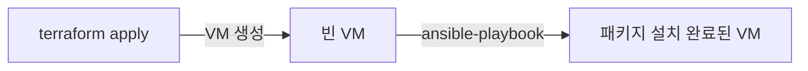

# Ansible

## 한 줄 요약

VM이 만들어진 뒤, 그 안에 필요한 패키지를 설치하고 설정 파일을 배치하는 걸 코드로 자동화하는 도구.

---

## terraform과 역할이 다르다

terraform.md에서 다뤘듯 terraform은 VM 자체를 만들거나 지우는 도구다.
VM 안에 들어가서 무언가를 설치하거나 설정하는 건 terraform의 역할이 아니다.

ansible은 그 반대편을 맡는다.
이미 떠 있는 VM에 ssh로 접속해서, 패키지 설치·설정 파일 배치·서비스 재시작 같은 작업을 순서대로 실행한다.
그래서 회사 인프라에서는 중계서버에 terraform으로 VM을 만들고, 그 VM에 ansible로 필요한 소프트웨어를 올리는 방식으로 두 도구를 같이 쓴다.



---

## agentless — 대상 서버에 아무것도 미리 깔 필요가 없다

ansible은 관리 대상 서버에 별도 에이전트를 설치하지 않는다.
제어하는 쪽(중계서버)에서 ssh로 접속해서 명령을 실행하는 방식이라, 대상 서버에는 python만 있으면 된다.
그래서 terraform으로 막 만든 VM에도 바로 ansible을 실행할 수 있다.

---

## inventory — 어떤 서버에 실행할지

```ini
[etude_servers]
etude-server ansible_host=138.2.xxx.xxx ansible_user=ubuntu
```

inventory는 ansible이 작업을 실행할 대상 서버 목록이다.
terraform의 output으로 나온 공인 IP를 이 inventory에 넣으면, 이후 작업은 서버 이름(`etude-server`)만으로 가리킬 수 있다.

---

## playbook — 실행할 작업 목록

```yaml
- hosts: etude_servers
  tasks:
    - name: install docker
      apt:
        name: docker.io
        state: present

    - name: start docker service
      systemd:
        name: docker
        state: started
        enabled: true
```

playbook은 대상 서버에서 순서대로 실행할 작업(task)의 목록이다.
각 task는 셸 명령을 직접 적는 게 아니라 module(`apt`, `systemd` 등)을 쓴다.

---

## module — "어떻게"가 아니라 "어떤 상태"를 선언

`apt` 모듈에 `state: present`라고 적으면, 이미 설치돼 있으면 아무것도 안 하고 없으면 설치한다.
`state: absent`면 반대로 지운다.
쉘 스크립트로 `apt install docker.io`를 직접 실행하는 것과 다르게, 이미 설치된 상태에서 다시 실행해도 에러 없이 그대로 둔다.
terraform이 "원하는 상태"를 선언하는 것과 같은 사고방식이 ansible의 module 단위에도 적용된 것이다.

---

## idempotent — 몇 번을 실행해도 결과가 같다

위 module 특성 때문에 같은 playbook을 몇 번 실행해도 서버 상태는 한 번 실행한 것과 같다.
이 성질을 idempotent(멱등)라고 한다.
재실행해도 안전하기 때문에, 서버 설정이 바뀌었는지 확실치 않을 때도 그냥 playbook을 다시 돌리면 된다.
