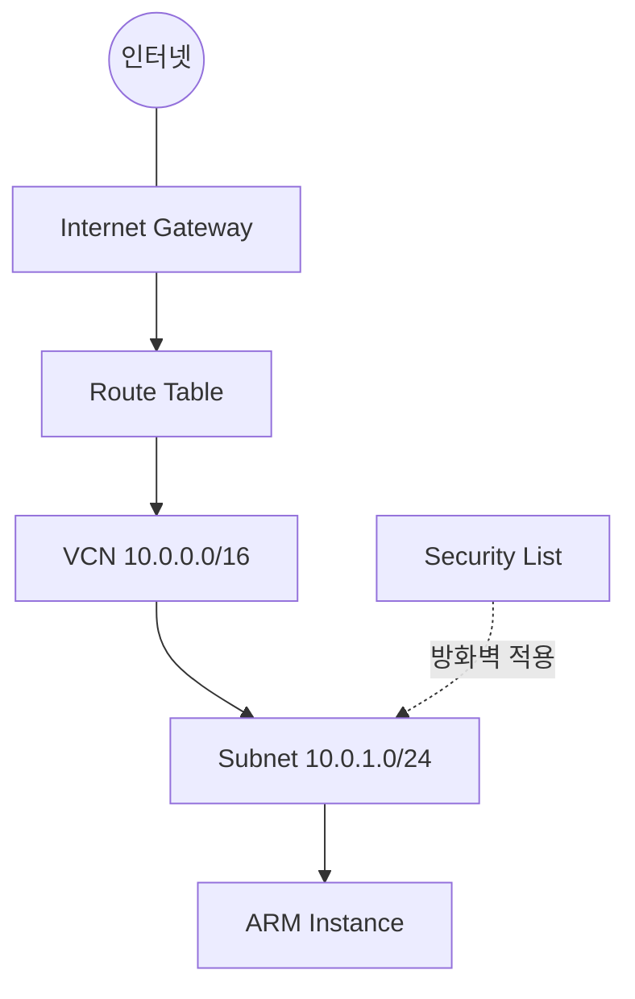

# VCN과 네트워크 구성요소

## 한 줄 요약

클라우드 서버가 인터넷과 연결되려면, 서버 하나만으로는 안 되고 가상 네트워크·서브넷·게이트웨이·방화벽이 순서대로 엮여야 한다.

---

## 왜 서버 하나만으로 안 되는가

물리 서버를 사무실에 두면 스위치와 라우터가 이미 회사 네트워크에 연결돼 있어서 그 위에 서버만 꽂으면 된다.
클라우드에서는 그 스위치와 라우터까지 전부 코드로 직접 선언해야 한다.
etude의 `main.tf`가 VCN, 인터넷 게이트웨이, 라우트 테이블, 시큐리티 리스트, 서브넷을 순서대로 만드는 이유다.



---

## VCN — 가상 네트워크의 경계

VCN(Virtual Cloud Network)은 클라우드 안에 만드는 나만의 사설 네트워크 영역이다.
etude는 `10.0.0.0/16` 대역을 VCN으로 잡았고, 이 안에서만 쓸 수 있는 IP 주소 범위(약 6만5천 개)를 확보한 것이다.
VCN 자체는 빈 울타리이고, 그 안에 서브넷·게이트웨이 같은 하위 리소스를 채워 넣는 방식이다.

---

## 서브넷 — VCN을 나눈 조각

서브넷은 VCN이라는 큰 대역 안에서 실제로 서버를 배치하는 작은 구역이다.
etude는 VCN(`10.0.0.0/16`) 안에 `10.0.1.0/24` 서브넷 하나만 만들고, 그 서브넷 안에 ARM 인스턴스를 배치했다.
서브넷을 나누는 이유는 보통 역할별로 트래픽 경로나 방화벽 규칙을 다르게 적용하기 위해서인데, etude는 서버가 한 대뿐이라 서브넷도 하나다.

---

## Internet Gateway — 인터넷으로 나가는 문

Internet Gateway는 VCN 내부와 바깥 인터넷을 연결하는 통로다.
이 게이트웨이가 없으면 VCN 안의 서버는 사설 네트워크에 갇혀서 외부와 통신할 수 없다.

---

## Route Table — 트래픽을 어디로 보낼지 정하는 규칙

```hcl
route_rules {
  destination       = "0.0.0.0/0"
  network_entity_id = oci_core_internet_gateway.etude.id
}
```

라우트 테이블은 "이 목적지로 가는 트래픽은 이 경로로 보내라"는 규칙의 집합이다.
`0.0.0.0/0`은 모든 목적지를 뜻하므로, 이 규칙은 "인터넷으로 나가는 모든 트래픽은 Internet Gateway를 거쳐라"는 뜻이다.
etude는 이 라우트 테이블을 서브넷에 연결해서, 서브넷 안 서버가 인터넷과 통신할 경로를 확보했다.

---

## Security List — 방화벽

시큐리티 리스트는 어떤 포트로 들어오고 나가는 트래픽을 허용할지 정하는 방화벽 규칙이다.
etude는 인바운드로 22번(SSH)과 80번(HTTP) 포트만 열어뒀고, 아웃바운드는 전체 허용이다.
포트를 최소한으로만 열어두는 이유는 불필요하게 열린 포트가 공격 표면이 되기 때문이다.

---

## 왜 인스턴스에 공인 IP를 직접 안 주고 Reserved Public IP를 따로 만드는가

```hcl
create_vnic_details {
  subnet_id        = oci_core_subnet.etude.id
  assign_public_ip = false
}

resource "oci_core_public_ip" "etude" {
  lifetime      = "RESERVED"
  private_ip_id = data.oci_core_private_ips.etude.private_ips[0].id
}
```

인스턴스 생성 시 자동으로 할당되는 공인 IP는 인스턴스를 삭제하면 같이 사라지고, 다시 만들면 IP가 바뀐다.
etude는 `assign_public_ip = false`로 자동 할당을 끄고, 대신 `lifetime = "RESERVED"`인 고정 공인 IP를 별도 리소스로 만들어 인스턴스의 사설 IP에 연결했다.
이렇게 하면 서버를 재생성해도 같은 공인 IP를 유지할 수 있다.
