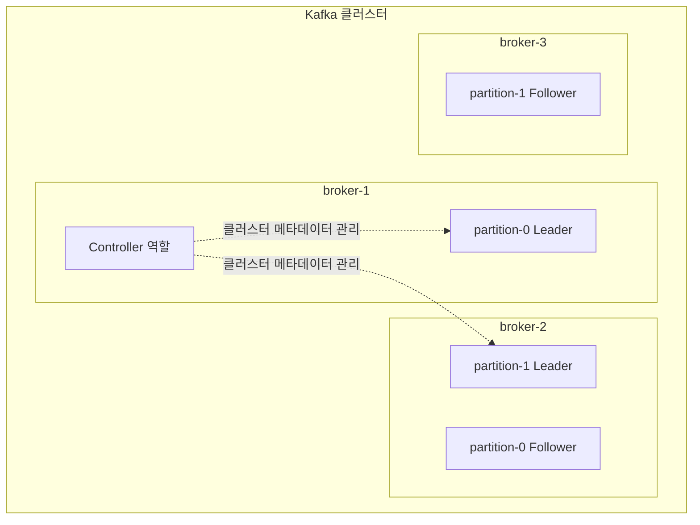

# Kafka Controller

클러스터 전체의 메타데이터를 관리하는 역할이다. 브로커 중 한 대가 이 역할을 맡는다.

Kafka에는 "Leader"라는 이름이 붙은 역할이 두 층위에 있어서 헷갈리기 쉽다. Controller와 파티션 Leader는 관리하는 대상의 범위가 다르다.

## Controller vs 파티션 Leader

파티션 Leader는 파티션 하나 단위의 역할이다. 파티션마다 Leader가 따로 있고, 같은 브로커라도 어떤 파티션은 Leader, 어떤 파티션은 Follower일 수 있다. producer/consumer가 실제로 데이터를 주고받는 대상이다.

Controller는 클러스터 전체 단위의 역할이다. 클러스터에 딱 한 대만 있다. 데이터 자체를 주고받지 않고, "어느 브로커가 어느 파티션의 Leader인가"를 결정하고 그 정보를 클러스터 전체에 전파하는 일을 한다.

브로커 한 대가 동시에 Controller이면서 특정 파티션의 Leader일 수도 있다. 두 역할은 겹칠 수 있지만 하는 일은 완전히 다르다.

## Controller가 하는 일

새 파티션 Leader를 선출한다. 파티션 Leader이던 브로커가 죽으면, Controller가 그 파티션의 ISR 중 하나를 새 Leader로 지정한다. 참고: kafka-isr.md

토픽 생성·삭제, 파티션 추가 같은 클러스터 구성 변경을 처리한다.

브로커가 클러스터에 새로 들어오거나 나갈 때 이를 감지하고, 그에 따라 파티션 배치를 조정한다.

이렇게 결정된 메타데이터(어느 브로커가 어느 파티션의 Leader인지 등)를 클러스터의 다른 모든 브로커에 전파한다. producer와 consumer는 이 메타데이터를 보고 어느 브로커에 요청을 보낼지 판단한다.

## Controller는 어떻게 정해지는가

ZooKeeper 시절에는 브로커들이 ZooKeeper의 특정 노드에 먼저 쓰기를 시도하는 방식으로 경쟁했고, 먼저 성공한 브로커가 Controller가 됐다. 기존 Controller가 죽으면 ZooKeeper가 이를 감지해서 남은 브로커들이 다시 경쟁했다. 이 과정에서 생긴 지연 문제는 kafka-zookeeper-metadata-problem.md 참고.

KRaft 모드에서는 별도의 Controller 전용 노드 집합(quorum)이 Raft 프로토콜로 서로 투표해서 Leader를 뽑는다. 이 Raft Leader가 곧 Kafka Controller 역할을 한다. Raft는 과반수 투표로 Leader를 정하는 합의 프로토콜이라, ZooKeeper처럼 별도 외부 시스템의 "먼저 쓰기 경쟁" 없이 Controller 후보군 안에서 직접 선출이 끝난다.

즉 KRaft가 바꾼 것은 "Leader 선출을 한다"는 사실 자체가 아니라, 그 선출을 어떤 메커니즘으로 하느냐다. ZooKeeper라는 외부 시스템에 의존하던 것을, Kafka 내부의 Raft 합의로 옮긴 것이다.

## 정리

Kafka에는 선출이 두 종류 있다. 파티션 Leader 선출은 각 파티션의 ISR 안에서 일어나고, Controller가 이 선출을 지시한다. Controller 자신의 선출은 클러스터 차원에서 한 번 일어나고, ZooKeeper 시절에는 ZooKeeper가, KRaft에서는 Raft quorum이 이를 담당한다.

"KRaft가 Leader 선출을 위한 것"이라는 이해는 정확히는 Controller 선출(과 그 기반이 되는 메타데이터 관리)을 ZooKeeper 없이 Kafka 내부에서 처리하기 위한 것에 가깝다. 파티션 Leader 선출은 ZooKeeper 시절에도 KRaft 시절에도 항상 있었고, 그 선출을 지시하는 주체가 Controller라는 점은 변하지 않았다.

참고: kafka-isr.md
참고: kafka-replication.md
참고: kafka-zookeeper-metadata-problem.md
